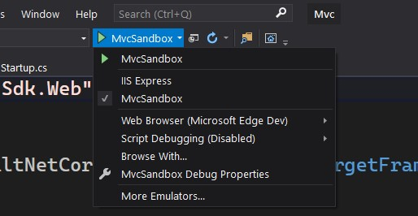

# Build Errors

This document is for common build errors and how to resolve them.

## Warning BUILD001

> warning BUILD001: Reference to '&hellip;' was removed since the last stable release of this package. &hellip;

This warning indicates a breaking change might have been made to a package or assembly due to the removal of a reference which was used
in a previous release of this assembly. See [ReferenceResolution](./ReferenceResolution.md) for how to suppress.

## Error BUILD002

> error BUILD002: Package references changed since the last release&hellip;

Similar to BUILD001, but this error is not suppressible. This error only appears in servicing builds, which should not change references between assemblies or packages.

## Error BUILD003

> error BUILD003: Multiple project files named 'Banana.csproj' exist. Project files should have a unique name to avoid conflicts in build output.

This repo uses a common output directory (artifacts/bin/$(ProjectName) and artifacts/obj/$(ProjectName)). To avoid conflicts in build output, each
project file should have a unique name.

## Error CS0006

Opening solution filters and building may produce an error code CS0006 with a message such as

> Error CS0006 Metadata file '&hellip;\AspNetCore\artifacts\bin\Microsoft.AspNetCore.Metadata\Debug\netstandard2.0\Microsoft.AspNetCore.Metadata.dll' could not be found

The cause of this problem is that the solution filter you are using does not include the project that produces this .dll. This most often occurs after we have added new projects to the repo, but failed to update our .sln/slnf files to include the new project. In some cases, it is sometimes the intended behavior of the .slnf which has been crafted to only include a subset of projects.

### You can fix this in one of three ways

1. Build the project on command line. In most cases, running `build.cmd` on command line solves this problem.
2. If the project is missing from the .sln file entirely, you can use `dotnet sln add` to add it, or else right click on the solution/folder in Visual Studio and choose Add->Existing Project, and adding it.
3. If it is present in the .sln, but not the .slnf, you can update the solution filter to include the missing project. You can either do this one by right-clicking on project in Visual Studio and choosing to load it's direct dependencies, and then saving.  Alternatively, you can hand edit the .slnf file - it's a fairly simple json format.

## Error MSB4019: The imported project "&hellip;\artifacts\bin\GenerateFiles\Directory.Build.props" was not found

You have likely attempted to use `dotnet` to build a project in the repo without first generating the required files.
Prior to building without `.\build.cmd` or `./build.sh` at least the following **must** be executed:

```powershell
.\build.cmd -noBuildNative -noBuildManaged
```

or

```bash
./build.sh --no-build-managed
```

## Error MSB4236: Unable to locate the .NET Core SDK

Executing `.\restore.cmd` or `.\build.cmd` may produce these errors:

> error : Unable to locate the .NET Core SDK. Check that it is installed and that the version specified in global.json (if any) matches the installed version.
> error MSB4236: The SDK 'Microsoft.NET.Sdk' specified could not be found.

In most cases, this is because the option _Use previews of the .NET Core SDK_ in VS2019 is not checked. Start Visual Studio, go to _Tools > Options_ and check _Use previews of the .NET Core SDK_ under _Environment > Preview Features_.

## Error MSB4019: The imported project Microsoft.Cpp.Default.props was not found.

Executing `.\restore.cmd` or `.\build.cmd` may produce these errors when your development environment is not configured with the correct C++ installation:

```
C:\git\aspnetcore\src\Servers\IIS\build\Build.Common.Settings(12,3): error MSB4019: The imported project "C:\git\aspnet
core\.tools\msbuild\17.1.0\tools\MSBuild\Microsoft\VC\v170\Microsoft.Cpp.Default.props" was not found. Confirm that the
 expression in the Import declaration "C:\git\aspnetcore\.tools\msbuild\17.1.0\tools\MSBuild\Microsoft\VC\v170\\Microso
ft.Cpp.Default.props" is correct, and that the file exists on disk. [C:\git\aspnetcore\src\Servers\IIS\AspNetCoreModule
V2\AspNetCore\AspNetCore.vcxproj]
C:\git\aspnetcore\src\Servers\IIS\build\Build.Common.Settings(12,3): error MSB4019: The imported project "C:\git\aspnet
core\.tools\msbuild\17.1.0\tools\MSBuild\Microsoft\VC\v170\Microsoft.Cpp.Default.props" was not found. Confirm that the
 expression in the Import declaration "C:\git\aspnetcore\.tools\msbuild\17.1.0\tools\MSBuild\Microsoft\VC\v170\\Microso
ft.Cpp.Default.props" is correct, and that the file exists on disk. [C:\git\aspnetcore\src\Servers\IIS\AspNetCoreModule
V2\IISLib\IISLib.vcxproj]
```

To resolve this issue, confirm that you've installed the required C++ components in Visual Studio by following the instructions in the [BuildFromSource](./BuildFromSource.md) document.

## Error: HTTP Error 500.33 - ANCM Request Handler Load Failure

The [ASP.NET Core Module](https://learn.microsoft.com/aspnet/core/host-and-deploy/aspnet-core-module) (ANCM) for IIS is not supported when running projects in this repository.

After using `startvs.cmd` to open a solution in Visual Studio, the Kestrel web host option must be used (name of the project) and not IIS Express.

Example of running the `MvcSandbox` project:

`.\startvs.cmd .\src\Mvc\Mvc.sln`



## Error: Unable to load the service index for &hellip;

When attempting to restore servicing tags e.g. `v3.1.7`,  the NuGet.config file may contain internal feeds that are not accessible. This will result in errors such as

> &hellip;\aspnetcore\.dotnet\sdk\3.1.103\NuGet.targets(123,5): error : Unable to load the service index for source https://pkgs.dev.azure.com/dnceng/_packaging/darc-int-dotnet-extensions-784b0ffa/nuget/v3/index.json. [&hellip;\Temp\1gsd3rdo.srb\restore.csproj] [&hellip;\.nuget\packages\microsoft.dotnet.arcade.sdk\1.0.0-beta.20213.4\tools\Tools.proj]

The `darc-int-...` feeds in NuGet.config are used only when building internally and are not needed after the tags are created. Delete all such entries in the file and retry.

## Error: Generated code is not up to date in eng/ProjectReferences.props.

After some project additions or moves, you may need to update the two `DotNetProjects Include` lists in `eng/Build.props`

## Warning: Requested Microsoft.AspNetCore.App v&hellip; does not exist

You have likely attempted to build projects or execute tests which require the just-build Microsoft.AspNetCore.App
shared framework. Execute the following to ensure that exists within the `$(DOTNET_ROOT)` folder:

```powershell
.\build.cmd -projects src\Framework\App.Runtime\src\Microsoft.AspNetCore.App.Runtime.csproj
```

or

```bash
./build.sh --projects "$PWD/src/Framework/App.Runtime/src/Microsoft.AspNetCore.App.Runtime.csproj"
```

## Errors when restoring older clones

If you have build errors trying to run `restore.cmd` and you cloned the repository some time ago,
try deleting the `.dotnet` and `.tools` directories in your local repo directory. It may resolve
the problem if older versions of the .NET SDK are causing an incompatibility with the latest version.
