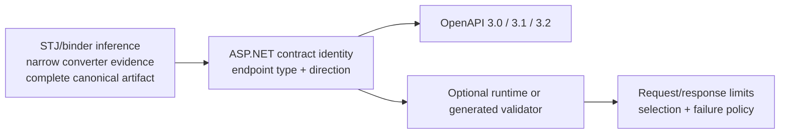

# Pluggable OpenAPI schema contracts for ASP.NET Core

## Executive overview

ASP.NET developers describe endpoints with request and response types. They expect System.Text.Json
wire behavior, generated OpenAPI, and optional validation to describe the same contract.

Today those views can disagree. Converters can hide accepted JSON shapes, requests and responses can
differ, and externally generated schemas cannot drive both OpenAPI and validation. Developers then
face inaccurate client contracts, duplicate schema work, or documentation and enforcement that
drift apart.

For ordinary applications, this proposal offers opt-in **zero-authoring inference**. ASP.NET derives
a stronger, conservative schema from the configured System.Text.Json and endpoint-binding behavior.
Developers do not maintain a separate schema.

Applications with complete externally produced schemas use a second path. They register a
**canonical JSON Schema artifact**: immutable schema bytes and identity treated as the source of
truth. ASP.NET consumes that artifact without reconstructing a validator's private object model.

Responsibilities remain clear:

- **Contract producers** author semantics through serializer metadata, endpoint metadata, or an
  external generator.
- **ASP.NET** associates request and response contracts with endpoints, projects OpenAPI, enforces
  limits and failure policy, and invokes replaceable validators.
- **Validation engines** execute the contract without owning endpoint selection, HTTP behavior, or
  the OpenAPI document.

Build-time producers can emit canonical schemas and validator-specific data ahead of time. Trimmed
and NativeAOT applications then avoid runtime type discovery, schema reconstruction, resource
resolution, and validator compilation.

The result is more accurate OpenAPI without extra authoring for common cases. Advanced applications
can share one contract across documentation and enforcement while retaining validator choice.

See the [claim-to-proof evidence](evidence/README.md) and
[current generated-artifact proof](evidence/generated-schema-artifacts/current-proof.md) for
behavioral, determinism, allocation, and trim/AOT evidence.

## What changes in ASP.NET Core

- **Stronger zero-authoring inference:** an opt-in mode derives conservative schemas from effective
  System.Text.Json (STJ) and endpoint-binding metadata.
- **Narrow runtime-enforced evidence:** a provider can expose a small set of facts hidden behind a
  converter or parser that already enforces them.
- **Complete-schema artifacts:** an engine-neutral contract carries canonical schema authority,
  dialect, capabilities, references, and identity.
- **Two validator seams:** runtime factories create reusable validators; generated/AOT bindings
  use prebuilt validator state.
- **Endpoint-scoped enforcement:** input and output registrations share one policy for buffering,
  size limits, status/content-type selection, and failures.
- **Version-aware projection:** the same authority projects deliberately to OpenAPI 3.0, 3.1, or
  3.2.
- **Deterministic identities:** schema, validator configuration, and closed binding identities
  prevent incompatible contracts or engine settings from sharing caches.

## What does not move in-box

- JsonSchema.Net, Corvus, or any other third-party schema or validation engine.
- A universal CLR-to-JSON-Schema generator.
- Application annotations, business constraints, or documentation policy.
- Remote reference fetching or unbounded external schema resolution.
- A requirement to add endpoint validation when an application wants only better OpenAPI.

## Pipeline

An **artifact** is immutable schema authority; it does not validate by itself. A **validator**
executes that contract. A **binding** closes a CLR type, artifact, validator, and composite
identity for generated use. **Evidence** is deliberately narrower: it reports facts that an
existing converter or parser already enforces.

## What stays consistent

The pipeline has one framework-owned center regardless of how contracts and validators are
produced:

- OpenAPI projection and runtime validation consume the same registered authority.
- Minimal API and MVC use the same directional endpoint plan.
- Engines never decide HTTP status, content type, payload limits, or whether invalid responses are
  suppressed.
- A different validator configuration changes binding identity without changing schema identity.
- Documentation-only paths never imply that ASP.NET has begun validating payloads.

This separation allows simple applications to stop after OpenAPI generation. Applications with a
complete schema can add enforcement without replacing ASP.NET endpoint behavior, and generated
applications can move schema preparation to build time without creating a second HTTP policy.

## Choose what you need

| Need | Contract source | Schema validator | Result |
| --- | --- | --- | --- |
| Better OpenAPI for an ordinary app | Effective STJ/binder metadata | None | Stronger conservative documentation; runtime behavior is unchanged |
| Describe an opaque converter/parser | Inference plus narrow evidence | None | Hidden runtime-proven facts appear in OpenAPI |
| Customize documentation | Transformer | None | Application-owned OpenAPI; no enforcement claim |
| Register a dynamic complete schema | Runtime validated-schema registration | Runtime factory and reusable validator | One schema drives OpenAPI and endpoint validation |
| Consume a build-time complete schema | Generated artifact and closed binding | Generated/AOT validator | No endpoint-build or request-time schema processing |

## Safety and compatibility

Inference is proof-based: when metadata cannot justify a restriction, output remains broad. The
evidence API may report only behavior already enforced by its recognized converter/parser.
Complete-schema registrations are explicit because they introduce a new endpoint acceptance
boundary.

OpenAPI 3.1 and 3.2 can preserve more JSON Schema semantics than OpenAPI 3.0. Projection to 3.0 is
conservative and may widen unsupported constructs. Complete-schema input is bounded by size,
depth, and reference limits; remote references are not fetched. Legacy OpenAPI generation remains
the default while the proposal is experimental.

## Reading paths

| Reader | Start here |
| --- | --- |
| Product behavior and tradeoffs | [Design](design.md) |
| Framework ownership and lifecycle | [Architecture](architecture.md) |
| Public seam review | [API overview](api-surface.md) |
| External producer/validator examples | [Integrations](integrations.md) |
| Claim-to-proof navigation | [Evidence index](evidence/README.md) |
| Full prototype evolution and implementation detail | [Design-history archive](archive/2026-10-prototype-design-history/README.md) |

For one complete external-producer example, the
[current generated-artifact proof](evidence/generated-schema-artifacts/current-proof.md) connects
canonical authority, symmetric validator bindings, OpenAPI, endpoint enforcement, determinism,
scoped performance, and deployment without making either engine an ASP.NET dependency.

The implementation in draft PR
[#69487](https://github.com/dotnet/aspnetcore/pull/69487) is executable design evidence only. It is
not intended to merge, and its code is disposable if the product design changes.
