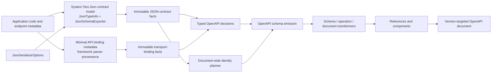
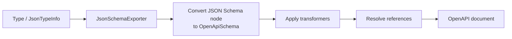
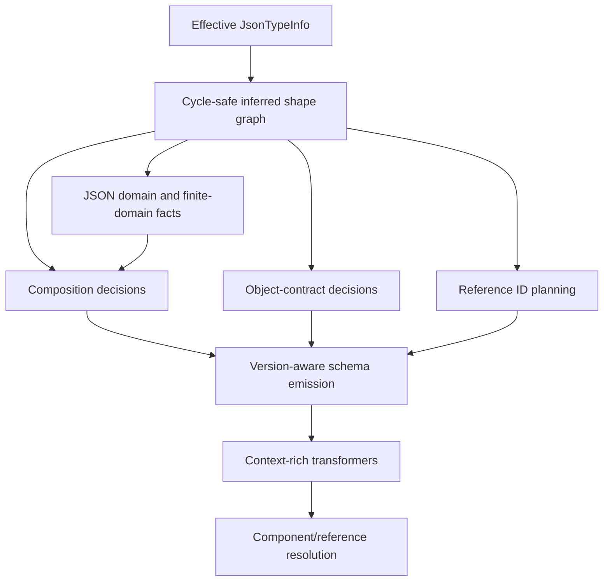
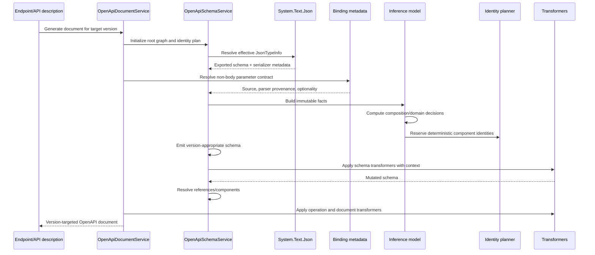
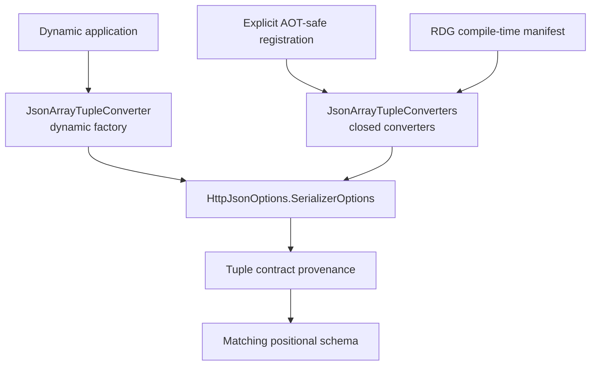

# Experimental OpenAPI Schema Inference: Architecture and Extensibility

## Purpose and Scope

This document describes the architecture of the experimental ASP.NET Core OpenAPI schema-inference approach, its extension points, and how it differs from the existing implementation.

The design addresses a specific problem: System.Text.Json can describe the effective serialization contract of an individual .NET type, but a useful OpenAPI document also needs document-wide composition, stable component identity, version policy, reference management, and extensibility. These concerns cannot be derived reliably by translating CLR reflection directly into OpenAPI.

The experimental approach therefore treats System.Text.Json as the authority for JSON representation and adds a separate, conservative inference layer for OpenAPI structure.

The architecture described here includes accepted work through direction-specific input/output generation, converter-proven scalar constraints, and binder-aware non-body parameter schemas.

## Optional validated-schema tier

An endpoint may opt into a stricter tier that couples an exact, self-contained Draft 2020-12 schema to a compiled validator. Registration is endpoint-scoped and directional. The same SHA-256 identity over the original UTF-8 bytes binds OpenAPI generation and runtime validation; OpenAPI model normalization never changes that authority.

For Minimal APIs, an endpoint convention wraps RDF/RDG's final request delegate outside argument binding. At endpoint-build time it compiles validators and precomputes immutable directional registrations, validation contexts, content-type/status selectors, limits, and the final delegate. JSON requests are buffered within an explicit limit, validated before System.Text.Json deserialization, then rewound. Invalid input produces a deterministic 400 validation problem. JSON responses are captured through a pooled `IHttpResponseBodyFeature` before any bytes reach the server, selected by actual status and content type, validated, and either copied unchanged or replaced by an empty 500 response. Capturing the body feature covers both `Stream` and `PipeWriter` output and avoids per-request `StreamResponseBodyFeature` allocation. Non-JSON and no-content responses are not validated. Request acceptance remains the intersection of schema validation and normal System.Text.Json binding.

After pool/cache warm-up, the successful framework request and response wrappers each measure 0 B/op incremental allocation against the pass-through baseline. This boundary includes endpoint-plan selection, evidence/context/result plumbing, bounded buffering, response interception, and copying. It excludes the server/TestServer, endpoint System.Text.Json binding/serialization, and validator-engine internals. The evidence adapters measure engine costs separately; see `evidence/validated-schema-adapters/allocation-results.md`.

The 3.1/3.2 importer uses OpenAPI.NET's typed schema model. A narrow internal compatibility association supplies typed `prefixItems` children because the current OpenAPI.NET version otherwise writes that keyword under `unrecognizedKeywords`. Schema transformers traverse those children in order. The shim does not introduce a second general JSON Schema AST and can be removed when OpenAPI.NET gains first-class support.

OpenAPI 3.0 cannot preserve Draft 2020-12 local definitions, recursive local references, or conditionals. Recursive/definition-bearing schemas therefore widen deterministically to `{}`. Fixed prefix arrays lower to the existing tuple approximation with length constraints and unconstrained `items`; unsupported assertions are deliberately widened rather than emitted as misleading extensions.

## Design Principles

1. **The effective serializer contract is authoritative.** Use `JsonTypeInfo`, effective converters, and serializer options rather than CLR shape alone.
2. **Facts and policy are separate.** Observe immutable serializer facts first; decide OpenAPI composition separately.
3. **Emit the strongest schema that can be proved.** Prefer conservative `anyOf` or unconstrained output when evidence is incomplete.
4. **Do not reverse-engineer opaque converters.** Custom converters remain unknown unless they expose package-owned schema provenance.
5. **Plan document-wide identities before emission.** Naming, collision resolution, aliases, and contextual identities must be deterministic.
6. **Keep legacy behavior stable.** The existing mode remains the default; inferred behavior is experimental and opt-in.
7. **Make OpenAPI version a generation input.** Transformers and emitters must know the target before producing version-sensitive structures.
8. **Keep extension points explicit.** Application-owned invariants belong in transformers or recognized contracts, not speculative inference.
9. **Treat trimming and NativeAOT as architectural constraints.** Reflection-dependent convenience APIs must have explicit safe alternatives.
10. **Test rejection decisions as well as successful inference.** Knowing why a stronger schema was not emitted is part of correctness.
11. **Keep body and transport authorities separate.** System.Text.Json owns JSON contracts; endpoint metadata and framework parser provenance own non-body binding contracts.

## System Context



### Responsibility boundary

| Concern | Authority |
| --- | --- |
| Property names and inclusion | System.Text.Json contract |
| Runtime JSON shape | Effective `JsonTypeInfo` and converter |
| Non-body logical value | Endpoint binding metadata and framework parser provenance |
| Custom parser lexical language | Unknown unless represented by a recognized declarative contract |
| Number/string acceptance | Effective `JsonNumberHandling` |
| Polymorphism configuration | System.Text.Json polymorphism metadata |
| OpenAPI composition | ASP.NET Core inferred decisions |
| Component IDs and collision policy | ASP.NET Core identity planner |
| OpenAPI-version fallback | ASP.NET Core generation policy |
| Application business invariants | Explicit transformers or future recognized providers |
| NativeAOT converter registration | Closed converters and RDG manifest |

## Existing and Experimental Architectures Compared

### Existing implementation

The existing path is primarily a conversion pipeline:



This architecture is effective for broad schema generation and intentionally simple. Its limitations arise when behavior depends on relationships across types or across the whole document:

- composition choices are made from the emitted schema rather than a durable semantic model;
- inheritance and alternatives are commonly flattened or represented broadly;
- component naming is local and can be sensitive to discovery order;
- serializer facts, inference decisions, and emission concerns can become interleaved;
- a custom converter's runtime behavior is difficult to distinguish from ordinary CLR shape;
- transformer traversal must infer context from the emitted tree;
- version-sensitive transformer output historically lacked an authoritative generation target;
- the same type identity is generally reused wherever the type appears.

### Experimental implementation

The experimental path adds explicit intermediate models:



The important difference is not merely that more keywords are emitted. The experimental approach preserves the reasoning inputs and decisions independently of the final OpenAPI object graph.

| Area | Existing approach | Experimental approach |
| --- | --- | --- |
| Serializer model | Consumed during direct conversion | Captured as immutable inferred facts |
| Composition | Primarily follows exported shape | Typed, proof-based decisions |
| Inheritance | Commonly flattened | Lossless `allOf` when eligible |
| Alternatives | Broad exporter composition | `oneOf` only when exclusivity is proven |
| Enum domains | Exported literals | Exact/open finite-domain classification |
| Number handling | Schema translation | Effective read/write number handling included in domain proof |
| Open objects | Basic `additionalProperties` handling | Distinct closed, disallow-unmapped, and extension-data decisions |
| Naming | Local candidate resolution | Document-wide deterministic planning |
| Late schemas | Resolved when encountered | Full late graph planned atomically |
| Converter handling | CLR shape may remain visible | Unknown unless effective contract or owned provenance proves shape |
| Scalar constraints | Familiar CLR-derived hints | Converter-proven bounds and versioned encoding |
| Non-body parameters | Shares broad schema-generation machinery | Separate transport-binding facts and decisions |
| Tuple arrays | No standard package contract | Dynamic, closed AOT-safe, and RDG-generated converter paths |
| OpenAPI version | Often selected at serialization | Selected before transformers and schema generation |
| Failure mode | Best-effort conversion | Explicit conservative rejection reasons |
| Compatibility | Existing behavior | Opt-in inferred mode; legacy remains default |

## Core Building Blocks

### 1. Effective serializer contract

`JsonSerializerOptions` and `JsonTypeInfo` define the actual JSON contract. The inference layer consumes:

- type kind: object, enumerable, dictionary, or converter-defined;
- properties in serializer order;
- effective JSON names;
- requiredness and directional nullability metadata;
- element or dictionary-value types;
- polymorphism configuration;
- effective number handling;
- converter identity and package-owned provenance.

The CLR type remains useful for stable identity and graph relationships, but it does not override the effective serializer contract.

### 2. Immutable inferred shape graph

The graph captures canonical facts for every reachable schema use:

- scalar, object, collection, dictionary, union, and tuple shapes;
- property uses and serializer identities;
- nullability and requiredness;
- base and derived relationships;
- polymorphic alternatives and discriminators;
- extension-data fallbacks;
- tuple element uses;
- converter provenance;
- recursive edges.

Graph construction is cycle-safe and deterministic. Facts are immutable after construction so later phases cannot silently reinterpret them.

### 3. Typed decision layer

The decision layer answers questions such as:

- Is inheritance decomposition lossless?
- Are alternatives pairwise exclusive?
- Is an enum domain exact or open?
- Is an object closed, open, extension-backed, or unknown?
- Which rejection reason prevented stronger composition?

Representative decisions include:

- inheritance eligibility and rejection reason;
- `oneOf` versus `anyOf`;
- discriminator property and mappings;
- exact/open finite literal domains;
- JSON value domains;
- object fallback behavior.

This layer has no dependency on the final OpenAPI object model, making it testable without serialization.

### 4. JSON-domain reasoning

Alternatives can be classified into broad domains:

- null;
- boolean;
- string;
- integer;
- non-integer number;
- object;
- array;
- unknown or arbitrary JSON.

Effective number handling can widen numeric domains to include strings. Exact finite literal sets can prove disjointness inside an otherwise shared broad domain. Unknown converter behavior prevents exclusivity claims.

### 5. Document-wide reference identity planner

The planner precomputes component identities across the full reachable graph:

1. preserve a unique existing candidate;
2. add declaring-type qualification when needed;
3. add namespace qualification when needed;
4. use a canonical identity hash as the final fallback.

Custom IDs are authoritative and validated. Explicit aliases support intentional shared identity. Late transformer-requested graphs are planned atomically against the same occupancy registry.

### 6. Version-aware emitter

Emission consumes facts, decisions, identity, and the target `OpenApiSpecVersion`. It does not re-derive semantic decisions from the OpenAPI tree.

Examples:

- tuple arrays use `prefixItems` and `items: false` in 3.1/3.2;
- tuple arrays use fixed arity and unconstrained `items` in 3.0;
- explicit conditional keywords are set by transformers only for 3.1/3.2;
- nullable component uses wrap references instead of mutating shared components.

### 7. Provenance markers

Internal metadata identifies schemas and converters produced by recognized framework paths. Provenance prevents inferred rules from being applied to:

- user-authored schemas;
- transformer replacements;
- unrelated `oneOf` or discriminator structures;
- arbitrary converters that happen to have a similar type name.

The tuple implementation demonstrates this pattern with a package-owned converter marker and immutable tuple contract.

### 8. Transformer integration

Schema, operation, and document transformer contexts receive:

- document name;
- exact generated document;
- scoped services;
- effective `JsonTypeInfo`;
- `JsonPropertyInfo` when applicable;
- authoritative OpenAPI generation target;
- schema-transformer collection for requested schemas.

Traversal includes composed branches, named properties, collection items, dictionary values, extension-data fallbacks, and positional tuple elements. Mutations to tuple prefix elements are synchronized back into the serialization bridge.

Operation contexts are associated with the exact generated document through a generation-local immutable map, preventing cross-version and cross-scope leakage.

### 9. Directional schema purpose

The inference model defines internal schema purposes:

- **Input** for request bodies and input parameters;
- **Output** for responses;
- **Neutral** for transformer-requested schemas without endpoint direction.

This is needed because JSON presence and nullability are directional: a property may be required during deserialization but conditionally omitted during serialization, get-only, set-only, or differently nullable through getter and setter contracts.

Purpose participates in fact discovery, decisions, recursive identity, references, transformer traversal, and component naming. Types whose directional graphs differ receive deterministic `.Input` and `.Output` identities; directionally identical graphs continue sharing the established component identity. Custom component IDs remain authoritative and fail explicitly when one configured ID cannot represent divergent directional contracts.

### 10. Converter-proven scalar contracts

`InferredScalarContract` captures immutable scalar facts from the effective System.Text.Json converter path. It separates recognized framework behavior from opaque custom converters and feeds typed decisions rather than patching schemas from CLR identity.

The decision layer can therefore:

- apply exact built-in integral bounds from `sbyte` through `UInt128`;
- preserve bounds on the numeric branch of number/string unions;
- leave floating-point precision and decimal scale unconstrained;
- omit inaccurate client hints such as decimal-as-`double`;
- emit base64 as `format: byte` in OpenAPI 3.0 and `contentEncoding: base64` in 3.1/3.2;
- preserve exact 128-bit literals without converting them through a narrower numeric representation.

Property-level and type-level custom converters invalidate built-in provenance. Unknown converter behavior produces a broad schema rather than inheriting constraints from the declared CLR type.

`OpenApiScalarFormatResolver` then applies the experimental public format policy:

- `Conventional` emits registered formats and established client-generation width hints;
- `CompatibleOnly` emits only the subset supported by the proven converter/parser contract;
- `None` suppresses optional formats;
- `CreateScalarFormat` accepts, replaces, or suppresses each candidate.

The immutable callback context exposes declared/effective type, JSON body/property or route/query/header/form location, input/output/neutral purpose, generation version, coarse provenance, and the policy-selected candidate. It does not expose internal fact records or converter/parser implementation types. Custom/unknown contracts have no default candidate but can receive an explicit application format.

Format resolution occurs before schema transformers, which retain final authority. Results are not cached by CLR type alone because location, purpose, version, provenance, and policy candidate all participate. Proven base64 encoding remains outside the optional format policy.

### 11. Transport-binding contracts

`InferredTransportBindingContract` is an immutable sibling to the JSON scalar model. It is used only for route, query, header, and form binding in experimental inferred mode.

Facts include:

- binding source;
- declared and effective type;
- framework, enum, or custom-parser provenance;
- logical schema kind;
- repeated-value element facts;
- optionality, nullability, and defaults;
- available binding metadata such as `HasTryParse` and `HasBindAsync`.

Typed decisions use a logical post-binding policy:

- exact bounded integer schemas for recognized fixed-width numeric binders;
- unbounded integer for `BigInteger`;
- unbounded number for floating-point and decimal binders;
- boolean for boolean binders;
- string schemas with policy-selected conventional annotations where configured;
- unformatted strings for parser languages without a recognized or application-supplied format;
- conservative enum string/integer alternatives;
- recursive item decisions for supported repeated-value arrays;
- absence/requiredness rather than JSON-null unions for nullable or defaulted parameters.

Arbitrary `TryParse` and `IParsable` implementations remain broad strings because binding metadata does not expose their lexical grammar. `BindAsync` is not treated as a text parser because it can consume arbitrary request state.

Transport schemas are finalized before schema transformers and remain inline or in a distinct identity space. They cannot alias a JSON-body component merely because both originate from the same CLR type.

## End-to-End Generation Flow



### Generation phases

1. Select the OpenAPI generation target.
2. Collect endpoint root types.
3. Build the inferred shape closure.
4. Preplan component identities.
5. Export and convert each effective serializer contract.
6. Apply inferred decisions.
7. Run schema transformers with exact context.
8. Resolve component references and placeholders.
9. Run operation and document transformers.
10. Register components and produce the target document.

For non-body parameters, transport facts and decisions replace the JSON-contract steps. The resulting schema is finalized before transformer traversal but is not registered as a reusable JSON-body component.

## Extensibility Mechanisms

### Schema transformers

Schema transformers are the primary application extension point. They are appropriate when the application owns semantics not represented by System.Text.Json, including:

- conditional and dependent constraints;
- domain-specific formats or patterns;
- application descriptions and examples;
- custom annotations;
- version-specific JSON Schema keywords.

Transformers can inspect `context.OpenApiVersion` and avoid unsupported 3.0 keywords:

```csharp
options.AddSchemaTransformer((schema, context, cancellationToken) =>
{
    if (context.JsonTypeInfo.Type == typeof(Payment) &&
        context.OpenApiVersion >= OpenApiSpecVersion.OpenApi3_1)
    {
        schema.DependentRequired = new Dictionary<string, HashSet<string>>
        {
            ["creditCard"] = ["billingAddress"],
        };
    }

    return Task.CompletedTask;
});
```

### Transformer-requested schemas

Operation and document transformers can request additional schemas. These requests:

- use the same serializer options;
- join the same deterministic identity registry;
- build the complete late graph atomically;
- participate in reference and transformer processing;
- inherit the same OpenAPI generation target.

These schemas use `Neutral` purpose unless a future public API explicitly allows the caller to choose.

### Runtime-enforced schema evidence providers

Normal inferred generation first discovers facts from the effective System.Text.Json and binding contracts with no additional application authoring. A public `IOpenApiSchemaEvidenceProvider` is a second, optional tier for a runtime mechanism whose enforced representation is otherwise opaque. Providers run before internal typed decisions and emission; they do not mutate an `OpenApiSchema` and do not replace ordinary inference.

A converter or separately registered provider can contribute one of the closed, version-independent evidence kinds: a strict scalar or a fixed positional array. The context supplies the declared/effective CLR type, effective `JsonTypeInfo`, effective converter, and input/output/neutral purpose so a provider can couple evidence to runtime enforcement. Documentation-only declarations still belong in schema transformers.

Providers execute in registration order. The effective converter is evaluated as a provider after registered providers unless the same instance is already registered. Multiple claims for one effective runtime contract fail deterministically; provider exceptions propagate. OpenAPI 3.0/3.1/3.2 adaptation remains emitter policy.

The tuple converter is the proving implementation and supplies:

- flattened ordered element types;
- exact arity;
- a proven array domain;
- runtime/schema parity.

Schema inference is intentionally not based on assembly names, converter class-name heuristics, or reflection over generic arguments. RDG retains its existing package-origin activation check solely to preserve the separate explicit tuple runtime opt-in before generated closed converters are installed; third-party provider registration does not activate tuple serialization.

The evidence algebra deliberately does not expose `OpenApiSchema`, `JsonNode`, arbitrary keyword dictionaries, composition, or the internal fact graph. Third-party runtime-enforced schema providers can translate strict scalar or fixed positional-array facts into these narrow evidence kinds. Full object, conditional, composition, and arbitrary schema import remain unsupported and transformer-authored. Arbitrary converter behavior remains unknown.

### Explicit closed converters

`JsonArrayTupleConverters` provides strongly typed factories for trim-safe tuple contracts. These are explicit runtime extensions that also carry recognized inference provenance.

For tuples longer than seven logical elements, the outer converter composes a typed converter for the CLR `Rest` storage tuple. Logical elements are flattened in JSON while ordinary nested tuple elements remain nested arrays.

### Request Delegate Generator integration

RDG owns compile-time endpoint discovery. It builds a conservative tuple-contract manifest from the same endpoint model used to generate delegates and registers closed converters before serializer options are frozen.

The manifest is:

- deterministic;
- cycle-safe;
- idempotent;
- non-overriding when a user converter already handles the contract;
- bounded to statically provable endpoint and DTO graphs.

Explicit closed registration remains the fallback for dynamic endpoints, custom contracts, fields, unsupported polymorphism, and metadata not visible to RDG.

### Custom reference IDs

Applications can continue to provide reference-ID policy. In inferred mode, custom IDs are validated as authoritative identities. Collisions fail explicitly instead of being silently reordered or overwritten.

## Cross-Cutting Concerns

### Cycle safety

Graph discovery, late planning, tuple expansion, and reference resolution all guard recursive paths. Re-entry produces a componentizable placeholder rather than infinitely expanding the graph.

### Determinism

Determinism applies to:

- property and branch order;
- component identity;
- collision resolution;
- finite literal ordering;
- discriminator mappings;
- late schema planning;
- RDG converter manifests.

Endpoint discovery order must not change the final component names or composition.

### Conservative unknowns

Unknown is a first-class result, not an error hidden behind a guessed schema. It is used for:

- arbitrary custom converters;
- unsupported scalar forms;
- erased generic reference nullability;
- dictionary key domains without an effective property-name contract;
- business invariants not represented by serializer metadata.

### Error handling

The design avoids success-shaped fallback for invalid explicit configuration:

- colliding authoritative custom IDs fail;
- malformed tuple arity fails during deserialization;
- unsupported tuple converter composition fails explicitly;
- missing operation context metadata remains an error;
- unsupported converter semantics remain broad rather than fabricated.

### Testing strategy

Testing is layered:

1. fact-model unit tests;
2. decision-model unit tests;
3. red/green emitter tests;
4. public endpoint generation tests;
5. reflection/source-generated parity;
6. version matrix across 3.0, 3.1, and 3.2;
7. Legacy/Inferred compatibility;
8. trimming and NativeAOT fixtures;
9. full component build and test.

Compatibility goldens also lock deliberate omissions such as no inferred `uniqueItems` or `propertyNames`.

Scalar and transport tests additionally lock:

- exact numeric bounds without constraining quoted-number branches;
- version-aware base64 emission;
- negative custom-converter provenance cases;
- runtime and RDG binding parity;
- binder-accepted temporal, URI, networking, and grouped-decimal values;
- Conventional, CompatibleOnly, and None output across JSON and transport locations;
- callback accept/replace/suppress behavior, context values, exception propagation, and transformer ordering;
- `uri-reference` for relative-or-absolute `Uri`;
- unformatted custom/unknown parsers unless the callback supplies a format;
- enum name/numeric/flags alternatives;
- absence semantics for nullable/defaulted parameters;
- transformer visibility of finalized transport schemas.

## Version and Compatibility Model

### Legacy mode

Legacy remains the default and preserves the established schema-generation behavior. Experimental internal metadata must not alter user-authored or legacy schemas.

### Inferred mode

Inferred mode enables proof-based composition, stable naming, directional contracts, converter-proven scalar constraints, binder-aware transport schemas, open-object decisions, strengthened union analysis, and other enhanced structures.

```csharp
builder.Services.AddOpenApi(options =>
{
    options.SchemaGenerationMode = OpenApiSchemaGenerationMode.Inferred;
});
```

### Generation target

OpenAPI version is selected before transformers run. The configured default is used by normal runtime generation, while callers can explicitly generate another target:

```csharp
var document = await provider.GetOpenApiDocumentForVersionAsync(
    OpenApiSpecVersion.OpenApi3_1);
```

A version-sensitive document must be regenerated for another version. Reserializing the same in-memory model under a different version is unsupported because transformers may have authored target-specific content.

### OpenAPI 3.0

OpenAPI 3.0 receives only conforming structures:

- no `prefixItems`;
- no boolean `items`;
- no conditional/dependent JSON Schema keywords;
- no unsupported keywords disguised as `x-jsonSchema-*`;
- tuple positional types are intentionally unavailable, while fixed arity is retained.

### OpenAPI 3.1 and 3.2

These versions can use standard JSON Schema vocabulary, including:

- null type unions;
- `prefixItems`;
- boolean schemas;
- explicit transformer-authored conditional/dependent keywords.

## AOT and Source-Generation Architecture



The architecture offers three tiers:

| Application model | Converter path |
| --- | --- |
| Reflection-capable/dynamic | `JsonArrayTupleConverter` |
| NativeAOT with explicit contracts | `JsonArrayTupleConverters.Create…` |
| NativeAOT with RDG-discoverable contracts | Generated registration using closed converters |

The dynamic factory is explicitly annotated with dynamic-code and trimming requirements. Closed converters construct and access tuple members directly and use configured `JsonTypeInfo` for elements.

## Worked Extension Example

Assume a package introduces a converter that serializes a domain value as a tagged two-element array:

```json
["customer", "C-123"]
```

### Existing implementation

Without special handling, the converter may appear opaque to schema generation. Attempting to infer from the CLR type or converter generic arguments risks describing implementation details rather than runtime JSON.

### Experimental extension pattern

1. The converter exposes a package-owned immutable contract describing:
   - JSON shape: array;
   - exact arity: two;
   - element contracts: string and string;
   - any exact finite literals, such as `"customer"`.
2. The inferred shape builder recognizes only that owned marker.
3. The decision layer records an exact array domain and positional element facts.
4. The emitter selects:
   - ordered `prefixItems` and `items: false` for 3.1/3.2;
   - fixed arity with unconstrained `items` for 3.0.
5. Transformer traversal visits both element schemas with their effective `JsonTypeInfo`.
6. Component identity and recursion use the ordinary document-wide planner.
7. An explicit closed converter path is supplied if NativeAOT support is required.

This pattern extends inference without teaching the core engine to inspect arbitrary converter internals.

## Known Boundaries

- Arbitrary converters are not declarative contracts.
- Current public STJ metadata does not expose effective dictionary key/property-name converter facts.
- CLR set types do not imply JSON uniqueness validation.
- Nullable reference annotations in generic arguments are erased from runtime type identity.
- Conditional business invariants are not inferred from constructors, control flow, or correlated properties.
- Compile-time RDG discovery is deliberately bounded and does not reproduce all runtime STJ contract discovery.
- OpenAPI 3.0 cannot express positional tuple element schemas.
- OpenAPI.NET currently requires an internal bridge for `prefixItems` and boolean `items`.
- The directional purpose model is internal; transformer-requested schemas remain neutral until a public need for purpose selection is demonstrated.
- Arbitrary custom parser lexical languages are not exposed by binding metadata.
- `BindAsync` is not a scalar text contract.
- Logical transport schemas do not attempt to encode every accepted HTTP lexical form.
- Conventional formats are client-generation annotations and do not claim exact lexical equivalence with framework parsers.
- Applications needing stricter compatibility can select `CompatibleOnly`, `None`, or a context-specific callback.

## Future Evolution

### Public purpose-aware transformer API

Evaluate whether transformer authors need to request or inspect schema purpose. Avoid exposing it prematurely if neutral transformer-requested schemas are sufficient.

### Effective dictionary-key metadata

If System.Text.Json exposes public key `JsonTypeInfo` and property-name converter schema metadata, add proof-based `propertyNames` or finite key-domain inference for 3.1/3.2.

### Shared declarative validation facts

If ASP.NET validation generation exposes serializer-name-aware declarative rules, consider a typed fact source for conditional and dependent constraints. Executable validation callbacks alone are insufficient.

### OpenAPI.NET enhancements

Upstream typed support for `prefixItems` and boolean schema positions would remove the internal raw-keyword bridge.

### Stabilization

Before moving the experimental API toward stability:

1. review cumulative public API and diagnostics;
2. validate document stability on representative applications;
3. benchmark generation and memory use;
4. obtain feedback from OpenAPI.NET, STJ, RDG, NativeAOT, binding, and client-generation owners;
5. document migration from legacy output;
6. retain conservative fallback for every unproven contract.
