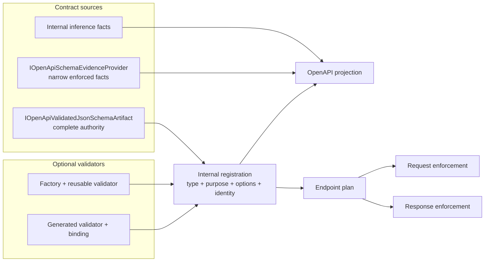

# Architecture: in-box contract and validator seams

This document defines ASP.NET Core ownership and lifecycle. External engines are examples, not
framework dependencies; see [Integrations](integrations.md).

## Terms

| Term | Meaning |
| --- | --- |
| Inference fact | Immutable observation from effective STJ or endpoint-binding metadata |
| Evidence | A narrow typed fact already enforced by a recognized converter/parser |
| Artifact | Complete portable schema authority with identity and OpenAPI projection |
| Validator | Reusable engine execution over raw UTF-8 |
| Binding | Generated composition of CLR type, artifact, validator, and identity |
| Registration | Engine-neutral contract selected for endpoint type and direction |
| Endpoint plan | Precomputed request/response buffering, selection, and failure policy |

## Framework ownership

| Concern | ASP.NET Core owns | Producer/engine owns |
| --- | --- | --- |
| Contract identity | Identity composition and collision safety | Source schema/resource identity |
| OpenAPI | Version target, compatibility projection, transformers | Authoritative source semantics |
| Validation | Neutral invocation and result boundary | Payload evaluation and native diagnostics |
| Endpoint policy | Type/direction selection, limits, buffering, status/content type, failures | Nothing HTTP-specific |
| Lifecycle | Startup type erasure and endpoint-plan construction | Generated resources or one-time runtime compilation |
| Results | Success/error abstraction | Mapping native results into that abstraction |

## End-to-end pipeline

```mermaid
flowchart LR
    subgraph Sources["Contract sources"]
        Inference["Internal inference facts"]
        Evidence["IOpenApiSchemaEvidenceProvider<br/>narrow enforced facts"]
        Artifact["IOpenApiValidatedJsonSchemaArtifact<TSelf><br/>complete authority"]
    end

    subgraph Validators["Optional validators"]
        Runtime["Factory + reusable validator"]
        Generated["Generated validator + binding"]
    end

    Registration["Internal registration<br/>type + purpose + options + identity"]
    Plan["Endpoint plan"]
    OpenApi["OpenAPI projection"]
    Request["Request enforcement"]
    Response["Response enforcement"]

    Inference --> OpenApi
    Evidence --> OpenApi
    Artifact --> Registration
    Runtime --> Registration
    Generated --> Registration
    Registration --> OpenApi
    Registration --> Plan
    Plan --> Request
    Plan --> Response
```

Inference and narrow evidence can improve OpenAPI without entering the validator branch. Complete
authority enters enforcement only through a validated registration or closed binding.

## Contract-source seams

### Internal inference facts

Cycle-safe discovery memoizes canonical type/property identities before following recursive edges.
Immutable facts describe nullability, shape, properties, collections, dictionaries, extension
data, alternatives, polymorphism, converters, and direction. Deterministic decisions then choose
composition, names, references, scalar annotations, and target-version fallbacks.

These facts are implementation details, not a second public schema model.

Discovery and decisions are separate. Discovery records effective metadata; policy decides whether
those facts justify `allOf`, exclusive `oneOf`, non-exclusive `anyOf`, component reuse, scalar
annotations, or conservative widening. This keeps rejection reasons testable and avoids
rediscovering facts while emitting mutable OpenAPI models.

### Narrow evidence providers

`IOpenApiSchemaEvidenceProvider.GetSchemaEvidence` receives framework-created context containing
the declared/effective type, effective `JsonTypeInfo`, converter, and input/output purpose. It may
return the closed `OpenApiSchemaEvidence` algebra.

Evidence must describe behavior already enforced elsewhere. ASP.NET does not run it as a
validator, and it cannot express complete objects, arbitrary composition, conditionals,
vocabularies, or engine configuration.

### Complete generated artifacts

`IOpenApiValidatedJsonSchemaArtifact<TSelf>` is complete portable authority. It exposes exact
source, normalized compatibility data, local references, dialect/capabilities, `SchemaIdentity`,
and isolated `OpenApiSchema` creation for a requested OpenAPI version.

The artifact must not expose engine-native state as authority. Native graphs, compiled programs,
or caches remain private derivatives.

Built-in generation accepts only explicitly declared schema inputs. Logical names and generated
source are path- and culture-independent. Invalid JSON, dialect mismatches, unsupported keyword
shapes, unresolved/external references, duplicate names, and invalid metadata fail generation
rather than producing success-shaped fallbacks.

## Validator seams

### Runtime registration

`IOpenApiJsonSchemaValidatorFactory` declares dialect support and stable
`ConfigurationIdentity`. Registration validates and normalizes bounded schema input, then calls
`CreateValidator` once. The resulting thread-safe `IOpenApiJsonSchemaValidator` validates request
or response UTF-8 using `OpenApiJsonSchemaValidationContext`.

`OpenApiJsonSchemaValidationResult` and `OpenApiJsonSchemaValidationError` form the neutral result
boundary. Native engine result objects do not cross it.

The [runtime adapter proof](evidence/validated-schema-adapters/README.md) exercises one-time
factory creation, reusable validators, supported-dialect rejection, neutral results, and the
shared endpoint policy.

### Generated/AOT registration

`IOpenApiValidatedJsonSchemaValidator<TArtifact,TSelf>` provides static validation and
configuration identity for one artifact. `IOpenApiValidatedJsonSchemaBinding<TSelf>` closes the
CLR type, artifact, validator, projection, and composite identity.

ASP.NET type-erases that closed binding once through
`OpenApiGeneratedValidatedJsonSchemaRegistration<TBinding>`. No factory compilation or schema
processing occurs at endpoint construction. The
[generated registration interpretation](evidence/generated-schema-artifacts/allocation-results.md#registration-runtime-authority-versus-generated-binding)
quantifies the bounded adapter object separately from runtime schema preparation.

### Convergence

Both public paths converge on internal `IOpenApiValidatedJsonSchemaRegistration`, which exposes:

- CLR `Type`, input/output `Purpose`, endpoint `Options`, and composite `Identity`;
- `CreateOpenApiSchema(version)` for document generation; and
- `ValidateAsync(bytes)` for runtime execution.

`OpenApiValidatedJsonSchemaEndpointPlan` selects registrations and owns all HTTP behavior. Engines
own only validation.

### Registration selection

Registrations are directional: input and output contracts can differ for the same CLR type. At
endpoint construction ASP.NET precomputes registrations, validation contexts, payload limits, and
status/content-type selectors. Requests use that immutable plan; they do not search providers or
rebuild schema state.

For MVC, an optional action predicate runs during controller endpoint construction, when
`ControllerActionDescriptor` is available. The resulting plan surrounds the completed MVC
delegate, preserving action-specific schemas without engine-specific filters or formatters.

## Lifecycle and forbidden work

| Phase | Runtime path | Generated path | ASP.NET work | Forbidden |
| --- | --- | --- | --- | --- |
| Build/source generation | None required | Emit artifact, validator/binding, optional private acceleration | Compile contracts | Treat engine image/graph as schema authority |
| Startup/endpoint construction | Normalize bounded source; create one validator | Type-erase binding; load/reference prebuilt state | Build registrations and endpoint plan | Generated schema parse, normalize, hash, resolve, or compile |
| Document generation | Import normalized authority | Create isolated schema from artifact | Project target version; run transformers | Validate payloads or mutate shared artifact state |
| Request | Reusable validator over buffered UTF-8 | Static validator over buffered UTF-8 | Limit, select, validate, rewind, bind | Schema processing, factory/provider lookup, validator compile |
| Response | Reusable validator over captured UTF-8 | Static validator over captured UTF-8 | Select by actual status/content type; copy or suppress | Engine ownership of HTTP/error policy |

The [current generated proof](evidence/generated-schema-artifacts/current-proof.md) provides
behavioral and lifecycle evidence; its
[symmetric binding section](evidence/generated-schema-artifacts/current-proof.md#symmetric-aspnet-binding-execution)
keeps engine execution distinct from framework policy.

## Identity boundaries

| Identity | Changes when | Must not change when |
| --- | --- | --- |
| `SchemaIdentity` | Authoritative source/resources or producer semantics change | Only the validation engine/configuration changes |
| `ConfigurationIdentity` | Engine version/options or executable validation semantics change | Only OpenAPI target version changes |
| Binding/evidence `Identity` | Schema authority, dialect/capabilities, or validator configuration changes | A derived compatibility view is reserialized equivalently |
| Program/image identity | Private compiled payload or format changes | It is not schema authority |

Composite identity prevents incompatible validators or settings from colliding in caches while
allowing multiple engines to consume one schema authority.

Identity strings are stable protocol values, not display names. Producers derive schema identity
from authoritative resources. Validators derive configuration identity from every option that can
change acceptance semantics. ASP.NET must not substitute a compatibility-schema or compiled-image
hash for source authority.

## Shared Minimal API and MVC enforcement

1. **Request:** bounded buffer → raw UTF-8 validation → rewind → ordinary binding. Invalid payload
   returns 400; oversized input returns 413.
2. **Response:** capture before server write → select by actual status/content type → validate →
   copy valid payload or suppress it and return an empty 500.

Minimal API endpoint conventions wrap the final RDF/RDG delegate. MVC conventions select actions
through `ControllerActionDescriptor`, then surround the complete MVC delegate. Model binding,
filters, formatters, serialization, and action code remain unchanged. Non-JSON/no-content
responses bypass validation.

Validation errors are neutral records with instance location, keyword, and message. Engines may
classify or phrase native diagnostics differently, so cross-engine equivalence is asserted at
success/failure and framework-policy boundaries unless a stronger common diagnostic contract is
defined.

After warm-up, the framework wrapper can operate without incremental successful-path allocation;
that claim excludes server hosting, STJ serialization/deserialization, and engine internals. The
[runtime](evidence/validated-schema-adapters/allocation-results.md) and
[generated](evidence/generated-schema-artifacts/allocation-results.md) interpretation pages
define exact operations, comparators, exclusions, units, and acceptance criteria.

## Dialect, security, and projection limits

Runtime complete schemas accept bounded Draft 4, 6, 7, 2019-09, and 2020-12 inputs. Registration
rejects unsupported dialect/keyword combinations, remote references, unresolved local references,
unsupported vocabularies, and configured depth/size/reference-limit violations. The framework
does not fetch network resources.

OpenAPI 3.1/3.2 preserve more canonical JSON Schema semantics. OpenAPI 3.0 is a lossy target:
recursive/definition-bearing schemas and unsupported assertions widen conservatively, and fixed
prefix arrays use a length-constrained approximation. A compatibility schema or private compiled
image is always derived; neither replaces canonical authority.

OpenAPI import creates isolated mutable models. Transformers run after projection and do not flow
back into validator authority. Callers request a fresh projection for each target version rather
than reserializing one version-sensitive model as another target.

Static abstract interface members and closed generic bindings avoid reflection or dynamic code in
the generated execution seam. Runtime registration remains available for dynamic schema bytes,
runtime-selected options, or ecosystems that cannot generate closed types.

The generated proof records
[deterministic identities](evidence/generated-schema-artifacts/current-proof.md#deterministic-build-and-identities),
[trim/NativeAOT deployment](evidence/generated-schema-artifacts/current-proof.md#deployment-and-footprint),
and [version-targeted projection](evidence/generated-schema-artifacts/current-proof.md#canonical-authority-and-correctness).

For implementation internals, alternatives, detailed normalization, and benchmark rationale, see
the [archived architecture](archive/2026-10-prototype-design-history/architecture.md). Current
claims and reproduction paths are indexed by [Evidence](evidence/README.md).
