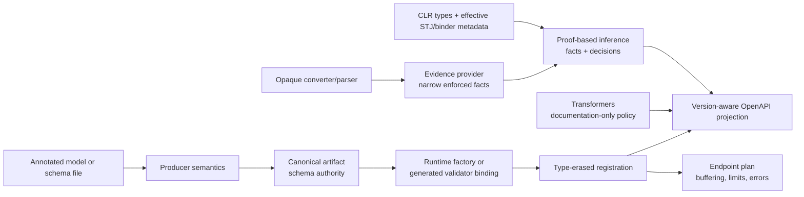
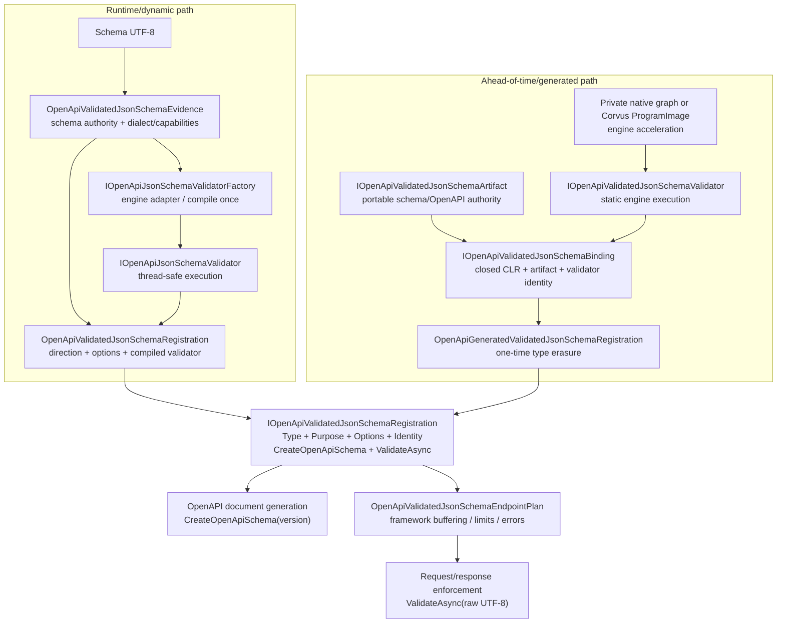
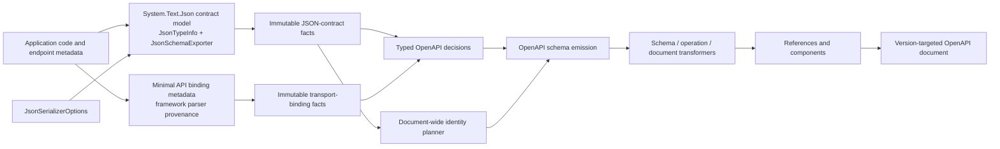
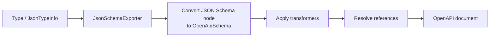
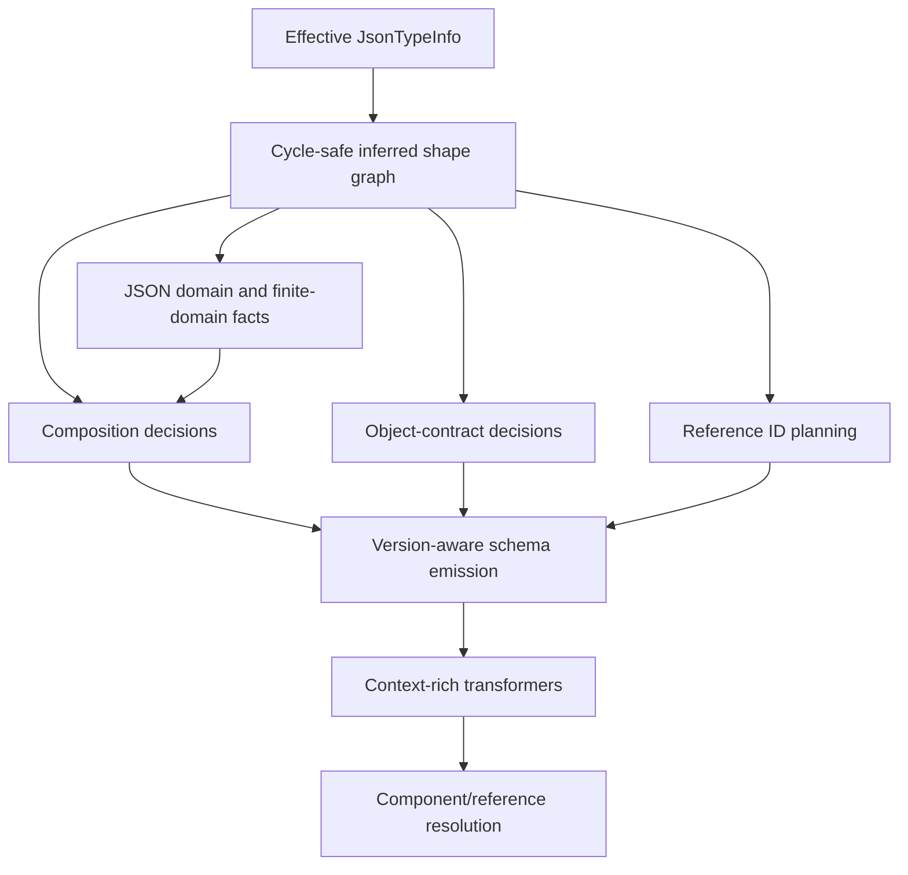
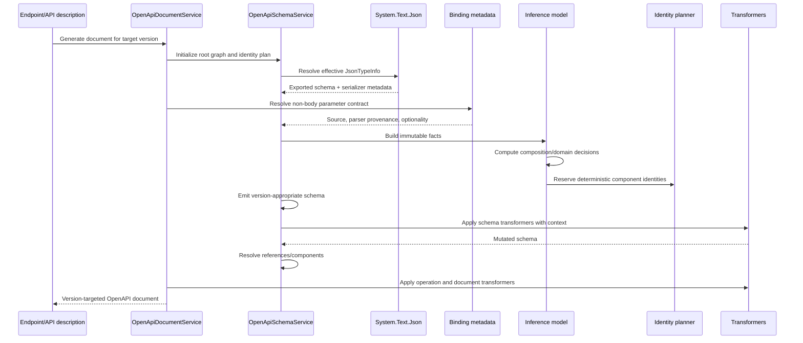
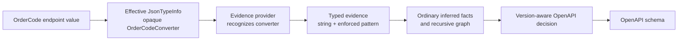
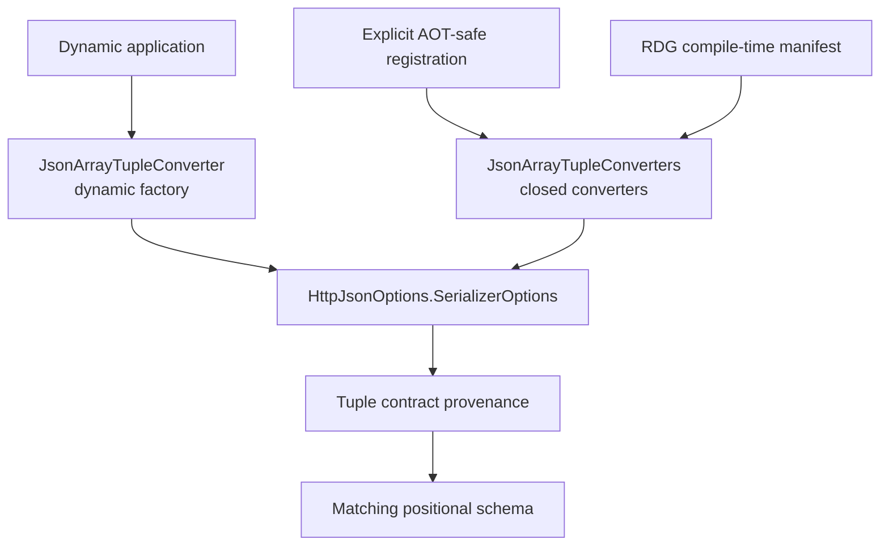

# Experimental OpenAPI contracts: architecture and extensibility

## Purpose and Scope

This document describes how the experimental proposal moves from runtime metadata or authored
schema authority to OpenAPI projection and, when explicitly selected, endpoint enforcement.

ASP.NET Core currently starts from CLR, System.Text.Json, and binder metadata, then translates
toward OpenAPI. That metadata can lose effective runtime details, while guessing missing details
can overconstrain clients. Transformers can improve documentation but do not enforce what they
add. At the other end of the spectrum, some ecosystems already possess an authoritative generated
JSON Schema and validator that should not be reauthored for OpenAPI.

The proposal addresses those cases through graduated paths: conservative zero-authoring
inference, narrow evidence for opaque runtime contracts, documentation-only transformers, and
complete validated canonical artifacts. The paths share deterministic identity and projection
principles but are selected independently.

The inference path treats System.Text.Json as the authority for JSON representation and endpoint
metadata/framework parsers as the authority for non-body values. The validated path treats the
canonical artifact as schema authority, private engine state as acceleration, and ASP.NET as the
owner of endpoint policy.

## End-to-end architecture at a glance

The proposal is a set of complementary paths, not one required stack. Existing applications can
stop at ordinary inference. Converter libraries can add narrow evidence. Applications can use
transformers for documentation-only semantics. Applications with an authoritative schema and
validator can opt into endpoint enforcement.



Inference and evidence produce OpenAPI descriptions of existing runtime contracts. Validated
artifacts go further: the same authoritative contract feeds OpenAPI projection and endpoint
validation. Transformers can modify documentation but do not become runtime validators.

### Terminology

| Term | Meaning |
| --- | --- |
| Inference fact | Immutable observation from effective STJ or binder metadata. |
| Evidence provider | Adapter that supplies a narrow typed fact already enforced by an opaque runtime mechanism. |
| Canonical artifact / schema authority | Portable immutable schema contract from which projection and validation derive. |
| Validator factory | Runtime engine adapter that checks dialect/configuration and creates one reusable validator. |
| Validator | Runtime execution seam over a complete raw UTF-8 payload. |
| Generated validator | Static AOT execution seam backed by generated code, a native graph, or a precompiled image. |
| Binding | Closed generated composition of CLR type, artifact, validator, and composite identity. |
| Registration | Type-erased directional contract consumed by framework document and endpoint code. |
| Endpoint plan | Framework-owned request/response buffering, selection, limits, and error policy. |
| Compatibility schema | Derived single-document schema view for consumers that cannot consume a resource bundle. |
| ProgramImage | Corvus-specific precompiled execution image; a private acceleration artifact, not schema authority. |

## Optional validated-schema tier

An endpoint may opt into a stricter tier that couples an exact, self-contained Draft 4, Draft 6, Draft 7, Draft 2019-09, or Draft 2020-12 schema to a compiled validator. Registration is endpoint-scoped and directional. `SchemaIdentity` is the SHA-256 hash of the original UTF-8 bytes. The semantic `Identity` additionally covers the declared dialect, format/vocabulary capabilities, and validator configuration, and binds OpenAPI generation, runtime validation, and validator caches. OpenAPI normalization never changes the original source authority.

Registration requires the dialect's exact stable `$schema` URI (except that Draft 6+ boolean
schemas have no object in which to declare it), checks source keyword shapes and local references
under that dialect, and rejects external/unresolved references and custom vocabularies. It then
normalizes the supported subset into one internal 2020-12-shaped semantic document:

| Source construct | Canonical representation |
| --- | --- |
| Draft 4 `id`; later `$id` | `$id` |
| Draft 4/6/7 `definitions` | `$defs`, including rewritten local pointers |
| Draft 4 boolean exclusive bounds | numeric `exclusiveMinimum` / `exclusiveMaximum` |
| Draft 4/6/7/2019-09 tuple `items` plus `additionalItems` | `prefixItems` plus `items` |
| Draft 4/6/7 `dependencies` | `dependentRequired` and `dependentSchemas` |
| Draft 4/6/7 `$ref` siblings | ignored as assertions; required identifier/definition containers retained and the reference represented through `allOf` |
| Draft 2019-09/2020-12 `$ref` siblings | retained as applicable assertions |
| Draft 6+ boolean schemas | assertion-equivalent boolean schema |

Draft 4 boolean schemas; recursive/dynamic reference keywords; malformed keyword values;
dialect-mismatched keywords; unsupported custom vocabularies; and external or unresolved
references fail registration with a tailored error. Recursive/dynamic references are not
reinterpreted as ordinary references. `format` is never inferred to be an assertion from its text:
that semantic remains an explicit validator capability.

### Validator seams

There are two public ways to supply validation. The runtime path accepts schema bytes and lets an
engine factory compile or construct a reusable validator once. The generated path supplies a
closed static artifact/validator binding whose engine-native state was prepared ahead of time.
Both become the same internal registration shape before framework policy runs.



#### Runtime factory and validator

`OpenApiValidatedJsonSchemaEvidence` owns immutable source authority plus dialect,
capabilities, `SchemaIdentity`, validator-configuration identity, and composite `Identity`.
`IOpenApiJsonSchemaValidatorFactory` is the engine adapter and compilation seam:
`SupportsDialect` rejects unsupported input, `ConfigurationIdentity` identifies all settings that
affect semantics, and `CreateValidator(evidence)` runs once when
`OpenApiValidatedJsonSchemaRegistration` is constructed. The returned
`IOpenApiJsonSchemaValidator` is reusable and thread-safe. It validates complete raw UTF-8 using
`OpenApiJsonSchemaValidationContext`; it is never created, compiled, or looked up per request.

`OpenApiJsonSchemaValidationResult` and `OpenApiJsonSchemaValidationError` are the
validator-neutral result boundary. Engines translate their native result and diagnostics into
this shape. The success value can remain allocation-free; failure diagnostics are engine-specific
in content but framework-neutral in representation.

#### Generated artifact, validator, and binding

`IOpenApiValidatedJsonSchemaArtifact<TSelf>` is the portable schema and OpenAPI authority. It
exposes exact source bytes, normalized bytes, local-reference data, dialect/capabilities,
`SchemaIdentity`, and isolated OpenAPI projection.
`IOpenApiValidatedJsonSchemaValidator<TArtifact,TSelf>` is the static AOT execution seam.
JsonSchema.Net's generated native graph or a Corvus `ProgramImage` remains private behind that
interface. `IOpenApiValidatedJsonSchemaBinding<TSelf>` closes the CLR type, artifact, validator,
and composite identity.

`OpenApiGeneratedValidatedJsonSchemaRegistration<TBinding>` type-erases the static binding once
during endpoint construction. It does not parse, normalize, hash, resolve, or compile a schema.
No factory compilation occurs at endpoint build or request time for this path.

#### Framework convergence

Both public paths implement the internal `IOpenApiValidatedJsonSchemaRegistration`, which exposes:

- `Type`, directional `Purpose`, endpoint `Options`, and composite `Identity`;
- `CreateOpenApiSchema(openApiVersion)` for document generation; and
- `ValidateAsync(utf8Json)` for request/response execution.

Endpoint conventions select registrations and build one
`OpenApiValidatedJsonSchemaEndpointPlan`. OpenAPI generation and runtime validation are separate
consumers of the same registration and identity: document generation calls
`CreateOpenApiSchema`; the request/response path calls `ValidateAsync`.

The endpoint plan, not the validation engine, owns bounded buffering, payload limits,
status/content-type selection, empty-body behavior, validation-problem/error policy, and invalid
response suppression. Engines own only payload validation and validator-neutral diagnostics.

`IOpenApiSchemaEvidenceProvider` is **not** a validator seam. It enriches inference with facts that
a converter or parser enforces elsewhere and installs no payload validation. See
[Runtime-enforced schema evidence providers](#runtime-enforced-schema-evidence-providers).

#### Lifecycle and forbidden work

| Phase | Runtime/dynamic path | Generated path | Framework work | Must not happen |
| --- | --- | --- | --- | --- |
| Build / source generation | No validator work is required. | Producer emits artifact, generated validator/binding, and optional private native graph or ProgramImage. | Compile generated contracts. | Treat an engine graph/image as schema authority. |
| Application startup / endpoint construction | Registration validates and normalizes source once; factory checks dialect and creates one reusable validator. | Static binding is type-erased once; prebuilt engine state is loaded or referenced, not compiled from schema. | Build directional registrations and one endpoint plan. | Generated path schema parse, normalization, hashing, reference resolution, or validator compilation. |
| Document generation | Registration imports normalized evidence. | Binding creates an isolated OpenAPI schema from the artifact. | Apply target-version projection and transformers. | Invoke payload validation or mutate shared artifact state. |
| Request | Reusable validator executes over buffered raw UTF-8. | Static generated validator executes over buffered raw UTF-8. | Select input registration, enforce limits, validate, rewind, then bind. | Schema parse/normalize/hash/ref resolution, validator compile, factory/provider lookup. |
| Response | Reusable validator executes over captured raw UTF-8. | Static generated validator executes over captured raw UTF-8. | Select by actual status/content type; copy valid output or suppress invalid output. | Engine ownership of buffering, HTTP selection, or error policy. |

#### Seam responsibilities

| Seam/type | Implemented by | Called when | Owns | Must not own |
| --- | --- | --- | --- | --- |
| `OpenApiValidatedJsonSchemaEvidence` | ASP.NET Core | Runtime registration construction and projection | Immutable source authority, dialect/capabilities, schema/configuration/composite identities | Engine-native validator state or endpoint policy |
| `IOpenApiJsonSchemaValidatorFactory` | Runtime engine adapter | Once per runtime registration | Dialect support, configuration identity, validator creation/compilation | Per-request execution, OpenAPI projection, buffering |
| `IOpenApiJsonSchemaValidator` | Runtime engine adapter | Each selected request/response | Thread-safe raw-UTF8 payload validation | Schema compilation, endpoint selection, HTTP policy |
| `OpenApiJsonSchemaValidationResult` / `Error` | ASP.NET Core boundary populated by adapters | Returned by every validation call | Validator-neutral success/failure and diagnostics | Native engine result objects or response policy |
| `IOpenApiValidatedJsonSchemaArtifact<TSelf>` | Source generator or application producer | Build output; document projection | Portable schema/OpenAPI authority and `SchemaIdentity` | Engine acceleration or endpoint policy |
| `IOpenApiValidatedJsonSchemaValidator<TArtifact,TSelf>` | Generated/AOT engine adapter | Each selected request/response | Static validation and `ConfigurationIdentity` | Runtime schema parse/compile or OpenAPI policy |
| `IOpenApiValidatedJsonSchemaBinding<TSelf>` | Generated/application adapter | Startup type erasure, projection, validation | CLR type + artifact + validator composition and binding `Identity` | Framework buffering, limits, status/error policy |
| `OpenApiGeneratedValidatedJsonSchemaRegistration<TBinding>` | ASP.NET Core | Once during endpoint construction | Type erasure into the internal registration | Schema processing or validator compilation |
| `IOpenApiValidatedJsonSchemaRegistration` | ASP.NET Core implementations | Document generation and endpoint-plan execution | Common type, direction, options, identity, projection, validation calls | Public engine-specific surface |
| `OpenApiValidatedJsonSchemaEndpointPlan` | ASP.NET Core | Built once; executed per request/response | Registration selection, buffering, limits, content/status matching, error policy | Schema authority or engine validation semantics |

#### Identity boundaries

`SchemaIdentity` belongs to exact source bytes or the generated artifact/resource graph. A
validator's `ConfigurationIdentity` belongs to engine version and options that affect validation
semantics. Runtime evidence `Identity` and generated binding `Identity` combine schema authority,
dialect/capabilities, and validator configuration so caches cannot collide across incompatible
execution semantics.

Changing only the engine, engine version, image format, or validator options must not change
schema authority or `SchemaIdentity`; it must change the composite evidence/binding identity.
Changing schema resources or producer semantics must change `SchemaIdentity` and therefore every
composite identity. Compatibility-schema and ProgramImage identities remain derived and cannot
replace schema authority.

#### Equivalent endpoint registration

The runtime path constructs a registration with a factory:

```csharp
var input = new OpenApiValidatedJsonSchemaRegistration(
    typeof(Order),
    OpenApiSchemaEvidencePurpose.Input,
    orderSchemaUtf8,
    OpenApiJsonSchemaDialect.Draft202012,
    OpenApiJsonSchemaValidationCapabilities.FormatAssertions,
    new JsonSchemaNetValidatorFactory());

app.MapPost("/orders", (Order order) => order)
    .WithValidatedJsonSchema(input);
```

The generated path names a closed binding:

```csharp
app.MapPost("/orders", (Order order) => order)
    .WithValidatedJsonSchema<OrderCorvusBinding>(
        OpenApiSchemaEvidencePurpose.Input);
```

Both registrations produce the same framework behavior: validation runs before request binding,
the same options govern buffering and errors, and the associated schema drives OpenAPI. Output
registrations use `OpenApiSchemaEvidencePurpose.Output` and the same endpoint-plan machinery.

### Minimal API and MVC execution

Validation runs in the endpoint wrapper before request binding and before response bytes reach the
server. It protects the payload boundary without replacing normal System.Text.Json or MVC
processing. Minimal APIs and MVC share one precomputed endpoint plan so limits, selection, and
failure behavior cannot drift.

1. **Request:** bounded buffer → validate raw UTF-8 → rewind → normal binding. Invalid JSON returns
   a deterministic 400 validation problem; an oversized body returns 413.
2. **Response:** capture before the server → select by actual status and content type → validate →
   copy unchanged, or suppress the payload and return an empty 500. Non-JSON and no-content
   responses bypass validation.

| Surface | Integration point | What remains unchanged |
| --- | --- | --- |
| Minimal API | Endpoint convention wraps the final RDF/RDG request delegate. | Argument binding, System.Text.Json deserialization/serialization, and endpoint code |
| MVC | Endpoint convention selects actions through `ControllerActionDescriptor` metadata. | Input/model binding, filters, formatters, result execution, and action code |

> **Measured framework boundary:** after pool/cache warm-up, successful request and response
> wrappers add **0 B/op** over pass-through. This includes plan selection, buffering, interception,
> and copying; it excludes the server/TestServer, System.Text.Json binding/serialization, and
> validator-engine allocation. See the
> [allocation evidence](../../evidence/validated-schema-adapters/allocation-results.md).

#### Implementation notes

- Request acceptance is the intersection of schema validation and normal framework binding.
- Response interception uses pooled `IHttpResponseBodyFeature` state and covers both `Stream` and
  `PipeWriter` writes.
- `ActionEndpointFactory` provides the completed MVC delegate before `MapControllers()` conventions
  run. Validation therefore surrounds controller invocation without putting validators in
  attributes: requests precede formatters/model binding/filters, and responses follow result
  filters and formatter writes.

### Ahead-of-time generated artifacts

The generated path separates four concerns. The **artifact** is portable schema/OpenAPI authority;
the **validator** hides engine-specific execution; the **binding** closes the CLR type, artifact,
validator, and composite identity; ASP.NET type-erases that binding for OpenAPI projection and
endpoint enforcement. Engine configuration may change binding identity, but never schema
authority. See the shared [validator-seam diagram and lifecycle](#validator-seams).

| Layer | Owns | Must not own |
| --- | --- | --- |
| Artifact | Exact and normalized bytes, references, dialect/capabilities, `SchemaIdentity`, isolated OpenAPI factory | Validator state or endpoint policy |
| Validator | Raw-UTF8 execution, `ConfigurationIdentity`, private native graph/image | Schema authority or HTTP behavior |
| Binding | CLR type + artifact + validator composition and composite `Identity` | Buffering, limits, or error policy |
| Registration | One-time type erasure into the common OpenAPI/endpoint-plan seam | Schema processing or validator compilation |

#### Generation sources

| Source | Emits | Constraint |
| --- | --- | --- |
| Built-in `AdditionalFiles` producer | Deterministic artifact and, when declared, a closed binding | Reads only explicit `OpenApiValidatedJsonSchema` inputs; invalid JSON, dialect/keyword/reference/metadata combinations fail the build |
| Independent annotated-model producer | Canonical resources, manifest, identity, and optional private native graph; an ASP.NET adapter consumes the resources | No generator-to-generator SPI: Roslyn generators cannot consume another generator's same-compilation output, so resources cross a build boundary or the producer emits the public static contract directly |

Both sources create isolated mutable OpenAPI models. Logical names and generated output are
path- and culture-independent. Draft 4, 6, 7, 2019-09, and 2020-12 use the same bounded
normalization rules as runtime evidence.

#### Runtime properties

- One type-erased registration object is created at startup (**80 B measured**).
- Endpoint construction and requests do **not** parse, normalize, hash, resolve references, look up
  providers, or compile validators.
- The warmed successful framework wrapper adds **0 B/op**; engine allocation is measured separately.
- MVC retains a runtime action-predicate boundary and is not claimed to be reflection-free.
- RDG generation is limited to source-visible endpoints with authoritative serializer metadata.
  Dynamic options, converters, and transformers use runtime registration instead; there is no
  separate public generated-plan ABI.

#### Demonstrated interoperability

The JsonSchema.Net.Generation proof emits one canonical authority plus an optional native graph.
ASP.NET adapters pair that artifact symmetrically with either the private JsonSchema.Net graph or a
private build-time Corvus `ProgramImage`, using the same Minimal API/MVC binding surface. Direct
native parsing or Corvus compilation appears only in labeled engine-equivalence tests and
engine-only benchmarks. The illustrative `json-everything` fork is not intended for upstream
submission; its unconditional native package closure still requires a production
analyzer/canonical-versus-native package split. See the
[same-pass evidence](../../evidence/generated-schema-artifacts/same-pass-exporter-removal.md).

#### OpenAPI projection limits

OpenAPI 3.1/3.2 import the canonical semantics into isolated typed OpenAPI.NET models. A narrow
internal association preserves typed `prefixItems` until OpenAPI.NET supports it directly; this is
not a second schema DOM.

OpenAPI 3.0 cannot preserve local definitions, recursive references, conditionals, or many newer
assertions. Definition-bearing/recursive schemas therefore widen to `{}`; fixed prefix arrays use
the existing length-constrained tuple approximation; unsupported assertions widen rather than
becoming misleading extensions. OpenAPI 3.0 remains an emission target, never a Draft 4 label.

## Design Principles

1. **The effective serializer contract is authoritative.** Use `JsonTypeInfo`, effective converters, and serializer options rather than CLR shape alone.
2. **Facts and policy are separate.** Observe immutable serializer facts first; decide OpenAPI composition separately.
3. **Emit the strongest schema that can be proved.** Prefer conservative `anyOf` or unconstrained output when evidence is incomplete.
4. **Do not reverse-engineer opaque converters.** Custom converters remain unknown unless they expose package-owned schema provenance.
5. **Plan document-wide identities before emission.** Naming, collision resolution, aliases, and contextual identities must be deterministic.
6. **Keep legacy behavior stable.** The existing mode remains the default; inferred behavior is experimental and opt-in.
7. **Make OpenAPI version a generation input.** Transformers and emitters must know the target before producing version-sensitive structures.
8. **Keep extension points explicit.** Application-owned invariants belong in transformers or recognized contracts, not speculative inference.
9. **Treat trimming and NativeAOT as architectural constraints.** Reflection-dependent convenience APIs must have explicit safe alternatives.
10. **Test rejection decisions as well as successful inference.** Knowing why a stronger schema was not emitted is part of correctness.
11. **Keep body and transport authorities separate.** System.Text.Json owns JSON contracts; endpoint metadata and framework parser provenance own non-body binding contracts.

## System Context



### Responsibility boundary

| Concern | Authority |
| --- | --- |
| Property names and inclusion | System.Text.Json contract |
| Runtime JSON shape | Effective `JsonTypeInfo` and converter |
| Non-body logical value | Endpoint binding metadata and framework parser provenance |
| Custom parser lexical language | Unknown unless represented by a recognized declarative contract |
| Number/string acceptance | Effective `JsonNumberHandling` |
| Polymorphism configuration | System.Text.Json polymorphism metadata |
| OpenAPI composition | ASP.NET Core inferred decisions |
| Component IDs and collision policy | ASP.NET Core identity planner |
| OpenAPI-version fallback | ASP.NET Core generation policy |
| Application business invariants | Explicit transformers or future recognized providers |
| NativeAOT converter registration | Closed converters and RDG manifest |

## Existing and Experimental Architectures Compared

### Existing implementation

The existing path is primarily a conversion pipeline:



This architecture is effective for broad schema generation and intentionally simple. Its limitations arise when behavior depends on relationships across types or across the whole document:

- composition choices are made from the emitted schema rather than a durable semantic model;
- inheritance and alternatives are commonly flattened or represented broadly;
- component naming is local and can be sensitive to discovery order;
- serializer facts, inference decisions, and emission concerns can become interleaved;
- a custom converter's runtime behavior is difficult to distinguish from ordinary CLR shape;
- transformer traversal must infer context from the emitted tree;
- version-sensitive transformer output historically lacked an authoritative generation target;
- the same type identity is generally reused wherever the type appears.

### Experimental implementation

The experimental path adds explicit intermediate models:



The important difference is not merely that more keywords are emitted. The experimental approach preserves the reasoning inputs and decisions independently of the final OpenAPI object graph.

| Area | Existing approach | Experimental approach |
| --- | --- | --- |
| Serializer model | Consumed during direct conversion | Captured as immutable inferred facts |
| Composition | Primarily follows exported shape | Typed, proof-based decisions |
| Inheritance | Commonly flattened | Lossless `allOf` when eligible |
| Alternatives | Broad exporter composition | `oneOf` only when exclusivity is proven |
| Enum domains | Exported literals | Exact/open finite-domain classification |
| Number handling | Schema translation | Effective read/write number handling included in domain proof |
| Open objects | Basic `additionalProperties` handling | Distinct closed, disallow-unmapped, and extension-data decisions |
| Naming | Local candidate resolution | Document-wide deterministic planning |
| Late schemas | Resolved when encountered | Full late graph planned atomically |
| Converter handling | CLR shape may remain visible | Unknown unless effective contract or owned provenance proves shape |
| Scalar constraints | Familiar CLR-derived hints | Converter-proven bounds and versioned encoding |
| Non-body parameters | Shares broad schema-generation machinery | Separate transport-binding facts and decisions |
| Tuple arrays | No standard package contract | Dynamic, closed AOT-safe, and RDG-generated converter paths |
| OpenAPI version | Often selected at serialization | Selected before transformers and schema generation |
| Failure mode | Best-effort conversion | Explicit conservative rejection reasons |
| Compatibility | Existing behavior | Opt-in inferred mode; legacy remains default |

## Core Building Blocks

### 1. Effective serializer contract

`JsonSerializerOptions` and `JsonTypeInfo` define the actual JSON contract. The inference layer consumes:

- type kind: object, enumerable, dictionary, or converter-defined;
- properties in serializer order;
- effective JSON names;
- requiredness and directional nullability metadata;
- element or dictionary-value types;
- polymorphism configuration;
- effective number handling;
- converter identity and package-owned provenance.

The CLR type remains useful for stable identity and graph relationships, but it does not override the effective serializer contract.

### 2. Immutable inferred shape graph

The graph captures canonical facts for every reachable schema use:

- scalar, object, collection, dictionary, union, and tuple shapes;
- property uses and serializer identities;
- nullability and requiredness;
- base and derived relationships;
- polymorphic alternatives and discriminators;
- extension-data fallbacks;
- tuple element uses;
- converter provenance;
- recursive edges.

Graph construction is cycle-safe and deterministic. Facts are immutable after construction so later phases cannot silently reinterpret them.

### 3. Typed decision layer

The decision layer answers questions such as:

- Is inheritance decomposition lossless?
- Are alternatives pairwise exclusive?
- Is an enum domain exact or open?
- Is an object closed, open, extension-backed, or unknown?
- Which rejection reason prevented stronger composition?

Representative decisions include:

- inheritance eligibility and rejection reason;
- `oneOf` versus `anyOf`;
- discriminator property and mappings;
- exact/open finite literal domains;
- JSON value domains;
- object fallback behavior.

This layer has no dependency on the final OpenAPI object model, making it testable without serialization.

### 4. JSON-domain reasoning

Alternatives can be classified into broad domains:

- null;
- boolean;
- string;
- integer;
- non-integer number;
- object;
- array;
- unknown or arbitrary JSON.

Effective number handling can widen numeric domains to include strings. Exact finite literal sets can prove disjointness inside an otherwise shared broad domain. Unknown converter behavior prevents exclusivity claims.

### 5. Document-wide reference identity planner

The planner precomputes component identities across the full reachable graph:

1. preserve a unique existing candidate;
2. add declaring-type qualification when needed;
3. add namespace qualification when needed;
4. use a canonical identity hash as the final fallback.

Custom IDs are authoritative and validated. Explicit aliases support intentional shared identity. Late transformer-requested graphs are planned atomically against the same occupancy registry.

### 6. Version-aware emitter

Emission consumes facts, decisions, identity, and the target `OpenApiSpecVersion`. It does not re-derive semantic decisions from the OpenAPI tree.

Examples:

- tuple arrays use `prefixItems` and `items: false` in 3.1/3.2;
- tuple arrays use fixed arity and unconstrained `items` in 3.0;
- explicit conditional keywords are set by transformers only for 3.1/3.2;
- nullable component uses wrap references instead of mutating shared components.

### 7. Provenance markers

Internal metadata identifies schemas and converters produced by recognized framework paths. Provenance prevents inferred rules from being applied to:

- user-authored schemas;
- transformer replacements;
- unrelated `oneOf` or discriminator structures;
- arbitrary converters that happen to have a similar type name.

The tuple implementation demonstrates this pattern with a package-owned converter marker and immutable tuple contract.

### 8. Transformer integration

Schema, operation, and document transformer contexts receive:

- document name;
- exact generated document;
- scoped services;
- effective `JsonTypeInfo`;
- `JsonPropertyInfo` when applicable;
- authoritative OpenAPI generation target;
- schema-transformer collection for requested schemas.

Traversal includes composed branches, named properties, collection items, dictionary values, extension-data fallbacks, and positional tuple elements. Mutations to tuple prefix elements are synchronized back into the serialization bridge.

Operation contexts are associated with the exact generated document through a generation-local immutable map, preventing cross-version and cross-scope leakage.

### 9. Directional schema purpose

The inference model defines internal schema purposes:

- **Input** for request bodies and input parameters;
- **Output** for responses;
- **Neutral** for transformer-requested schemas without endpoint direction.

This is needed because JSON presence and nullability are directional: a property may be required during deserialization but conditionally omitted during serialization, get-only, set-only, or differently nullable through getter and setter contracts.

Purpose participates in fact discovery, decisions, recursive identity, references, transformer traversal, and component naming. Types whose directional graphs differ receive deterministic `.Input` and `.Output` identities; directionally identical graphs continue sharing the established component identity. Custom component IDs remain authoritative and fail explicitly when one configured ID cannot represent divergent directional contracts.

### 10. Converter-proven scalar contracts

`InferredScalarContract` captures immutable scalar facts from the effective System.Text.Json converter path. It separates recognized framework behavior from opaque custom converters and feeds typed decisions rather than patching schemas from CLR identity.

The decision layer can therefore:

- apply exact built-in integral bounds from `sbyte` through `UInt128`;
- preserve bounds on the numeric branch of number/string unions;
- leave floating-point precision and decimal scale unconstrained;
- omit inaccurate client hints such as decimal-as-`double`;
- emit base64 as `format: byte` in OpenAPI 3.0 and `contentEncoding: base64` in 3.1/3.2;
- preserve exact 128-bit literals without converting them through a narrower numeric representation.

Property-level and type-level custom converters invalidate built-in provenance. Unknown converter behavior produces a broad schema rather than inheriting constraints from the declared CLR type.

`OpenApiScalarFormatResolver` then applies the experimental public format policy:

- `Conventional` emits registered formats and established client-generation width hints;
- `CompatibleOnly` emits only the subset supported by the proven converter/parser contract;
- `None` suppresses optional formats;
- `CreateScalarFormat` accepts, replaces, or suppresses each candidate.

The immutable callback context exposes declared/effective type, JSON body/property or route/query/header/form location, input/output/neutral purpose, generation version, coarse provenance, and the policy-selected candidate. It does not expose internal fact records or converter/parser implementation types. Custom/unknown contracts have no default candidate but can receive an explicit application format.

Format resolution occurs before schema transformers, which retain final authority. Results are not cached by CLR type alone because location, purpose, version, provenance, and policy candidate all participate. Proven base64 encoding remains outside the optional format policy.

### 11. Transport-binding contracts

`InferredTransportBindingContract` is an immutable sibling to the JSON scalar model. It is used only for route, query, header, and form binding in experimental inferred mode.

Facts include:

- binding source;
- declared and effective type;
- framework, enum, or custom-parser provenance;
- logical schema kind;
- repeated-value element facts;
- optionality, nullability, and defaults;
- available binding metadata such as `HasTryParse` and `HasBindAsync`.

Typed decisions use a logical post-binding policy:

- exact bounded integer schemas for recognized fixed-width numeric binders;
- unbounded integer for `BigInteger`;
- unbounded number for floating-point and decimal binders;
- boolean for boolean binders;
- string schemas with policy-selected conventional annotations where configured;
- unformatted strings for parser languages without a recognized or application-supplied format;
- conservative enum string/integer alternatives;
- recursive item decisions for supported repeated-value arrays;
- absence/requiredness rather than JSON-null unions for nullable or defaulted parameters.

Arbitrary `TryParse` and `IParsable` implementations remain broad strings because binding metadata does not expose their lexical grammar. `BindAsync` is not treated as a text parser because it can consume arbitrary request state.

Transport schemas are finalized before schema transformers and remain inline or in a distinct identity space. They cannot alias a JSON-body component merely because both originate from the same CLR type.

## End-to-End Generation Flow



### Generation phases

1. Select the OpenAPI generation target.
2. Collect endpoint root types.
3. Build the inferred shape closure.
4. Preplan component identities.
5. Export and convert each effective serializer contract.
6. Apply inferred decisions.
7. Run schema transformers with exact context.
8. Resolve component references and placeholders.
9. Run operation and document transformers.
10. Register components and produce the target document.

For non-body parameters, transport facts and decisions replace the JSON-contract steps. The resulting schema is finalized before transformer traversal but is not registered as a reusable JSON-body component.

## Extensibility Mechanisms

### Schema transformers

Schema transformers are the primary application extension point. They are appropriate when the application owns semantics not represented by System.Text.Json, including:

- conditional and dependent constraints;
- domain-specific formats or patterns;
- application descriptions and examples;
- custom annotations;
- version-specific JSON Schema keywords.

Transformers can inspect `context.OpenApiVersion` and avoid unsupported 3.0 keywords:

```csharp
options.AddSchemaTransformer((schema, context, cancellationToken) =>
{
    if (context.JsonTypeInfo.Type == typeof(Payment) &&
        context.OpenApiVersion >= OpenApiSpecVersion.OpenApi3_1)
    {
        schema.DependentRequired = new Dictionary<string, HashSet<string>>
        {
            ["creditCard"] = ["billingAddress"],
        };
    }

    return Task.CompletedTask;
});
```

### Transformer-requested schemas

Operation and document transformers can request additional schemas. These requests:

- use the same serializer options;
- join the same deterministic identity registry;
- build the complete late graph atomically;
- participate in reference and transformer processing;
- inherit the same OpenAPI generation target.

These schemas use `Neutral` purpose unless a future public API explicitly allows the caller to choose.

### Runtime-enforced schema evidence providers

#### Problem: effective metadata can stop at an opaque runtime mechanism

Normal inference uses effective System.Text.Json and binding contracts without additional
application authoring. A custom converter or parser can enforce a narrower wire contract while
exposing only an opaque runtime object through metadata. ASP.NET Core must not reverse-engineer
that implementation, but leaving every such contract unconstrained loses useful information.

`IOpenApiSchemaEvidenceProvider` is the narrow bridge for this case. It recognizes the effective
runtime mechanism and returns typed facts that the mechanism already enforces. Providers run
before internal decisions and emission. They neither mutate `OpenApiSchema` nor replace ordinary
recursive inference.

#### Example and data flow

Consider a custom `OrderCodeConverter` that serializes `OrderCode` as a string and rejects input
outside `^[A-Z]{3}-[0-9]{3}$`. `JsonTypeInfo` identifies the converter but does not describe the
pattern. A provider checks both the effective CLR type and converter identity, then returns
`OpenApiScalarSchemaEvidence` with string value kind and the enforced pattern.



For a fixed positional-array converter, evidence supplies ordered element CLR types and exact
arity. The ordinary inference pipeline still discovers each element's schema, nullability,
references, direction, and component identity. This reuse is why evidence is preferable to a
complete artifact for a small opaque converter contract.

The context supplies declared and effective CLR types, effective `JsonTypeInfo`, effective
converter, and input/output/neutral purpose. Providers execute in registration order. The
effective converter is evaluated as a provider after registered providers unless the same instance
is already registered. Multiple claims for one effective contract fail deterministically, and
provider exceptions propagate.

#### Safety invariant: evidence describes enforcement; it does not add enforcement

It is called evidence because the returned value attests to runtime behavior that already exists.
Returning evidence does **not** make ASP.NET Core validate requests or responses against those
facts. A provider may claim only what its recognized converter or parser enforces.

The governing invariant is that inferred OpenAPI must not be stricter than runtime behavior. If a
converter accepts lowercase order codes, the provider cannot safely claim an uppercase-only
pattern. Unsupported or uncertain behavior remains broad.

OpenAPI 3.0/3.1/3.2 adaptation remains ASP.NET Core emitter policy. Evidence stays
version-independent and cannot smuggle target-specific keywords into inference.

#### Supported scope: a deliberately small algebra

The closed evidence algebra supports:

- strict scalar JSON value kinds: boolean, string, integer, or number;
- enforced string patterns and exact arbitrary-precision numeric bounds;
- policy-controlled scalar format candidates;
- fixed positional arrays with ordered element types and exact arity.

It deliberately does not expose `OpenApiSchema`, `JsonNode`, arbitrary keyword dictionaries,
composition, or the internal fact graph. Consequently, it is not a complete JSON Schema model.
Objects, conditionals, composition, arbitrary keywords, and validator-engine configuration do not
belong in this seam.

The tuple converter is the proving positional-array implementation. It supplies flattened ordered
element types, exact arity, a proven array domain, and runtime/schema parity. Inference does not
recognize converters through assembly names, class-name heuristics, or reflected generic
arguments. RDG retains its package-origin check only for the separate explicit tuple runtime
opt-in; third-party evidence registration does not activate tuple serialization.

#### Choosing the correct extension

- **Use ordinary inference** when effective STJ or binder metadata already describes the runtime
  contract.
- **Use evidence** when an identifiable converter or parser enforces one of the supported narrow
  facts. No separate schema document, validator, identity, or binding pipeline is required.
- **Use a transformer** for documentation-only or application-owned semantics. A transformer adds
  no runtime enforcement claim.
- **Use a validated canonical artifact** for a complete schema plus endpoint request/response
  enforcement. That tier imports a prevalidated canonical graph, carries stable identity, and binds
  an explicit validation engine.

These mechanisms are complementary, not progressively more capable versions of one API.
Evidence enriches inference; artifacts establish complete schema authority and enforcement;
transformers customize the resulting document.

### Explicit closed converters

`JsonArrayTupleConverters` provides strongly typed factories for trim-safe tuple contracts. These are explicit runtime extensions that also carry recognized inference provenance.

For tuples longer than seven logical elements, the outer converter composes a typed converter for the CLR `Rest` storage tuple. Logical elements are flattened in JSON while ordinary nested tuple elements remain nested arrays.

### Request Delegate Generator integration

RDG owns compile-time endpoint discovery. It builds a conservative tuple-contract manifest from the same endpoint model used to generate delegates and registers closed converters before serializer options are frozen.

The manifest is:

- deterministic;
- cycle-safe;
- idempotent;
- non-overriding when a user converter already handles the contract;
- bounded to statically provable endpoint and DTO graphs.

Explicit closed registration remains the fallback for dynamic endpoints, custom contracts, fields, unsupported polymorphism, and metadata not visible to RDG.

### Custom reference IDs

Applications can continue to provide reference-ID policy. In inferred mode, custom IDs are validated as authoritative identities. Collisions fail explicitly instead of being silently reordered or overwritten.

## Cross-Cutting Concerns

### Cycle safety

Graph discovery, late planning, tuple expansion, and reference resolution all guard recursive paths. Re-entry produces a componentizable placeholder rather than infinitely expanding the graph.

### Determinism

Determinism applies to:

- property and branch order;
- component identity;
- collision resolution;
- finite literal ordering;
- discriminator mappings;
- late schema planning;
- RDG converter manifests.

Endpoint discovery order must not change the final component names or composition.

### Conservative unknowns

Unknown is a first-class result, not an error hidden behind a guessed schema. It is used for:

- arbitrary custom converters;
- unsupported scalar forms;
- erased generic reference nullability;
- dictionary key domains without an effective property-name contract;
- business invariants not represented by serializer metadata.

### Error handling

The design avoids success-shaped fallback for invalid explicit configuration:

- colliding authoritative custom IDs fail;
- malformed tuple arity fails during deserialization;
- unsupported tuple converter composition fails explicitly;
- missing operation context metadata remains an error;
- unsupported converter semantics remain broad rather than fabricated.

### Testing strategy

Testing is layered:

1. fact-model unit tests;
2. decision-model unit tests;
3. red/green emitter tests;
4. public endpoint generation tests;
5. reflection/source-generated parity;
6. version matrix across 3.0, 3.1, and 3.2;
7. Legacy/Inferred compatibility;
8. trimming and NativeAOT fixtures;
9. full component build and test.

Compatibility goldens also lock deliberate omissions such as no inferred `uniqueItems` or `propertyNames`.

Scalar and transport tests additionally lock:

- exact numeric bounds without constraining quoted-number branches;
- version-aware base64 emission;
- negative custom-converter provenance cases;
- runtime and RDG binding parity;
- binder-accepted temporal, URI, networking, and grouped-decimal values;
- Conventional, CompatibleOnly, and None output across JSON and transport locations;
- callback accept/replace/suppress behavior, context values, exception propagation, and transformer ordering;
- `uri-reference` for relative-or-absolute `Uri`;
- unformatted custom/unknown parsers unless the callback supplies a format;
- enum name/numeric/flags alternatives;
- absence semantics for nullable/defaulted parameters;
- transformer visibility of finalized transport schemas.

## Version and Compatibility Model

### Legacy mode

Legacy remains the default and preserves the established schema-generation behavior. Experimental internal metadata must not alter user-authored or legacy schemas.

### Inferred mode

Inferred mode enables proof-based composition, stable naming, directional contracts, converter-proven scalar constraints, binder-aware transport schemas, open-object decisions, strengthened union analysis, and other enhanced structures.

```csharp
builder.Services.AddOpenApi(options =>
{
    options.SchemaGenerationMode = OpenApiSchemaGenerationMode.Inferred;
});
```

### Generation target

OpenAPI version is selected before transformers run. The configured default is used by normal runtime generation, while callers can explicitly generate another target:

```csharp
var document = await provider.GetOpenApiDocumentForVersionAsync(
    OpenApiSpecVersion.OpenApi3_1);
```

A version-sensitive document must be regenerated for another version. Reserializing the same in-memory model under a different version is unsupported because transformers may have authored target-specific content.

### OpenAPI 3.0

OpenAPI 3.0 receives only conforming structures:

- no `prefixItems`;
- no boolean `items`;
- no conditional/dependent JSON Schema keywords; generated canonical artifacts
  containing them are widened rather than treated as unsupported input;
- no unsupported keywords disguised as `x-jsonSchema-*`;
- tuple positional types are intentionally unavailable, while fixed arity is retained.

### OpenAPI 3.1 and 3.2

These versions can use standard JSON Schema vocabulary, including:

- null type unions;
- `prefixItems`;
- boolean schemas;
- explicit transformer-authored conditional/dependent keywords.

## AOT and Source-Generation Architecture



The architecture offers three tiers:

| Application model | Converter path |
| --- | --- |
| Reflection-capable/dynamic | `JsonArrayTupleConverter` |
| NativeAOT with explicit contracts | `JsonArrayTupleConverters.Create…` |
| NativeAOT with RDG-discoverable contracts | Generated registration using closed converters |

The dynamic factory is explicitly annotated with dynamic-code and trimming requirements. Closed converters construct and access tuple members directly and use configured `JsonTypeInfo` for elements.

## Worked Extension Example

Assume a package introduces a converter that serializes a domain value as a tagged two-element array:

```json
["customer", "C-123"]
```

### Existing implementation

Without special handling, the converter may appear opaque to schema generation. Attempting to infer from the CLR type or converter generic arguments risks describing implementation details rather than runtime JSON.

### Experimental extension pattern

1. The converter exposes a package-owned immutable contract describing:
   - JSON shape: array;
   - exact arity: two;
   - element contracts: string and string;
   - any exact finite literals, such as `"customer"`.
2. The inferred shape builder recognizes only that owned marker.
3. The decision layer records an exact array domain and positional element facts.
4. The emitter selects:
   - ordered `prefixItems` and `items: false` for 3.1/3.2;
   - fixed arity with unconstrained `items` for 3.0.
5. Transformer traversal visits both element schemas with their effective `JsonTypeInfo`.
6. Component identity and recursion use the ordinary document-wide planner.
7. An explicit closed converter path is supplied if NativeAOT support is required.

This pattern extends inference without teaching the core engine to inspect arbitrary converter internals.

## Known Boundaries

- Arbitrary converters are not declarative contracts.
- Current public STJ metadata does not expose effective dictionary key/property-name converter facts.
- CLR set types do not imply JSON uniqueness validation.
- Nullable reference annotations in generic arguments are erased from runtime type identity.
- Conditional business invariants are not inferred from constructors, control flow, or correlated properties.
- Compile-time RDG discovery is deliberately bounded and does not reproduce all runtime STJ contract discovery.
- OpenAPI 3.0 cannot express positional tuple element schemas.
- OpenAPI.NET currently requires an internal bridge for `prefixItems` and boolean `items`.
- The directional purpose model is internal; transformer-requested schemas remain neutral until a public need for purpose selection is demonstrated.
- Arbitrary custom parser lexical languages are not exposed by binding metadata.
- `BindAsync` is not a scalar text contract.
- Logical transport schemas do not attempt to encode every accepted HTTP lexical form.
- Conventional formats are client-generation annotations and do not claim exact lexical equivalence with framework parsers.
- Applications needing stricter compatibility can select `CompatibleOnly`, `None`, or a context-specific callback.

## Future Evolution

### Public purpose-aware transformer API

Evaluate whether transformer authors need to request or inspect schema purpose. Avoid exposing it prematurely if neutral transformer-requested schemas are sufficient.

### Effective dictionary-key metadata

If System.Text.Json exposes public key `JsonTypeInfo` and property-name converter schema metadata, add proof-based `propertyNames` or finite key-domain inference for 3.1/3.2.

### Shared declarative validation facts

If ASP.NET validation generation exposes serializer-name-aware declarative rules, consider a typed fact source for conditional and dependent constraints. Executable validation callbacks alone are insufficient.

### OpenAPI.NET enhancements

Upstream typed support for `prefixItems` and boolean schema positions would remove the internal raw-keyword bridge.

### Stabilization

Before moving the experimental API toward stability:

1. review cumulative public API and diagnostics;
2. validate document stability on representative applications;
3. benchmark generation and memory use;
4. obtain feedback from OpenAPI.NET, STJ, RDG, NativeAOT, binding, and client-generation owners;
5. document migration from legacy output;
6. retain conservative fallback for every unproven contract.
