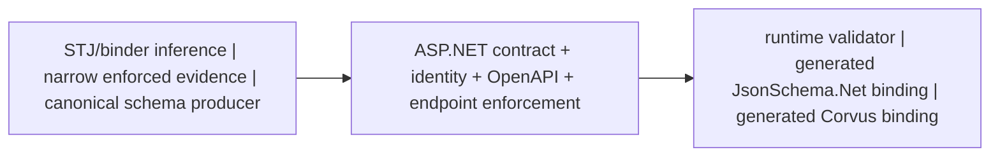

# Experimental OpenAPI contracts: benefits from inference to enforcement

This proposal lets applications choose how much schema authority and enforcement they need,
without changing the default behavior of existing applications.

## TL;DR

ASP.NET gains a **pluggable schema-contract pipeline**.

On the **contract/evidence producer side**, ordinary System.Text.Json and binder inference needs no
schema authoring. Narrow evidence providers can reveal runtime-enforced facts hidden behind opaque
converters or parsers. Complete-schema producers—such as the illustrative
JsonSchema.Net.Generation/`json-everything` proof of concept—can instead produce a canonical
artifact carrying their full constraint model.

On the **validation consumer side**, runtime validator factories/validators or generated validator
bindings enforce that schema over endpoint request and response UTF-8. JsonSchema.Net and Corvus
demonstrate interchangeable private engines over the same authoritative artifact.

In the **framework middle**, ASP.NET associates the contract with endpoint type and direction,
projects version-aware OpenAPI, owns buffering, limits, and error policy, and invokes validators
without taking an engine-specific dependency. The result is one authority for documentation and
enforcement while contract production and validation execution remain independently replaceable.



| What this delivers | Practical benefit |
| --- | --- |
| Pluggable contract production | Use zero-authoring inference, add only narrow runtime-proven facts, or bring a complete canonical schema. |
| Pluggable validation execution | Choose a runtime adapter or generated engine binding without changing ASP.NET endpoint policy. |
| One authority for OpenAPI + runtime | Documentation and enforcement cannot silently drift into separately authored contracts. |
| Endpoint-scoped request/response enforcement | Apply direction, type, payload limits, status, and content-type policy to each endpoint. |
| Deterministic/AOT-friendly generation | Precompute identities, OpenAPI artifacts, and validator state instead of doing schema work per request. |

> **Exact seams:** narrow evidence uses `IOpenApiSchemaEvidenceProvider`; full-schema production
> uses `IOpenApiValidatedJsonSchemaArtifact<TSelf>`; runtime validation uses
> `IOpenApiJsonSchemaValidatorFactory` and `IOpenApiJsonSchemaValidator`; generated execution uses
> `IOpenApiValidatedJsonSchemaValidator<TArtifact,TSelf>` and
> `IOpenApiValidatedJsonSchemaBinding<TSelf>`.

See the [validator seams](architecture.md#validator-seams), the
[evidence-provider design](architecture.md#runtime-enforced-schema-evidence-providers), the
[generated-artifact walkthrough](../../evidence/generated-schema-artifacts/same-pass-exporter-removal.md),
and the [API review roadmap](api-surface.md#review-roadmap).

Pluggability does not require mixed engines. An application can keep JsonSchema.Net generation and
validation end to end for simplicity and diagnostics, or pair the same canonical authority with
Corvus where raw UTF-8 and build-time image execution justify the added build complexity. The
`json-everything` fork is a production-grade proof of concept, not an intended upstream
contribution.

## Benefits across the graduated paths

| Path | Primary benefit | Runtime effect | Evidence |
| --- | --- | --- | --- |
| Ordinary inferred mode | More faithful composition, direction, naming, scalar, and transport schemas without new authoring | No validator or binding behavior is added | [Core inference evidence](../../evidence/core-inference-details.md#focused-comparisons-and-practical-impact) |
| Evidence provider | Safely enriches opaque converter/parser contracts with typed facts | Existing converter/parser remains the enforcement mechanism | [Evidence-provider architecture](architecture.md#runtime-enforced-schema-evidence-providers) |
| Transformer | Documents application-owned semantics and version-specific OpenAPI | No enforcement is added by the transformer | [Transformer architecture](architecture.md#schema-transformers) |
| Validated canonical artifact | Reuses one exact contract across OpenAPI and directional endpoint validation | Minimal API and MVC share the same request/response plan | [Generated-artifact proof](../../evidence/generated-schema-artifacts/same-pass-exporter-removal.md) |

The complete-artifact path adds benefits that inference alone cannot provide:

- **Exact contract reuse:** validation and OpenAPI derive from the same schema authority rather
  than separately authored documents.
- **Endpoint-scoped direction:** input and output contracts can use different registrations,
  payload limits, status selectors, and content types.
- **Engine independence with private optimization:** JsonSchema.Net and Corvus use the same ASP.NET
  seams while keeping native graphs and ProgramImages private.
- **Deterministic and AOT-friendly artifacts:** schema identity, generated source, compatibility
  views, and validator images are produced before requests and tested for clean-build stability.
- **Framework/engine cost separation:** the measured warmed ASP.NET wrapper target is 0 B/op
  incremental allocation; validator-engine allocation is reported separately.
- **Consistent hosting:** Minimal API and MVC use one endpoint-plan model.
- **Multi-dialect input, version-aware output:** Draft 4 through 2020-12 input can be normalized,
  while OpenAPI 3.0 widens unsupported semantics and 3.1/3.2 preserve more JSON Schema structure.

The matched generated-binding measurements cover one schema and machine; they are scoped evidence,
not a universal engine ranking. See
[Symmetric ASP.NET binding execution](../../evidence/generated-schema-artifacts/same-pass-exporter-removal.md#symmetric-aspnet-binding-execution).

## Benefits Over the Existing Approach

### More faithful to the effective JSON contract

Inference follows the effective `JsonTypeInfo` and serializer options rather than assuming that CLR shape alone determines JSON shape. This matters for:

- converters that replace an object's normal representation;
- numeric values that may also be accepted or written as strings;
- string and numeric enum converters;
- extension-data properties;
- immutable, frozen, read-only, and custom collection contracts;
- tuple converters that intentionally serialize CLR tuples as arrays.

For example, a `string | int` union is not declared exclusive when the active number handling accepts numeric strings. If number handling is explicitly strict, the same union can safely become `oneOf`.

### Expressive composition without overstating certainty

The inferred mode can emit:

- `allOf` for lossless inheritance decomposition;
- `oneOf` for alternatives proven to be mutually exclusive;
- `anyOf` when overlap remains possible;
- discriminator mappings for explicit System.Text.Json polymorphism;
- exact finite enum domains when the active converter proves they are closed.

The key improvement is proof-based selection. `oneOf` is not used merely because types look different in C#, and `allOf` is rejected when converters, property collisions, extension data, polymorphism, or additional-property behavior could make decomposition lossy.

### Stable, deterministic component identities

The new approach plans schema identities across the document before emission. It preserves existing simple names when they are unique and resolves collisions symmetrically using declaring types, namespaces, and a canonical hash fallback.

This improves:

- repeatability across endpoint-order changes;
- stability of generated clients and checked-in OpenAPI documents;
- consistency for late schemas requested by transformers;
- component reuse across inheritance, polymorphism, recursive graphs, and tuple elements.

Custom reference IDs remain authoritative. Invalid or colliding custom IDs fail explicitly in inferred mode rather than silently producing unstable output.

### Better handling of inheritance and polymorphism

Eligible inheritance hierarchies can use a reusable base component plus local derived constraints through `allOf`. Explicit System.Text.Json polymorphism can use ordered alternatives and discriminator mappings.

The implementation avoids combining these mechanisms when doing so would introduce recursion or ambiguous semantics. This is more useful to downstream tooling than a flattened object, while remaining faithful to serializer behavior.

### Correct open and mixed object schemas

Objects with extension data retain their declared properties and required entries while exposing the extension-data value contract through `additionalProperties`. Pure dictionaries remain efficient map schemas.

This is more accurate than treating an object as either completely closed or as an unstructured dictionary. It also preserves transformer traversal into the fallback value schema.

### Stronger union reasoning

Union alternatives are classified using exact JSON domains such as null, boolean, string, integer, non-integer number, object, and array. Exact finite literal sets can further prove that otherwise similar branches do not overlap.

The analysis accounts for:

- effective `JsonNumberHandling`;
- nullable branches sharing `null`;
- integer/number overlap;
- open numeric and string enum contracts;
- custom converters and arbitrary JSON values remaining unknown.

This produces stronger schemas where justified while preventing false exclusivity.

### First-class positional tuple JSON

The package now offers an experimental tuple converter that serializes framework `Tuple` and `ValueTuple` contracts as positional JSON arrays. Matching schemas preserve exact arity:

- OpenAPI 3.1 and 3.2 use ordered `prefixItems`, fixed arity, and `items: false`;
- OpenAPI 3.0 uses a conforming fixed-arity approximation with unconstrained `items`.

Both dynamic and NativeAOT-friendly paths are available:

- a convenience converter factory for reflection-capable applications;
- reflection-free closed converters for explicitly known contracts;
- Request Delegate Generator integration that registers discoverable closed tuple converters before serializer options are frozen.

The schema inference recognizes package-owned converter provenance. CLR tuple syntax alone does not change the JSON contract.

### A coherent NativeAOT story

The dynamic tuple factory clearly advertises its dynamic-code and trimming requirements. Applications targeting NativeAOT can instead use closed, strongly typed converters with no reflection, `Activator`, or `MakeGenericType`.

For Request Delegate Generator endpoints, a conservative compile-time manifest can register known tuple contracts before `JsonSerializerOptions` becomes read-only. Explicit closed registration remains the reliable fallback for dynamic endpoints and contracts that cannot be proven statically.

### Version-aware transformers

Schema, operation, and document transformer contexts now receive the authoritative OpenAPI generation target. Applications can safely author version-specific keywords—for example `if`, `then`, `else`, `dependentRequired`, and `dependentSchemas` for OpenAPI 3.1 or 3.2—without leaking OpenAPI.NET compatibility extensions into 3.0 output.

A version-targeted document-generation API ensures transformers run with the intended version. Callers regenerate a document for another target instead of reserializing a version-sensitive model under a different version.

### Safer treatment of unsupported inference

The design explicitly avoids claims that cannot be proven:

- sets do not imply `uniqueItems`, because System.Text.Json accepts and coalesces duplicate input;
- dictionary CLR key types do not imply `propertyNames` or finite key domains, because effective property-name conversion is not publicly exposed;
- constructors, nullable annotations, correlated properties, and control flow do not imply conditional business rules;
- custom converters remain unconstrained unless they expose recognized provenance.

Conservative output is a feature: an incomplete but valid broad schema is safer than a precise-looking schema that rejects JSON the application accepts.

### More predictable transformer behavior

Transformer traversal is synchronized with inferred composition, tuple prefix elements, additional-property schemas, references, and recursively generated components. Contexts carry the exact `JsonTypeInfo`, property information where applicable, document identity, scoped services, and generation target.

Operation contexts are scoped to the exact document generation, preventing cross-version or cross-request leakage during sequential and concurrent generation.

### Accurate request and response contracts

Inferred mode distinguishes serializer input, output, and neutral schema purposes. This prevents a deserialization requirement from being presented as a guarantee that the property is always emitted in a response.

Input schemas use proven setter, constructor-parameter, and explicit population participation. Their nullability follows the setter or constructor contract, and requiredness follows effective System.Text.Json deserialization metadata.

Output schemas use readable getter participation and getter nullability. C# `required`, `[JsonRequired]`, and input `IsRequired` do not incorrectly make response properties mandatory. Get-only and set-only members appear only in the direction where the effective serializer contract uses them.

When the same type has genuinely different directional graphs, deterministic `.Input` and `.Output` component identities prevent one schema from weakening or overstating the other. Directionally identical graphs retain the established shared identity, avoiding unnecessary document churn.

### Proven scalar constraints without converter guesses

Well-known scalar constraints are inferred from the effective converter contract, not CLR identity alone. In inferred mode:

- built-in integral contracts from `sbyte` through `UInt128` receive exact minimum and maximum values;
- numeric bounds apply only to numeric branches, so quoted-number string alternatives remain unconstrained by numeric keywords;
- floating-point branches, named floating literals, and decimal remain free of invented precision or `multipleOf` claims;
- custom converters remain broad unless recognized provenance proves their representation;
- decimal no longer receives the inaccurate `double` client hint;
- byte arrays and byte-memory contracts preserve proven base64 semantics.

Base64 emission is version-aware. OpenAPI 3.0 uses the compatible `format: byte` representation, while OpenAPI 3.1 and 3.2 use `contentEncoding: base64`. Exact 128-bit bounds are retained without lossy decimal approximation.

### Configurable well-known scalar formats

Inferred mode emits conventional well-known formats by default so client generators retain useful scalar types:

- `Guid` uses `uuid`;
- relative-or-absolute `Uri` uses `uri-reference`;
- `DateOnly` uses `date`;
- `DateTime` and `DateTimeOffset` use `date-time`;
- `TimeOnly` uses `time`;
- fixed-width numerics use their established width hints where available.

Because downstream tools can treat formats as validators rather than annotations, applications can choose `CompatibleOnly` or `None`. A source-aware callback can accept, replace, or suppress each candidate using the declared/effective type, JSON or transport location, input/output purpose, OpenAPI version, and coarse converter/parser provenance. Schema transformers still run afterward.

Proven content encoding is not optional format metadata. Base64 remains represented under every policy and callback.

### Binder-aware non-body parameter schemas

Route, query, header, and form values are transported as text and parsed by Minimal API binding; they are not JSON bodies. The inferred mode therefore uses a separate transport-contract model rather than reusing System.Text.Json schemas.

The policy describes the logical post-binding value while remaining conservative about accepted lexical forms:

- framework-proven integral binders receive exact integer bounds;
- `BigInteger` is an unbounded integer;
- `Half`, `float`, `double`, and `decimal` are numbers;
- booleans are boolean;
- repeated values infer array item schemas recursively;
- enum contracts conservatively allow names and the bounded underlying integer domain;
- conventional mode annotates recognized date/time, `Guid`, relative-or-absolute `Uri`, and `char` contracts for client generation;
- `CompatibleOnly` omits transport hints that are narrower than the parser's accepted language;
- `Version`, `TimeSpan`, `Rune`, IP addresses/endpoints, and custom parsers remain unformatted unless an application callback supplies a format;
- nullable and defaulted parameters use absence and requiredness semantics rather than pretending HTTP transports JSON `null`;
- `BindAsync` remains uninferred because it may consume arbitrary request state.

Transport schemas remain inline and distinct from body components, preventing one CLR type from accidentally sharing identity between unrelated JSON and HTTP-text representations. Schema transformers observe the finalized transport decision.

## Compatibility and Adoption

The enhanced behavior is opt-in:

```csharp
builder.Services.AddOpenApi(options =>
{
    options.SchemaGenerationMode = OpenApiSchemaGenerationMode.Inferred;
});
```

The existing `Legacy` mode remains the default. This protects applications that compare generated documents, depend on current component layouts, or use downstream tooling with assumptions about the existing output.

Adoption can therefore be staged:

1. enable inferred mode in development or CI;
2. review intentional schema changes;
3. configure strict serializer behavior where stronger contracts are desired;
4. register positional tuple converters only for APIs that intentionally use tuple arrays;
5. add explicit version-aware transformer rules for application-owned invariants;
6. promote the generated document after client and compatibility validation.

The experimental diagnostic and API surface make the maturity level explicit while allowing real-world feedback before stabilization.

## Examples

### Inheritance

Existing output may flatten inherited properties into one object. When the serializer contract proves decomposition is lossless, inferred mode can instead produce:

```json
{
  "allOf": [
    { "$ref": "#/components/schemas/BaseMessage" },
    {
      "type": "object",
      "properties": {
        "priority": { "type": "integer" }
      }
    }
  ]
}
```

### Numeric-string-aware unions

With web-default number handling, a string and integer alternative may overlap:

```json
{
  "anyOf": [
    { "type": "string" },
    { "type": ["integer", "string"] }
  ]
}
```

After explicitly configuring strict number handling, the inferred domains are disjoint and can safely use `oneOf`.

### Mixed object with extension data

```json
{
  "type": "object",
  "properties": {
    "name": { "type": "string" }
  },
  "required": ["name"],
  "additionalProperties": {
    "type": "integer"
  }
}
```

### Positional tuple in OpenAPI 3.1 or 3.2

```json
{
  "type": "array",
  "prefixItems": [
    { "type": "integer" },
    { "type": "string" }
  ],
  "minItems": 2,
  "maxItems": 2,
  "items": false
}
```

### Explicit version-sensitive constraints

```csharp
options.AddSchemaTransformer((schema, context, cancellationToken) =>
{
    if (context.JsonTypeInfo.Type == typeof(Payment) &&
        context.OpenApiVersion >= OpenApiSpecVersion.OpenApi3_1)
    {
        schema.DependentRequired = new Dictionary<string, HashSet<string>>
        {
            ["creditCard"] = ["billingAddress"],
        };
    }

    return Task.CompletedTask;
});
```

### Exact integral constraints

For a built-in `Int16` JSON contract, inferred mode can emit:

```json
{
  "type": "integer",
  "minimum": -32768,
  "maximum": 32767
}
```

If number handling also accepts strings, those bounds apply only to the integer branch.

### Version-aware base64

An inferred `byte[]` schema uses the OpenAPI 3.0-compatible representation:

```json
{
  "type": "string",
  "format": "byte"
}
```

For OpenAPI 3.1 or 3.2 it preserves the JSON Schema encoding vocabulary:

```json
{
  "type": "string",
  "contentEncoding": "base64"
}
```

### Transport binding with configurable formats

A `Uri` query parameter uses `uri-reference` rather than `uri`, because Minimal API binding accepts relative as well as absolute values. A `long` route parameter remains a logical bounded integer with the conventional `int64` hint. Applications that want only formats compatible with the full accepted lexical language can select `CompatibleOnly`; applications that want no optional formats can select `None`.

## Current Boundaries

The approach intentionally does not promise:

- automatic inference of business-rule conditionals or cross-property dependencies;
- dictionary key domains without authoritative property-name converter metadata;
- uniqueness validation based on set-like CLR types;
- complete compile-time discovery of dynamic endpoints or serializer contracts;
- AOT safety for the dynamic tuple convenience factory;
- positional tuple element schemas in OpenAPI 3.0;
- schema precision for opaque custom converters;
- equivalence when a version-sensitive generated document is later serialized as another OpenAPI version;
- public selection of schema purpose for transformer-requested schemas, which currently remain deliberately neutral.
- exact lexical schemas for arbitrary `TryParse`/`IParsable` implementations;
- text-parser inference for `BindAsync`;
- a guarantee that conventional `date-time`, `time`, or other format annotations exactly describe every framework-accepted lexical form;
- floating-point precision or decimal scale constraints not proven by the runtime contract.
- that evidence providers are a complete JSON Schema model or install request validation;
- zero complexity for applications choosing the complete validated-artifact tier;
- lossless projection of Draft 2020-12 conditionals, resources, or recursion into OpenAPI 3.0;
- identical diagnostics across validation engines;
- removal of JsonSchema.Net transitive package closure in the current `CanonicalOnly` prototype;
- broad annotation/custom-handler coverage in the generated-schema proof of concept;
- universal validator benchmark ratios, startup budgets, or publish-size targets;
- that the illustrative `json-everything` fork will be proposed upstream as-is.

These boundaries are explicit, documented, and covered by compatibility tests. Applications can use closed tuple registration and version-aware transformers where they possess stronger domain knowledge.

## Recommended Positioning

The experimental mode should be presented as **serializer-faithful, proof-based OpenAPI inference** rather than as a general-purpose C# static analyzer.

Its principal value proposition is:

> Generate the strongest stable OpenAPI schema justified by the application's effective serialization and parameter-binding contracts, while preserving conservative output whenever exclusivity, composition, validation, or lexical semantics cannot be proven.

This framing highlights the practical benefits—better client generation, fewer misleading
contracts, deterministic documents, improved composition, and a credible NativeAOT path—without
suggesting that ordinary CLR structure can encode every JSON Schema invariant.

The complete-artifact tier should be positioned separately as **portable schema authority plus
validator-neutral endpoint enforcement**. Its production-grade prototype is design evidence, not
a merge proposal for the illustrative JsonSchema.Net.Generation fork. Remaining production work
includes API review, package separation, broader semantics, scaling assessment, and externally
reproducible packages.
