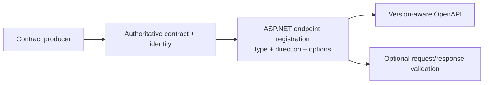

# Product design: schema contracts from inference to enforcement

## Problem

ASP.NET Core currently starts OpenAPI schema generation from CLR, System.Text.Json, and endpoint
metadata. That metadata often describes the runtime contract well, but it can hide details behind
converters and parsers or omit document-wide relationships such as direction, composition, and
stable component identity.

Guessing missing details is unsafe: OpenAPI must not reject values the runtime accepts.
Transformers can document application semantics, but they do not enforce those semantics. At the
other end of the spectrum, some applications already have a complete authoritative JSON Schema
and a matching validator; recreating that contract from CLR metadata introduces drift.

The proposal therefore offers graduated, independently selectable inputs and an optional
validation stage.

## One pipeline

ASP.NET owns endpoint association, OpenAPI projection, and HTTP policy. Contract producers own
schema semantics. Validators own only payload validation and validator-neutral diagnostics.

## Contract inputs

### Ordinary inference

Opt-in inferred mode reads effective STJ metadata and endpoint-binding metadata. It requires no
schema files, annotations, evidence providers, or validators. It emits the strongest schema that
can be proven for:

- directional input/output participation, nullability, and requiredness;
- objects, collections, dictionaries, extension data, recursion, and stable references;
- lossless inheritance and serializer-configured polymorphism;
- exclusive alternatives only when their JSON domains prove exclusivity;
- scalar formats and bounds supported by effective converter/parser provenance; and
- route, query, header, and form logical values.

Unknown behavior remains broad. Legacy generation remains the default.
The [core inference proof](evidence/core-inference-details.md#focused-comparisons-and-practical-impact)
records exact cross-version documents and conservative boundaries.

### Narrow runtime-enforced evidence

`IOpenApiSchemaEvidenceProvider` fills a small metadata gap for a recognized converter or parser.
It can report strict scalar shape, patterns, exact `OpenApiSchemaNumber` bounds, format
candidates, or fixed positional arrays. The provider may report only facts that the runtime
mechanism already enforces.

Evidence is not a complete schema model and does not install validation. For example, an
`OrderCodeConverter` that accepts only `ABC-123`-shaped strings remains the runtime enforcement;
evidence merely lets OpenAPI include the proven pattern. The
[provider proof](evidence/schema-evidence-providers.md) covers converter provenance, inert
behavior without the converter, exact numeric emission, ordering, conflicts, and failures.

### Complete canonical artifact

`IOpenApiValidatedJsonSchemaArtifact<TSelf>` represents a complete immutable schema authority:
source and normalized bytes, local references, dialect/capabilities, deterministic identity, and
version-targeted OpenAPI projection. The artifact is data and authority, not execution.

An application may register equivalent authority dynamically or consume it as generated source.
Endpoint enforcement begins only when the authority is paired with a validator.

### Transformers

Schema, operation, and document transformers remain the application-owned documentation
mechanism. They can add descriptions, examples, or business semantics. They are not contract
authority and never enter endpoint validation.

## Contract-selection rules

The paths are complementary, not a precision ladder that every application must climb.

1. Use ordinary inference when the effective serializer and binder already describe the contract.
2. Add evidence only when a package can identify the exact runtime mechanism that proves a narrow
   hidden fact.
3. Use a canonical artifact when another producer owns the complete schema or when endpoint
   validation must share one exact authority with OpenAPI.
4. Use transformers for application-owned documentation regardless of the chosen contract source.

ASP.NET does not merge arbitrary complete schemas into inferred graphs and then claim that the
result is enforced. A validated registration selects one complete authority for its CLR type,
direction, and endpoint. Narrow evidence is different: it participates in ordinary recursive
inference because its converter/parser remains the runtime authority.

When multiple registrations exist for the same CLR type, endpoint metadata and direction select
the applicable contract. Output selection can additionally use actual status code and content
type. This permits different actions to use different contracts without placing validator
instances in attributes or global middleware.

## Outputs and runtime behavior

Every registered contract can contribute version-aware OpenAPI. A validated registration may
also enforce input, output, or both:

1. **Request:** buffer within the configured limit, validate raw UTF-8, rewind, then continue
   normal binding. Invalid payloads return 400; oversized payloads return 413.
2. **Response:** capture before bytes reach the server, select a registration by actual status and
   content type, validate, then copy valid output or suppress invalid output and return an empty
   500.

Non-JSON and no-content responses bypass validation. Request acceptance remains the intersection
of schema validation and normal STJ/MVC binding. Minimal APIs and MVC use the same endpoint plan,
limits, selection rules, and failure policy. The
[runtime adapter proof](evidence/validated-schema-adapters/README.md) exercises the 400/413/500
policy and both framework surfaces.

The runtime factory path may compile one reusable validator during registration. The generated
path uses prebuilt state and performs no schema parse, normalization, hashing, reference
resolution, provider lookup, or validator compilation during endpoint construction or requests;
the [generated lifecycle proof](evidence/generated-schema-artifacts/current-proof.md#framework-registration-and-warmed-wrapper)
separates that startup claim from request-path and engine measurements.

## Three application scenarios

| Scenario | Contract source | Validator | Outcome |
| --- | --- | --- | --- |
| Ordinary application | Effective STJ/binder metadata | None | Better OpenAPI with unchanged runtime behavior |
| Opaque converter library | Inference plus narrow evidence | None | Runtime-proven hidden facts appear in OpenAPI |
| Complete external producer | Canonical artifact | Runtime adapter or generated binding | One authority drives OpenAPI and directional endpoint enforcement |

The third scenario does not prescribe an engine. A producer can pair its artifact with its own
validator, another validator, or multiple configurations through ASP.NET's neutral seams.

## OpenAPI behavior

Document generation always starts with a target OpenAPI version. Ordinary inference emits
version-appropriate decisions directly. A complete artifact creates a fresh typed OpenAPI model
for the requested version so document transformers and concurrent document generation do not
mutate shared state.

Schema identity remains independent of the selected OpenAPI target. A lossy 3.0 compatibility
view is a projection, not new authority. Changing only a validator engine or its settings likewise
does not rewrite the artifact; it changes the validator configuration and composite binding
identity.

For inferred contracts, references are planned across the document before emission. Existing
simple names remain when unique, while collisions use deterministic declaring-type, namespace, and
hash fallbacks. Recursive graphs become references rather than depth-dependent expansions.

## Goals

- Improve OpenAPI for ordinary applications without new authoring.
- Never strengthen inferred documentation beyond proven runtime behavior.
- Reuse complete authoritative schemas instead of reconstructing them from CLR shape.
- Keep schema production, validation engines, and HTTP enforcement independently replaceable.
- Use deterministic, cycle-safe facts and identities suitable for repeatable builds and NativeAOT.
- Keep request and response contracts directional and endpoint-scoped.
- Preserve transformer customization and current default behavior.
- Support deliberate OpenAPI 3.0, 3.1, and 3.2 projection.

## Non-goals

- Inferring arbitrary business rules or reverse-engineering arbitrary converters/parsers.
- Providing a general public JSON Schema DOM through the evidence API.
- Shipping or selecting a third-party schema engine in ASP.NET Core.
- Fetching remote references or accepting unbounded schema graphs.
- Claiming lossless projection of every JSON Schema dialect feature into OpenAPI 3.0.
- Making generated endpoints fully reflection-free when MVC/action selection remains dynamic.
- Requiring endpoint validation for applications that want documentation only.

## Tradeoffs and boundaries

The zero-authoring path stays conservative, so it can underdescribe behavior known only to
application code. Complete-schema enforcement is opt-in because it adds identity, normalization,
validator, buffering, and error-policy responsibilities.

OpenAPI 3.1 and 3.2 preserve more JSON Schema structure. OpenAPI 3.0 cannot represent local
definitions, recursive references, conditionals, or many later assertions; unsupported semantics
widen rather than becoming misleading extensions. Format and vocabulary support must be declared,
schema size/depth/reference counts are bounded, and remote references are rejected.

Validators can produce different native diagnostics. ASP.NET normalizes the result boundary and
owns HTTP behavior, not engine-specific message equivalence. External integration examples and
their current packaging limitations are described in [Integrations](integrations.md).

## Adoption and compatibility

Applications opt into inferred generation, evidence providers, and validated registrations
separately. Selecting inferred mode does not discover or activate validators. Registering a
transformer does not make its additions enforceable. Adding a validated input contract changes
which request payloads reach model binding and should therefore be treated as an application
behavior change.

The proposal preserves ordinary STJ binding after schema validation. This intentionally permits
the effective accepted language to be narrower than a conservative schema projection, but never
assumes that schema success guarantees deserialization success. Response validation observes the
actual bytes produced by framework formatters/serializers rather than validating CLR objects.

Generated paths improve startup determinism and NativeAOT compatibility, but dynamic endpoints,
runtime serializer options, and MVC action predicates retain runtime fallback paths. The proposal
does not require every application or framework feature to become source-generated.

## Proposal status

The proposal is experimental and split into separately reviewable API groups. Draft PR
[#69487](https://github.com/dotnet/aspnetcore/pull/69487) demonstrates feasibility and is not
intended to merge. See the [API overview](api-surface.md), [architecture](architecture.md), and
[claim-to-proof evidence index](evidence/README.md). The full implementation journey is retained
only in the [design-history archive](archive/2026-10-prototype-design-history/README.md).
