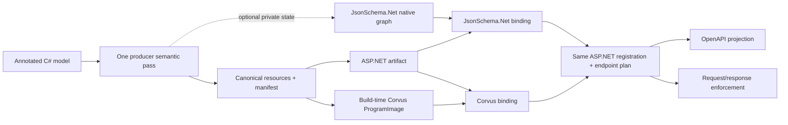

# Generated JSON Schema artifact evidence

> **Active evidence index.** Return to [Integrations](../../integrations.md),
> [Architecture](../../architecture.md#generatedaot-registration), or the
> [proposal evidence index](../README.md).

## Claim

One generated canonical schema authority can drive version-aware OpenAPI and
either of two private generated validators through symmetric ASP.NET binding
seams. Native object graphs and ProgramImages remain derived engine state, not
portable authority.

## What was exercised

An illustrative `JsonSchema.Net.Generation`/`json-everything` producer emits
canonical UTF-8 resources and a manifest from the same semantic pass that can
also emit its private native graph. ASP.NET consumes those resources as a
generated artifact. JsonSchema.Net retains the native graph privately; Corvus
loads a build-time ProgramImage. Both close over the same CLR type, artifact,
directional purpose, and framework endpoint plan.

## Success criteria and headline result

The proof requires cross-engine corpus agreement, equal OpenAPI 3.0/3.1/3.2
projection, deterministic identities, no generated-path schema processing at
endpoint construction or request time, the exact 0 B/op warmed framework target,
and successful trim/NativeAOT deployment for the isolated generated consumer.

The recorded bounded model met those criteria. See the
[current proof](current-proof.md) for interpreted correctness, performance,
determinism, and deployment evidence before opening raw reports.

## Capability boundary

The canonical resource graph is schema authority. A compatibility document,
native graph, OpenAPI projection, or ProgramImage is a derivative with its own
narrow purpose and identity.

## Recommended reading path

1. [Integrations](../../integrations.md): why external producers and validators
   remain replaceable examples.
2. [Current generated-artifact proof](current-proof.md): claim, setup, success,
   result, performance boundaries, deployment, and limitations.
3. [Validator seams](../../architecture.md#validator-seams) and
   [API review 6](../../api-surface.md#review-6-generatedaot-complete-schema-validation):
   framework ownership and proposed contracts.
4. [Hands-on demo](two-stage-annotated-demo/README.md): commands and meaning of
   `verified`.
5. [Generated allocation interpretation](allocation-results.md): one-time
   registration and warmed framework-wrapper boundaries.
6. [Detailed same-pass record](same-pass-exporter-removal.md): full rationale,
   provenance, exact identities, and retained implementation detail.
7. [Archive](archive/README.md): superseded released-generator and collectible
   exporter investigations.

## Active evidence map

| Landing | What it proves |
| --- | --- |
| [Current proof](current-proof.md) | Canonical authority, corpus/OpenAPI equivalence, symmetric bindings, determinism, scoped performance, and deployment |
| [Generated allocation interpretation](allocation-results.md) | Runtime-versus-generated registration and 0 B/op warmed framework boundary |
| [Hands-on demo](two-stage-annotated-demo/README.md) | Reproduction inputs, commands, artifacts, success signal, and limitations |
| [Current generated files](two-stage-annotated-demo/generated/) | Exact checked-in bundle, manifest, compatibility schema, properties, and image source |

## Traceability

| Field | Source or result |
| --- | --- |
| Product code under test | [`ValidatedJsonSchemaGenerator`](../../../../src/OpenApi/gen/ValidatedJsonSchemaGenerator.cs), [`ValidatedJsonSchemaGeneratorNormalizer`](../../../../src/OpenApi/gen/ValidatedJsonSchemaGeneratorNormalizer.cs), [`OpenApiValidatedJsonSchemaImporter`](../../../../src/OpenApi/src/Services/Schemas/OpenApiValidatedJsonSchemaImporter.cs), and [`OpenApiValidatedJsonSchemaEndpointConventionBuilderExtensions`](../../../../src/OpenApi/src/Extensions/OpenApiValidatedJsonSchemaEndpointConventionBuilderExtensions.cs) |
| Producer/harness code | [`TwoStageAnnotatedDemo.proj`](two-stage-annotated-demo/TwoStageAnnotatedDemo.proj), Stage 1 and Stage 2 projects/programs linked by the [current proof traceability table](current-proof.md#traceability), and the isolated deployment project |
| Exact command | [`two-stage-annotated-demo/README.md`](two-stage-annotated-demo/README.md) owns generation, verification, benchmark, determinism, and deployment commands |
| Retained output | [`generated/`](two-stage-annotated-demo/generated/), interpreted [`current-proof.md`](current-proof.md), raw reports reached through it, and current deployment transcript |
| Result mapping | `verified` means the five stable Stage 2 verification methods passed; benchmark and deployment rows map through their dedicated interpretation tables |

Raw BDN reports and cold-process CSV data are reachable only through the
[current proof's interpreted performance sections](current-proof.md#how-to-read-the-performance-evidence).

## Other producer shape

The built-in `OpenApiValidatedJsonSchema` item demonstrates a file-based
producer. It hashes exact schema bytes and can emit an artifact alone or an
artifact plus closed binding. The annotated-model proof instead demonstrates an
external complete-contract producer. Neither shape makes a validator-native
object graph framework authority.

## Limitations

- The illustrative producer package is locally built and unpublished.
- Canonical-only generation still carries unconditional
  JsonSchema.Net-related package closure; a package split is external work.
- The compatibility schema is derived and cannot replace graph identity.
- OpenAPI 3.0 widens unsupported Draft 2020-12 semantics.
- The flagship image has no regex patterns, and larger graph scaling remains
  unmeasured.
- The `json-everything` fork is a production-grade bounded POC, likely
  disposable, and not intended as an upstream pull request.
- JsonSchema.Net package use and Corvus licensing remain application concerns;
  neither is a shipping ASP.NET dependency.
