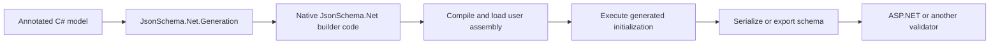
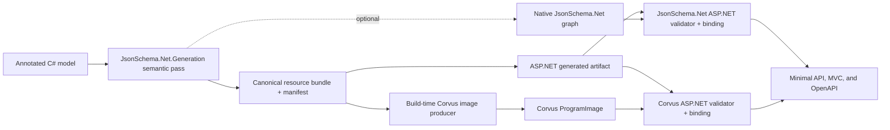
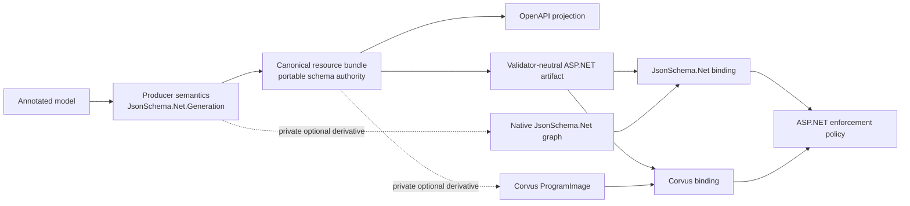
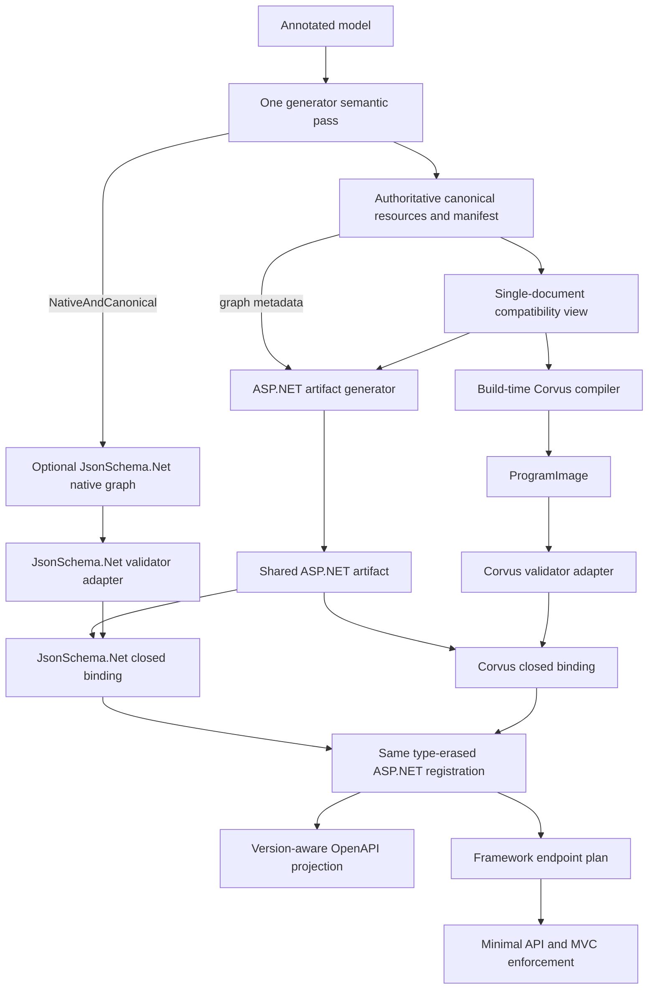

# Reusing generated JSON Schema across OpenAPI and validation engines

> **Detailed technical record, not the active entry point.** Start with the
> [current generated-artifact proof](current-proof.md), which presents the claim,
> setup, success criteria, interpreted measurements, limitations, and links back
> to the proposal. This document preserves implementation rationale, exact
> identities, commands, and historical comparisons.

## Executive explanation

This non-shipping prototype adds a way for one annotated C# model to produce a
stable JSON Schema artifact that ASP.NET OpenAPI and different validation engines
can share. Released `JsonSchema.Net.Generation` 7.3.11 emits executable
JsonSchema.Net builder code, so another generator or validation engine cannot
reuse the schema without loading that assembly and reconstructing or serializing
the native object graph. The prototype makes one minimal change: the originating
generator also emits the canonical resource bytes and manifest from the semantic
model it already computed. Its `CanonicalOnly` mode can omit the native
JsonSchema.Net builder while retaining the portable schema artifact. ASP.NET
consumes that artifact without taking a shipping dependency on JsonSchema.Net or
Corvus, while Corvus consumes a validator-specific image compiled at build time.
The proof shows equivalent validation and OpenAPI behavior, deterministic clean
rebuilds, no active exporter or runtime Corvus schema compilation, successful
trimming and NativeAOT, and no incremental framework allocation on the measured
successful request path.

## The problem in one model

The flagship model has a nested address resource and a conditional rule:

```csharp
[GenerateJsonSchema(PropertyNaming = NamingConvention.CamelCase, StrictConditionals = true)]
[Id("urn:flagship:conditional")]
[If(nameof(Kind), "business", 0)]
public sealed class FlagshipModel
{
    [Required]
    public required string Kind { get; set; }

    [Required]
    public required FlagshipAddress Address { get; set; }

    [Required(ConditionGroup = 0)]
    public string? TaxId { get; set; }
}
```

A business payload must contain `taxId`; a personal payload need not. The address
is a separately identified JSON Schema resource. This is enough to expose the
original reuse problem: the released generator represents the result as
JsonSchema.Net-specific executable construction code rather than portable
generated data.

### Before: reconstruct or export after compilation



The **native graph** is the in-memory `JsonSchema` object graph created by the
generated `JsonSchemaBuilder` code. It is useful to JsonSchema.Net, but it is not
an engine-neutral interchange format. A second source generator cannot inspect
another generator's runtime values during the same compilation. Exporting later
also executes the compiled assembly and makes the exported bytes, rather than the
originating semantic pass, a second schema authority.

### After: emit portable evidence in the same pass



The **canonical resource bundle** contains the exact UTF-8 for the root and all
referenced resources. Its ordered **manifest** records resource membership,
identities, root URI, dialect, and generation configuration. A **graph identity**
hashes that complete ordered schema graph; it is the schema authority shared by
all consumers.

A **compatibility schema** is a deterministic single-document view that moves the
known resources under local `$defs`. Current ASP.NET and Corvus inputs use this
derived view, but its byte hash is not the graph identity. A Corvus
**ProgramImage** is a versioned compiled-validator binary produced from that view
at build time. A **binding identity** combines the graph identity with a
validator's version and configuration, so an image cannot be reused with an
incompatible validator even though the underlying schema is unchanged.

## Why separate generation from validation?

The primary reason for these seams is separation of concerns, not arbitrary
producer/consumer mix-and-match.

- **JsonSchema.Net.Generation owns code-first schema authoring.** It interprets
  Greg Dennis's mature annotation model, naming rules, requiredness, conditionals,
  references, and custom generation behavior.
- **The canonical resource bundle is the portable contract.** It records the
  result of that interpretation as authoritative schema resources and a manifest,
  independent of how any validator executes them.
- **ASP.NET owns framework policy.** It associates contracts with endpoints,
  projects them into OpenAPI, selects request and response contracts, enforces
  buffering and size limits, defines invalid-input/error behavior, and exposes the
  validator-neutral artifact/binding ABI.
- **A validation engine owns execution.** JsonSchema.Net can execute its native
  graph. Corvus can execute raw UTF-8 through a build-time-produced ProgramImage.
- **Engine-specific artifacts remain private derivatives.** A native
  JsonSchema.Net graph or Corvus image may accelerate one binding, but neither
  becomes schema authority or leaks into the ASP.NET public ABI.



This split preserves the annotation system instead of asking ASP.NET or Corvus to
reimplement it. It also lets an allocation- or startup-sensitive application use
Corvus raw-UTF8 validation and build-time image compilation, while
`CanonicalOnly` suppresses the JsonSchema.Net runtime builder graph. Validation
and OpenAPI still derive from the same exact contract. A validator can be replaced
or independently versioned without changing model annotations or the ASP.NET
public ABI, and equivalence tests can detect semantic drift at each boundary.

### Choosing an end-to-end path

| Use JsonSchema.Net end to end when... | Use JsonSchema.Net.Generation + Corvus when... |
|---|---|
| One library from annotations through validation is simpler to build, diagnose, and support. | Raw UTF-8 validation throughput and success-path allocation are important. |
| JsonSchema.Net's native evaluation results and diagnostics are the preferred application model. | Schema parsing/compilation should happen at build time rather than application startup. |
| Avoiding an additional engine, image producer, and binding identity is more important than minimizing validator cost. | `CanonicalOnly` should omit the native builder graph and a Corvus image should be private to the validator binding. |
| Existing JsonSchema.Net package/runtime dependencies are acceptable. | Trim/NativeAOT deployment and independent validator versioning justify the additional build plumbing. |

Corvus is not universally superior. Its image producer, version/configuration
identity, diagnostics behavior, and build complexity are additional responsibilities.
The current prototype package also still copies JsonSchema.Net transitive
dependencies even in `CanonicalOnly`; suppressing native builder generation is not
yet the same as removing package closure.

An earlier matched default BenchmarkDotNet run of the temporary exporter demo
measured native JsonSchema.Net valid evaluation at 49.857 us and 16,553 B/op,
versus Corvus image evaluation at 1.528 us and 168 B/op. Those figures are
representative evidence for this specific schema and machine, not the current
focused same-pass run or a universal guarantee. The retained
[archived report](archive/exporter-demo/results/final/20260925-161036/AnnotatedSchemaDemo.DemoBenchmarks-report-github.md)
also shows substantial variance, which is why the decision rests on architecture
and matched measurements rather than an assumed fixed ratio.

Corvus can be cheaper here because it evaluates raw UTF-8, loads precompiled
validator state instead of parsing and compiling schema at runtime, avoids the
native `JsonSchemaBuilder` graph under `CanonicalOnly`, and uses a lower-allocation
success result path. JsonSchema.Net end to end may still be the better choice when
its diagnostics and simpler single-engine build outweigh those costs.

## Goals and non-goals

### Goals

- Preserve semantic equivalence across the native JsonSchema.Net graph, parsed
  canonical resources, Corvus compilation and image loading, ASP.NET enforcement,
  and OpenAPI generation.
- Produce deterministic bytes and graph identity from clean rebuilds without
  machine paths, timestamps, or culture-sensitive ordering.
- Remove the active post-compilation exporter, reflection, and execution of the
  annotated assembly from artifact production.
- Allow `CanonicalOnly` consumers to suppress generated native builder code.
- Keep the ASP.NET artifact and binding contracts independent of JsonSchema.Net
  and Corvus shipping dependencies.
- Retain the measured framework target of 0 B/op incremental allocation on the
  successful request/response hot path.
- Keep build-time and startup costs reasonable and measurable, with validator
  compilation moved out of application startup where the engine permits it.

### Non-goals

- Replacing JsonSchema.Net or its native generated graph.
- Proving that the prototype package no longer copies every JsonSchema.Net
  transitive file; that requires a package split.
- Claiming RFC 8785 JSON Canonicalization Scheme compliance. The prototype defines
  its own deterministic generated representation and ordinal ordering.
- Treating measurements from one machine as universal latency or size budgets.
- Claiming that OpenAPI 3.0 can represent every Draft 2020-12 construct without
  conservative widening.

## How to judge success

| Dimension | Passing evidence | Failure or concern |
|---|---|---|
| Correctness | Every engine and ASP.NET surface agrees on the same valid/invalid corpus and schema identity. | Any disagreement, even if one path appears more permissive. |
| Determinism | Two clean builds produce byte-identical artifacts and hashes. | Output varies with path, culture, timestamp, process, or resource ordering. |
| Runtime architecture | The Corvus path loads a precompiled image; no runtime exporter, schema parser, resolver, or compiler is required. | Application startup reconstructs or compiles the schema. |
| Framework hot path | The measured incremental ASP.NET wrapper target remains 0 B/op after warm-up. | Any allocation above 0 B/op is a framework regression. Engine allocation is reported separately; the measured Corvus path allocates 168 B/op. |
| Startup/build tradeoff | Lower matched-operation time and allocation are better, but are evaluated separately from request throughput. | Comparing unlike methods, environments, or warm and cold measurements as if they were interchangeable. |
| Size | Source, assembly, image, and publish sizes are tracked for scaling trends and regressions. | Unexpected nonlinear growth or duplicated graphs. Absolute self-contained publish size alone is not a pass/fail score. |
| Deployment | Trim and NativeAOT succeed, and consumer IL has no native graph initialization or JsonSchema.Net reference on the Corvus-only path. | Trim/AOT failure or native graph construction remains reachable. Copied transitive package files without IL use are packaging debt, not proof of runtime use. |

No arbitrary numerical budget was established for build time, startup time, or
artifact size. Those dimensions are comparative: matched methods must remain
stable or improve as schemas scale.

## Architecture, progressively

The active build has one semantic source and two optional engine bindings:



`CanonicalOnly` emits the authoritative generated data without the optional
native graph. `NativeAndCanonical` emits both from the same semantic pass and is
used by the private JsonSchema.Net validator adapter and the engine-equivalence
comparison. Both adapters implement
`IOpenApiValidatedJsonSchemaValidator<TArtifact, TSelf>` over the same generated
`FlagshipAnnotatedArtifact`; both closed bindings implement
`IOpenApiValidatedJsonSchemaBinding<TSelf>` and are selected through the same
generic `WithValidatedJsonSchema<TBinding>` overloads. The active build does not
invoke the historical `AnnotatedSchemaExporter`.

The generated binding is type-erased once at endpoint construction. OpenAPI generation calls its
artifact projection, while requests and responses call its validator. The shared framework plan,
not either engine, owns buffering, limits, status/content-type selection, and error behavior. See
the proposal's [validator-seam lifecycle](../../architecture.md#validator-seams) for the runtime
factory path and the common internal registration.

### Identity chain

```text
annotated model + generator semantics
    -> ordered resource bytes + root/dialect/configuration
    -> graph identity                         (schema authority)
    -> compatibility-schema byte identity    (derived transport view)
    -> Corvus image identity                  (compiled validator payload)
    -> Corvus binding identity                (graph + engine + configuration)
```

Changing resource bytes, membership, ordering, or semantic configuration changes
the graph identity. Changing only the compatibility transformation changes its
derived identity. Changing the Corvus version, image format, or options changes
the image and binding identities. This separation prevents a validator image from
silently standing in for schema authority.

Property order participates in the prototype's exact generated bytes. The
same-pass graph therefore has a different identity from the earlier exporter,
which flattened resources and reordered properties. That change is correct:
identity now describes the originating generator's deterministic artifact rather
than an exporter's rewritten serialization.

## Correctness in behavior terms

The shared corpus asks questions that exercise the schema rather than merely
checking that each API can be called:

| Representative case | Expected behavior | What agreement proves |
|---|---|---|
| Business payload with `taxId` and complete address | Valid | The conditional's required branch and nested resource both resolve. |
| Business payload without `taxId` | Invalid | The conditional was not lost during bundling, localization, image compilation, or ASP.NET binding. |
| Personal payload without `taxId` | Valid | The conditional does not become an unconditional requirement. |
| Missing, incomplete, or wrong-type address | Invalid | Cross-resource references and object constraints remain aligned. |
| Wrong-type `kind` or malformed JSON | Invalid | Type and input-well-formedness checks agree at engine and HTTP boundaries. |
| Invalid response payload | Suppressed/500 | Response enforcement uses the same artifact as request validation. |
| Oversized request | Rejected | Framework limits remain active around generated validation. |

JsonSchema.Net's native graph, the canonical resources parsed by JsonSchema.Net,
Corvus compilation, Corvus image loading, the generated ASP.NET artifact, Minimal
API, and MVC agreed for every case. Minimal API and MVC produced valid 200
responses, invalid-request 400 responses, and invalid-response suppression/500.
Both ASP.NET bindings produced the same validator-neutral diagnostic classification,
request-limit behavior, and identical OpenAPI 3.0, 3.1, and 3.2 schema output.
They expose the same graph identity and different engine/configuration binding
identities. Repeated Minimal API and MVC requests did not reinitialize either
validator; direct native-graph parsing and Corvus compilation remain confined to
the explicitly named engine-equivalence checks. OpenAPI 3.0 still widens
constructs that its dialect cannot represent; this does not change request
validation.

After those behavioral checks, the focused repository validation reported:

- Build tests: 3 passed of 3;
- source-generator tests: 41 passed of 41;
- OpenAPI tests: 1,447 passed and 5 skipped of 1,452;
- aggregate: 1,491 passed, 5 skipped, 0 failed of 1,496.

## Performance questions and interpretation

The measurements answer separate architecture questions. They are not one ranking
of validator performance.

### Reading the units

- `ns` and `us` are nanoseconds and microseconds per BenchmarkDotNet operation.
- `B/op` is managed memory allocated per measured operation after benchmark
  setup. It is not process working set or artifact size.
- BenchmarkDotNet tables report means. The fresh-process harness reports medians
  and means across processes because cold measurements are more skewed.
- A result at the timer floor can establish that an operation is precomputed and
  allocation-free, but not a portable sub-nanosecond latency.
- Compare values only within a matched method and environment. A build/export
  operation, image load, request validation, and self-contained publish size
  answer different questions.

### Build-time/export path

**Hypothesis:** same-pass emission removes the need to reconstruct and serialize a
native graph after compilation.

| Scenario | Comparison/question | Result | Interpretation | Acceptance criterion |
|---|---|---:|---|---|
| Historical native exporter | What did reconstructing the bundle cost in the retained default BDN run? | 29.880 us; 50,360 B/op | This is work the active path removes, not validator throughput. | The exporter is absent from active artifact production. |
| Same-pass warm bundle access | Is the already-generated byte array available without reconstruction? | 0.294 ns; 0 B/op | The time is at the timer floor. It supports only the precomputed, allocation-free access claim. | 0 B/op and no exporter/reconstruction; do not treat the latency as portable. |

The two rows demonstrate a change in architecture, not a general
`29.880 us / 0.294 ns` speedup. The first constructs data; the second reads data
that the generator already emitted.

### First access in a fresh process

**Hypothesis:** removing post-compilation export reduces matched first-operation
work even when first-access JIT and module costs are included.

The internal harness starts a fresh process for each sample, excludes process
launch, and measures the first selected operation.

| Scenario | Comparison/question | Result | Interpretation | Acceptance criterion |
|---|---|---:|---|---|
| Same-pass bundle first access | What does first access to generated evidence cost? | 152.00 us median; 165.57 us mean; 2,680 B | Includes first-access runtime effects around precomputed bytes. | Deterministic artifact access without exporter work. |
| Historical exporter first operation | What did the matched historical export operation cost? | 3,682.85 us median; 4,075.23 us mean; 62,160 B median | The same internal harness shows materially more work and allocation for reconstruction/export. | The active path should not regress toward this architecture. |
| Corvus image first load | What does first evaluator-image load cost in a fresh process? | 26,001.50 us median; 26,460.79 us mean; 65,080 B | This is validator initialization, not bundle access or request throughput. It is intentionally reported separately. | No schema text parse, resolver, or compiler at runtime; monitor scaling rather than applying an invented budget. |

### Engine-only Corvus compilation and image loading

**Hypothesis:** a build-time program image reduces application initialization work
relative to compiling the same schema at runtime while preserving validation
behavior.

| Scenario | Comparison/question | Result | Interpretation | Acceptance criterion |
|---|---|---:|---|---|
| Compile Corvus from compatibility schema | Baseline: what would runtime compilation cost in the matched default BDN run? | 22.192 us; 52,600 B/op | Measures evaluator compilation from schema bytes after benchmark setup. | This operation must not be required by the generated image binding at application startup. |
| Load Corvus ProgramImage | Alternative: what does loading the precompiled payload cost in the same run? | 12.132 us; 39,160 B/op | In this run image loading used less time and 13,440 fewer allocated bytes than compilation. | Same corpus result, compatible image/configuration identity, and no runtime compile. |

The image contains no regex patterns for this model, so these results do not claim
a generated-regex benefit. These operations deliberately bypass the ASP.NET
binding and exist only to prove engine equivalence and initialization tradeoffs.

### Symmetric ASP.NET binding execution

**Hypothesis:** both engines can sit behind the same artifact, validator, binding,
and endpoint-registration seams without schema processing in the request path.

The refactored proof reran only the affected binding methods through Dry, Short,
and the default BenchmarkDotNet job:

| Scenario | Comparison/question | Result | Interpretation | Acceptance criterion |
|---|---|---:|---|---|
| ASP.NET JsonSchema.Net binding, valid | What does the native generated graph cost behind the shared binding contract? | 8.4335 us; 12,816 B/op | Includes UTF-8 payload parsing into `JsonDocument` and JsonSchema.Net evaluation/result allocation. It does not reconstruct, normalize, serialize, or hash the schema. | Correct result, shared graph identity, and one-time private native-graph initialization. |
| ASP.NET Corvus binding, valid | What does the precompiled image cost behind the same contract? | 384.8 ns; 168 B/op | Includes the Corvus engine call and validator-neutral result mapping. No schema text parse, resolver, or compiler runs. | Correct result, shared graph identity, and one-time image load. |

These are matched binding calls for one schema and payload on the recorded
machine, not universal engine rankings. The ASP.NET registration and wrapper are
identical outside the private validator. Raw native graph, parsed bundle, Corvus
compile, and direct image calls retain `EngineOnly` benchmark names so their costs
cannot be mistaken for framework integration.

### Framework registration and hot path

**Hypothesis:** generated artifacts move schema processing out of ASP.NET endpoint
registration and add no incremental allocation to a successful warmed request or
response.

| Scenario | Comparison/question | Result | Interpretation | Acceptance criterion |
|---|---|---:|---|---|
| Generated registration | What remains at endpoint setup after schema work is generated? | 27.02 ns; 80 B/op | The 80 bytes are one type-erased registration object; no parsing, hashing, reflection, or validator compilation occurs. | Keep schema processing out of registration and avoid growth beyond the required adapter. |
| Generated valid request/response wrapper | Does the ASP.NET layer allocate incrementally after warm-up? | 146.39 ns request; 199.93 ns response; 0 B/op for both | Measures the framework wrapper, excluding server, JSON serialization, and validator-engine allocation. | Exactly 0 B/op incremental framework allocation. |

The full side-by-side framework table is retained in
[allocation evidence](allocation-results.md). A validator may allocate while the
framework wrapper still meets its 0 B/op incremental target.

### Deployment and size

**Hypothesis:** a Corvus-only consumer can trim and NativeAOT-publish without
executing or referencing the native JsonSchema.Net graph.

| Scenario | Comparison/question | Result | Interpretation | Acceptance criterion |
|---|---|---:|---|---|
| Corvus ProgramImage payload | What compiled validator data is embedded? | 726 B | Engine-specific acceleration, not schema authority. | Identity/version/configuration are bound and validated. |
| Trimmed self-contained publish | Does trimming succeed? | 31,536,314 B | Absolute size includes the self-contained runtime and is not a standalone quality score. | Build and run succeed; inspect composition and scaling. |
| NativeAOT publish | Does AOT succeed? | 14,546,204 B directory; 4,268,320 B executable; 6,739,688 B debug file | Demonstrates deployment compatibility for this probe. | Build and run succeed, with no native graph initialization/reference in consumer IL. |

The clean consumer's IL, dependency file, assembly references, and strings contain
no `JsonSchemaBuilder`, `GeneratedJsonSchemas`, or JsonSchema.Net reference.
NativeAOT required evidence-only NodaTime 3.3.1 metadata because Corvus metadata
references it.

The prototype package itself still has unconditional dependencies that copy
JsonSchema.Net, Json.More, JsonPointer, and Humanizer for a `CanonicalOnly`
consumer. Those copied files are packaging debt, not evidence that the clean
Corvus consumer executes the native graph.

### Results that would be concerning

The proof should be reconsidered if any engine disagrees on behavior, clean builds
change identities, application startup parses or compiles schema for the image
path, the ASP.NET wrapper allocates above 0 B/op, generated source or assemblies
scale unexpectedly, or trimming/NativeAOT fails. No universal time or size budget
is asserted where the evidence has not established one.

## What this demonstrates

One annotation semantic pass can serve three roles without making them share an
engine: JsonSchema.Net can retain its native generated graph, ASP.NET can consume
an engine-neutral generated artifact for enforcement and OpenAPI, and Corvus can
load a build-time-precompiled validator image. The canonical resource graph, not a
validator payload or OpenAPI lowering, remains the common authority. The temporary
collectible-assembly exporter is unnecessary in the active pipeline.

## What remains before production adoption

- Review and stabilize the generated public API/protocol, including manifest and
  identity semantics.
- Split analyzer/canonical support from native JsonSchema.Net runtime assets so a
  canonical-only consumer does not inherit the native package closure.
- Measure source and assembly size across larger, more varied schema graphs.
- Broaden supported annotation semantics and define a custom-handler seam without
  duplicating the producer's semantic pass.
- Publish the fork or prototype package so external contributors can reproduce the
  proof without unpublished local inputs.

The `json-everything` fork is an illustrative, production-grade proof of the
smallest same-pass producer change. It is not intended to be submitted upstream
as-is. A production proposal would require maintainer-led API, packaging, and
semantic design rather than treating the prototype diff as the desired product.

## Reference evidence

### Provenance and exact identities

| Item | Exact value |
|---|---|
| Prototype package | Locally packed `JsonSchema.Net.Generation` 7.3.11 |
| Prototype package SHA-256 | `5cd990f735218993a2a2322b86032db27685f66f62ece536a4ff940115f6adee` |
| Upstream source | `json-everything` commit `ff430467e33e54d56537954fae73dbdda2c95246` |
| JsonSchema.Net | 9.4.0 |
| Corvus source | `corvus-dotnet/Corvus.JsonSchema` commit `6af6c149ee5c9461faa9850a34d0e0cff1fd9be2` |
| Root resource | 384 B; SHA-256 `a7bee50811f87eaffdc54a4f2caa1f05b6227035dd0b21ec9fb13038ed8ba12a` |
| Address resource | 199 B; SHA-256 `9de0d3e3611e4409d3df6cbbac297b2b91585928c49bbc49736f4eb35f932604` |
| Canonical bundle/manifest | 1,803 B; SHA-256 `8bf1dcf1c1e152864b408807468fea1cf3082dfbd3e51410070732f3dd13a28a` |
| Complete graph identity | `5F26E1108737429022275068F71A3F513D04A26E071E8EBECCE88B76CFF9A83A` |
| Compatibility schema | 539 B; SHA-256 `0c79cfe3d63f3bd4124262ec4899c940b0ae649cb751c02cb4dc30be30a0b0c3` |
| Corvus image | 726 B; format 6; identity `1992DDA660F086171EEC0093D66DDA41904971D09958FD8C1342AF34FC86A5C2` |
| JsonSchema.Net binding identity | `E1E6950C7A3B6DCF7F450DA466406BC1BCA6752850B5FA0E16D4FE4CB85427B0` |
| Corvus binding identity | `E38594DC849D46A34883B4F3D0CD9DAD495CFEFAB476C86F3110DF8A55A201B4` |
| Image regex patterns | 0 |

The historical exporter used graph identity
`0E53596F56F86689286FDCA450301A7A28DC15AE79A36EE7B348DEEEEC21D8AD`.
It is retained only to explain the move from flattened exporter output to the
originating generator's ordered resource graph.

### Measurement environment

The focused microbenchmarks used BenchmarkDotNet 0.13.0 with
`MemoryDiagnoser`, Ubuntu 22.04 under WSL, an Intel Core i7-13800H, and .NET SDK
`11.0.100-rc.1.26420.103`. Dry and Short jobs passed before the default job.
Initialization was performed in benchmark setup, methods returned observable
results, and the warm byte-access benchmark used a runtime-varying index to avoid
constant folding.

Reports are retained under
[`two-stage-annotated-demo/results/same-pass`](two-stage-annotated-demo/results/same-pass/).
The refactored symmetric ASP.NET binding reports are under
[`two-stage-annotated-demo/results/symmetric-bindings`](two-stage-annotated-demo/results/symmetric-bindings/).
The fresh-process source data is
[`cold-process.csv`](two-stage-annotated-demo/results/same-pass/cold-process.csv).

### Deterministic build outputs

Two clean builds produced byte-identical bundle, manifest, compatibility schema,
generated MSBuild properties, and generated image source:

| Generated file | SHA-256 |
|---|---|
| `flagship.bundle.json` | `8bf1dcf1c1e152864b408807468fea1cf3082dfbd3e51410070732f3dd13a28a` |
| `flagship.manifest.json` | `8bf1dcf1c1e152864b408807468fea1cf3082dfbd3e51410070732f3dd13a28a` |
| `flagship.schema.json` | `0c79cfe3d63f3bd4124262ec4899c940b0ae649cb751c02cb4dc30be30a0b0c3` |
| `flagship.generated.props` | `d34305df3eabf6c150969fad54242c250739dee169afac525a0a4c8eb075bf08` |
| `FlagshipCorvusProgramImage.g.cs` | `9cf68fe8005ecc2d6f486b2cbaf13f61514e8432fbcfd4d162b86fdb9a42a123` |

JsonSchema.Net use is subject to its OSMF license/EULA and requires the
applicable approval. Corvus is Apache-2.0. Neither engine is added as a shipping
ASP.NET product dependency.

## Reproduce the proof

The [hands-on guide](two-stage-annotated-demo/README.md) separates a short
happy-path run from deterministic, deployment, benchmark, and inspection commands.
The prototype package is not published, so reproduction currently requires the
verified nupkg or rebuilding the local `json-everything` fork changes.

From the repository root, after activating the repository SDK and preparing the
pinned Corvus checkout:

```bash
source activate.sh

dotnet msbuild \
  docs/OpenApiInferenceProposal/evidence/generated-schema-artifacts/two-stage-annotated-demo/TwoStageAnnotatedDemo.proj \
  /t:Run \
  /p:CorvusJsonSchemaSourceRoot="$PWD/artifacts/corvus-image-source" \
  /p:JsonSchemaGenerationPrototypePackageRoot="<prototype-package-directory>"
```

The expected final output is `verified`. The exact completed OpenAPI validation
command was:

```bash
source activate.sh
./src/OpenApi/build.sh -test
```

It completed with zero warnings and zero errors. The current sanitized build
record is [`build-transcript.txt`](two-stage-annotated-demo/build-transcript.txt);
the released-generator and temporary-exporter investigations remain in the
[archive](archive/README.md).
