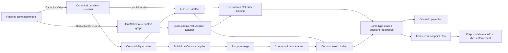

# Run the same-pass generated-schema demo

> **Active reproduction guide.** Return to
> [Integrations](../../../integrations.md), the
> [current generated-artifact proof](../current-proof.md), or the
> [evidence index](../../README.md).

This non-shipping demo starts with one annotated C# model and produces a portable
JSON Schema resource graph, an optional native JsonSchema.Net graph, an ASP.NET
generated artifact, and a build-time-precompiled Corvus validator image. It then
checks the same payloads through both engines, Minimal API, MVC, and OpenAPI. The
active build does not load the compiled model assembly or run the historical
schema exporter.

Read the [current proof](../current-proof.md) before using this as a reference.
That landing explains the claim, architecture, success criteria, interpreted
measurements, and limitations. This guide focuses on commands and inspectable
output.

## Happy path

### 1. Supply the two external inputs

The completed proof used:

- a locally packed `JsonSchema.Net.Generation` 7.3.11 prototype containing
  `CanonicalOnly` and `NativeAndCanonical`; and
- Corvus.JsonSchema source at the pinned commit used to build the image producer.

The prototype package is not published or checked in. Obtain the verified package
or rebuild the local prototype changes described under
[Prototype package and provenance](#prototype-package-and-provenance).

Prepare Corvus at the expected local path:

```bash
git clone https://github.com/corvus-dotnet/Corvus.JsonSchema.git \
  artifacts/corvus-image-source
git -C artifacts/corvus-image-source checkout \
  6af6c149ee5c9461faa9850a34d0e0cff1fd9be2
```

### 2. Build and run the proof

From the ASP.NET Core repository root:

```bash
source activate.sh

dotnet msbuild \
  docs/OpenApiInferenceProposal/evidence/generated-schema-artifacts/two-stage-annotated-demo/TwoStageAnnotatedDemo.proj \
  /t:Run \
  /p:CorvusJsonSchemaSourceRoot="$PWD/artifacts/corvus-image-source" \
  /p:JsonSchemaGenerationPrototypePackageRoot="<directory-containing-the-prototype-nupkg>"
```

Expected final output:

```text
verified
```

That single run:

1. generates the canonical resource bundle without a native graph;
2. generates a separate native graph from the identical model for comparison;
3. derives the current single-document compatibility view;
4. generates the ASP.NET artifact and Corvus ProgramImage;
5. adapts both engines to the same ASP.NET artifact, validator, binding, and
   generic endpoint-registration contracts;
6. checks the shared valid/invalid corpus and diagnostics through both bindings,
   Minimal API, and MVC; and
7. confirms equal OpenAPI 3.0, 3.1, and 3.2 output between validator bindings.

The checked-in [`build-transcript.txt`](build-transcript.txt) is a concise,
sanitized record of this exporter-free run.

## What the build produces



The stages are intentionally acyclic:

1. `stage1` compiles the model in `CanonicalOnly` mode and exposes the exact
   bundle, ordered resources, root URI, dialect, configuration, and graph identity.
2. A deterministic adapter writes those bytes and creates a local-`$defs`
   compatibility schema for current single-document consumers.
3. The graph identity flows into the ASP.NET artifact as metadata. The Corvus
   producer compiles the compatibility schema during the evidence build.
4. `stage1-native` links the same model under `NativeAndCanonical`; its native
   graph remains private to the JsonSchema.Net validator adapter and explicit
   engine-equivalence benchmarks.
5. `stage2` implements a JsonSchema.Net validator and a Corvus validator over the
   same `FlagshipAnnotatedArtifact`, closes each into an engine-specific binding,
   and runs both through identical `WithValidatedJsonSchema<TBinding>` calls.

The canonical resource graph is authoritative. The compatibility schema and
Corvus image are derived artifacts. The historical collectible-assembly exporter
remains only for retained A/B benchmark code and clean-target compatibility; it is
not invoked by this build.

At endpoint construction the generated bindings are type-erased without schema
parsing, normalization, hashing, reference resolution, or validator compilation.
OpenAPI projection and runtime validation then consume the same registration and
identity for different purposes. The framework endpoint plan owns buffering,
limits, response selection, and error behavior; the private engines validate only
raw UTF-8 payloads.

## What `verified` means

The corpus includes:

- a business payload with its required `taxId`;
- a business payload missing `taxId`;
- a personal payload without `taxId`;
- missing, incomplete, and wrong-type addresses;
- wrong-type `kind`;
- malformed JSON;
- invalid response suppression; and
- request size limits.

The native JsonSchema.Net graph, canonical resources parsed by JsonSchema.Net,
Corvus compilation, Corvus image, generated ASP.NET artifact, Minimal API, and MVC
must agree on every case. Any disagreement fails the run; the demo does not
normalize divergent results. The ASP.NET binding checks also compare
validator-neutral diagnostic classification, request limits, invalid-response
suppression, and ensure repeated requests do not reinitialize a validator.
OpenAPI equality is checked independently from runtime validation. OpenAPI 3.0
retains its documented conservative widening for newer JSON Schema semantics.

## Source-to-output traceability

| Field | Source or result |
| --- | --- |
| Product code under test | [`ValidatedJsonSchemaGenerator`](../../../../../src/OpenApi/gen/ValidatedJsonSchemaGenerator.cs), [`ValidatedJsonSchemaGeneratorNormalizer`](../../../../../src/OpenApi/gen/ValidatedJsonSchemaGeneratorNormalizer.cs), [`OpenApiValidatedJsonSchemaImporter`](../../../../../src/OpenApi/src/Services/Schemas/OpenApiValidatedJsonSchemaImporter.cs), and [`OpenApiValidatedJsonSchemaEndpointConventionBuilderExtensions`](../../../../../src/OpenApi/src/Extensions/OpenApiValidatedJsonSchemaEndpointConventionBuilderExtensions.cs) |
| Producer/harness code | Stage 1 [`FlagshipModel.cs`](stage1/FlagshipModel.cs), [`AnnotatedModelStage1.csproj`](stage1/AnnotatedModelStage1.csproj), and [`Program.cs`](stage1/Program.cs); orchestration [`TwoStageAnnotatedDemo.proj`](TwoStageAnnotatedDemo.proj); Stage 2 [`AnnotatedSchemaDemo.csproj`](stage2/AnnotatedSchemaDemo.csproj), [`GeneratedBindings.cs`](stage2/GeneratedBindings.cs), and [`Program.cs`](stage2/Program.cs); Corvus [`CorvusImageProducer.csproj`](../jsonschema-net-generation-inspection/corvus-image-producer/CorvusImageProducer.csproj) |
| Exact command | [Build and run](#2-build-and-run-the-proof), [deterministic clean rebuild](#deterministic-clean-rebuild), [trim and NativeAOT probes](#trim-and-nativeaot-probes), and [focused performance reproduction](#focused-performance-reproduction) |
| Retained output | [`generated/`](generated/), recorded [`build-transcript.txt`](build-transcript.txt), benchmark [`results/`](results/), current [`deployment-inspection-current.txt`](results/deployment-inspection-current.txt), and current [`determinism-current-status.txt`](results/determinism-current-status.txt) |
| Result mapping | Stage 2 `VerifyIdentityChain`, `VerifyEngineEquivalence`, `VerifyAspNetBindingsAsync`, `VerifyOpenApiProjectionAsync`, and `VerifyHttpPipelineAsync` map directly to identity, engine corpus, generated binding, OpenAPI projection, and HTTP assertions |

## Prototype package and provenance

| Input | Exact completed-run value |
|---|---|
| Package | Locally packed `JsonSchema.Net.Generation` 7.3.11 prototype |
| Package SHA-256 | `5cd990f735218993a2a2322b86032db27685f66f62ece536a4ff940115f6adee` |
| Upstream source | `json-everything` commit `ff430467e33e54d56537954fae73dbdda2c95246` |
| JsonSchema.Net | 9.4.0 |
| Corvus source | `6af6c149ee5c9461faa9850a34d0e0cff1fd9be2` |

The completed run received the verified package from outside the repository.
That local build location is intentionally not part of the reproducible
contract. Do not substitute the released 7.3.11 package because it does not
contain the prototype generation modes.

Verify any supplied copy before use:

```powershell
Get-FileHash `
  '<prototype-package-directory>\JsonSchema.Net.Generation.7.3.11.nupkg' `
  -Algorithm SHA256
```

Expected SHA-256:

```text
5cd990f735218993a2a2322b86032db27685f66f62ece536a4ff940115f6adee
```

The Stage 1 projects prevent the prototype from colliding with the released
package of the same ID and version:

- `RestoreAdditionalProjectSources` points at the supplied directory;
- `RestorePackagesPath` uses project intermediate output;
- `RestoreNoCache=true` prevents global-cache reuse; and
- the repository `NuGet.config` remains unchanged.

## Inspect the generated evidence

The current files under [`generated`](generated/) are:

| File | Role |
|---|---|
| `flagship.bundle.json` | Authoritative ordered resource container and manifest bytes |
| `flagship.manifest.json` | Manifest copy used by the evidence pipeline |
| `flagship.schema.json` | Derived single-document compatibility schema |
| `flagship.generated.props` | Generated build metadata carrying identities and configuration |
| `FlagshipCorvusProgramImage.g.cs` | Binding-private generated Corvus image source |

Exact identities and byte lengths are in the proof's
[reference evidence](../same-pass-exporter-removal.md#reference-evidence). Keeping
them there avoids making raw hashes the entry point for understanding the demo.

## Deterministic clean rebuild

Run the same clean/build sequence twice:

```bash
source activate.sh

demo=docs/OpenApiInferenceProposal/evidence/generated-schema-artifacts/two-stage-annotated-demo
corvus="$PWD/artifacts/corvus-image-source"
packages="<directory-containing-the-prototype-nupkg>"

dotnet msbuild "$demo/TwoStageAnnotatedDemo.proj" /t:Clean \
  /p:CorvusJsonSchemaSourceRoot="$corvus" \
  /p:JsonSchemaGenerationPrototypePackageRoot="$packages"
dotnet msbuild "$demo/TwoStageAnnotatedDemo.proj" /t:Build \
  /p:CorvusJsonSchemaSourceRoot="$corvus" \
  /p:JsonSchemaGenerationPrototypePackageRoot="$packages"

sha256sum \
  "$demo/generated/flagship.bundle.json" \
  "$demo/generated/flagship.manifest.json" \
  "$demo/generated/flagship.schema.json" \
  "$demo/generated/flagship.generated.props" \
  "$demo/generated/FlagshipCorvusProgramImage.g.cs"
```

Repeat and diff the two hash lists. The completed proof produced:

```text
8bf1dcf1c1e152864b408807468fea1cf3082dfbd3e51410070732f3dd13a28a  flagship.bundle.json
8bf1dcf1c1e152864b408807468fea1cf3082dfbd3e51410070732f3dd13a28a  flagship.manifest.json
0c79cfe3d63f3bd4124262ec4899c940b0ae649cb751c02cb4dc30be30a0b0c3  flagship.schema.json
d34305df3eabf6c150969fad54242c250739dee169afac525a0a4c8eb075bf08  flagship.generated.props
9cf68fe8005ecc2d6f486b2cbaf13f61514e8432fbcfd4d162b86fdb9a42a123  FlagshipCorvusProgramImage.g.cs
```

Byte-for-byte mismatch is a failure to investigate, not a benchmark fluctuation.

## Trim and NativeAOT probes

The deployment project is isolated from repository-wide build imports and consumes
the generated image plus Corvus:

```bash
demo=docs/OpenApiInferenceProposal/evidence/generated-schema-artifacts/two-stage-annotated-demo
corvus="$PWD/artifacts/corvus-image-source"
deployment="$demo/deployment/CorvusImageDeployment.csproj"

dotnet publish "$deployment" -c Release -r linux-x64 --self-contained true \
  -p:PublishTrimmed=true \
  -p:CorvusJsonSchemaSourceRoot="$corvus" \
  -o artifacts/bin/CorvusImageDeployment/trimmed

dotnet publish "$deployment" -c Release -r linux-x64 --self-contained true \
  -p:PublishAot=true \
  -p:CorvusJsonSchemaSourceRoot="$corvus" \
  -o artifacts/bin/CorvusImageDeployment/aot

artifacts/bin/CorvusImageDeployment/trimmed/CorvusImageDeployment
artifacts/bin/CorvusImageDeployment/aot/CorvusImageDeployment
```

Both executables validate the business-valid/business-missing-`taxId` pair and
print the graph and image identities. The
[deployment interpretation](../current-proof.md#deployment-and-footprint)
defines the design constraint, measured publish/run/inspection operation,
included and excluded work, environment, byte units, acceptance criterion,
recorded sizes, permitted conclusion, and footprint caveat.

The exact replayable size, `.deps.json`, managed metadata/IL, symbol, and string
commands and their current output are retained in
[`results/deployment-inspection-current.txt`](results/deployment-inspection-current.txt).
They require standard Linux `find`, `stat`, `grep`, `strings`, and `nm`, plus the
.NET 11 file-based
[`InspectManagedAssembly.cs`](deployment/InspectManagedAssembly.cs)
`System.Reflection.Metadata` inspector. The passing condition is no
`JsonSchemaBuilder`, `GeneratedJsonSchemas`, or JsonSchema.Net reference in the
clean Corvus-only consumer. NativeAOT requires an evidence-only NodaTime 3.3.1
metadata dependency because Corvus metadata references it.

This does not prove package removal. The prototype package still copies
JsonSchema.Net, Json.More, JsonPointer, and Humanizer through unconditional package
dependencies even though the clean consumer IL does not use the native graph. That
is the package-split follow-up.

## Focused performance reproduction

The benchmarks answer different questions. Names beginning with `EngineOnly`
deliberately bypass ASP.NET:

- `HistoricalExporterBundleConstruction` versus `SamePassArtifactByteAccess`
  demonstrates removal of
  post-compilation reconstruction; it is not validator throughput.
- `EngineOnlyCompileCorvus` versus `EngineOnlyLoadCorvusImage` compares matched evaluator
  initialization alternatives.
- `EngineOnlyJsonSchemaNet*`, `EngineOnlyCorvus*`, and the parsed-bundle methods
  are semantic/performance probes, not framework integration.
- `AspNetJsonSchemaNetBindingValid` and `AspNetCorvusBindingValid` call the two
  validators through the same ASP.NET binding contract.
- `run-cold-probes.sh` measures first selected operations in fresh processes,
  excluding process launch.

The [interpreted performance evidence](../current-proof.md#how-to-read-the-performance-evidence)
defines the design constraint, exact operation, comparator, included/excluded
work, environment, units, acceptance criterion, result, permitted conclusion,
and caveat for every measurement. It links the retained raw reports only after
those boundaries are established.

Build the demo first. The entry point is `BenchmarkSwitcher`, so the filter is
mandatory:

```bash
demo=docs/OpenApiInferenceProposal/evidence/generated-schema-artifacts/two-stage-annotated-demo
app=artifacts/bin/AnnotatedSchemaDemo/Release/net11.0/AnnotatedSchemaDemo.dll

same_pass_filters=(
  --filter
  '*HistoricalExporterBundleConstruction*'
  '*SamePassArtifactByteAccess*'
  '*EngineOnlyCompileCorvus*'
  '*EngineOnlyLoadCorvusImage*'
)
dotnet "$app" "${same_pass_filters[@]}" --job Dry --noOverwrite \
  --artifacts "$demo/results/same-pass/dry" > /tmp/same-pass-dry.log 2>&1
dotnet "$app" "${same_pass_filters[@]}" --job Short --noOverwrite \
  --artifacts "$demo/results/same-pass/short" > /tmp/same-pass-short.log 2>&1
dotnet "$app" "${same_pass_filters[@]}" --noOverwrite \
  --artifacts "$demo/results/same-pass/final" > /tmp/same-pass-final.log 2>&1

dotnet "$app" --filter '*AspNet*BindingValid*' --job Dry --noOverwrite \
  --artifacts "$demo/results/symmetric-bindings/dry" > /tmp/symmetric-dry.log 2>&1
dotnet "$app" --filter '*AspNet*BindingValid*' --job Short --noOverwrite \
  --artifacts "$demo/results/symmetric-bindings/short" > /tmp/symmetric-short.log 2>&1
dotnet "$app" --filter '*AspNet*BindingValid*' --noOverwrite \
  --artifacts "$demo/results/symmetric-bindings/final" > /tmp/symmetric-final.log 2>&1
```

The commands redirect verbose console output outside the repository. The
retained broad comparison reports use `dry2`, `short2`, and `final2`;
obsolete constant-folded reports were removed. After changing the adapters, the
two affected ASP.NET binding cases were rerun separately under
`results/symmetric-bindings`.

Run the fresh-process harness separately:

```bash
"$demo/run-cold-probes.sh" \
  "$demo/results/same-pass/cold-process.csv" \
  "$app"
```

Do not compare cold-process medians with BenchmarkDotNet means or use warm
byte-access timing as a general validation-speed claim. See the
[cold-harness interpretation](../current-proof.md#cold-first-operation-harness).

## Repository validation

The exact relevant repository command is:

```bash
source activate.sh
./src/OpenApi/build.sh -test
```

The completed run succeeded with zero warnings and zero errors:

- Build: 3 passed of 3;
- source generators: 41 passed of 41;
- OpenAPI: 1,447 passed and 5 skipped of 1,452;
- aggregate: 1,491 passed, 5 skipped, 0 failed of 1,496.

The current count source is
[`../../validation-current.txt`](../../validation-current.txt); its separate
Build, source-generator, and OpenAPI totals show the aggregate arithmetic.

The source-generator suite includes explicit graph-identity acceptance/rejection
and source-hash fallback coverage.

## Licensing and availability

JsonSchema.Net package use is subject to the OSMF license/EULA and applicable
approval. Corvus is Apache-2.0. Neither is added as a shipping ASP.NET product
dependency.

The principal reproduction limitation is external availability: the exact
prototype package is locally built and unpublished. The smallest production
packaging follow-up is to retain same-pass canonical resources and the optional
native handle while separating canonical/analyzer support from native runtime
assets.

The local `json-everything` changes are an illustrative production-grade proof,
not an intended upstream pull request. External reproduction and any eventual
producer proposal require a published package and maintainer-led design.
