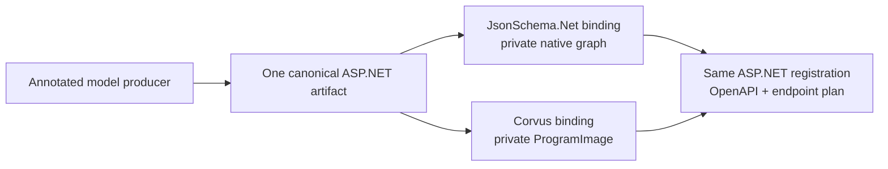

# External integration examples

ASP.NET Core defines contract, validator, registration, and endpoint-policy seams. It does not
depend on the external components below. They are replaceable examples showing how a producer and
one or more validators can add capability without moving engine policy into the framework.

## Complete contract production

The illustrative JsonSchema.Net.Generation/`json-everything` proof interprets model annotations
and emits canonical UTF-8 resources, a manifest, dialect/capabilities, and deterministic graph
identity in the same semantic pass as its optional native graph.

An ASP.NET adapter consumes those resources as
`IOpenApiValidatedJsonSchemaArtifact<TSelf>`. The canonical resource graph remains authority;
neither a JsonSchema.Net object graph nor another engine's compiled representation replaces it.

There is no generator-to-generator protocol. Roslyn generators cannot consume another
generator's same-compilation output. A producer therefore emits the public static artifact
contract directly or passes canonical resources across a build boundary such as
`AdditionalFiles`.

## Two validator examples over one artifact

### JsonSchema.Net execution

A JsonSchema.Net binding can retain the producer's native generated graph privately. This is the
shortest end-to-end choice when one ecosystem should own annotation semantics, generated schema,
validation behavior, and diagnostics.

### Corvus execution

A Corvus binding can load a build-time `ProgramImage` and validate raw UTF-8 without runtime
schema parsing or compilation. The image is private engine acceleration with its own identity; it
is not portable schema authority.

Both bindings expose the same ASP.NET generated validator/binding contracts. They differ only
inside validation. Endpoint association, request/response buffering, limits, status/content-type
selection, failure behavior, and OpenAPI projection remain identical.

## Requirements for another integration

A different producer or engine need not copy either example. It must provide:

- bounded canonical resources and an explicit supported dialect;
- stable schema identity independent of engine choice;
- declared format/vocabulary capabilities;
- isolated OpenAPI projection or normalized data for ASP.NET projection;
- configuration identity covering every acceptance-affecting validator option;
- thread-safe validation over supplied UTF-8; and
- deterministic mapping into ASP.NET's neutral validation result.

Generated integrations implement the static artifact, validator, and binding contracts. Runtime
integrations implement the factory and reusable validator contracts. Neither may move buffering,
size limits, status/content selection, or error policy into the engine adapter.

## Choosing an integration

| Choice | Prefer when | Tradeoff |
| --- | --- | --- |
| JsonSchema.Net producer + JsonSchema.Net validator | Simplicity, one ecosystem, and native diagnostics matter most | Runtime/startup/allocation characteristics are those of that engine |
| JsonSchema.Net producer + Corvus validator | Raw UTF-8 and precompiled-image execution justify build-time integration | Adds image production, compatibility checks, and package complexity |
| Another producer or validator | It can implement the same authority/result contracts | Must supply stable dialect, capability, identity, and diagnostic mappings |

The measurements demonstrate feasibility for one schema, environment, and configuration; they do
not establish universal engine superiority. Direct native-graph parsing, canonical parsing, and
Corvus compilation remain in clearly labeled engine-equivalence tests or engine-only benchmarks,
not ASP.NET integration paths.

The comparison demonstrates portability of authority and framework policy. An application may use
one ecosystem end to end, combine a producer with another execution engine, or retain multiple
bindings for different deployments. Schema identity stays stable; binding identity distinguishes
incompatible execution semantics.

## Current external limitations

The `json-everything` fork is a production-grade bounded proof of concept and is likely disposable.
It is not intended as an upstream pull request. A production producer design requires maintainer
agreement on API shape, packaging, semantics, and versioning.

The prototype's canonical-only mode still carries unconditional JsonSchema.Net-related package
closure. Separating analyzer/canonical production from optional native runtime assets remains
external packaging work. Annotation/custom-handler coverage is intentionally narrow, and the
prototype package is not published for clean external reproduction.

See the [current generated-artifact proof](evidence/generated-schema-artifacts/current-proof.md)
for the shared authority and limitations, with precise sections for
[symmetric binding execution](evidence/generated-schema-artifacts/current-proof.md#symmetric-aspnet-binding-execution),
[deployment and footprint](evidence/generated-schema-artifacts/current-proof.md#deployment-and-footprint),
and [reproduction/deeper evidence](evidence/generated-schema-artifacts/current-proof.md#reproduction-and-deeper-evidence).
The
[hands-on demo](evidence/generated-schema-artifacts/two-stage-annotated-demo/README.md) records the
current reproduction process.
