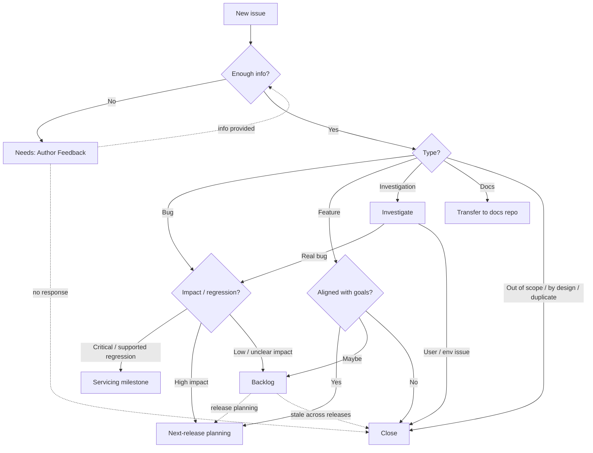

# Triage Process

This document describes how issues filed in `dotnet/aspnetcore` are triaged. It is intended as:

- A reference for the **.NET community** so you know what to expect after filing an issue.
- A guide for **engineers joining the team** on how to triage incoming issues consistently.

> **Need urgent help?** Customers needing urgent investigation should contact [Microsoft Support](https://dotnet.microsoft.com/platform/support).

## What we triage and when

Every open issue without a milestone is considered untriaged. The team reviews untriaged issues regularly (typically weekly per area) and aims to make a decision quickly. Decisions are recorded as a **type label**, an **area label**, and a **milestone** — together they answer "what kind of issue is this, who owns it, and when (if ever) will we work on it?"

## Triage outcomes

Every triaged issue ends up in one of these states:

| Outcome | Meaning |
| --- | --- |
| **Closed** | Not actionable: invalid, duplicate, by-design, won't fix, can't repro, or already fixed. |
| **Current release milestone** (e.g. the active `N.0` milestone) | Important enough to address in the in-flight release. Used sparingly. |
| **Servicing milestone** (e.g. `N.0.x`) | A regression or high-impact bug in a supported release that warrants a patch. Subject to the [servicing bar](https://github.com/dotnet/aspnetcore/blob/main/docs/ReleasePlanning.md). |
| **Next-release planning milestone** | Candidate for the next major .NET release; reviewed during sprint planning. |
| **`Backlog`** | Tracked, but not committed to any release. Re-evaluated during release planning. |
| **`Needs: Author Feedback`** | Waiting on the reporter for more information. May auto-close if no response. |

If the report depends on more information from the reporter, we apply `Needs: Author Feedback` first and triage again once we have what we need.

## How we triage by issue type

Every triaged issue is tagged with a **type label**: `bug`, `enhancement` (feature), `Docs`, or `investigate` / `question`. The decision logic differs by type.

### Bug reports

For something to be triaged as a bug, the issue should clearly describe:

1. The expected behavior.
2. The actual behavior.
3. Steps to reproduce, ideally a minimal repro project.
4. The .NET version and OS.

Then we assess impact and severity, considering:

- **Is it a regression in a currently supported release?** Regressions are weighted heavily and are the strongest candidates for servicing.
- **Severity:** crash, data loss, security, hang, perf, or incorrect behavior with workaround?
- **Reach:** how many users are likely affected? Common scenario or a niche edge case?
- **Community signal:** 👍 reactions and substantive comments from distinct users.
- **Workaround availability:** is there a reasonable user-side fix?

Based on that:

- **Critical / clear regression in a supported release** → servicing milestone (subject to servicing-bar approval).
- **High-impact, reproducible** → next-release planning milestone.
- **Real but low impact, or unclear impact** → `Backlog`, awaiting more signal.
- **Cannot reproduce or insufficient information** → `Needs: Author Feedback`; close if no response.
- **Caused by user code or environment** → close with an explanation.

### Feature requests (`enhancement`)

We weigh:

- Alignment with the framework's goals and roadmap.
- Size and design complexity.
- Community demand (👍, comments, related issues, prior discussions).
- Whether the scenario can already be achieved via extension points.

Outcomes:

- **Aligned and well-scoped** → next-release planning milestone for design review.
- **Reasonable but not urgent** → `Backlog` to gather signal.
- **Out of scope or unlikely to ship** → close with rationale and, where possible, a pointer to alternatives.

### Investigations

When a report could be a bug, environmental, or a misconfiguration, we apply the `investigate` label. Most investigations resolve to "user code / environment" and close; a minority surface as real bugs and re-triage as such.

For investigations that require a process dump, ETW trace, or other diagnostic the reporter must provide, we set `Needs: Author Feedback`. If the reporter cannot or will not provide actionable diagnostics, the issue is closed; reopening is welcome once data is available.

### Documentation issues

Tagged `Docs` and typically transferred to [`dotnet/AspNetCore.Docs`](https://github.com/dotnet/AspNetCore.Docs). High-traffic confusion may be addressed in the current release.

### Wrong area or wrong repo

If an issue belongs in another area or repo (e.g. `dotnet/runtime`, `dotnet/sdk`, `dotnet/AspNetCore.Docs`, `microsoft/reverse-proxy`), we transfer or re-label it during triage rather than holding it.

## Milestone and release planning

- **Sprint planning** (typically monthly): the team reviews issues in the next-release planning milestone and pulls the highest-impact items into the active sprint. Lower-impact items may be moved to `Backlog`.
- **Release planning**: near the end of a release cycle, the team reviews `Backlog` and promotes items aligned with the next release's themes into the next-release planning milestone. See [ReleasePlanning.md](https://github.com/dotnet/aspnetcore/blob/main/docs/ReleasePlanning.md).

## Stale-issue cleanup

Issues that have been in `Backlog` across multiple releases without gaining traction are closed during release planning. Long-lived backlog age is itself a signal that an issue isn't impactful enough to act on; closing keeps the backlog meaningful. Reopening is welcome when new information or community demand emerges.

## How decisions flow

## References

- [Issue Management Policies](https://github.com/dotnet/aspnetcore/blob/main/docs/IssueManagementPolicies.md) — automation and labels.
- [Release Planning](https://github.com/dotnet/aspnetcore/blob/main/docs/ReleasePlanning.md) — how releases are scoped.
- [Servicing bar](https://github.com/dotnet/aspnetcore/blob/main/docs/ReleasePlanning.md) — what qualifies for a patch release.
