# .NET Async Internals Deep Dive

This document provides an in-depth exploration of .NET's asynchronous programming infrastructure, including `ExecutionContext`, `SynchronizationContext`, task scheduling, and ThreadPool internals.

## Table of Contents

- [1. ExecutionContext](#1-executioncontext)
- [2. AsyncLocal\<T\>](#2-asynclocalt)
- [3. SynchronizationContext](#3-synchronizationcontext)
- [4. Task Scheduling](#4-task-scheduling)
- [5. ThreadPool Internals](#5-threadpool-internals)
- [6. Putting It All Together](#6-putting-it-all-together)

---

## 1. ExecutionContext

`ExecutionContext` is the mechanism that flows ambient data across async boundaries, thread pool work items, and other asynchronous operations.

### 1.1 Architecture

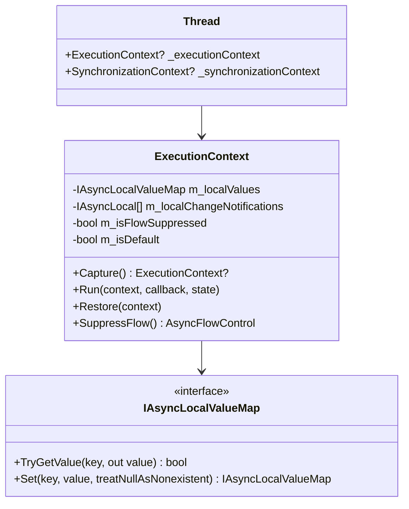
```mermaid
classDiagram
    class Thread {
        +ExecutionContext? _executionContext
        +SynchronizationContext? _synchronizationContext
    }

    class ExecutionContext {
        -IAsyncLocalValueMap m_localValues
        -IAsyncLocal[] m_localChangeNotifications
        -bool m_isFlowSuppressed
        -bool m_isDefault
        +Capture() ExecutionContext?
        +Run(context, callback, state)
        +Restore(context)
        +SuppressFlow() AsyncFlowControl
    }

    class IAsyncLocalValueMap {
        <<interface>>
        +TryGetValue(key, out value) bool
        +Set(key, value, treatNullAsNonexistent) IAsyncLocalValueMap
    }

    Thread --> ExecutionContext
    ExecutionContext --> IAsyncLocalValueMap
```

### 1.2 Core Operations

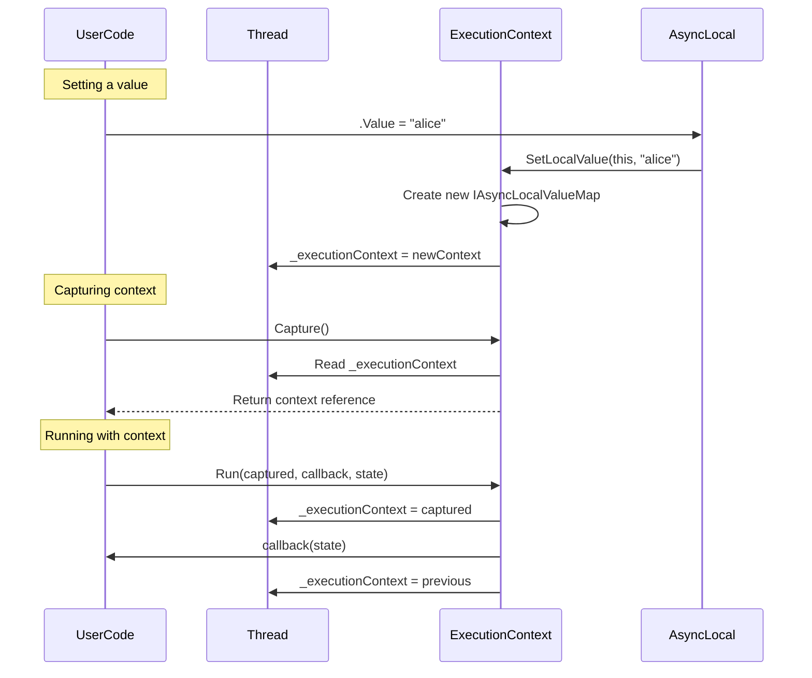
```mermaid
sequenceDiagram
    participant UserCode
    participant Thread
    participant ExecutionContext
    participant AsyncLocal

    Note over UserCode: Setting a value
    UserCode->>AsyncLocal: .Value = "alice"
    AsyncLocal->>ExecutionContext: SetLocalValue(this, "alice")
    ExecutionContext->>ExecutionContext: Create new IAsyncLocalValueMap
    ExecutionContext->>Thread: _executionContext = newContext

    Note over UserCode: Capturing context
    UserCode->>ExecutionContext: Capture()
    ExecutionContext->>Thread: Read _executionContext
    ExecutionContext-->>UserCode: Return context reference

    Note over UserCode: Running with context
    UserCode->>ExecutionContext: Run(captured, callback, state)
    ExecutionContext->>Thread: _executionContext = captured
    ExecutionContext->>UserCode: callback(state)
    ExecutionContext->>Thread: _executionContext = previous
```

### 1.3 Copy-on-Write Semantics

ExecutionContext uses immutable data structures. Modifications create new instances:

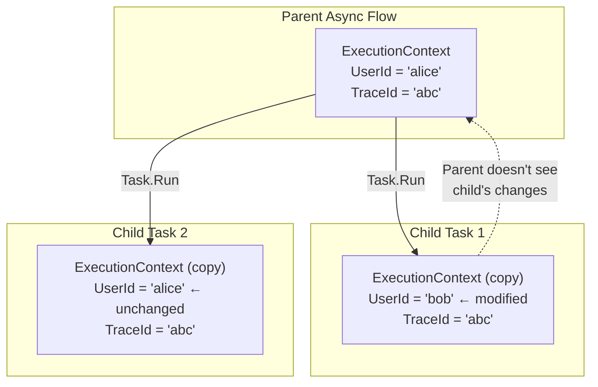
```mermaid
flowchart TB
    subgraph Parent["Parent Async Flow"]
        EC1["ExecutionContext<br/>UserId = 'alice'<br/>TraceId = 'abc'"]
    end

    subgraph Child1["Child Task 1"]
        EC2["ExecutionContext (copy)<br/>UserId = 'bob' ← modified<br/>TraceId = 'abc'"]
    end

    subgraph Child2["Child Task 2"]
        EC3["ExecutionContext (copy)<br/>UserId = 'alice' ← unchanged<br/>TraceId = 'abc'"]
    end

    EC1 -->|"Task.Run"| EC2
    EC1 -->|"Task.Run"| EC3

    EC2 -.->|"Parent doesn't see<br/>child's changes"| EC1
```

### 1.4 IAsyncLocalValueMap Implementations

The runtime uses specialized implementations based on the number of stored values:

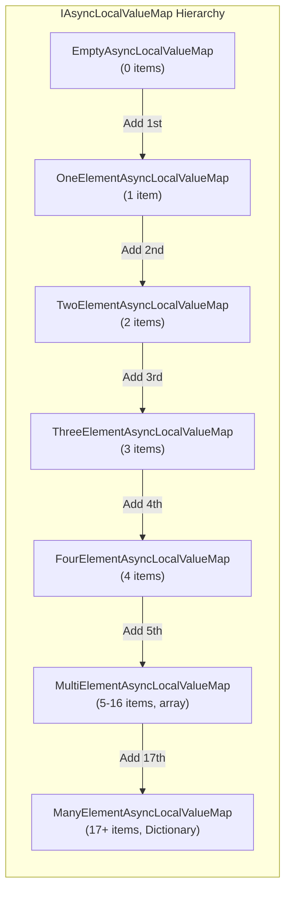
```mermaid
flowchart LR
    subgraph Maps["IAsyncLocalValueMap Hierarchy"]
        Empty["EmptyAsyncLocalValueMap<br/>(0 items)"]
        One["OneElementAsyncLocalValueMap<br/>(1 item)"]
        Two["TwoElementAsyncLocalValueMap<br/>(2 items)"]
        Three["ThreeElementAsyncLocalValueMap<br/>(3 items)"]
        Four["FourElementAsyncLocalValueMap<br/>(4 items)"]
        Multi["MultiElementAsyncLocalValueMap<br/>(5-16 items, array)"]
        Many["ManyElementAsyncLocalValueMap<br/>(17+ items, Dictionary)"]
    end

    Empty -->|"Add 1st"| One
    One -->|"Add 2nd"| Two
    Two -->|"Add 3rd"| Three
    Three -->|"Add 4th"| Four
    Four -->|"Add 5th"| Multi
    Multi -->|"Add 17th"| Many
```

This optimization minimizes memory overhead for the common case (few AsyncLocal values).

---

## 2. AsyncLocal\<T\>

`AsyncLocal<T>` provides ambient data storage that flows with the async control flow.

### 2.1 How AsyncLocal Works

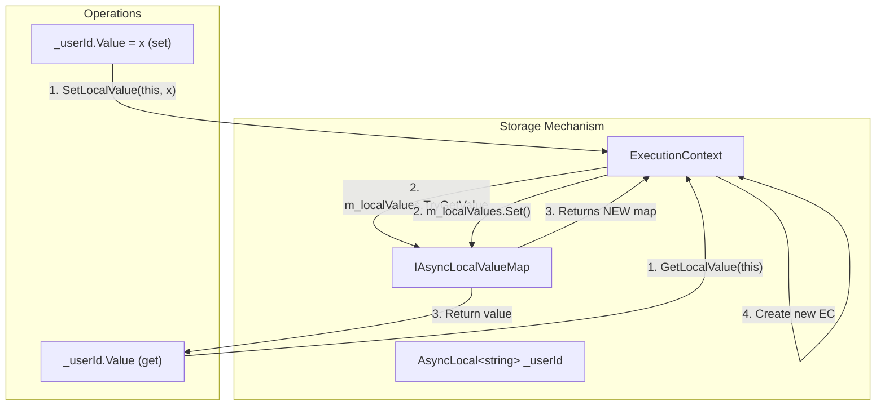
```mermaid
flowchart TB
    subgraph Storage["Storage Mechanism"]
        AL["AsyncLocal&lt;string&gt; _userId"]
        EC["ExecutionContext"]
        Map["IAsyncLocalValueMap"]
    end

    subgraph Operations["Operations"]
        Get["_userId.Value (get)"]
        Set["_userId.Value = x (set)"]
    end

    Get -->|"1. GetLocalValue(this)"| EC
    EC -->|"2. m_localValues.TryGetValue"| Map
    Map -->|"3. Return value"| Get

    Set -->|"1. SetLocalValue(this, x)"| EC
    EC -->|"2. m_localValues.Set()"| Map
    Map -->|"3. Returns NEW map"| EC
    EC -->|"4. Create new EC"| EC
```

### 2.2 Value Change Notifications

```csharp
var local = new AsyncLocal<string>(args => {
    Console.WriteLine($"Changed: {args.PreviousValue} → {args.CurrentValue}");
    Console.WriteLine($"Context changed: {args.ThreadContextChanged}");
});
```

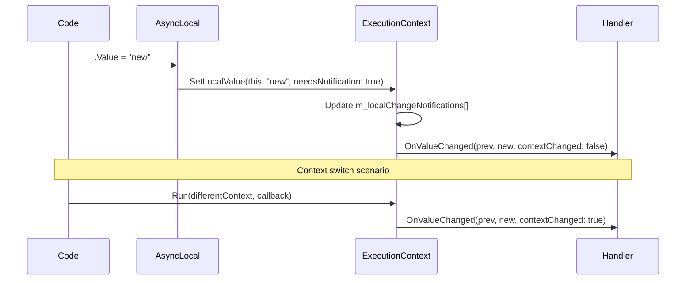
```mermaid
sequenceDiagram
    participant Code
    participant AsyncLocal
    participant ExecutionContext
    participant Handler

    Code->>AsyncLocal: .Value = "new"
    AsyncLocal->>ExecutionContext: SetLocalValue(this, "new", needsNotification: true)
    ExecutionContext->>ExecutionContext: Update m_localChangeNotifications[]
    ExecutionContext->>Handler: OnValueChanged(prev, new, contextChanged: false)

    Note over Code,Handler: Context switch scenario
    Code->>ExecutionContext: Run(differentContext, callback)
    ExecutionContext->>Handler: OnValueChanged(prev, new, contextChanged: true)
```

---

## 3. SynchronizationContext

`SynchronizationContext` controls **where** code runs (thread affinity), while `ExecutionContext` controls **what data** flows.

### 3.1 SynchronizationContext vs ExecutionContext

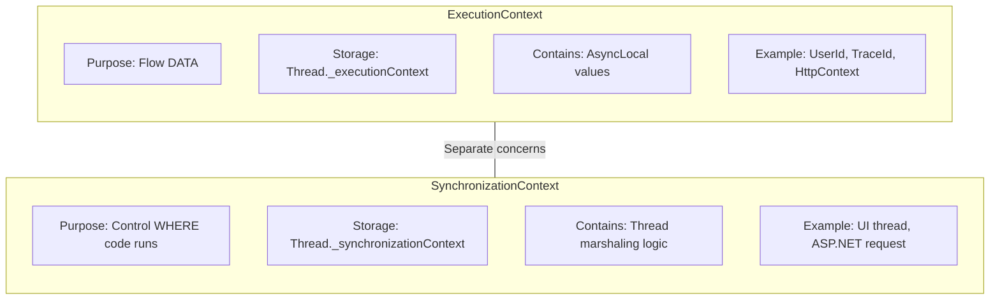
```mermaid
flowchart TB
    subgraph EC["ExecutionContext"]
        direction TB
        EC_Purpose["Purpose: Flow DATA"]
        EC_Storage["Storage: Thread._executionContext"]
        EC_Contains["Contains: AsyncLocal values"]
        EC_Example["Example: UserId, TraceId, HttpContext"]
    end

    subgraph SC["SynchronizationContext"]
        direction TB
        SC_Purpose["Purpose: Control WHERE code runs"]
        SC_Storage["Storage: Thread._synchronizationContext"]
        SC_Contains["Contains: Thread marshaling logic"]
        SC_Example["Example: UI thread, ASP.NET request"]
    end

    EC ---|"Separate concerns"| SC
```

### 3.2 SynchronizationContext Class Hierarchy

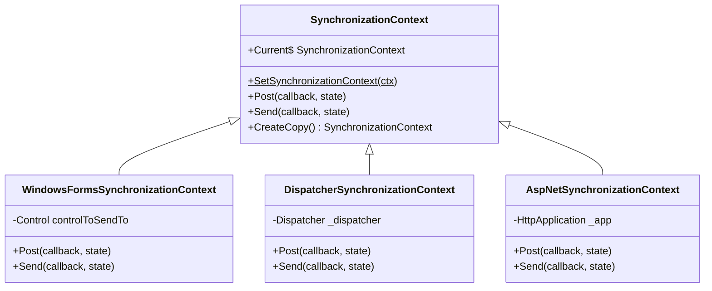
```mermaid
classDiagram
    class SynchronizationContext {
        +Current$ SynchronizationContext
        +SetSynchronizationContext(ctx)$
        +Post(callback, state)
        +Send(callback, state)
        +CreateCopy() SynchronizationContext
    }

    class WindowsFormsSynchronizationContext {
        -Control controlToSendTo
        +Post(callback, state)
        +Send(callback, state)
    }

    class DispatcherSynchronizationContext {
        -Dispatcher _dispatcher
        +Post(callback, state)
        +Send(callback, state)
    }

    class AspNetSynchronizationContext {
        -HttpApplication _app
        +Post(callback, state)
        +Send(callback, state)
    }

    SynchronizationContext <|-- WindowsFormsSynchronizationContext
    SynchronizationContext <|-- DispatcherSynchronizationContext
    SynchronizationContext <|-- AspNetSynchronizationContext
```

### 3.3 How await Uses SynchronizationContext

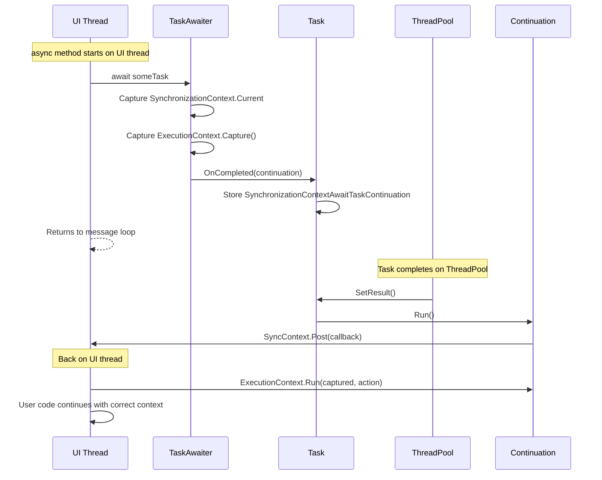
```mermaid
sequenceDiagram
    participant UI as UI Thread
    participant Awaiter as TaskAwaiter
    participant Task
    participant Pool as ThreadPool
    participant Continuation

    Note over UI: async method starts on UI thread
    UI->>Awaiter: await someTask
    Awaiter->>Awaiter: Capture SynchronizationContext.Current
    Awaiter->>Awaiter: Capture ExecutionContext.Capture()
    Awaiter->>Task: OnCompleted(continuation)
    Task->>Task: Store SynchronizationContextAwaitTaskContinuation

    UI-->>UI: Returns to message loop

    Note over Pool: Task completes on ThreadPool
    Pool->>Task: SetResult()
    Task->>Continuation: Run()
    Continuation->>UI: SyncContext.Post(callback)

    Note over UI: Back on UI thread
    UI->>Continuation: ExecutionContext.Run(captured, action)
    UI->>UI: User code continues with correct context
```

### 3.4 ConfigureAwait Effects

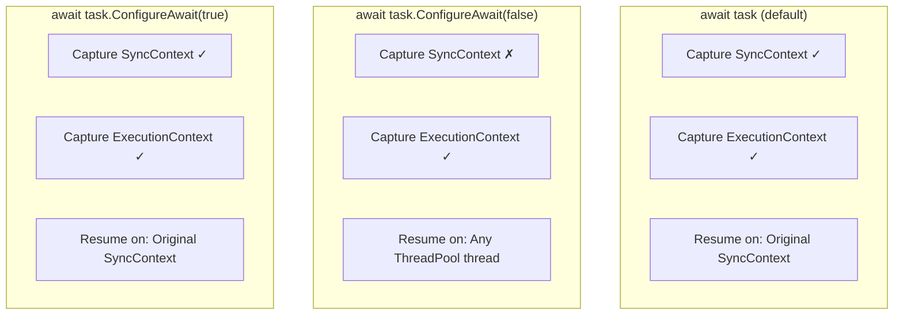
```mermaid
flowchart TB
    subgraph Default["await task (default)"]
        D1["Capture SyncContext ✓"]
        D2["Capture ExecutionContext ✓"]
        D3["Resume on: Original SyncContext"]
    end

    subgraph ConfigFalse["await task.ConfigureAwait(false)"]
        F1["Capture SyncContext ✗"]
        F2["Capture ExecutionContext ✓"]
        F3["Resume on: Any ThreadPool thread"]
    end

    subgraph ConfigTrue["await task.ConfigureAwait(true)"]
        T1["Capture SyncContext ✓"]
        T2["Capture ExecutionContext ✓"]
        T3["Resume on: Original SyncContext"]
    end
```

### 3.5 Continuation Class Hierarchy

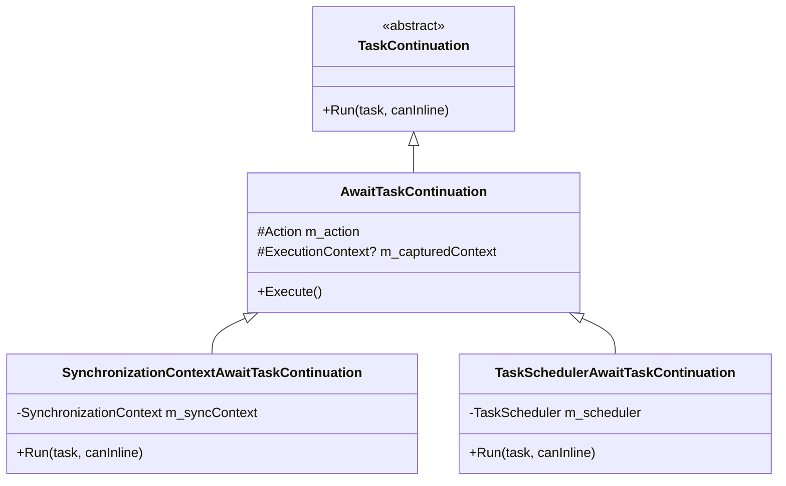
```mermaid
classDiagram
    class TaskContinuation {
        <<abstract>>
        +Run(task, canInline)
    }

    class AwaitTaskContinuation {
        #Action m_action
        #ExecutionContext? m_capturedContext
        +Execute()
    }

    class SynchronizationContextAwaitTaskContinuation {
        -SynchronizationContext m_syncContext
        +Run(task, canInline)
    }

    class TaskSchedulerAwaitTaskContinuation {
        -TaskScheduler m_scheduler
        +Run(task, canInline)
    }

    TaskContinuation <|-- AwaitTaskContinuation
    AwaitTaskContinuation <|-- SynchronizationContextAwaitTaskContinuation
    AwaitTaskContinuation <|-- TaskSchedulerAwaitTaskContinuation
```

---

## 4. Task Scheduling

### 4.1 TaskScheduler Architecture

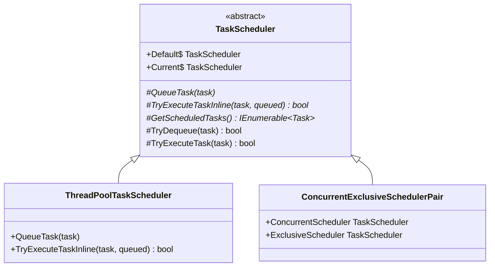
```mermaid
classDiagram
    class TaskScheduler {
        <<abstract>>
        +Default$ TaskScheduler
        +Current$ TaskScheduler
        #QueueTask(task)*
        #TryExecuteTaskInline(task, queued)* bool
        #GetScheduledTasks()* IEnumerable~Task~
        #TryDequeue(task) bool
        #TryExecuteTask(task) bool
    }

    class ThreadPoolTaskScheduler {
        +QueueTask(task)
        +TryExecuteTaskInline(task, queued) bool
    }

    class ConcurrentExclusiveSchedulerPair {
        +ConcurrentScheduler TaskScheduler
        +ExclusiveScheduler TaskScheduler
    }

    TaskScheduler <|-- ThreadPoolTaskScheduler
    TaskScheduler <|-- ConcurrentExclusiveSchedulerPair
```

### 4.2 Task.Run Flow

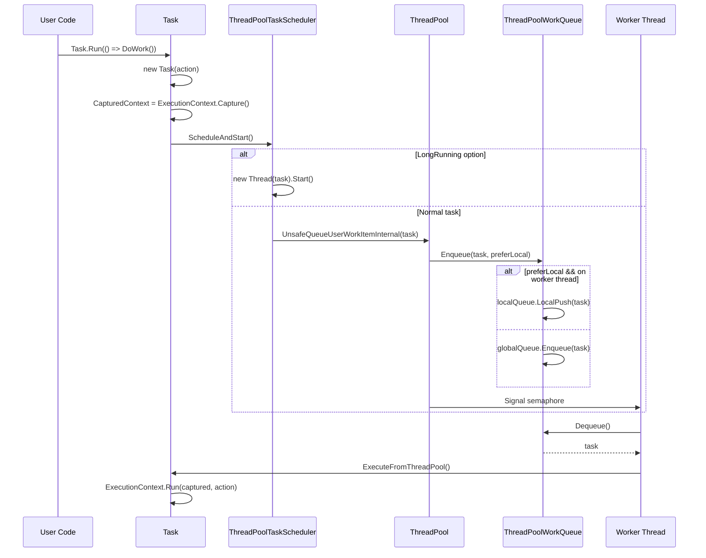
```mermaid
sequenceDiagram
    participant User as User Code
    participant Task
    participant Scheduler as ThreadPoolTaskScheduler
    participant Pool as ThreadPool
    participant Queue as ThreadPoolWorkQueue
    participant Worker as Worker Thread

    User->>Task: Task.Run(() => DoWork())
    Task->>Task: new Task(action)
    Task->>Task: CapturedContext = ExecutionContext.Capture()
    Task->>Scheduler: ScheduleAndStart()

    alt LongRunning option
        Scheduler->>Scheduler: new Thread(task).Start()
    else Normal task
        Scheduler->>Pool: UnsafeQueueUserWorkItemInternal(task)
        Pool->>Queue: Enqueue(task, preferLocal)

        alt preferLocal && on worker thread
            Queue->>Queue: localQueue.LocalPush(task)
        else
            Queue->>Queue: globalQueue.Enqueue(task)
        end

        Pool->>Worker: Signal semaphore
    end

    Worker->>Queue: Dequeue()
    Queue-->>Worker: task
    Worker->>Task: ExecuteFromThreadPool()
    Task->>Task: ExecutionContext.Run(captured, action)
```

### 4.3 ThreadPoolWorkQueue Structure

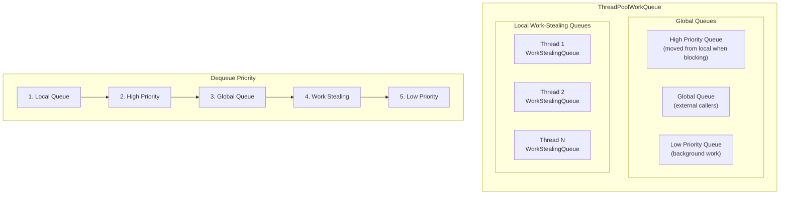
```mermaid
flowchart TB
    subgraph ThreadPoolWorkQueue
        direction TB

        subgraph GlobalQueues["Global Queues"]
            HP["High Priority Queue<br/>(moved from local when blocking)"]
            GQ["Global Queue<br/>(external callers)"]
            LP["Low Priority Queue<br/>(background work)"]
        end

        subgraph LocalQueues["Local Work-Stealing Queues"]
            LQ1["Thread 1<br/>WorkStealingQueue"]
            LQ2["Thread 2<br/>WorkStealingQueue"]
            LQ3["Thread N<br/>WorkStealingQueue"]
        end
    end

    subgraph DequeueOrder["Dequeue Priority"]
        direction LR
        P1["1. Local Queue"]
        P2["2. High Priority"]
        P3["3. Global Queue"]
        P4["4. Work Stealing"]
        P5["5. Low Priority"]

        P1 --> P2 --> P3 --> P4 --> P5
    end
```

### 4.4 Work-Stealing Queue Operations

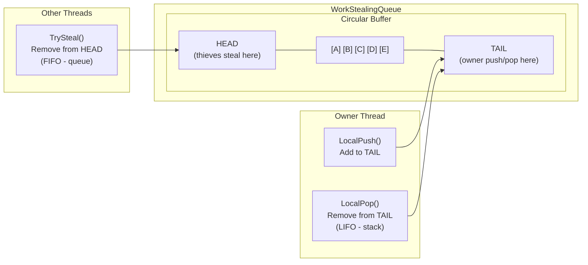
```mermaid
flowchart LR
    subgraph WSQ["WorkStealingQueue"]
        direction TB

        subgraph Array["Circular Buffer"]
            H["HEAD<br/>(thieves steal here)"]
            Items["[A] [B] [C] [D] [E]"]
            T["TAIL<br/>(owner push/pop here)"]
        end

        H --- Items --- T
    end

    subgraph Owner["Owner Thread"]
        Push["LocalPush()<br/>Add to TAIL"]
        Pop["LocalPop()<br/>Remove from TAIL<br/>(LIFO - stack)"]
    end

    subgraph Thief["Other Threads"]
        Steal["TrySteal()<br/>Remove from HEAD<br/>(FIFO - queue)"]
    end

    Push --> T
    Pop --> T
    Steal --> H
```

**Why LIFO for owner, FIFO for stealers?**

| Thread | Access Pattern | Reason |
|--------|----------------|--------|
| Owner | LIFO (stack) | Cache locality - recent data still in CPU cache |
| Stealers | FIFO (queue) | Fairness - oldest work eventually completes |

---

## 5. ThreadPool Internals

### 5.1 PortableThreadPool Architecture

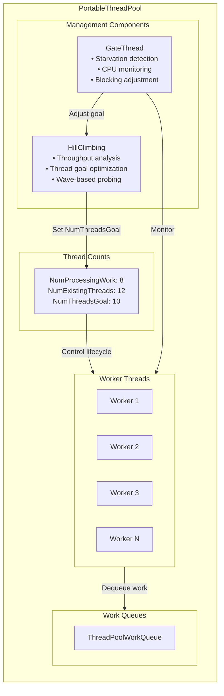
```mermaid
flowchart TB
    subgraph PortableThreadPool
        direction TB

        subgraph Management["Management Components"]
            Gate["GateThread<br/>• Starvation detection<br/>• CPU monitoring<br/>• Blocking adjustment"]
            Hill["HillClimbing<br/>• Throughput analysis<br/>• Thread goal optimization<br/>• Wave-based probing"]
        end

        subgraph Workers["Worker Threads"]
            W1["Worker 1"]
            W2["Worker 2"]
            W3["Worker 3"]
            WN["Worker N"]
        end

        subgraph Queues["Work Queues"]
            WQ["ThreadPoolWorkQueue"]
        end

        subgraph State["Thread Counts"]
            TC["NumProcessingWork: 8<br/>NumExistingThreads: 12<br/>NumThreadsGoal: 10"]
        end
    end

    Gate -->|"Adjust goal"| Hill
    Hill -->|"Set NumThreadsGoal"| TC
    TC -->|"Control lifecycle"| Workers
    Workers -->|"Dequeue work"| Queues
    Gate -->|"Monitor"| Workers
```

### 5.2 Hill Climbing Algorithm

The algorithm uses frequency-domain analysis to find optimal thread count:

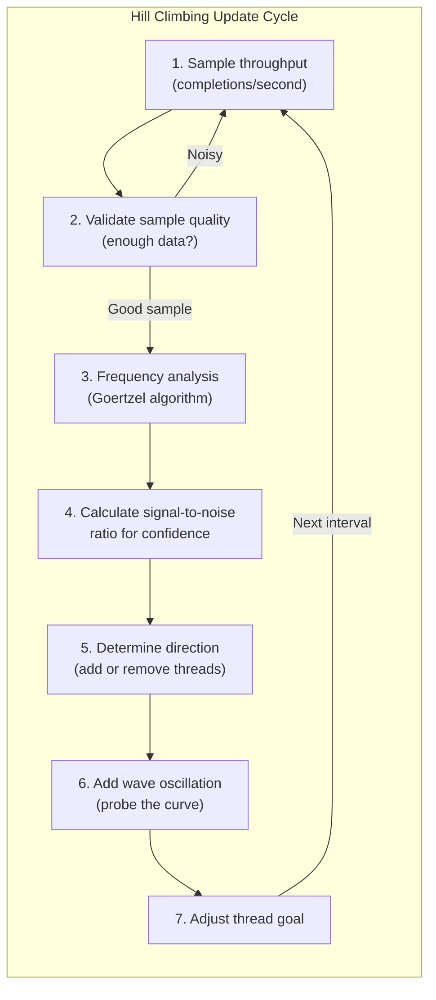
```mermaid
flowchart TB
    subgraph HillClimbing["Hill Climbing Update Cycle"]
        direction TB

        Sample["1. Sample throughput<br/>(completions/second)"]
        Validate["2. Validate sample quality<br/>(enough data?)"]
        FFT["3. Frequency analysis<br/>(Goertzel algorithm)"]
        SNR["4. Calculate signal-to-noise<br/>ratio for confidence"]
        Direction["5. Determine direction<br/>(add or remove threads)"]
        Wave["6. Add wave oscillation<br/>(probe the curve)"]
        Adjust["7. Adjust thread goal"]

        Sample --> Validate
        Validate -->|"Good sample"| FFT
        Validate -->|"Noisy"| Sample
        FFT --> SNR
        SNR --> Direction
        Direction --> Wave
        Wave --> Adjust
        Adjust -->|"Next interval"| Sample
    end
```

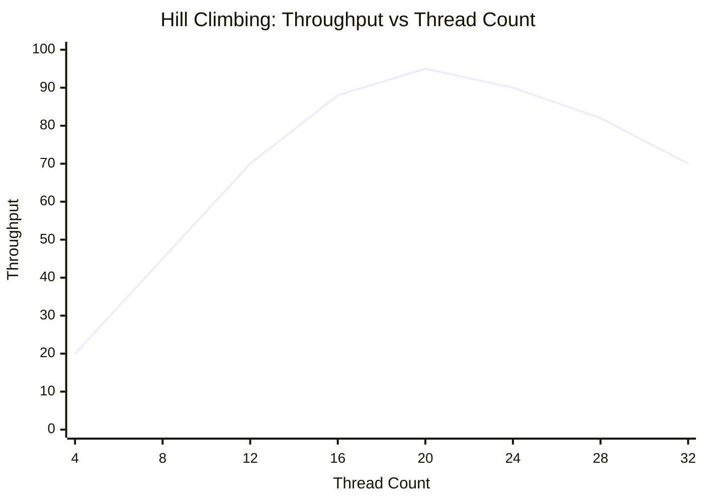
```mermaid
xychart-beta
    title "Hill Climbing: Throughput vs Thread Count"
    x-axis "Thread Count" [4, 8, 12, 16, 20, 24, 28, 32]
    y-axis "Throughput" 0 --> 100
    line [20, 45, 70, 88, 95, 90, 82, 70]
```

### 5.3 Worker Thread Lifecycle

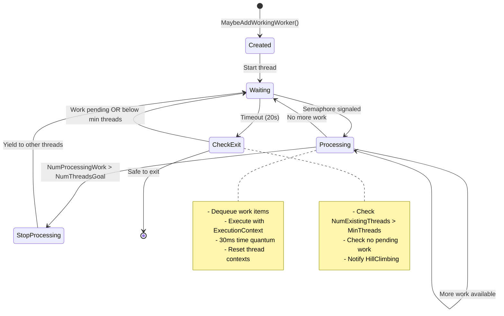
```mermaid
stateDiagram-v2
    [*] --> Created: MaybeAddWorkingWorker()

    Created --> Waiting: Start thread

    Waiting --> Processing: Semaphore signaled
    Waiting --> CheckExit: Timeout (20s)

    Processing --> Waiting: No more work
    Processing --> Processing: More work available
    Processing --> StopProcessing: NumProcessingWork > NumThreadsGoal

    StopProcessing --> Waiting: Yield to other threads

    CheckExit --> Waiting: Work pending OR below min threads
    CheckExit --> [*]: Safe to exit

    note right of Processing
        - Dequeue work items
        - Execute with ExecutionContext
        - 30ms time quantum
        - Reset thread contexts
    end note

    note right of CheckExit
        - Check NumExistingThreads > MinThreads
        - Check no pending work
        - Notify HillClimbing
    end note
```

### 5.4 Gate Thread Operations

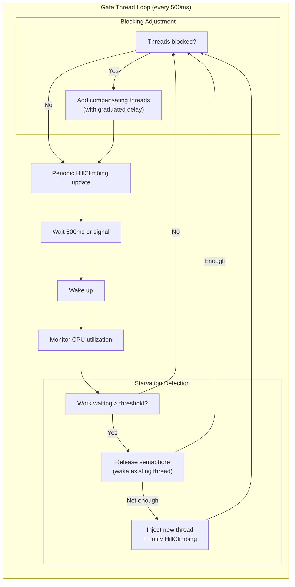
```mermaid
flowchart TB
    subgraph GateThread["Gate Thread Loop (every 500ms)"]
        direction TB

        Start["Wake up"]
        CPU["Monitor CPU utilization"]

        subgraph Starvation["Starvation Detection"]
            Check["Work waiting > threshold?"]
            Wake["Release semaphore<br/>(wake existing thread)"]
            Inject["Inject new thread<br/>+ notify HillClimbing"]
        end

        subgraph Blocking["Blocking Adjustment"]
            BlockCheck["Threads blocked?"]
            Compensate["Add compensating threads<br/>(with graduated delay)"]
        end

        HillUpdate["Periodic HillClimbing update"]
        Sleep["Wait 500ms or signal"]

        Start --> CPU
        CPU --> Check
        Check -->|"Yes"| Wake
        Check -->|"No"| BlockCheck
        Wake -->|"Not enough"| Inject
        Wake -->|"Enough"| BlockCheck
        Inject --> BlockCheck
        BlockCheck -->|"Yes"| Compensate
        BlockCheck -->|"No"| HillUpdate
        Compensate --> HillUpdate
        HillUpdate --> Sleep
        Sleep --> Start
    end
```

### 5.5 Blocking Detection and Compensation

```mermaid
sequenceDiagram
    participant Worker as Worker Thread
    participant Block as Blocking API
    participant Pool as PortableThreadPool
    participant Gate as GateThread

    Worker->>Block: Task.Wait() / lock / I/O
    Block->>Pool: NotifyThreadBlocked()
    Pool->>Pool: Interlocked.Increment(_numBlockedThreads)
    Pool->>Gate: Signal _runGateThreadEvent

    Gate->>Gate: PerformBlockingAdjustment()

    Note over Gate: Target = MinThreads + NumBlockedThreads

    alt Immediate (first few threads)
        Gate->>Pool: Create thread immediately
    else Delayed (many blocked)
        Gate->>Gate: Wait 25-250ms
        Gate->>Pool: Create thread
    end

    Block-->>Worker: Unblocked
    Worker->>Pool: NotifyThreadUnblocked()
    Pool->>Pool: Interlocked.Decrement(_numBlockedThreads)
```

### 5.6 Thread Injection Delays

```mermaid
flowchart LR
    subgraph Delays["Thread Injection Delay Schedule"]
        D1["1-4 blocked<br/>0ms delay"]
        D2["5-8 blocked<br/>25ms delay"]
        D3["9-12 blocked<br/>50ms delay"]
        D4["13-16 blocked<br/>75ms delay"]
        D5["17+ blocked<br/>up to 250ms"]
    end

    D1 --> D2 --> D3 --> D4 --> D5
```

---

## 6. Putting It All Together

### 6.1 Complete async/await Flow

```mermaid
sequenceDiagram
    participant UI as UI Thread
    participant EC as ExecutionContext
    participant SC as SynchronizationContext
    participant Task
    participant Pool as ThreadPool
    participant Worker as Worker Thread
    participant Queue as WorkQueue

    Note over UI: async Task MyMethod()

    rect rgb(200, 220, 240)
        Note over UI,EC: 1. CAPTURE PHASE
        UI->>EC: Capture() - save AsyncLocal values
        UI->>SC: Current - save UI context
        UI->>Task: Create continuation with both
    end

    rect rgb(220, 240, 200)
        Note over Pool,Worker: 2. EXECUTION PHASE
        Pool->>Queue: Enqueue work item
        Queue->>Worker: Dequeue
        Worker->>Worker: Execute async operation
        Worker->>Task: SetResult()
    end

    rect rgb(240, 220, 200)
        Note over UI,SC: 3. CONTINUATION PHASE
        Task->>SC: Post(continuation) - marshal to UI
        SC->>UI: Queue to message loop
        UI->>EC: Run(captured, callback) - restore AsyncLocals
        UI->>UI: User code continues
    end
```

### 6.2 Memory Layout

```mermaid
flowchart TB
    subgraph Thread["Thread Object"]
        EC["_executionContext"]
        SC["_synchronizationContext"]
    end

    subgraph ExecutionContext
        Map["m_localValues: IAsyncLocalValueMap"]
        Notifications["m_localChangeNotifications: IAsyncLocal[]"]
        Flags["m_isFlowSuppressed, m_isDefault"]
    end

    subgraph ValueMap["IAsyncLocalValueMap (e.g., TwoElement)"]
        K1["_key1: AsyncLocal&lt;string&gt;"]
        V1["_value1: 'alice'"]
        K2["_key2: AsyncLocal&lt;int&gt;"]
        V2["_value2: 42"]
    end

    subgraph WorkItem["QueueUserWorkItemCallback"]
        Callback["_callback: WaitCallback"]
        State["_state: object"]
        Context["_context: ExecutionContext"]
    end

    Thread --> ExecutionContext
    ExecutionContext --> ValueMap
    WorkItem --> Context
    Context -.->|"reference"| ExecutionContext
```

### 6.3 Key Relationships Summary

| Component | Purpose | Stored On | Captured By |
|-----------|---------|-----------|-------------|
| `ExecutionContext` | Flow ambient data (AsyncLocal) | `Thread._executionContext` | `await`, `Task.Run`, `ThreadPool.QueueUserWorkItem` |
| `SynchronizationContext` | Control thread affinity | `Thread._synchronizationContext` | `await` (unless `ConfigureAwait(false)`) |
| `TaskScheduler` | Decide where tasks run | Task instance | `Task.Factory.StartNew` |
| `IAsyncLocalValueMap` | Store AsyncLocal values | `ExecutionContext.m_localValues` | Implicitly via EC |

### 6.4 Best Practices

```mermaid
flowchart TB
    subgraph Do["✓ Do"]
        D1["Use ConfigureAwait(false) in library code"]
        D2["Use AsyncLocal for request-scoped data"]
        D3["Let ThreadPool manage thread count"]
        D4["Use Task.Run for CPU-bound work"]
    end

    subgraph Dont["✗ Don't"]
        X1["Block on async code (Task.Wait)"]
        X2["Use ThreadLocal in async code"]
        X3["Manually create threads for short work"]
        X4["Capture context unnecessarily"]
    end
```

---

## References

- [ExecutionContext.cs](https://github.com/dotnet/runtime/blob/main/src/libraries/System.Private.CoreLib/src/System/Threading/ExecutionContext.cs)
- [AsyncLocal.cs](https://github.com/dotnet/runtime/blob/main/src/libraries/System.Private.CoreLib/src/System/Threading/AsyncLocal.cs)
- [SynchronizationContext.cs](https://github.com/dotnet/runtime/blob/main/src/libraries/System.Private.CoreLib/src/System/Threading/SynchronizationContext.cs)
- [TaskScheduler.cs](https://github.com/dotnet/runtime/blob/main/src/libraries/System.Private.CoreLib/src/System/Threading/Tasks/TaskScheduler.cs)
- [ThreadPoolWorkQueue.cs](https://github.com/dotnet/runtime/blob/main/src/libraries/System.Private.CoreLib/src/System/Threading/ThreadPoolWorkQueue.cs)
- [PortableThreadPool.cs](https://github.com/dotnet/runtime/blob/main/src/libraries/System.Private.CoreLib/src/System/Threading/PortableThreadPool.cs)
- [PortableThreadPool.HillClimbing.cs](https://github.com/dotnet/runtime/blob/main/src/libraries/System.Private.CoreLib/src/System/Threading/PortableThreadPool.HillClimbing.cs)
