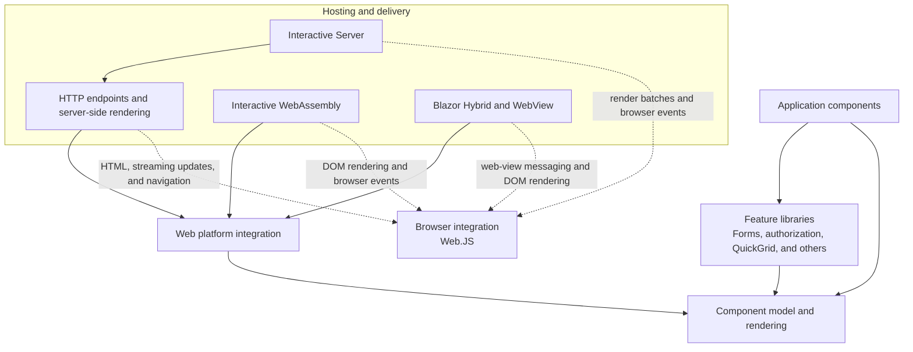
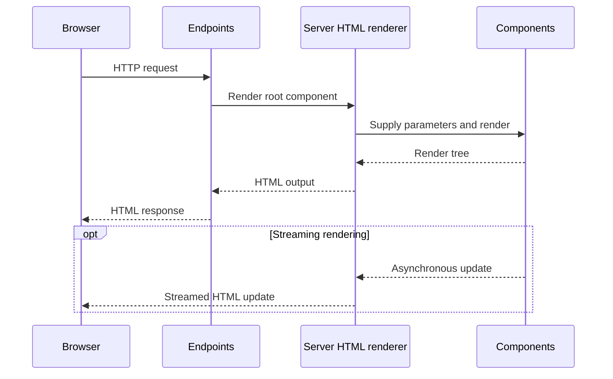
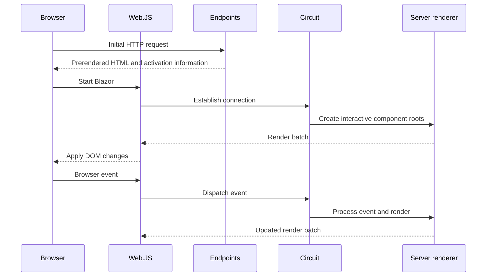
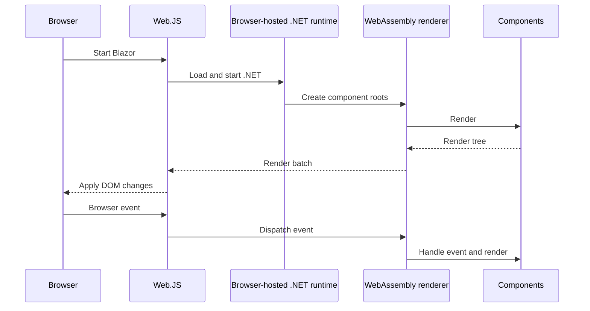
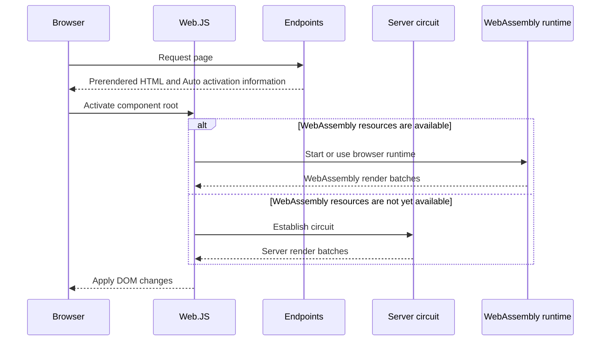
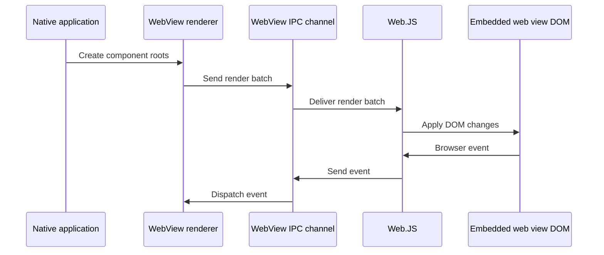

# Blazor Components Architecture

## Purpose and Scope

This document describes how the major subsystems under `src/Components` compose to implement Blazor across its supported hosting and rendering models. It provides a system-wide view of their responsibilities, dependency direction, execution boundaries, and shared design principles.

The intended audience is contributors who need to understand how a change in one part of Blazor affects the rest of the system. This document covers the relationships among subsystems and the runtime compositions they form, including static server-side rendering, Interactive Server, Interactive WebAssembly, Interactive Auto, and Blazor Hybrid.

This document is the entry point for a set of more focused `ARCHITECTURE.md` files located alongside individual subsystems. Those documents are authoritative for the internal architecture of their respective subsystems. This document describes each subsystem only to the extent necessary to explain its role in the overall composition and links to the focused document for further detail.

This document is not an API reference, an exhaustive inventory of projects and source files, or a guide to building and testing the repository. Consumer-facing behavior belongs in the product documentation, repository workflows and contribution instructions belong in `AGENTS.md`, and subsystem implementation details belong in the corresponding subsystem architecture document.

## System Overview

Blazor is built around a host-independent component model. Application components receive parameters, handle events, and produce render trees. A renderer coordinates component execution, compares successive render trees, and turns the resulting changes into output appropriate for its environment. The core component model does not determine whether that output becomes an HTML response, updates a browser DOM, or is transported to another process.

Web-specific integration builds on the component model with concepts needed when HTML and the browser are the rendering targets. The .NET web layer and the code in `Web.JS` cooperate on DOM updates, browser events, navigation, streaming rendering, and JavaScript interoperability. This boundary is used differently by each hosting model, but it does not change the component programming model.

Hosting subsystems determine where components execute and how rendered output reaches its destination. The endpoints subsystem integrates components with ASP.NET Core HTTP routing and server-side HTML rendering. Interactive Server keeps component execution on the server and exchanges render batches and events with the browser over a circuit. Interactive WebAssembly runs the component model and renderer in the browser-hosted .NET runtime. WebView hosts use an embedded web view to connect .NET component execution with a browser-like rendering surface.

Feature libraries such as forms, authorization, and QuickGrid build on these foundations. They participate in an application when selected, but they do not define a hosting model.

### Composition Diagram

The solid arrows in this diagram represent the primary dependency direction between architectural layers. Dashed arrows represent runtime communication across the .NET and JavaScript boundary rather than assembly dependencies.

This is an architectural composition rather than a complete project-reference graph. Individual subsystems can have additional dependencies required by their implementation, which are documented in their respective architecture documents.

## Architectural Layers

The layers below describe architectural responsibilities rather than a single deployment stack. A Blazor application selects a hosting model that composes several of these layers, and some layers contain both .NET and JavaScript implementations. The boundaries identify which subsystem owns a behavior even when the resulting runtime composition spans multiple assemblies or processes.

### Component Model and Rendering

`Microsoft.AspNetCore.Components` defines the host-independent foundation used by every Blazor application. It owns the component abstraction, parameter delivery, component lifecycle, render-tree representation, renderer coordination, event dispatch into components, and the mechanisms that schedule and produce render batches.

This layer models rendering without assuming HTML, a browser, or a particular transport. A host-specific renderer decides how to consume the rendered output and how events or external changes are delivered back to components. Higher layers should build on these abstractions rather than introducing hosting concerns into the component model.

### Web Platform Integration

`Microsoft.AspNetCore.Components.Web` specializes the component model for HTML and browser-based applications. It provides web-oriented rendering behavior, browser event abstractions, navigation integration, and the shared concepts used by the server, WebAssembly, and WebView hosting models.

`Web.JS` owns the corresponding browser-side behavior. It applies interactive render batches to the DOM, captures browser events, coordinates navigation and document updates, and provides the JavaScript side of framework interop. The .NET and JavaScript implementations form an internal integration boundary and ship together as parts of the same framework version.

### Hosting and Delivery

Hosting subsystems select where component instances and renderers execute, how an application starts, and how rendered output and events cross environment boundaries.

- **Endpoints** integrates components with ASP.NET Core routing and HTTP responses. It owns static server-side rendering, prerendering, streaming rendering over HTTP, and the server-side coordination required to establish interactive render modes.
- **Server** owns long-lived server interactivity. It manages circuits, server-side component state, and the transport of render batches and browser events between the server and `Web.JS`.
- **WebAssembly** owns startup and execution in the browser-hosted .NET runtime. Component state and rendering execute in the browser, while `Web.JS` applies the resulting changes to the DOM.
- **WebView** owns hosting within an embedded web view. It connects .NET component execution in the native process to the web content displayed by the platform-specific web view.

These hosts share the component and web layers, but their execution locations, service scopes, startup sequences, failure modes, and state lifetimes differ.

### Supporting Features

Supporting libraries add capabilities to the component programming model without defining how an application is hosted. Forms, authorization, QuickGrid, custom elements, and other specialized features build on the core or web layers and participate only when an application uses them.

These features should depend on the lowest layer that provides the abstractions they require. Hosting subsystems may integrate with them, but feature-specific policy and state remain owned by the feature rather than by the host.

### Tooling and Test Infrastructure

Analyzers, generators, testing infrastructure, test assets, samples, and benchmarks support development and validation of the runtime architecture but are not runtime layers themselves. They are outside the scope of this runtime architecture map and should not appear in runtime composition diagrams unless they participate in the behavior being described.

## Runtime Compositions

A runtime composition determines where component instances execute, which renderer owns them, how rendered output reaches its destination, and how events return to the renderer. These choices also determine service scopes, state lifetime, startup behavior, and failure boundaries.

A single document can contain multiple component roots with different render modes. Each interactive root is owned by one runtime for its lifetime; component instances and renderer state do not migrate between runtimes after activation.

### Static Server-Side Rendering

In static server-side rendering, an HTTP endpoint creates and renders the component hierarchy for a request. The renderer writes HTML to the response, and no interactive component instance is retained after the response completes.

Streaming rendering can keep the response open while asynchronous work completes and send later HTML updates. Enhanced navigation can fetch another server-rendered response and update the current document without a full browser reload. These capabilities can involve `Web.JS`, but they do not turn the statically rendered components into interactive component instances.

The component hierarchy, renderer, and request-scoped services belong to the HTTP request. State that must survive a later request or interactive activation has to cross that boundary explicitly.

### Interactive Server

In Interactive Server, component instances and their renderer live on the server inside a circuit. `Web.JS` maintains the browser side of the connection, applies render batches to the DOM, and sends browser events back to the circuit.

An application can send prerendered HTML in the initial HTTP response before establishing the circuit. Prerendering and interactivity use separate component instances and service scopes. State can be persisted across that transition, but the prerendered instance itself does not become the interactive instance.

Circuit state survives across individual events and renders, but it remains server-owned. Connection loss, circuit retention, reconnection, and server resource limits are therefore part of this hosting model's architecture.

### Interactive WebAssembly

In Interactive WebAssembly, the .NET runtime, component instances, renderer, and application services run in the browser. The renderer exchanges render batches and events with `Web.JS` within the browser rather than through a server circuit.

A standalone Blazor WebAssembly application starts directly in this composition. A Blazor Web App can first prerender the component on the server and then activate a separate WebAssembly instance after the runtime and application assets are available.

Application state is browser-owned for the lifetime of the running application. Server communication, when required by the application, occurs through ordinary remote APIs rather than through the component rendering protocol.

### Interactive Auto

Interactive Auto allows a Blazor Web App to choose between Interactive Server and Interactive WebAssembly when activating a component root. The server can provide immediate interactivity while WebAssembly resources are not yet available locally. After those resources have been downloaded, a later activation can select WebAssembly.

The selection is made for an activation, not as a live migration. A component root activated on the server remains server-owned for that instance's lifetime, even if WebAssembly resources become available afterward.

Because either interactive runtime can own the component, services and application logic used by an Auto component must be valid in both environments unless the component is deliberately constrained to one of them.

### Blazor Hybrid and WebView

In Blazor Hybrid, components execute in the native .NET process. A WebView renderer sends render batches through an internal channel to `Web.JS` running inside an embedded web view. Browser events travel back through the same channel to the renderer.

The web view supplies the HTML and DOM rendering surface, but it does not host the application's .NET runtime. The application therefore uses native-process services and lifetimes rather than WebAssembly or server-circuit scopes.

The platform-specific web view controls process integration, content loading, and the lifecycle of the embedded browser surface. The shared WebView layer owns the component-rendering protocol above those platform adapters.

## Cross-Cutting Architectural Boundaries

Features that span hosting models must preserve several boundaries that are not visible from the component programming model alone. Before changing cross-runtime behavior, identify the owner on each side of the boundary, the lifetime of its state, and the mechanism by which information crosses it.

### Execution Location

A component can execute in an ASP.NET Core process, in a browser-hosted .NET runtime, or in a native process containing a web view. The component model is common to all three, but the available services, resources, security boundaries, and failure conditions are not.

Code below a hosting boundary must not assume access to server resources, browser-only .NET APIs, or native platform capabilities. Components intended for Interactive Auto must be valid in either the server or WebAssembly environment. Runtime-specific behavior belongs behind an abstraction or within a component whose render mode constrains its execution environment.

The browser is always involved in web UI, but browser-side JavaScript does not imply that component code executes in the browser. In Interactive Server, `Web.JS` runs in the browser while the components and renderer remain on the server.

### Renderer and Host Responsibilities

The host owns application startup, service registration and scopes, renderer creation, transport setup, and shutdown. The renderer owns component instances, parameter delivery, lifecycle execution, event dispatch, render scheduling, and production of rendered output.

The consumer of that output owns its application to the target environment. A server HTML renderer writes HTML, while interactive browser integrations apply render batches to the DOM. A transport can carry batches and events between those owners, but it does not take ownership of component state or rendering decisions.

Components should express UI through the component and rendering abstractions. They should not directly control a host, transport, circuit, HTTP response, or DOM renderer.

### State and Dependency Injection Scopes

State belongs to the runtime and scope in which its owning component or service executes:

- Static server-side rendering uses the request's service scope and ends with the request.
- Interactive Server uses a circuit scope that can span many renders and browser events.
- Interactive WebAssembly uses scopes owned by the browser-hosted application.
- WebView uses scopes owned by the native application and its Blazor web view.

The same dependency injection lifetime name can therefore represent different effective lifetimes in different hosting models. A scoped service is not automatically shared between prerendering and interactivity, between server and WebAssembly execution, or between separate circuits or application instances.

State crosses these boundaries only through an explicit mechanism, such as persisted component state, application storage, an HTTP API, or another host-defined channel. Sharing a component type or service registration does not share the corresponding instance or its state.

### Prerendering and Interactive Activation

Prerendering and interactive rendering are separate executions. Prerendering creates a server-side component hierarchy to produce initial HTML. Interactive activation later creates a new component hierarchy in the selected interactive runtime and associates its rendered output with the existing DOM.

Activation information in the HTML identifies interactive roots and supplies the data needed to create them. It does not transfer ownership of the prerendered component instances. Any state required to avoid recomputation or preserve continuity must be captured during prerendering and restored by the interactive instance.

A statically rendered parent can establish interactive roots, but the selected render mode defines an execution boundary. Components within an interactive hierarchy execute in the runtime that owns that hierarchy unless another independently activated root is established at an allowed boundary.

### Navigation and Document Lifetime

Navigation can replace the entire browser document or update it through enhanced navigation. A full document load restarts browser-side framework state and all interactive runtimes associated with that document. Enhanced navigation preserves the document while replacing server-rendered content and reconciling interactive roots.

`Web.JS` owns browser-side interception, document updates, and notifications about browser navigation. ASP.NET Core endpoints own the server response produced for an enhanced request. Interactive renderers own the component hierarchies that remain active or are disposed as roots enter and leave the document.

Behavior associated with a DOM element must follow the lifetime of that element. Document-level behavior can survive enhanced navigation, while element-level behavior must be re-established when replacement content creates a new element.

### JavaScript and .NET Integration

The .NET and JavaScript parts of Blazor communicate through internal contracts for bootstrapping, root-component activation, render batches, browser events, navigation, streaming updates, and interop. These contracts cross language and, for Interactive Server and WebView, process boundaries.

The framework's .NET and JavaScript assets ship and evolve together. Their internal protocol is not a compatibility boundary between different major framework versions, so coordinated changes should update both sides rather than add version negotiation or compatibility shims.

This does not apply to public contracts used by applications. Public .NET APIs, documented JavaScript entry points such as `Blazor.start`, and the documented JavaScript interop APIs retain their normal compatibility requirements.

## Design Principles

- **Keep shared abstractions independent of host policy.** Shared component and rendering abstractions should describe concepts that applicable renderers can interpret consistently. Decisions involving HTTP, circuits, browser behavior, transport, or concrete render modes belong in the renderer or hosting boundary that owns them. When a host needs support from a shared layer, add the smallest generally useful mechanism and keep the host-specific policy outside it.
- **Choose capabilities or identity according to the decision being made.** Base shared behavior on the capability or render-mode abstraction it requires rather than enumerating known hosts. Use renderer or host identity only when that identity is itself meaningful to the behavior or must be surfaced to the application. Do not use identity as a substitute for a capability, because new renderers may provide the same behavior without matching an existing name.
- **Design for mixed-runtime composition.** Evaluate features when Server and WebAssembly roots coexist and when Auto can select either runtime, not only within each host independently. Define which runtime owns each component root and which subsystem arbitrates shared browser resources. Account for prerendering, delayed startup, enhanced navigation, streaming rendering, and circuit replacement when they affect the feature.
- **Gate transitions on explicit completion conditions.** When SSR, navigation, activation, or reconnection phases operate on the same document or component roots, do not let the next phase take ownership until the preceding phase reaches a defined barrier. Use conditions such as rendering quiescence, document completion, renderer attachment, or acknowledgment rather than inferring completion from the temporary absence of work. Reevaluate the relevant state after asynchronous waits because ownership or pending work may have changed.
- **Match automatically when identity is sufficiently discriminating and ambiguity is safe.** Framework automation can use stable, deliberately scoped identity without requiring global uniqueness. Combine the contextual signals available to the framework, and provide an explicit mechanism for applications to disambiguate valid cases the framework cannot distinguish. Automatic matching is appropriate when an incorrect correlation has a safe fallback; operations with riskier consequences should require explicit application intent or establish a new instance instead.
- **Design asynchronous operations for cancellation and supersession.** Define when ongoing work becomes irrelevant because its owner was disposed, its environment disconnected, or a newer operation replaced it. Propagate cancellation when the work can stop, and verify ownership again before committing results when it cannot. Cancellation and supersession must produce an explicit outcome rather than allowing stale work to update current state or fail later through an unrelated timeout.
- **Build browser enhancements on native web semantics.** Navigation, forms, history, URLs, and document loading should retain their browser-defined behavior when framework enhancement is unavailable or declines to handle an operation. Assign one framework mechanism as the authority for each interaction, preserve the element and submitter semantics that determine the native result, and fall back only when doing so does not repeat an unsafe operation.
- **Use the renderer dispatcher as the concurrency boundary.** Access renderer-, circuit-, and component-owned mutable state through the owning dispatcher, and dispatch the complete state-changing operation rather than only its resulting render request. Do not add locks, semaphores, or concurrent collections to state confined to one dispatcher. This provides logical serialization, not exclusive execution of an entire asynchronous operation: state must remain valid whenever an incomplete `await` yields control, and assumptions may need to be rechecked when execution resumes. Use independent synchronization only for state accessed outside the dispatcher or shared across renderers, circuits, or other concurrent owners.
- **Make cross-boundary protocols self-validating.** Data exchanged across processes, runtimes, or languages should carry enough information to validate its identity, ordering, size, completion, and cancellation where those properties affect correctness. Reject protocol violations at the receiving boundary with a defined failure instead of accepting malformed state or depending on timeouts and downstream failures to expose the problem.
- **Define failure outcomes as part of the contract.** For each operation, decide whether failure terminates the operation, permits best-effort continuation, discards stale work, or triggers a fallback. The implementation must leave callers and later stages able to determine which outcome occurred. Avoid incidental partial success; when partial results are supported, make that state explicit and define how consumers handle it.

## Architecture Documentation Map

Focused architecture documents live at the root of the runtime subsystem they describe. Each document owns the internal architecture of that subsystem and links back to this composition document. Documents will be linked here as they are added.

### Foundations

| Subsystem | Responsibility | Architecture |
|---|---|---|
| Components | Host-independent component model, render trees, renderer coordination, lifecycle, and event dispatch | `Components/ARCHITECTURE.md` |
| Web | HTML-oriented components, browser event abstractions, navigation, and shared web rendering behavior | `Web/ARCHITECTURE.md` |
| Web.JS | Browser bootstrapping, DOM rendering, navigation enhancement, events, and the JavaScript side of framework protocols | `Web.JS/ARCHITECTURE.md` |

### Hosting and Rendering

| Subsystem | Responsibility | Architecture |
|---|---|---|
| Endpoints | ASP.NET Core endpoints, static SSR, prerendering, streaming rendering, forms, and render-mode activation | `Endpoints/ARCHITECTURE.md` |
| Server | Interactive Server circuits, server renderers, reconnection, circuit persistence, pause and resume, and browser transport, including the opt-in AutoPause extension | `Server/ARCHITECTURE.md` |
| WebAssembly | Browser-hosted .NET startup, rendering, application execution, and WebAssembly-specific JavaScript interop | `WebAssembly/WebAssembly/ARCHITECTURE.md` |
| WebAssembly Server | Server delivery of WebAssembly resources, endpoint integration, authentication-state serialization, and debugging support | `WebAssembly/Server/ARCHITECTURE.md` |
| WebView | Native-process component execution and embedded web-view rendering | `WebView/WebView/ARCHITECTURE.md` |
| Gateway | Reverse-proxy hosting, service discovery, and telemetry for deployed Blazor applications | `Gateway/ARCHITECTURE.md` |

### Runtime Features

Runtime feature projects receive focused architecture documents when their design involves durable responsibilities or boundaries not already explained by a foundational or hosting document.

| Subsystem | Responsibility | Architecture |
|---|---|---|
| Authorization | Authentication-state propagation and authorization components | `Authorization/ARCHITECTURE.md` |
| Forms | Form coordination, editing state, validation, and input components | `Forms/ARCHITECTURE.md` |
| QuickGrid | Data-grid composition, virtualization, sorting, and data-provider integration, including the Entity Framework adapter | `QuickGrid/Microsoft.AspNetCore.Components.QuickGrid/ARCHITECTURE.md` |
| Custom Elements | Exposing components through the browser custom-elements model | `CustomElements/ARCHITECTURE.md` |
| WebAssembly Authentication | Client-side authentication state, navigation, access tokens, and JavaScript integration, including the MSAL specialization | `WebAssembly/WebAssembly.Authentication/ARCHITECTURE.md` |
| AI | Conversational UI state, content-block mapping, rendering, and extensibility | `AI/ARCHITECTURE.md` |

Samples, test assets, benchmarks, analyzers, generators, and testing infrastructure are outside the runtime architecture map. They are documented by their own contributor guidance where necessary.

## Finding the Right Subsystem

Start with the subsystem that owns the concept being changed, then follow the documented boundaries when the behavior spans more than one subsystem.

| If the change concerns | Start with | Also inspect |
|---|---|---|
| Component lifecycle, parameters, render trees, render scheduling, diffing, or event dispatch | Components | The renderer or host consuming the render batch |
| HTML rendering behavior or browser event abstractions shared by multiple hosts | Web | Web.JS and each affected host |
| DOM updates, browser events, bootstrapping, enhanced navigation, or browser-side protocol handling | Web.JS | Web, Endpoints, Server, or WebAssembly according to the producer |
| HTTP routing, static SSR, prerendering, streaming rendering, form posts, or render-mode markers | Endpoints | Web.JS and the selected interactive hosts |
| Circuits, reconnection, server-side component state, or SignalR transport | Server | Endpoints and Web.JS |
| Browser-hosted .NET startup, WebAssembly rendering, or client application services | WebAssembly | Web.JS and Endpoints for Blazor Web Apps |
| WebAssembly resource delivery, endpoint options, authentication-state serialization, or debugging support | WebAssembly Server | Endpoints and WebAssembly |
| Embedded web views or native-to-web-view communication | WebView | Web and Web.JS |
| Reverse-proxy hosting or service discovery for deployed Blazor applications | Gateway | The hosting subsystem used by the proxied application |
| Authentication state or authorization components | Authorization | The hosts that provide authentication state |
| Client-side remote authentication, access tokens, or authentication navigation | WebAssembly Authentication | Authorization, WebAssembly, and its JavaScript integration |
| Form state, validation, field tracking, or input components | Forms | Web and Endpoints for browser and form-post integration |
| Grid rendering, data providers, sorting, or virtualization | QuickGrid | Components and Web |
| Browser custom elements backed by components | Custom Elements | Web and Web.JS |
| Conversational UI state, content-block mapping, or AI component rendering | AI | Components, Web, and Microsoft.Extensions.AI |

A cross-subsystem change should identify the producer, consumer, data contract, owner, and lifetime at each boundary. Do not select a subsystem merely because it contains the current call site; place the behavior with the subsystem that owns its semantics and keep environment-specific adaptation at the hosting boundary.

## Terminology

- **Component** - A unit of UI with parameters, state, lifecycle, and rendering behavior. A component instance belongs to one renderer.
- **Renderer** - The owner and coordinator of a component hierarchy. It dispatches component work, processes render requests, computes changes, and produces output for a target environment.
- **Host** - The environment that starts Blazor, configures services, creates renderers, and manages their external resources and lifetime.
- **Render tree** - The renderer-facing representation produced by a component. It describes components, elements, attributes, text, regions, and related rendering instructions.
- **Render batch** - An ordered set of changes produced by a renderer, including edits to rendered output and changes to component and event-handler ownership.
- **Render mode** - A declaration of how a component root is rendered and, when applicable, where it becomes interactive.
- **Static server-side rendering (static SSR)** - Request-scoped component execution that produces HTML without retaining an interactive component instance.
- **Prerendering** - Producing initial HTML on the server for a component that will later be instantiated separately by an interactive renderer.
- **Interactive root** - A component root activated and owned by an interactive renderer. A document can contain roots owned by different interactive runtimes.
- **Activation** - Creating an interactive component root from information emitted during server rendering and associating its output with the existing document.
- **Circuit** - The server-side lifetime and execution environment for an Interactive Server component hierarchy, including its renderer, services, state, and connection-related resources.
- **Enhanced navigation** - Browser-side navigation that fetches server-rendered HTML and updates the current document without performing a full document load.
- **Runtime composition** - The combination of component, web, hosting, and browser subsystems that implements a supported rendering and interactivity model.
