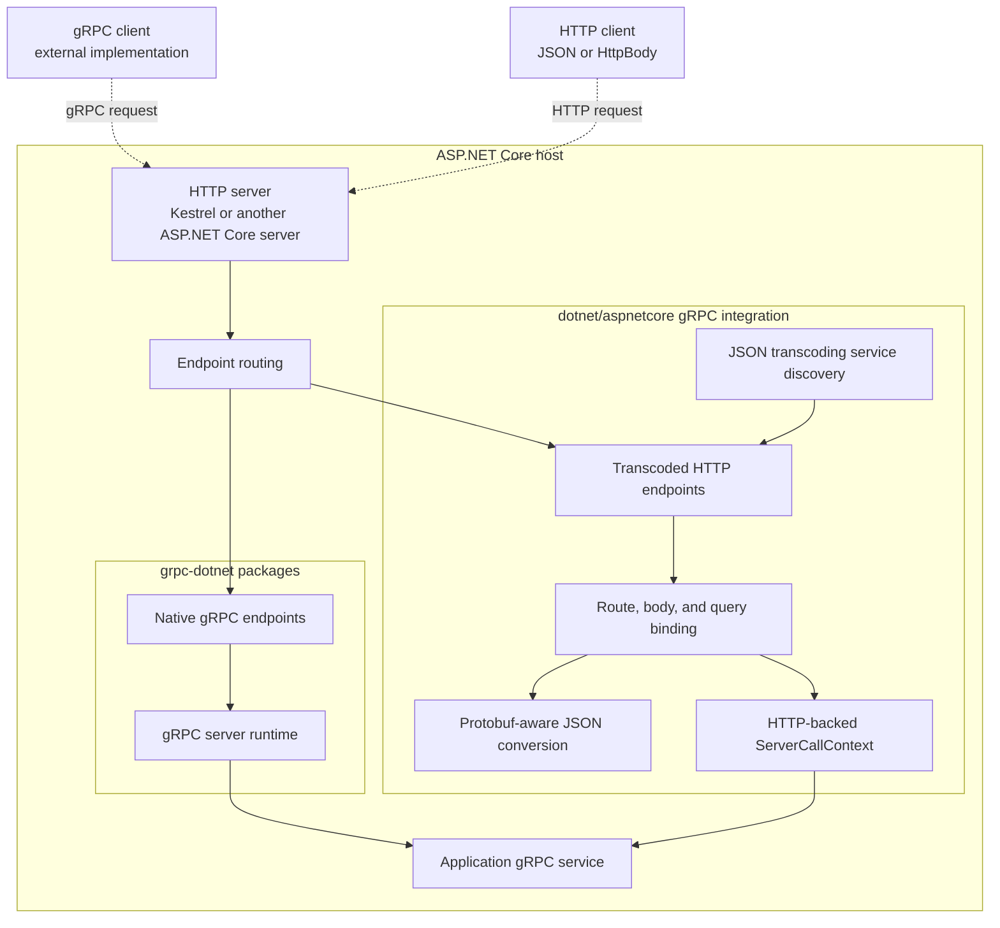
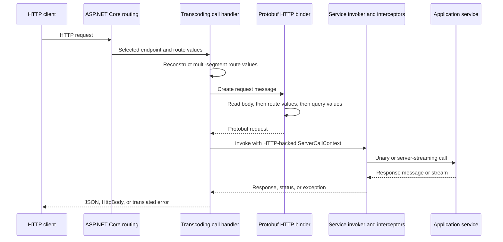

# ASP.NET Core gRPC Integration Architecture

## Purpose and Scope

This document describes how the gRPC integration owned by the ASP.NET Core repository composes with the wider .NET gRPC stack. It explains the responsibilities, runtime pipeline, state ownership, and protocol boundaries of the code under `src/Grpc`, with particular focus on gRPC JSON transcoding and runtime interoperability validation.

The core .NET gRPC server, client, reflection, health-check, and client-factory implementations live in the [grpc-dotnet repository](https://github.com/grpc/grpc-dotnet). ASP.NET Core supplies the HTTP server, routing, dependency injection, hosting, and endpoint abstractions on which those implementations run. This repository additionally owns the JSON transcoding package, the gRPC project template, and tests that validate gRPC packages against current ASP.NET Core and .NET runtime builds.

The intended audience is contributors who need to determine which repository and subsystem owns a behavior and how changes at the ASP.NET Core boundary affect gRPC applications.

This document is not an API reference, a general introduction to gRPC, an exhaustive project inventory, or a build and test workflow. The [gRPC README](README.md) provides development entry points. Consumer guidance belongs in the [ASP.NET Core gRPC documentation](https://learn.microsoft.com/aspnet/core/grpc/), and wire-level details belong in the upstream gRPC and Google API specifications.

## System Overview

An ASP.NET Core gRPC application combines independently owned layers:

- An ASP.NET Core server, normally Kestrel, accepts HTTP connections and produces an `HttpContext` for each request.
- ASP.NET Core routing selects an endpoint.
- The external `Grpc.AspNetCore.Server` package discovers generated service methods, creates native gRPC endpoints, and invokes application services.
- The in-repository `Microsoft.AspNetCore.Grpc.JsonTranscoding` package extends that discovery process with additional HTTP endpoints for methods annotated with `google.api.http`.
- Generated protobuf types and service descriptors define the message and method contracts used by both native gRPC and JSON transcoding.

Native gRPC and JSON transcoding are two representations of the same application service methods. They share service activation, interceptor, option, and method-invocation concepts, but they do not share a wire representation. Native gRPC uses the gRPC protocol and protobuf message framing. JSON transcoding binds ordinary HTTP routes, bodies, and query strings to protobuf messages and writes JSON or `google.api.HttpBody` responses.

### Composition Diagram

Solid arrows represent service composition and use. Dashed arrows represent request and response flow. This is an ownership map, not a complete package-dependency graph.

The native and transcoded endpoints meet at application service invocation. The transport and representation-specific work remains on the corresponding side of that boundary.

## Repository and Subsystem Ownership

| Subsystem | Responsibility | Ownership |
| --- | --- | --- |
| [JSON transcoding](JsonTranscoding) | Discovers annotated service methods, creates HTTP endpoints, binds HTTP input to protobuf messages, invokes services, and serializes responses. | This repository |
| [Interop validation](Interop) | Runs process-based gRPC interoperability cases against current ASP.NET Core and .NET runtime builds. | This repository; test assets are derived from grpc-dotnet |
| [gRPC project template](../ProjectTemplates/Web.ProjectTemplates/content/GrpcService-CSharp) | Creates an ASP.NET Core host that registers and maps a generated gRPC service. | This repository, outside `src/Grpc` |
| [ASP.NET Core servers](../Servers/Kestrel) and routing | Own HTTP/1.1, HTTP/2, and HTTP/3 processing, connection and stream management, endpoint matching, and `HttpContext`. | This repository, outside `src/Grpc` |
| Native gRPC server and clients | Own native gRPC endpoint handling, channels, calls, protocol framing, client factories, and the main service runtime. | [grpc-dotnet](https://github.com/grpc/grpc-dotnet) |
| Server reflection and gRPC health services | Implement the gRPC reflection and health-check protocols. | grpc-dotnet packages, not `src/Grpc` |
| Protobuf runtime and descriptors | Define generated messages, reflection descriptors, JSON field metadata, and well-known types. | [protocolbuffers/protobuf](https://github.com/protocolbuffers/protobuf) |
| Protobuf and gRPC code generation | Compiles `.proto` files and generates C# messages and service binding code. | [`Grpc.Tools` and `protoc`](https://github.com/grpc/grpc/blob/master/src/csharp/BUILD-INTEGRATION.md), outside this repository |

The transcoding implementation compiles selected shared server sources under [`JsonTranscoding/src/Shared`](JsonTranscoding/src/Shared) into its assembly. These sources preserve service activation and interceptor behavior compatible with the external gRPC server, but they do not move ownership of the native server into this repository.

Protobuf reflection descriptors used during endpoint discovery are also distinct from the network-facing gRPC server reflection protocol. This area consumes descriptors; it does not implement the reflection service.

## Endpoint Discovery and Registration

JSON transcoding extends the service registration established by the external gRPC server package. `AddJsonTranscoding` registers an additional `IServiceMethodProvider<TService>`, shared descriptor state, options setup, and interceptor activator infrastructure. Registrations are idempotent so repeated framework composition does not replace application services or duplicate providers.

When a gRPC service is mapped, the transcoding method provider performs startup-time discovery:

1. It locates the generated static bind method for the service.
2. It obtains the protobuf `ServiceDescriptor` associated with the generated service.
3. It registers the descriptor and its dependencies for later JSON type resolution.
4. It runs the generated binding logic with a transcoding-specific `ServiceBinderBase`.
5. For each unary or server-streaming method with a `google.api.http` annotation, it creates one endpoint for the primary rule and each additional binding.

Client-streaming and bidirectional-streaming methods do not receive transcoded endpoints. That is a JSON transcoding limitation, not a limitation of native gRPC.

The HTTP rule is parsed and adapted into an ASP.NET Core `RoutePattern`. Multi-segment variables and catch-all forms that do not map directly to ASP.NET Core route syntax are rewritten into internal route values. Request-time rewrite actions reconstruct the public protobuf field path before binding begins. Endpoint routing remains responsible for matching the request; the transcoding layer does not implement a separate per-request router.

Each endpoint carries the application service and method metadata plus `GrpcJsonTranscodingMetadata`, which exposes the protobuf method descriptor and HTTP rule to endpoint metadata consumers. This repository does not contain an in-tree gRPC OpenAPI schema generator.

## Transcoded Request Pipeline

After endpoint routing selects a transcoded endpoint, one call handler owns the request:

### Request Binding

Binding is descriptor-driven rather than based on ordinary CLR property conventions:

- The HTTP rule selects the request body field, route variables, HTTP verb, and optional response body field.
- A wildcard body binds the entire request message. A named body binds one top-level field.
- Route variables use protobuf field paths and can traverse nested messages.
- Query values bind fields not already owned by the body or an overlapping route path.
- Both protobuf field names and JSON field names participate where supported by the binding rules.
- `google.api.HttpBody` bypasses JSON deserialization and carries the request content type and raw bytes.

Body, route, and query binding have an intentional precedence. A query value must not overwrite a field already supplied by the request body or by a route variable, including equivalent paths written with different protobuf and JSON field-name spellings.

### Service Invocation

The call handler creates a `JsonTranscodingServerCallContext` backed by the current `HttpContext`. Shared invoker infrastructure then applies effective global and per-service gRPC options, activates the application service from request services, executes configured interceptors, invokes the generated service method delegate, and releases framework-created service instances.

This is an in-process adaptation. A transcoded request does not create a native gRPC client call or proxy through a second network connection.

### Response Serialization

Unary responses are serialized as one JSON value unless the response is `google.api.HttpBody`, in which case its content type and bytes are written directly. A response-body annotation can select one top-level protobuf field instead of the complete response message.

Server-streaming responses are written as a sequence of newline-delimited JSON values. Indented JSON is disabled for streaming because embedded formatting newlines would conflict with message delimiting. `HttpBody` stream items write their bytes followed by the same delimiter.

The JSON serializer uses protobuf descriptors and specialized converters for protobuf field presence, names, enums, 64-bit integers, wrappers, `Any`, and other well-known types. Serializer settings change the JSON representation; they do not change the protobuf service or method contract.

## Protocol and Transport Boundaries

Native gRPC, JSON transcoding, HTTP transport, and application invocation are separate boundaries:

- **Native gRPC protocol handling** belongs to grpc-dotnet. It interprets gRPC content types, message framing, compression, metadata, deadlines, and streaming semantics.
- **JSON transcoding** exposes annotated service methods as ordinary HTTP endpoints. It translates between HTTP route/body/query values and protobuf messages and between gRPC status and an HTTP JSON error response.
- **HTTP transport handling** belongs to the selected ASP.NET Core server. Kestrel owns its HTTP/2 and HTTP/3 connection and stream implementations; the transcoding package receives an `HttpContext` after that transport work.
- **Application invocation** is shared conceptually. Native and transcoded endpoints activate the same service types and honor compatible gRPC service options and interceptor pipelines.

JSON transcoding is therefore not native gRPC with JSON substituted for protobuf bytes. It has different request shapes, response framing, error representation, and supported streaming modes. Conversely, transport changes in Kestrel should not introduce gRPC-specific policy into the HTTP server when the behavior belongs in grpc-dotnet or the transcoding adapter.

The project template composes the external `Grpc.AspNetCore` package with ASP.NET Core hosting. Its `<Protobuf>` items drive external code generation, and its generated service is registered through `AddGrpc` and mapped through `MapGrpcService`. The JSON transcoding package adds build assets only to make the bundled `google/api/annotations.proto` and `google/api/http.proto` imports available to `Grpc.Tools` when an application opts in.

## Lifetime and Concurrency Boundaries

State is owned at different lifetimes:

- The descriptor registry and interceptor-activator cache are singleton services. Descriptor registration begins during service discovery and can also add payload types encountered through an application `TypeRegistry`, such as an `Any` value whose type is not referenced by the service. Registration is synchronized, while type lookup supports concurrent request-time reads.
- Effective gRPC service options and serializer options are prepared once and reused. Unary and server-streaming serializers are separate because streaming cannot use indented JSON.
- Route patterns, route and body descriptors, rewrite actions, method delegates, and endpoint metadata are startup-created endpoint state. Query field paths are resolved on demand and admitted to a bounded endpoint-owned cache; valid paths still bind after the cache reaches its limit.
- `JsonTranscodingServerCallContext`, request messages, response writers, service activation handles, and request metadata belong to one HTTP request.
- Application service lifetime follows the external gRPC service activator and dependency injection registration rather than being redefined by transcoding.

A server-streaming call can remain active for the lifetime of the HTTP response. Writes are serialized by the stream writer, and starting another write before the previous write completes is rejected. Completion prevents later writes. This protects response ordering without making application service state globally serialized.

## Cancellation, Errors, and Security Boundaries

The transcoded call context adapts ASP.NET Core request state to the gRPC service surface:

- `ServerCallContext.CancellationToken` is the HTTP request-aborted token. A canceled stream write can abort the associated `HttpContext`.
- `GetHttpContext()` resolves to the current request, and user state is backed by `HttpContext.Items`.
- Request headers are projected into gRPC metadata after protocol-specific and pseudo headers are filtered. Binary metadata values retain their binary interpretation.
- Client certificate information is exposed through the gRPC authentication context. Authentication and authorization policy remain owned by ASP.NET Core hosting and endpoint middleware.
- The adapter does not synthesize every native gRPC facility. For example, it does not create a native gRPC deadline from the transcoded request.

An application `RpcException` preserves its gRPC status for translation. Other exceptions become `Unknown`, and detailed exception information is withheld unless detailed errors are enabled. Before the HTTP response starts, gRPC status codes map to corresponding HTTP status codes. The response body uses the protobuf JSON representation of `google.rpc.Status`.

The `grpc-status-details-bin` trailer has special handling: when valid, its `google.rpc.Status` payload becomes the richer JSON error response. Arbitrary native gRPC trailers do not automatically become equivalent HTTP response metadata. Once a streaming response has started, the HTTP status can no longer be changed; the error payload and streaming delimiter complete the observable transcoded result.

Malformed JSON and exceptions while binding route, query, body, or descriptor values are request errors. They become `InvalidArgument` status before normal service execution. Query paths that do not resolve to protobuf fields are ignored and are not cached. Startup descriptor or route failures instead prevent the corresponding endpoint from being created. Keeping those phases separate makes configuration failures observable before they become request-path ambiguity.

## Design Principles and Invariants

- **Extend the gRPC server rather than duplicating it.** JSON transcoding participates in external service discovery, activation, options, and interceptors while owning only the HTTP adaptation it adds.
- **Keep descriptors as the contract source.** Generated protobuf descriptors and HTTP rules define route, body, query, response, and JSON field semantics. CLR reflection locates generated service methods but does not replace the protobuf contract.
- **Separate startup work from request work.** Parse rules, resolve descriptors, construct delegates, and create endpoint metadata during discovery. Per-request code should bind values and execute the already constructed endpoint.
- **Make binding precedence explicit.** Route-bound fields take precedence over values deserialized from the body. Query binding excludes body-owned fields and fields that overlap route-owned paths, including when aliases identify the same protobuf field.
- **Keep wire representations explicit.** Native gRPC framing, transcoded JSON, newline-delimited server streams, and raw `HttpBody` payloads have different compatibility and buffering requirements.
- **Preserve service invocation semantics across representations.** Activation, interceptor ordering, service options, cancellation, and cleanup should remain aligned with the external gRPC server unless the HTTP representation requires a documented difference.
- **Translate failures at the boundary that owns the representation.** Application status remains a gRPC concept until the transcoding response writer maps it to HTTP status and JSON. Transport failures and request abortion remain ASP.NET Core server concerns.
- **Do not infer support across subsystem boundaries.** Protobuf descriptor reflection is not the reflection protocol, template Native AOT coverage is not proof of transcoding Native AOT support, and endpoint metadata is not an in-repository OpenAPI generator.

## Verification Boundaries

Different test layers establish different properties:

| Validation area | Location | What it establishes |
| --- | --- | --- |
| Parser, descriptor, converter, binding, and handler tests | [`JsonTranscoding/test/Microsoft.AspNetCore.Grpc.JsonTranscoding.Tests`](JsonTranscoding/test/Microsoft.AspNetCore.Grpc.JsonTranscoding.Tests) | Focused transcoding behavior and failure cases |
| Hosted transcoding integration tests | [`JsonTranscoding/test/Microsoft.AspNetCore.Grpc.JsonTranscoding.IntegrationTests`](JsonTranscoding/test/Microsoft.AspNetCore.Grpc.JsonTranscoding.IntegrationTests) | Endpoint composition and HTTP behavior through `TestServer`; not Kestrel transport behavior |
| Transcoding microbenchmarks | [`JsonTranscoding/perf`](JsonTranscoding/perf) | Selected JSON read and write costs; not whole-request throughput |
| Native gRPC interoperability tests | [`Interop/test/InteropTests`](Interop/test/InteropTests) | Process-based client/server interop against current runtime builds over the configured Kestrel HTTP/2 endpoint |
| Template tests | [`../ProjectTemplates/test/Templates.Tests/GrpcTemplateTest.cs`](../ProjectTemplates/test/Templates.Tests/GrpcTemplateTest.cs) | Template creation, restore, build, publish, startup, and selected Native AOT scenarios |
| Test applications and sandbox projects | `JsonTranscoding/test/testassets` and `Interop/test/testassets` | Supporting fixtures and manual probes; not separate shipping runtime layers |

The interop harness validates the external gRPC implementation against changes in this repository. It is not a second implementation of the client or server and does not establish every transport, hosting, or security configuration. Likewise, `TestServer` integration coverage validates the HTTP application pipeline without exercising Kestrel's HTTP/2 or HTTP/3 implementations.

## Documentation Map

| Topic | Reference |
| --- | --- |
| Area introduction and local development | [gRPC README](README.md) |
| JSON transcoding consumer guidance | [gRPC JSON transcoding in ASP.NET Core](https://learn.microsoft.com/aspnet/core/grpc/json-transcoding) |
| ASP.NET Core gRPC overview | [gRPC services with ASP.NET Core](https://learn.microsoft.com/aspnet/core/grpc/aspnetcore) |
| Native .NET gRPC implementation | [grpc-dotnet](https://github.com/grpc/grpc-dotnet) |
| HTTP annotation contract | [`google/api/http.proto`](JsonTranscoding/src/Microsoft.AspNetCore.Grpc.JsonTranscoding/protos/google/api/http.proto) |
| gRPC protocol over HTTP/2 | [gRPC over HTTP/2](https://github.com/grpc/grpc/blob/master/doc/PROTOCOL-HTTP2.md) |
| gRPC interoperability cases | [Interop test descriptions](https://github.com/grpc/grpc/blob/master/doc/interop-test-descriptions.md) |
| Protobuf C# and MSBuild integration | [gRPC C# build integration](https://github.com/grpc/grpc/blob/master/src/csharp/BUILD-INTEGRATION.md) |
| Interop test assets | [Interop test-assets README](Interop/test/testassets/README.md) |

## Finding the Right Owner

| If the change concerns | Start with |
| --- | --- |
| Native gRPC calls, channels, protocol framing, client factories, reflection, or gRPC health services | grpc-dotnet |
| HTTP annotations, route adaptation, protobuf JSON conversion, or transcoded errors | `src/Grpc/JsonTranscoding` |
| HTTP/2 or HTTP/3 connection, stream, flow-control, or server behavior | `src/Servers/Kestrel` or the selected ASP.NET Core server |
| ASP.NET Core endpoint matching or route-pattern behavior | `src/Http/Routing` |
| The `dotnet new grpc` project shape or package composition | `src/ProjectTemplates` |
| Compatibility with current ASP.NET Core and .NET runtime builds | `src/Grpc/Interop` |
| Protobuf C# generation or `Grpc.Tools` MSBuild behavior | grpc/grpc |

## Terminology

- **Native gRPC** - The gRPC protocol representation implemented by grpc-dotnet, including protobuf message framing, metadata, status, and supported streaming call types.
- **JSON transcoding** - The in-process adaptation of an annotated gRPC service method into an ordinary HTTP endpoint with protobuf-aware JSON or `HttpBody` input and output.
- **HTTP rule** - A `google.api.http` annotation that defines the HTTP verb, path template, request body mapping, response body mapping, and additional bindings for a protobuf method.
- **Service descriptor** - Generated protobuf reflection metadata describing a service and its methods.
- **Method provider** - A participant in gRPC endpoint discovery that adds endpoints for generated service methods.
- **Call handler** - The request delegate that binds one HTTP request, invokes the application service, and writes the transcoded response.
- **Interop harness** - The process-based validation infrastructure that runs standardized gRPC client/server scenarios against current runtime builds.
- **Server reflection** - The network protocol for discovering gRPC services at runtime; it is distinct from local use of protobuf reflection descriptors.
