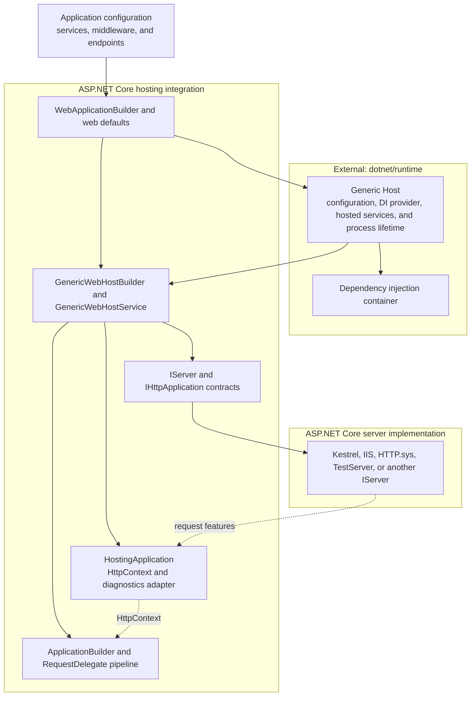

# ASP.NET Core Hosting Integration Architecture

## Purpose and Scope

This document describes how ASP.NET Core composes the .NET Generic Host, dependency injection, an HTTP server, and an application request pipeline into a running web application. It covers the hosting abstractions and runtime adapters under `src/Hosting` together with the modern application composition layer under [`src/DefaultBuilder`](../DefaultBuilder).

ASP.NET Core does not implement the general-purpose Generic Host or dependency injection container. Those implementations live in the [dotnet/runtime repository](https://github.com/dotnet/runtime) under `Microsoft.Extensions.Hosting` and `Microsoft.Extensions.DependencyInjection`. This area owns the web-specific integration: web host settings and environment, startup conventions, default web composition, request-pipeline construction, the server/application boundary, and HTTP request diagnostics.

The intended audience is contributors who need to determine which hosting layer owns a behavior and when a change crosses into another subsystem or repository.

This document is not an API reference, an exhaustive project inventory, a dependency injection guide, or a build and test workflow. The [Hosting README](README.md) provides the area introduction and development entry points. Consumer guidance belongs in the [ASP.NET Core hosting documentation](https://learn.microsoft.com/aspnet/core/fundamentals/host/generic-host) and the [.NET Generic Host documentation](https://learn.microsoft.com/dotnet/core/extensions/generic-host).

## System Overview

Modern ASP.NET Core hosting is an integration layer over the Generic Host. `WebApplicationBuilder` uses the runtime-owned `HostApplicationBuilder` for configuration, logging, dependency injection, hosted services, and process lifetime. ASP.NET Core adds web defaults and registers `GenericWebHostService` as an `IHostedService`. When the Generic Host starts that service, the service constructs the request pipeline and passes a `HostingApplication` adapter to the selected `IServer`.

The server accepts connections and supplies an `IFeatureCollection` for each request. `HostingApplication` creates or reinitializes an `HttpContext`, starts request diagnostics, invokes the application `RequestDelegate`, and performs request cleanup. Network protocols, connection management, and address binding remain server responsibilities.

The older Web Host performs a similar web composition through `IWebHost`, but it has a separate implementation and materially different service-provider and lifetime behavior. It remains a compatibility surface rather than the model for new applications.

### Composition Diagram

Solid arrows represent composition or ownership. Dashed arrows represent runtime request flow. This is a responsibility map, not a complete assembly-dependency graph.

## Repository and Subsystem Ownership

| Subsystem | Responsibility | Ownership |
| --- | --- | --- |
| [`Hosting/Abstractions`](Abstractions) | Web hosting abstractions such as `IWebHostEnvironment`, `IStartup`, `IStartupFilter`, and `IWebHostBuilder`. | This area |
| [`Hosting/Hosting`](Hosting) | Generic Host integration, legacy Web Host implementation, startup discovery, environment adaptation, request diagnostics, and the server/application adapter. | This area |
| [`DefaultBuilder`](../DefaultBuilder) | `WebApplicationBuilder`, `WebApplication`, default/slim/empty compositions, and automatic web-pipeline integration. | This area |
| [`Hosting/Server.Abstractions`](Server.Abstractions) | The `IServer` and `IHttpApplication<TContext>` boundary between hosting and a server. | This area |
| [`Hosting/TestHost`](TestHost) | An in-memory `IServer` for exercising an application pipeline without a network transport. | This area; test server behavior is not production transport behavior |
| [`Hosting/Server.IntegrationTesting`](Server.IntegrationTesting) | Deployment and server-matrix infrastructure used by tests across the repository. | This area; not a runtime layer |
| [`Hosting/WindowsServices`](WindowsServices) | Compatibility integration for running the legacy Web Host as a Windows service. | This area; general host lifetime support is external |
| [Generic Host](https://github.com/dotnet/runtime/tree/main/src/libraries/Microsoft.Extensions.Hosting) | `HostBuilder`, `HostApplicationBuilder`, `IHost`, `HostOptions`, hosted-service execution, process lifetime, and graceful shutdown policy. | dotnet/runtime |
| [.NET dependency injection](https://github.com/dotnet/runtime/tree/main/src/libraries/Microsoft.Extensions.DependencyInjection) | Service registration primitives, provider construction, resolution, validation, scopes, and provider disposal. | dotnet/runtime |
| [Configuration, logging, and options](https://github.com/dotnet/runtime/tree/main/src/libraries) | Provider implementations, configuration traversal and reload, logging providers, and the options pipeline. | Primarily dotnet/runtime; ASP.NET Core selects and consumes them |
| [`src/Servers`](../Servers) | Network transports, HTTP protocol processing, connection management, server-specific options, and address binding. | Servers area |
| [`src/Http`](../Http) | `HttpContext`, HTTP features, request services, and other HTTP abstractions and implementations. | HTTP area |
| [`src/Extensions/Features`](../Extensions/Features) | `IFeatureCollection`, `FeatureCollection`, and feature-reference infrastructure used at the server/application boundary. | Extensions area; not Generic Host or DI infrastructure |
| [`src/Mvc/Mvc.Testing`](../Mvc/Mvc.Testing) | `WebApplicationFactory`, application discovery, and higher-level functional-test composition. | MVC testing area |
| [`src/ProjectTemplates`](../ProjectTemplates) | Generated application shape and template validation. | Project Templates area |

The document follows ownership rather than directory alone. The current public entry point lives in `src/DefaultBuilder`, while the web-host adapter it configures lives in `src/Hosting`; both are required to explain one modern application startup.

## Hosting Models and Compatibility Surfaces

### WebApplicationBuilder and WebApplication

`WebApplicationBuilder` is the primary ASP.NET Core application builder. It implements `IHostApplicationBuilder` while delegating general host construction to a runtime `HostApplicationBuilder`. It exposes the shared configuration and service collections directly and provides restricted `Host` and `WebHost` adapters for compatibility with existing extension methods.

`WebApplication` wraps the built `IHost` and also implements `IApplicationBuilder` and `IEndpointRouteBuilder`. This joins application lifetime, middleware registration, and endpoint registration in one object without moving Generic Host or routing implementation ownership into Hosting.

The builder variants intentionally compose different defaults:

| Builder | Composition |
| --- | --- |
| `CreateBuilder` | Generic Host defaults plus the full ASP.NET Core web defaults, including Kestrel, routing, host filtering, forwarded-header setup, IIS integration, static web assets in Development, and development-time service-provider validation. |
| `CreateSlimBuilder` | Generic Host application configuration and essential logging plus Kestrel Core and routing core. It retains host filtering, forwarded-header setup, cross-origin CSRF protection, the Development exception page, and development-time service-provider validation while omitting IIS integration, static web assets, and full Kestrel. |
| `CreateEmptyBuilder` | The host and web integration scaffolding with a default content root, but no default server, routing, host filtering, forwarded headers, developer exception page, default service-provider validation, or `ASPNETCORE_` environment configuration. |

Slim and empty builders are not required to behave as if omitted services were registered. Shared behavior is tested across variants where the abstraction promises it; differences in default composition are deliberate.

### Generic Host with ConfigureWebHost

`ConfigureWebHost` adapts an existing `IHostBuilder` to an ASP.NET Core web workload. `GenericWebHostBuilder` translates web settings and callbacks into Generic Host configuration and service registrations. `ConfigureWebHostDefaults` additionally selects common web defaults.

The resulting web runtime is `GenericWebHostService`, an `IHostedService` inside the Generic Host. The Generic Host remains responsible for the root provider, hosted-service lifecycle, `HostOptions`, process lifetime, and final disposal. ASP.NET Core is responsible for what the web hosted service builds and for its handoff to `IServer`.

### Legacy Web Host

`WebHostBuilder`, `IWebHost`, the static `WebHost` helpers, and related extensions are retained for compatibility. `WebHostBuilder` is obsolete under ASPDEPR004. `IWebHost` and the static `WebHost` surface are obsolete under ASPDEPR008; `IWebHostBuilder` remains in use as the configuration abstraction exposed by Generic Host integration.

The legacy implementation must not be described as a thin alias for the modern path:

- It creates a hosting service provider and a separate application service provider.
- It owns a legacy hosted-service executor and application-lifetime implementation.
- It supports `IStartup` and a `ConfigureServices` method that returns `IServiceProvider`.
- It applies `WebHostOptions.ShutdownTimeout` directly during shutdown.

Generic Host integration instead composes one host-owned provider, rejects those terminal Startup provider patterns, and delegates general hosted-service and lifetime policy to dotnet/runtime.

## Builder, Configuration, and Provider Phases

### Builder Creation and Host Identity

Application name, environment name, content root, and web root influence configuration loading, file providers, static web assets, diagnostics, and Startup discovery. They are therefore initialized before ordinary application composition.

`WebApplicationOptions` supplies these values at construction time. The `WebApplicationBuilder.Host` and `.WebHost` adapters run configuration and service callbacks immediately so imperative code can observe their effects, but reject later changes to identity values whose consequences have already been applied. The adapters are configuration views over one build; they are not independently buildable hosts.

The runtime Generic Host owns its default configuration sources. ASP.NET Core injects `ASPNETCORE_`-prefixed environment variables early as baseline web-host configuration, allowing later Generic Host sources such as `DOTNET_`-prefixed variables, non-prefixed variables, and command-line arguments to override them. `ConfigurationManager` remains a live, ordered collection of sources, so later sources override earlier values. Exact defaults differ by builder:

- The default builder uses the runtime Generic Host defaults and then applies full web defaults.
- The slim builder recreates the required application configuration and essential logging around an empty runtime builder before applying slim web defaults.
- The empty builder intentionally omits the normal `ASPNETCORE_` environment source and most framework defaults.

The effective environment is shared with web hosting through `IWebHostEnvironment`. Content-root and web-root paths are normalized before consumers use their file providers. A missing default `wwwroot` produces a `NullFileProvider`; a nonexistent configured content root is an error.

### Service Registration and Provider Construction

ASP.NET Core contributes web services to the host's `IServiceCollection`; it does not implement service resolution. Replaceable framework defaults generally use `TryAdd`, while ordered extension points such as startup filters use ordinary enumerable registrations because multiplicity and order are part of their contract.

`WebApplicationBuilder.Build` restores the `GenericWebHostService` descriptor after user service registrations, applies any selected `IServiceProviderFactory`, and asks the runtime builder to build the host. The runtime then creates the root provider and owns its disposal. Building the host does not yet build the HTTP request delegate or start a server.

Custom container integration crosses this boundary through `IServiceProviderFactory<TContainerBuilder>` and `ConfigureContainer`. ASP.NET Core preserves those callbacks and supplies its registrations; container creation, validation, resolution, scope rules, and disposal graphs remain the container implementation's responsibility.

Applications and framework extensions should compose through the supplied service collection and factories rather than create an independent provider during registration. An early provider is disconnected from the final host's registrations, validation, scopes, and disposal lifetime.

## Startup and Request-Pipeline Construction

### Modern Minimal Hosting

Application code adds middleware and endpoints directly to `WebApplication`. The builder records a callback that is invoked when `GenericWebHostService.StartAsync` constructs the server-facing pipeline.

That callback composes the application's pipeline with framework-owned fallback behavior:

- A developer exception page is added for the default and slim builders in Development.
- When endpoints exist, routing is added unless the application has already established routing for its route builder. Endpoint execution is appended to the destination pipeline even when the application explicitly called `UseEndpoints`; duplicate data-source registration is avoided.
- Authentication, authorization, and cross-site request-forgery protection are conditionally added when their services exist and the application has not already added the corresponding middleware.
- Post-routing middleware is kept after endpoint matching, including when a branch reroutes a request.

These defaults are integration policy. The middleware and routing implementations remain owned by their respective areas, and explicit application ordering must continue to take precedence.

### Startup Classes and Filters

Generic Host web integration supports `UseStartup` and conventional `Startup` methods for compatibility. For type-based activation, `GenericWebHostBuilder` constructs Startup using a restricted provider that exposes configuration and host-environment services. `StartupLoader` then selects environment-specific or default `ConfigureServices`, `ConfigureContainer`, and `Configure` methods and validates their signatures. Parameters to `Configure` are resolved from a separate application-service scope that is disposed after the method returns. The legacy Web Host instead uses `StartupLoader.LoadMethods` with its hosting service provider.

Reflection-based Startup is a compatibility boundary. Its public methods are annotated for trimming, and some container patterns require dynamic code. In particular, value-type custom container builders are rejected when dynamic code is unavailable. These annotations and checks preserve specific supported paths; they are not a blanket guarantee that every Startup pattern or application dependency is Native AOT compatible.

`IStartupFilter` wraps the final application configuration delegate. Filters are applied in reverse registration order so each filter can add behavior before or after the next delegate. `IHostingStartup` is a separate assembly-discovery extension point that can contribute configuration and services before direct web-host configuration. Both mechanisms can affect startup ordering and must remain distinguishable from application middleware execution.

The modern `WebApplicationBuilder.WebHost` adapter deliberately rejects `UseStartup` and `Configure`; minimal-hosting applications configure the returned `WebApplication` directly.

## Server, Request, and Lifetime Boundaries

### Starting the Web Workload

When the Generic Host starts `GenericWebHostService`, the service:

1. Applies configured URLs or HTTP/HTTPS port values to a writable `IServerAddressesFeature` when the server has not already supplied addresses. The effective `urls` setting takes precedence over `http_ports` and `https_ports`.
2. Creates an `IApplicationBuilder` using the selected server's features.
3. Applies startup filters and application configuration.
4. Builds the final `RequestDelegate`.
5. Creates `HostingApplication`, which adapts the delegate to `IHttpApplication<TContext>`.
6. Calls `IServer.StartAsync`.

`IServer` is the ownership boundary. Hosting supplies the application adapter and startup inputs; the selected server owns listening, protocol processing, connection state, address binding, and graceful transport shutdown. Kestrel is the default selected by full and slim builders, not the only supported implementation.

### Processing a Request

For each server-supplied feature collection, `HostingApplication` creates or reinitializes an `HttpContext`, begins diagnostics, invokes the request delegate, records the outcome, and clears reusable context state.

`DefaultHttpContextFactory` supplies the `IServiceScopeFactory` to `DefaultHttpContext` and coordinates `IHttpContextAccessor` state. The HTTP-owned `RequestServicesFeature` lazily creates the request scope when `HttpContext.RequestServices` is first used and registers that scope for asynchronous response cleanup. Hosting context cleanup and request-service disposal cooperate, but they are separate responsibilities.

`TestServer` implements the same `IServer` boundary and sends requests directly to the application adapter without opening network sockets. It establishes middleware and `HttpContext` behavior, not Kestrel transport, TLS, protocol, or real-network behavior.

### Lifetime, Shutdown, and Disposal

`WebApplication.StartAsync`, `StopAsync`, `Run`, and `RunAsync` delegate to the underlying `IHost`. In the modern path, dotnet/runtime determines hosted-service ordering, startup validation, background-service behavior, application-lifetime notifications, shutdown timeout policy, and provider disposal. `GenericWebHostService.StopAsync` asks the selected server to stop and records Hosting events.

The web hosted service is deliberately ordered within the service collection. `WebApplicationBuilder` temporarily removes its descriptor while defaults and application services are composed, then appends it during `Build`; custom container callbacks can still affect the final ordering. Runtime options can also allow concurrent hosted-service startup or shutdown, so registration order is not a universal timing guarantee.

Stopping and disposal are different boundaries. Stopping ends hosted work and server acceptance according to the host policy. Disposing the host releases the root provider and provider-owned services, including asynchronous disposables. The legacy Web Host has its own stop and two-provider disposal path and must be validated separately.

## Diagnostics, Options, and Extensibility

`HostingApplicationDiagnostics`, `HostingMetrics`, and `HostingEventSource` form the HTTP hosting observability layer. They coordinate request logs, `DiagnosticListener` events, distributed tracing activities, EventSource counters, and HTTP server metrics around request execution. They consume `HttpContext` and endpoint metadata but do not own server protocol telemetry or feature-specific application diagnostics.

The default builders use options to configure integrations such as host filtering, forwarded headers, Kestrel, and Hosting behavior. ASP.NET Core owns the registration and interpretation of its option types. The general options pipeline, named options semantics, validation framework, and change-token machinery remain external framework infrastructure.

Hosting startup assemblies, startup filters, custom service-provider factories, custom `IHttpContextFactory` implementations, and alternate `IServer` implementations are distinct extension points:

- Hosting startup assemblies enrich builder configuration before direct application configuration.
- Startup filters wrap request-pipeline construction.
- Service-provider factories replace container construction while retaining the host composition.
- `IHttpContextFactory` controls creation and disposal hooks for request contexts.
- `IServer` replaces the HTTP server while preserving the hosting/application contract.

An extension should use the narrowest applicable boundary rather than mutate already built providers, replace application services after build, or depend on server-specific features without an explicit capability check.

## Design Principles and Invariants

- **Keep ASP.NET Core Hosting an adapter over the Generic Host.** Web-specific composition belongs here; general host execution, background-service policy, and container mechanics remain in dotnet/runtime.
- **Freeze identity before dependent defaults run.** Application name, environment, content root, and web root must be stable before configuration sources, file providers, static assets, and Startup discovery depend on them.
- **Separate registration, build, start, stop, and disposal.** Each phase has different available state and ownership. Do not resolve application services or construct the request pipeline earlier than its owning phase.
- **Preserve intentional builder differences.** Default, slim, empty, Generic Host, legacy Web Host, and TestHost paths share contracts only where their composition supports them.
- **Use one host-owned provider in the modern path.** Add services before `Build`, honor the selected provider factory, and let the Generic Host own provider disposal. Preserve the legacy two-provider behavior only for compatibility.
- **Keep application ordering explicit.** Startup filters, application middleware, implicit middleware, endpoint execution, hosted services, and server startup each have separate ordering rules.
- **Program to server and HTTP abstractions.** Hosting should exchange features and `IHttpApplication<TContext>` with a server rather than absorb transport or protocol policy.
- **Make defaults replaceable or intentionally ordered.** Use idempotent registrations for replaceable framework services and direct registrations only when multiplicity or ordering is part of the integration.
- **Treat reflection as a capability boundary.** Startup discovery and container adaptation need precise trimming annotations, dynamic-code checks, and published validation for the paths they support.
- **Keep diagnostics paired with request lifetime.** Start and stop activities, logs, metrics, scopes, and pooled context state at the corresponding request boundary, including exceptions and cancellation.

## Verification Boundaries

| Validation area | Location | What it establishes |
| --- | --- | --- |
| Hosting unit tests | [`Hosting/Hosting/test`](Hosting/test) | Builder settings, Startup discovery and errors, environment and file-provider behavior, hosted-service/server ordering, request diagnostics, metrics, and legacy Web Host behavior |
| DefaultBuilder unit tests | [`DefaultBuilder/test/Microsoft.AspNetCore.Tests`](../DefaultBuilder/test/Microsoft.AspNetCore.Tests) | Default/slim/empty composition, configuration behavior, provider factories, implicit middleware ordering, endpoints, and `WebApplication` lifecycle |
| Hosting functional tests | [`Hosting/test/FunctionalTests`](test/FunctionalTests) | Process-level startup, linked applications, shutdown signals, lifetime notifications, and exit behavior on supported platforms |
| DefaultBuilder functional tests | [`DefaultBuilder/test/Microsoft.AspNetCore.FunctionalTests`](../DefaultBuilder/test/Microsoft.AspNetCore.FunctionalTests) | Default host composition through deployed applications and selected real server integrations |
| TestHost tests | [`Hosting/TestHost/test`](TestHost/test) | In-memory `IServer` behavior, request and response adaptation, WebSockets, cancellation, and execution-context options |
| Trimming and Native AOT tests | [`DefaultBuilder/test`](../DefaultBuilder/test) | Narrow published capabilities such as slim-builder dependency closure and supported Startup/container patterns |
| Server integration infrastructure | [`Hosting/Server.IntegrationTesting`](Server.IntegrationTesting) | Deployment orchestration across server, runtime, architecture, and hosting-model matrices; not product runtime behavior |
| Template tests | [`ProjectTemplates/test`](../ProjectTemplates/test) | Generated applications use supported builder shapes and can restore, build, publish, and run in the scenarios covered by the template suite |
| MVC testing infrastructure | [`Mvc/Mvc.Testing`](../Mvc/Mvc.Testing) | Application discovery and test-host composition through `WebApplicationFactory`; this is a consumer of Hosting diagnostics and builder hooks |

A lower-level test establishes only the boundary it exercises. TestHost coverage does not establish real-server transport behavior, isolated Startup-loader tests do not establish complete application startup, and a trimming warning suppression does not establish published Native AOT viability.

## Documentation Map

- [Hosting README](README.md) - area contents, development setup, and product documentation links.
- [Hosting samples](samples/README.md) - focused development samples, not production templates.
- [TestHost package documentation](TestHost/src/PACKAGE.md) - in-memory middleware testing.
- [ASP.NET Core Generic Host documentation](https://learn.microsoft.com/aspnet/core/fundamentals/host/generic-host) - consumer guidance for Generic Host web applications.
- [ASP.NET Core Web Host documentation](https://learn.microsoft.com/aspnet/core/fundamentals/host/web-host) - compatibility guidance for the legacy Web Host.
- [.NET Generic Host documentation](https://learn.microsoft.com/dotnet/core/extensions/generic-host) - externally owned host defaults and lifetime.
- [.NET dependency injection documentation](https://learn.microsoft.com/dotnet/core/extensions/dependency-injection/) - externally owned container concepts and lifetimes.
- [ASP.NET Core servers documentation](https://learn.microsoft.com/aspnet/core/fundamentals/servers/) - server selection and production transport behavior.
- [ASP.NET Core startup documentation](https://learn.microsoft.com/aspnet/core/fundamentals/startup) - Startup classes and application configuration.

## Finding the Right Owner

| If the change concerns | Start with | Also inspect |
| --- | --- | --- |
| `WebApplicationBuilder`, `WebApplication`, default/slim/empty behavior, or implicit web middleware | [`src/DefaultBuilder`](../DefaultBuilder) | Hosting integration and the middleware or routing area being composed |
| `ConfigureWebHost`, web-host settings, Startup discovery, startup filters, or Hosting diagnostics | [`src/Hosting/Hosting`](Hosting) | dotnet/runtime Generic Host behavior when lifecycle or provider semantics are involved |
| `IWebHostEnvironment`, `IWebHostBuilder`, `IStartup`, or `IStartupFilter` contracts | [`src/Hosting/Abstractions`](Abstractions) | API compatibility and all affected hosting models |
| `IServer`, `IHttpApplication<TContext>`, or server feature handoff | [`src/Hosting/Server.Abstractions`](Server.Abstractions) | The selected implementation under [`src/Servers`](../Servers) |
| Kestrel protocols, listeners, endpoints, connections, TLS, or address binding | [`src/Servers`](../Servers) | Hosting only where server selection or startup handoff changes |
| `HttpContext`, request services, HTTP features, or response completion | [`src/Http`](../Http) | Hosting only where context creation or server adaptation changes |
| `IFeatureCollection`, `FeatureCollection`, or feature-reference infrastructure | [`src/Extensions/Features`](../Extensions/Features) | Hosting, HTTP, or server consumers of those abstractions |
| Generic Host lifecycle, `HostOptions`, `BackgroundService`, or `IHostLifetime` | [dotnet/runtime Hosting](https://github.com/dotnet/runtime/tree/main/src/libraries/Microsoft.Extensions.Hosting) | ASP.NET Core only if the web hosted-service adapter is affected |
| Service resolution, scope validation, provider engines, or disposal graphs | [dotnet/runtime dependency injection](https://github.com/dotnet/runtime/tree/main/src/libraries/Microsoft.Extensions.DependencyInjection) | ASP.NET Core registrations and provider-factory integration |
| In-memory middleware tests | [`src/Hosting/TestHost`](TestHost) | A real server test when transport behavior matters |
| `WebApplicationFactory` application discovery or functional-test customization | [`src/Mvc/Mvc.Testing`](../Mvc/Mvc.Testing) | Hosting diagnostic hooks and TestHost or Kestrel according to the selected mode |

## Terminology

- **Generic Host** - The runtime-owned application host that manages configuration, logging, dependency injection, hosted services, process lifetime, shutdown, and provider disposal.
- **Web host integration** - The ASP.NET Core layer that adds a request pipeline and an HTTP server to a Generic Host.
- **WebApplicationBuilder** - The modern ASP.NET Core builder that composes runtime `HostApplicationBuilder` with web defaults and exposes application services and configuration directly.
- **WebApplication** - The built modern application surface combining `IHost`, middleware construction, and endpoint registration.
- **Web Host** - The legacy `IWebHost`-based implementation retained for compatibility.
- **Host configuration** - Values needed to establish host identity and environment before the remainder of application composition.
- **Application configuration** - The configuration consumed by application services and features after host identity is established.
- **Web-host setting** - An ASP.NET Core setting such as web root, server URLs, hosting startup assemblies, or startup error behavior.
- **Startup** - The compatibility convention that discovers and invokes service, container, and application configuration methods.
- **Startup filter** - An ordered wrapper around application request-pipeline configuration.
- **Hosting startup assembly** - An assembly-discovered extension that contributes web-host configuration before direct application configuration.
- **Request pipeline** - The composed `RequestDelegate` chain that processes an `HttpContext`.
- **HostingApplication** - The adapter between `IServer` request features and the ASP.NET Core request pipeline.
- **Server** - An `IServer` implementation that owns listening, HTTP protocol handling, connections, and transport shutdown.
- **TestServer** - An in-memory `IServer` implementation that exercises the application pipeline without a production network transport.
