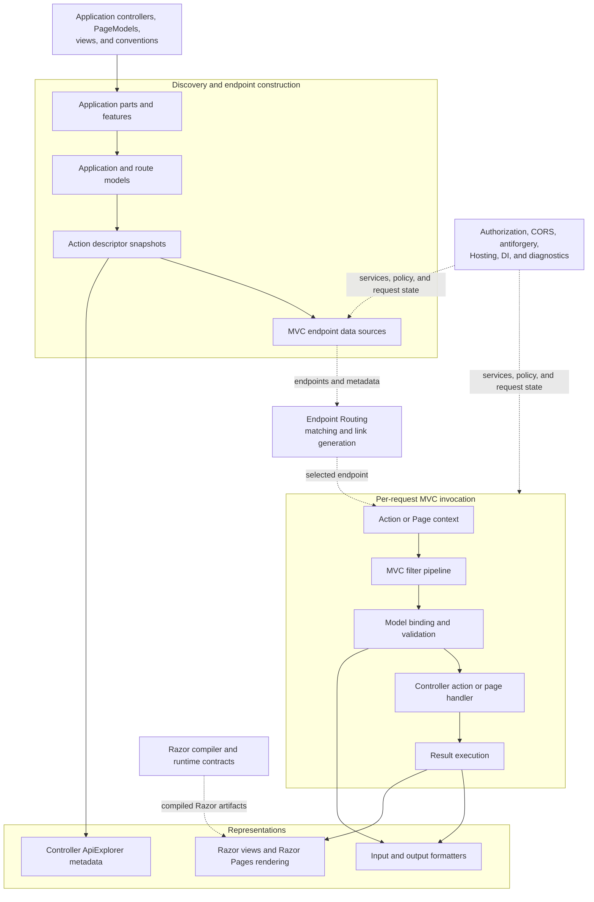
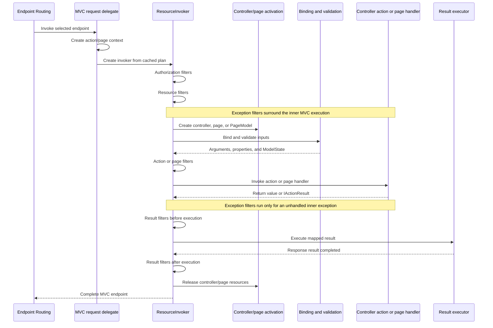

# ASP.NET Core MVC Architecture

## Purpose and Scope

This document describes how the subsystems under `src/Mvc` compose to discover application behavior, publish MVC endpoints, invoke controllers and Razor Pages, bind and validate request data, and execute results. It provides a system-wide view of MVC-owned responsibilities, state and lifetime boundaries, extension points, and integration with adjacent ASP.NET Core subsystems.

The intended audience is contributors who need to understand how a change in one part of MVC affects the rest of the system. The document covers controller APIs, controllers with views, Razor Pages, formatters, MVC-owned Tag Helpers, API behavior, and controller ApiExplorer.

MVC consumes infrastructure owned elsewhere. Endpoint Routing performs generic route matching and link generation, the Razor compiler and SDK produce compiled Razor artifacts, Antiforgery owns token generation and validation, Hosting owns application startup and request services, and Components owns Blazor rendering. This document describes those systems only where they meet MVC.

This document is not an API reference, an exhaustive inventory of projects or source files, a consumer tutorial, or a guide to building and testing the repository. Consumer documentation belongs on [Microsoft Learn](https://learn.microsoft.com/aspnet/core/mvc/), area contribution and test guidance belongs in [AGENTS.md](AGENTS.md), and local build entry points remain documented in the [MVC README](README.md).

## System Overview

MVC turns application types and compiled Razor artifacts into endpoint metadata and request delegates. At application setup, service registration selects a composition:

- `AddControllers` supplies controller discovery, model binding, validation, filters, API behavior, formatters, and ApiExplorer without view or Razor Pages services.
- `AddControllersWithViews` adds view features, the Razor view engine, and MVC Tag Helpers to the controller composition.
- `AddRazorPages` adds Razor Pages discovery, page application models, page invocation, views, and MVC Tag Helpers.
- `AddMvc` composes controllers with views and Razor Pages.

Discovery produces `ActionDescriptor` snapshots for controller actions and Razor Pages. MVC endpoint data sources transform those descriptors into Endpoint Routing endpoints, including route patterns, required route values, filters, action constraints, and other metadata. Endpoint Routing selects one of those endpoints before MVC begins request invocation.

The selected endpoint enters an MVC request delegate. MVC creates an action or page context and resolves cached execution plans. Authorization and resource filters run before controller or page activation and can short-circuit the request. If execution continues, MVC activates the controller or page, binds and validates inputs, runs action or page filters, invokes the action or page handler, maps the return value to an `IActionResult`, and executes that result inside the result-filter stage. A result may write directly to the response, select an output formatter, render a Razor view, redirect through routing, or delegate another specialized response behavior.

### Composition Diagram

Solid arrows show primary dependency or control direction. Dashed arrows show integration with an adjacent subsystem whose implementation is not owned by MVC.

The diagram is an architectural composition rather than a complete assembly-reference graph. Individual packages expose public extension points and may reference additional framework libraries.

## Architectural Layers and Ownership

| Layer | MVC responsibility | Important boundary |
| --- | --- | --- |
| Service composition | Register the selected controller, view, page, formatter, metadata, and invocation services | Hosting creates the application service provider and request scope |
| Discovery and application models | Discover controllers, actions, pages, compiled views, and MVC Tag Helpers; apply ordered providers and conventions | Razor compilation and generic reflection infrastructure are external |
| Descriptors and endpoints | Produce versioned action descriptors and translate them into Endpoint Routing endpoints and metadata | `src/Http/Routing` owns generic route parsing, matching, policies, and `LinkGenerator` |
| Invocation and filters | Create MVC contexts, activate application types, run MVC filters, invoke actions or handlers, and release resources | Middleware and endpoint filters have distinct ordering and ownership |
| Binding and validation | Compose metadata, value providers, binders, input formatters, validation providers, and `ModelState` | Request body and form infrastructure comes from HTTP abstractions |
| Results and representations | Map return values, execute results, negotiate output formatters, render views, and maintain TempData/ViewData state | Serializer implementations, Data Protection, session, and Razor runtime contracts are dependencies |
| API behavior and exploration | Apply controller API conventions and derive `ApiDescription` data from controller action descriptors | OpenAPI document and schema generation belongs to `src/OpenApi` |
| Tooling and validation | Supply MVC analyzers, test infrastructure, samples, and benchmarks | These support the runtime architecture but are not request-processing layers |

MVC-owned Razor integration includes view discovery and rendering, Razor Pages routing and invocation, MVC Tag Helpers, view components, HTML helpers, `ViewData`, and `TempData`. It does not include the Razor language parser, general code generation, design-time tooling, or SDK build pipeline. Those produce the compiled artifacts that MVC consumes.

## Application Model and Endpoint Construction

### Service Compositions

[`MvcServiceCollectionExtensions`](Mvc/src/MvcServiceCollectionExtensions.cs) builds the public service compositions from `AddMvcCore` and feature-specific extensions. These compositions are additive rather than separate frameworks: controllers with views retain the controller pipeline, and Razor Pages reuse MVC's descriptor, filter, model-binding, result, and view infrastructure while adding page-specific discovery and invocation.

The selected registration method is an architectural boundary. Code in a controller-only application cannot assume view or page services are present. Optional packages such as [Newtonsoft.Json integration](Mvc.NewtonsoftJson/src/PACKAGE.md) and [Razor runtime compilation](Mvc.Razor.RuntimeCompilation/src/PACKAGE.md) replace or extend selected services rather than defining another MVC pipeline.

### Controller Discovery and Application Models

[`ApplicationPartManager`](Mvc.Core/src/ApplicationParts/ApplicationPartManager.cs) owns the ordered collection of application parts and feature providers. Controller feature providers populate controller types from those parts. The same application-part mechanism discovers compiled views and MVC Tag Helpers for view-enabled compositions.

Controller types flow through ordered `IApplicationModelProvider` instances into an `ApplicationModel`. Providers establish the default controller, action, parameter, selector, filter, route, and metadata model. Conventions then transform that model before [`ControllerActionDescriptorProvider`](Mvc.Core/src/ApplicationModels/ControllerActionDescriptorProvider.cs) flattens it into `ControllerActionDescriptor` instances.

Application models are the main startup-time extensibility layer for controller behavior. They let features such as API conventions, authorization, antiforgery integration, CORS, routing, and user conventions agree on one action description before endpoint construction and request execution.

### Razor Pages Discovery

Razor Pages use a parallel model pipeline. `IPageRouteModelProvider` implementations produce route models from compiled page descriptors, and page route conventions transform their selectors and route values. `IPageApplicationModelProvider` implementations then describe handlers, bound properties, filters, authorization, TempData, and other page behavior.

[`CompiledPageActionDescriptorProvider`](Mvc.RazorPages/src/Infrastructure/CompiledPageActionDescriptorProvider.cs) joins page route models with build-time compiled view descriptors and produces `CompiledPageActionDescriptor` instances. [`PageRouteModelFactory`](Mvc.RazorPages/src/ApplicationModels/PageRouteModelFactory.cs) defines MVC-owned conventions such as folder-derived routes, area routes, explicit `@page` templates, and the special outbound-link behavior for `Index.cshtml`.

The Razor compiler determines the generated page type and compiled-item metadata. MVC determines how that artifact participates as a page, which handlers and filters it exposes, and which endpoint route represents it.

### Descriptor Snapshots and Change Propagation

[`DefaultActionDescriptorCollectionProvider`](Mvc.Core/src/Infrastructure/DefaultActionDescriptorCollectionProvider.cs) executes ordered descriptor providers and publishes a versioned, read-only `ActionDescriptorCollection`. The provider serializes updates so consumers do not observe a new change token paired with an old collection.

Controller and page endpoint data sources subscribe to descriptor changes through [`ActionEndpointDataSourceBase`](Mvc.Core/src/Routing/ActionEndpointDataSourceBase.cs). They rebuild endpoint lists under a write lock, publish a new list and change token, and then notify consumers. Descriptor and endpoint collections are application-wide snapshots; request-specific state does not belong in them.

Hot Reload connects to this mechanism through [`HotReloadService`](Mvc/src/HotReloadService.cs). Metadata updates clear MVC-owned metadata, activation, and Razor caches and can signal descriptor regeneration. Other cache invalidation mechanisms are subsystem-specific and should not be inferred from this one path.

### Endpoint Routing Integration

[`ControllerActionEndpointDataSource`](Mvc.Core/src/Routing/ControllerActionEndpointDataSource.cs) and [`PageActionEndpointDataSource`](Mvc.RazorPages/src/Infrastructure/PageActionEndpointDataSource.cs) select the relevant descriptors and ask [`ActionEndpointFactory`](Mvc.Core/src/Routing/ActionEndpointFactory.cs) to create endpoints.

MVC owns:

- applying controller and page route conventions;
- substituting action route values into conventional patterns;
- creating attribute-routed, conventionally routed, dynamic, and link-generation-only endpoints;
- projecting action metadata, ordered MVC filters, supported HTTP methods, content-type constraints, route names, and descriptor identity onto endpoints;
- constructing the request delegate that enters MVC; and
- preserving MVC compatibility behavior for conventional routes and action constraints.

Endpoint Routing owns parsing the final `RoutePattern`, matching requests, applying generic matcher policies, selecting endpoints, and generating links. MVC URL helpers and Tag Helpers supply MVC route values and addresses to that routing system; they do not implement the generic matcher or link generator.

Endpoint conventions can also add endpoint filters to controller endpoints. MVC composes those filters around the controller action method after MVC has created the controller and bound action arguments. Endpoint filters do not replace the MVC filter pipeline.

## Request and Action Invocation

After Endpoint Routing selects an MVC endpoint, the endpoint request delegate creates a `ControllerContext` or `PageContext` from the `HttpContext`, selected descriptor, route values, and configured value-provider factories. The delegate obtains cached execution data and creates the appropriate invoker. Setting `MvcOptions.EnableActionInvokers` opts into the more general invoker-factory path so custom `IActionInvokerProvider` implementations can participate.

The exact path can short-circuit. Authorization or resource filters can supply a result before model binding, action execution, or page-handler execution. Action and page filters can skip the inner operation. Exception filters observe exceptions from the MVC action or page portion of the pipeline, while result filters wrap result execution according to their contracts. Always-run result filters cover the MVC short-circuit paths that explicitly require them.

### MVC Filters

[`ResourceInvoker`](Mvc.Core/src/Infrastructure/ResourceInvoker.cs) owns the shared state machine for authorization, resource, exception, and result filters. [`ControllerActionInvoker`](Mvc.Core/src/Infrastructure/ControllerActionInvoker.cs) supplies controller activation, argument binding, action filters, action-method execution, and result mapping. [`PageActionInvoker`](Mvc.RazorPages/src/Infrastructure/PageActionInvoker.cs) supplies page or `PageModel` activation, handler selection, property and handler-argument binding, page filters, handler execution, and the implicit `PageResult`.

Filter descriptors are sorted first by `IOrderedFilter.Order` and then, for equal order values, by registration scope: global, controller, and action. The nested execution model means "before" callbacks run in ascending order while corresponding "after" callbacks unwind in reverse. Exception filters run only after an exception enters their stage.

Filter factories may cache only filters they report as reusable. The descriptor and invoker caches retain factories, compiled delegates, and safely reusable filter instances; request-specific filter instances remain request-owned.

### Activation and Return-Value Mapping

The default controller activator creates a controller from `HttpContext.RequestServices`, so constructor dependencies come from the current request service provider. MVC caches activation delegates, not controller instances. Controllers, page models, and pages are released after invocation, including asynchronous disposal where supported.

Compiled action executors handle synchronous and asynchronous controller signatures without making the rest of the pipeline depend on a single return shape. `IActionResult` values execute directly; other supported values are converted through `IActionResultTypeMapper`. Controller endpoint filters, when configured, wrap this action-method executor and return to the same result-mapping path.

## Model Binding and Validation

MVC binding combines several ordered provider systems:

1. Model metadata providers describe the target type, parameter, property, attributes, binding information, and validation metadata.
2. Value-provider factories expose values from forms, routes, query strings, and other configured key-value sources.
3. Model-binder providers select a binder for the metadata and binding source.
4. Input formatters deserialize request bodies when the body binder is selected.
5. Object validators traverse the resulting object graph and record validation outcomes.

[`ModelBinderFactory`](Mvc.Core/src/ModelBinding/ModelBinderFactory.cs) walks binder providers in configured order and caches binder graphs when a stable cache token is available. Its per-operation visited set breaks recursive binder-construction cycles without publishing incomplete binders into the application-wide cache.

[`ParameterBinder`](Mvc.Core/src/ModelBinding/ParameterBinder.cs) creates the binding context, selects the model-name prefix, invokes the binder, enforces bind-required behavior, and invokes object validation. Both conversion failures and validation failures are represented in `ModelState`, preserving field paths and messages for filters, application code, helpers, and API responses.

[`ValidationVisitor`](Mvc.Core/src/ModelBinding/Validation/ValidationVisitor.cs) traverses model graphs through metadata and validation strategies. It tracks visited objects, observes configured depth limits, and combines validator results with existing `ModelState` rather than treating validation as an independent pass.

Form fields and files use form value providers and model binders. They are not input formatter payloads. Request bodies use the body binder and configured input formatters. Keeping those paths distinct preserves their different buffering, size-limit, error, and lifetime behavior.

## API Behavior and API Description

`[ApiController]` is interpreted during application-model construction, not by separate middleware. [`ApiBehaviorApplicationModelProvider`](Mvc.Core/src/ApplicationModels/ApiBehaviorApplicationModelProvider.cs) requires attribute routing and applies conventions for visibility, inferred binding sources, client-error mapping, form-file content types, API conventions, and automatic invalid-`ModelState` handling.

The automatic invalid-model-state response is implemented as an MVC action filter. Its configurable response factory normally produces `ValidationProblemDetails` through MVC's `ProblemDetailsFactory`. Other client-error results can also be mapped to `ProblemDetails`. The HTTP `IProblemDetailsService` remains an adjacent cross-framework service and can participate in result execution.

[`DefaultApiDescriptionProvider`](Mvc.ApiExplorer/src/DefaultApiDescriptionProvider.cs) derives controller `ApiDescription` entries from controller action descriptors, route templates, binding metadata, formatters, endpoint metadata, and declared response information. It describes the controller surface for downstream consumers. OpenAPI owns document and schema generation from that description and from other endpoint types.

## Result Execution, Formatters, and Views

### Action Results and Formatters

MVC resolves typed `IActionResultExecutor<T>` services for concrete result types. File, content, redirect, status-code, JSON, object, view, partial-view, page, and view-component results each own their response semantics.

[`ObjectResultExecutor`](Mvc.Core/src/Infrastructure/ObjectResultExecutor.cs) determines the runtime or declared object type and delegates content negotiation to the configured `OutputFormatterSelector`. [`DefaultOutputFormatterSelector`](Mvc.Core/src/Infrastructure/DefaultOutputFormatterSelector.cs) considers explicit result content types, the request `Accept` header, formatter order, browser wildcard behavior, and the configured 406 policy. The selected formatter owns serialization and response-body writing.

Input and output formatter collections are ordered extension points. System.Text.Json is registered by the default MVC core setup; XML and Newtonsoft.Json integrations are optional packages. Formatter selection is part of MVC, while the serializer implementation and its object model remain dependencies.

### Razor Views and Razor Pages Rendering

[`RazorViewEngine`](Mvc.Razor/src/RazorViewEngine.cs) resolves application-relative paths or expands named view locations using controller, area, page, and view-expander values. It caches both successful and unsuccessful lookups with any change tokens supplied by compiled view descriptors.

[`DefaultViewCompiler`](Mvc.Razor/src/Compilation/DefaultViewCompiler.cs), the default `IViewCompiler` implementation, does not parse `.cshtml` source. It discovers build-time compiled view descriptors from application parts and resolves them by normalized path. The optional runtime-compilation package can compile changed files with Razor and Roslyn services, but that package is obsolete and is not the default production architecture.

[`RazorView`](Mvc.Razor/src/RazorView.cs) activates compiled pages, executes `_ViewStart` pages, renders the main page, resolves nested layouts, validates sections, and coordinates pooled view buffers. `ViewContext`, `ViewData`, `TempData`, HTML helpers, view components, and MVC Tag Helpers participate in this request-owned rendering context.

Razor Pages use the same rendering primitives after page-handler invocation. Their page and `PageModel` activation, bound properties, handler selection, page filters, and implicit `PageResult` are owned by the Razor Pages invoker rather than by the Razor compiler.

## Dependency Injection, State, and Lifetime Boundaries

MVC separates application-wide plans from request-owned state:

- Application parts, application-model factories, descriptor collections, model metadata, binder factories, invoker caches, formatter selectors, result executors, and many activation factories are registered as singletons.
- MVC endpoint data sources are created and retained by endpoint-route builders for the application rather than registered as DI singletons.
- Provider and activator registrations can be transient even when the resulting delegates or reusable objects are retained by a singleton cache.
- `ActionContext`, `ControllerContext`, `PageContext`, `ModelState`, value providers, controller/page instances, filter contexts, `ViewContext`, and response writers are request-owned.
- Rendering resolves scoped resources such as `IViewBufferScope` from `HttpContext.RequestServices` because singleton view-engine infrastructure must not capture request services.
- TempData has a later-request lifetime by design. The cookie provider protects its serialized payload through Data Protection, while the session provider stores it in `ISession`.

Singleton caches must contain immutable metadata, thread-safe structures, factories, or explicitly reusable instances. A cache's invalidation contract is specific to the subsystem: descriptor change tokens rebuild endpoints, Razor view descriptors can provide expiration tokens, Hot Reload clears selected caches, and runtime compilation tracks file changes.

## Cross-Cutting Boundaries

### Routing and Hosting

MVC publishes endpoints into the application's route builder. [Endpoint Routing](../Http/Routing) matches them and establishes route values before MVC invocation. [Hosting](../Hosting/README.md) owns startup, the middleware pipeline, application services, request scopes, and server selection. MVC must not assume it is the first or only endpoint type in an application.

### Authorization, CORS, and Antiforgery

Authorization and CORS policies are normally enforced by middleware using metadata on the selected endpoint. MVC application models and endpoint construction project the metadata those systems consume, while MVC filters preserve compatibility and provide MVC-specific execution points.

[Antiforgery](../Antiforgery) owns token generation, protection, and validation. MVC owns integration through application-model conventions, filters, form generation, and endpoint metadata. MVC has two distinct filter paths: `ValidateAntiforgeryTokenAuthorizationFilter`, used by the traditional validation attributes, calls `IAntiforgery.ValidateRequestAsync` directly; `AntiforgeryMiddlewareAuthorizationFilter`, added for endpoint antiforgery metadata, consumes the validation verdict recorded by antiforgery or CSRF-protection middleware. The application-model provider rejects a validate-token filter combined with endpoint antiforgery metadata when both appear on the same controller or action model.

HTML helpers and Tag Helpers must preserve the distinction between trusted `IHtmlContent` and text that still requires encoding. The shared HTML content contracts are outside `src/Mvc`, while MVC owns the helpers and rendering behavior that consume them.

### Diagnostics and Observability

MVC emits structured logs and `DiagnosticListener` events around action execution, filters, model binding, action methods, results, view lookup, page handlers, and Razor page execution. Diagnostics observe the existing pipeline; they must not change ordering, exception propagation, disposal, or response behavior.

Performance-sensitive paths use precomputed descriptors, compiled delegates, cached binder graphs, pooled readers, writers, arrays, and view buffers. A proposed cache or allocation change must be evaluated at the layer that owns the work and against its invalidation and concurrency rules.

### Razor Compiler, Tooling, Trimming, and Native AOT

The [Razor area](../Razor/README.md) provides runtime contracts used by compiled Razor artifacts, while the Razor compiler and SDK toolchain own parsing, code generation, source mapping, design-time behavior, and build outputs. MVC consumes generated view and page types and adds runtime application semantics.

`Microsoft.AspNetCore.Mvc.Analyzers` provides build-time diagnostics for MVC usage patterns, but analyzers do not participate in endpoint construction or request execution.

MVC controller and Razor Pages registrations are explicitly annotated as not supporting trimming or Native AOT. Reflection-based discovery, metadata, binding, validation, and activation remain fundamental to the current architecture. Source generation in adjacent tooling does not by itself make the MVC runtime trim- or Native-AOT-compatible.

## Architectural Invariants

Changes across MVC should preserve these relationships:

1. **Discovery precedes dispatch.** Application parts, providers, and conventions produce descriptors before endpoints and cached execution plans are built.
2. **Descriptors are the shared contract.** Routing endpoints, invokers, filters, ApiExplorer, URL generation, and diagnostics must agree on action identity, route values, metadata, and ordering.
3. **Routing selects; MVC invokes.** MVC constructs endpoints and supplies MVC-specific policies and metadata, while Endpoint Routing owns generic matching and link generation.
4. **Binding and validation share `ModelState`.** Missing values, conversion failures, validation failures, and API behavior must remain distinguishable through their established metadata and error paths.
5. **Results own representations.** Actions and handlers select results; result executors, formatters, and view engines own response representation and writing.
6. **Request state does not escape into application caches.** Controllers, pages, contexts, filter instances, writers, and scoped services stay within their intended lifetime.
7. **Compiled Razor artifacts and MVC runtime semantics remain separate.** Compiler output supplies executable types and metadata; MVC owns discovery, routing, activation, invocation, and rendering context.
8. **Metadata is cross-subsystem communication.** Authorization, CORS, antiforgery, ApiExplorer, endpoint filters, and routing integrate through ordered metadata rather than hidden coupling.

## Documentation Map

| Topic | Reference |
| --- | --- |
| MVC overview and local build entry point | [MVC README](README.md) |
| MVC contribution and test placement | [MVC contributor guidance](AGENTS.md) |
| MVC development samples | [Samples README](samples/README.md) |
| Razor runtime compilation package | [Runtime compilation package documentation](Mvc.Razor.RuntimeCompilation/src/PACKAGE.md) |
| Newtonsoft.Json formatter integration | [Newtonsoft.Json package documentation](Mvc.NewtonsoftJson/src/PACKAGE.md) |
| Generic routing implementation | [`src/Http/Routing`](../Http/Routing) |
| Razor runtime contracts and area overview | [Razor README](../Razor/README.md) |
| Blazor component architecture | [Blazor Components architecture](../Components/ARCHITECTURE.md) |
| Hosting architecture and development entry points | [Hosting README](../Hosting/README.md) |

## Verification Boundaries

| Architectural behavior | Existing verification boundary |
| --- | --- |
| Individual providers, conventions, binders, validators, filters, formatters, result executors, view components, Tag Helpers, and caches | Unit tests beside each product project under `src/Mvc/*/test` |
| Model-binding and validation compositions using MVC's real metadata, binder, and validation providers | [`test/Mvc.IntegrationTests`](test/Mvc.IntegrationTests) |
| Hosted controller, routing, filter, formatter, security, ApiExplorer, Razor Pages, view, TempData, and application-model behavior | [`test/Mvc.FunctionalTests`](test/Mvc.FunctionalTests) with applications under [`test/WebSites`](test/WebSites) |
| Build-time Razor integration and runtime-compilation behavior | `Mvc.Razor/test`, `Mvc.RazorPages/test`, `Mvc.Razor.RuntimeCompilation/test`, and the Razor build web sites |
| Allocation and throughput characteristics of request-path components | [`perf/Microbenchmarks`](perf/Microbenchmarks) and [`perf/benchmarkapps`](perf/benchmarkapps) |
| Manual feature exploration | [`samples`](samples) |

Each boundary proves only the behavior it exercises. Unit tests establish local provider and state-machine contracts. MVC integration tests establish binding and validation composition without a complete hosted application. Functional tests establish the hosted HTTP boundary, but `TestServer` does not prove server transport behavior. Build tests establish generated artifacts and compilation behavior, not browser rendering or generic routing internals.

## Finding the Right Subsystem

| If the change concerns | Start with |
| --- | --- |
| Controller or action discovery, application models, descriptors, MVC filters, binding, validation, results, or controller activation | `src/Mvc/Mvc.Core` and `src/Mvc/Mvc.Abstractions` |
| MVC service compositions | `src/Mvc/Mvc` |
| Controller endpoint construction, MVC route conventions, dynamic controller routing, or MVC URL helpers | `src/Mvc/Mvc.Core/src/Routing` |
| Generic endpoint matching, route-pattern behavior, matcher policies, or `LinkGenerator` | `src/Http/Routing` |
| Razor Pages discovery, route/application models, handlers, page filters, or page activation | `src/Mvc/Mvc.RazorPages` |
| View discovery, compiled-view consumption, `_ViewStart`, layouts, or Razor page activation | `src/Mvc/Mvc.Razor` |
| Razor parsing, generated C#, source mapping, design-time tooling, or SDK build targets | The Razor compiler and SDK toolchain, not MVC |
| HTML helpers, view components, ViewData, TempData, antiforgery integration, or view result execution | `src/Mvc/Mvc.ViewFeatures` |
| MVC Tag Helper implementations | `src/Mvc/Mvc.TagHelpers` |
| Controller `ApiDescription` generation | `src/Mvc/Mvc.ApiExplorer` |
| OpenAPI documents and schemas | `src/OpenApi` |
| Blazor components, renderers, circuits, or component endpoints | `src/Components` |
| Host startup, middleware composition, request scopes, or server selection | `src/Hosting` and the relevant middleware or server area |

## Terminology

- **Application part** - An ordered source of controllers, compiled views, Tag Helpers, or other MVC features.
- **Application model** - The mutable startup-time representation of controller, action, parameter, selector, filter, and metadata behavior before descriptors are created.
- **Page route model** - The startup-time Razor Pages representation of file-derived and explicit routes before page descriptors are created.
- **Action descriptor** - The stable metadata record used to identify an executable controller action or Razor Page and connect discovery, routing, invocation, and ApiExplorer.
- **Endpoint data source** - The MVC-owned adapter that turns action descriptors into Endpoint Routing endpoints and publishes change notifications.
- **Action context** - The request-owned MVC context containing the `HttpContext`, route data, selected descriptor, and `ModelState`.
- **Resource invoker** - The shared MVC state machine around authorization, resource, exception, and result filters.
- **Model binding** - The process that selects value sources and binders to construct action arguments, page-handler arguments, and bound properties.
- **Model validation** - Metadata-driven traversal that records validation results in `ModelState` after or alongside binding.
- **Result executor** - The service that implements the HTTP behavior of a concrete `IActionResult`.
- **Compiled view descriptor** - MVC's runtime description of a build-time compiled Razor view or page.
- **View context** - The request-owned rendering context shared by a Razor view, layouts, partials, helpers, view components, ViewData, and TempData.
