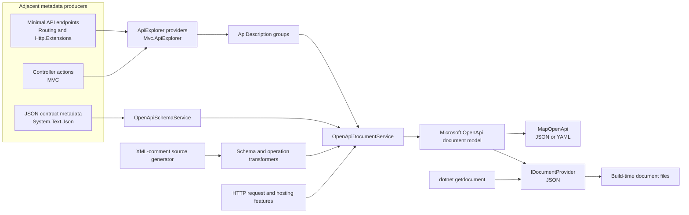

# ASP.NET Core OpenAPI architecture

## Purpose and scope

The `Microsoft.AspNetCore.OpenApi` package translates ASP.NET Core API descriptions and JSON serialization metadata into OpenAPI documents. The area owns document composition, schema adaptation, transformers, XML-documentation integration, and the runtime and build-time adapters that expose generated documents.

This document is for framework contributors who need to understand where OpenAPI behavior belongs, how the major pieces compose, and which contracts cross repository or package boundaries.

This document is not:

- An API reference or a complete description of the OpenAPI specification.
- A consumer tutorial or a replacement for the [ASP.NET Core OpenAPI documentation](https://learn.microsoft.com/aspnet/core/fundamentals/openapi/aspnetcore-openapi).
- An exhaustive inventory of projects, source files, tests, or supported endpoint shapes.
- A description of Minimal API request binding, controller discovery, generic Endpoint Routing, the `Microsoft.OpenApi` object model, or `System.Text.Json` internals.
- A build or test workflow. The [area README](README.md), [package documentation](src/PACKAGE.md), and repository build documentation cover those concerns.

## System overview

OpenAPI generation is a consumer of metadata produced by other ASP.NET Core subsystems. Minimal API and MVC components describe endpoints through endpoint metadata and `ApiDescription`; the OpenAPI area maps those descriptions into a `Microsoft.OpenApi` document and combines them with schemas derived from the application's `System.Text.Json` contract.

The diagram shows responsibility and data flow rather than assembly layering. Several arrows cross area or repository boundaries by design.

## Repository and subsystem ownership

| Concern | Owner | OpenAPI integration boundary |
| --- | --- | --- |
| Document registration, named options, document composition, schema adaptation, transformers, and serving | [`src/OpenApi`](.) | The package registers one keyed document service and schema service per document name, consumes `ApiDescription` groups, and produces `Microsoft.OpenApi` models. |
| Minimal API endpoint creation, binding, result metadata, and request delegate generation | [`src/Http`](../Http) | OpenAPI consumes endpoint and parameter metadata. It does not decide how a request is bound or compile the request delegate. |
| Endpoint Routing | [`src/Http/Routing`](../Http/Routing) | OpenAPI maps one endpoint that serves documents and reads route patterns from descriptions. It does not match application routes or execute routing policies. |
| Controller and Minimal API `ApiDescription` production | [`src/Mvc/Mvc.ApiExplorer`](../Mvc/Mvc.ApiExplorer) | OpenAPI consumes `IApiDescriptionGroupCollectionProvider`. ApiExplorer produces descriptions from endpoint metadata and controller action descriptors; controller discovery and action-descriptor construction remain MVC Core responsibilities. |
| JSON contracts and JSON Schema export | [`System.Text.Json`](https://github.com/dotnet/runtime/tree/main/src/libraries/System.Text.Json) | OpenAPI starts from the configured `JsonSerializerOptions` and exported schema, then applies ASP.NET Core and OpenAPI-specific adaptations. |
| OpenAPI object model, references, validation, and writers | [`Microsoft.OpenApi`](https://github.com/microsoft/OpenAPI.NET) | ASP.NET Core creates and mutates the model, chooses the requested specification version, and invokes the JSON or YAML writer. |
| Server addresses and request URL features | Hosting, HTTP abstractions, and the active server | OpenAPI reads `HttpRequest` or `IServerAddressesFeature`; it does not own server binding, proxy processing, or transport behavior. |
| Build invocation and `dotnet getdocument` | [`src/Tools`](../Tools) and the `Microsoft.Extensions.ApiDescription.Server` package | OpenAPI supplies the service that the tool discovers and invokes. The tool owns host activation, reflection-based discovery, output paths, and MSBuild integration. |

The [`CODEOWNERS` entry](../../.github/CODEOWNERS) for `src/OpenApi` is the authority for changes in this area. Cross-area changes still require review from the owner of the producing or consuming subsystem.

## Registration and named documents

[`OpenApiServiceCollectionExtensions`](src/Extensions/OpenApiServiceCollectionExtensions.cs) is the composition root for the package:

- `AddOpenApi` registers a named `OpenApiOptions` instance and records the document name for enumeration.
- Document names are normalized to lowercase when used as keyed-service and named-options keys so resolution agrees with case-insensitive routing.
- `AddOpenApiCore` registers ApiExplorer, the keyed schema and document services, the keyed runtime [`IOpenApiDocumentProvider`](src/Services/IOpenApiDocumentProvider.cs), the build-time `IDocumentProvider`, and JSON options used by schema conversion.
- [`IAdditionalOpenApiDocumentNameResolver`](src/Extensions/IAdditionalOpenApiDocumentNamesResolver.cs) allows an application to expose document names whose options are configured through broader named-options conventions.

[`OpenApiOptions`](src/Services/OpenApiOptions.cs) defines the per-document inclusion predicate, schema-reference naming policy, target OpenAPI version, and transformer registrations. The default inclusion predicate associates ungrouped descriptions with every applicable document and otherwise matches `ApiDescription.GroupName` to the document name.

`OpenApiDocumentService` and `OpenApiSchemaService` are keyed singletons, but each generation call creates a new document. The generation service provider depends on the entry point: `MapOpenApi` passes request services, direct `IOpenApiDocumentProvider` calls use the singleton-captured application provider, and the build-time `OpenApiDocumentProvider` creates a scope. Singleton registration therefore does not make the mutable `OpenApiDocument` a singleton.

## Endpoint metadata and `ApiDescription` inputs

[`OpenApiDocumentService`](src/Services/OpenApiDocumentService.cs) consumes `IApiDescriptionGroupCollectionProvider`. It treats the resulting descriptions as upstream input:

1. The document's `ShouldInclude` predicate selects descriptions.
2. Relative paths are normalized from route patterns and grouped into path items.
3. Valid HTTP methods become operations.
4. Parameters, request bodies, responses, tags, names, summaries, descriptions, and deprecation state are mapped from `ApiDescription`, model metadata, and endpoint metadata.
5. Schema requests are delegated to `OpenApiSchemaService`.

The two common producers have different owners:

- Minimal API descriptions are produced by [`EndpointMetadataApiDescriptionProvider`](../Mvc/Mvc.ApiExplorer/src/EndpointMetadataApiDescriptionProvider.cs). It reads route endpoints and binding metadata produced by [`RequestDelegateFactory`](../Http/Http.Extensions/src/RequestDelegateFactory.cs) or the [request delegate generator](../Http/Http.Extensions/gen/Microsoft.AspNetCore.Http.RequestDelegateGenerator).
- Controller descriptions are produced by [`DefaultApiDescriptionProvider`](../Mvc/Mvc.ApiExplorer/src/DefaultApiDescriptionProvider.cs), using MVC action, model-binding, formatter, and response metadata.

An incorrect or missing description may require a fix in the producer. OpenAPI-specific translation belongs in `src/OpenApi`, but OpenAPI must not independently reimplement Minimal API binding inference or MVC discovery to compensate for a general ApiExplorer defect.

The deprecated [`WithOpenApi`](src/Extensions/OpenApiEndpointConventionBuilderExtensions.cs) path is separate. It reflectively creates an `OpenApiOperation` endpoint annotation for external consumers and explicitly does not integrate with built-in document generation. New built-in customization composes through `AddOpenApi`, the transformer pipeline, and `AddOpenApiOperationTransformer`.

## Document generation pipeline

On successful generation, each call to `OpenApiDocumentService.GetOpenApiDocumentAsync` follows this sequence:

1. Initialize schema and operation transformers for the generation scope.
2. Create document information and server entries.
3. Select and map `ApiDescription` instances into paths and operations.
4. Generate request, response, and parameter schemas as needed.
5. Run global operation transformers, followed by endpoint-specific operation transformers.
6. Run document transformers after paths and operations have been assembled.
7. Finalize activated schema and operation transformers.
8. Register document components and sort component schema keys for stable, readable output.

Schema transformers run while each schema graph is created. They are applied recursively with the relevant `JsonTypeInfo`, `JsonPropertyInfo`, and optional `ApiParameterDescription`. This means the overall order is schema construction and schema transformation, then operation transformation, then document transformation; it is not three independent passes over a completed document.

Transformer registrations preserve registration order. Global operation transformers run before endpoint-specific operation transformers stored in endpoint metadata. Document transformers can inspect and mutate the assembled document and can request additional schemas through their context.

Exceptions propagate to the caller. The current finalization block surrounds document-transformer execution, after path, schema, and operation construction. A failure before that block does not pass through the same schema and operation transformer finalization path, so unconditional exceptional-path cleanup is not an established invariant.

## Transformer activation and lifetimes

Transformer contexts expose the document name, the generation service provider, and the metadata relevant to the current document, operation, or schema. The service provider is:

- The current request scope for `MapOpenApi`.
- A scope created by `OpenApiDocumentProvider` for build-time generation.
- The application service provider held by `OpenApiDocumentService` when `IOpenApiDocumentProvider` is called directly.
- The scope supplied by a caller using the internal document service directly.

Type-based schema and operation transformers are activated through dependency injection once per generated document and reused for all matching nodes in that document. On the normal path, and when document-transformer execution exits, they are finalized by the document service. Type-based document transformers are activated for their document invocation and disposed afterward. Delegate and instance registrations bypass type activation.

The transformer APIs are asynchronous and receive the generation cancellation token. Framework loops await transformers sequentially to preserve registration order. A transformer can start concurrent work, including concurrent schema requests, but it is then responsible for coordinating its own work and respecting cancellation.

## Schema generation and references

[`OpenApiSchemaService`](src/Services/Schemas/OpenApiSchemaService.cs) uses the application's configured HTTP [`JsonOptions`](../Http/Http.Extensions/src/JsonOptions.cs) as the source of serialization metadata. It asks the `System.Text.Json` JSON Schema exporter for a schema based on `JsonTypeInfo`, then adapts the result to ASP.NET Core and OpenAPI requirements.

The adaptation includes:

- Mapping JSON primitive formats and handling framework-specific types such as files, streams, and JSON Patch documents.
- Applying validation, description, default-value, and deprecation annotations where the metadata supplies them.
- Reconciling parameter-binding metadata with the JSON contract for non-body parameters.
- Applying schema transformers across objects, properties, collection elements, and recognized polymorphic branches.
- Choosing inline schemas or component references through `OpenApiOptions.CreateSchemaReferenceId`.
- Resolving component references, recursive shapes, and reference-specific annotations into the `Microsoft.OpenApi` model.

Schema shape follows the serializer contract rather than raw CLR reflection alone. Naming policies, ignored members, converters, required members, and polymorphism options can change the exported JSON contract. Conversely, route, query, header, form, and other non-body parameters are constrained by their binding contract and cannot blindly inherit body-serialization semantics.

Nullability is assembled from several inputs: `System.Text.Json` schema export, property nullability metadata, `ApiParameterDescription` optionality, and request or response context. Component references sometimes require a nullable wrapper rather than mutating the shared component. Polymorphism uses `JsonPolymorphismOptions` to build discriminator and mapping information, after which the OpenAPI layer resolves those mappings to document references.

The schema-reference ID is a document-level identity, not merely a CLR type name. IDs must be valid reference fragments, avoid unintended collisions, and remain consistent anywhere the same logical schema is reused. Applications can return `null` from `CreateSchemaReferenceId` to keep a schema inline.

## XML documentation and source generation

XML-comment support is a compile-time pipeline, not runtime file parsing:

1. The [`XmlCommentGenerator`](gen/XmlCommentGenerator.cs) reads documentation from the current Roslyn compilation and XML files supplied as additional texts.
2. [`Microsoft.AspNetCore.OpenApi.targets`](build/Microsoft.AspNetCore.OpenApi.targets) adds existing XML documentation files from project references to those additional inputs.
3. The generator emits a compact comment cache, documentation-ID helpers, schema and operation transformers, and interceptors for supported `AddOpenApi` call sites.
4. The generated transformers participate in the normal schema and operation transformation pipeline.

The generator owns mapping compiler documentation identities and supported XML elements into OpenAPI descriptions, examples, responses, and deprecation markers. Roslyn owns compilation and interceptor semantics; referenced projects own producing their XML documentation files.

This pipeline is distinct from build-time document generation. XML support generates code that enriches a document when the application runs its OpenAPI services. `dotnet getdocument` later runs those services to write a document.

## Runtime document serving

[`MapOpenApi`](src/Extensions/OpenApiEndpointRouteBuilderExtensions.cs) registers a GET endpoint and excludes that endpoint from ApiExplorer so the document does not describe itself. For a resolved document name it:

- Resolves the keyed document service from request services and reads per-document options from the `IOptionsMonitor<OpenApiOptions>` captured from `endpoints.ServiceProvider` when the route was mapped.
- Generates a fresh document with `HttpRequest` and `RequestAborted`.
- Uses the request scheme, host, and path base to populate the server URL.
- Selects the `Microsoft.OpenApi` YAML writer when the route pattern ends in `.yaml` or `.yml`; other patterns use the JSON writer.
- Serializes using the document's configured OpenAPI version and flushes the response body.

When there is no `HttpRequest`, development-time generation can fall back to addresses exposed through `IServerAddressesFeature`; other environments produce no implicit server entry. Proxy and forwarded-header processing must occur in the hosting pipeline before OpenAPI reads the request. OpenAPI does not interpret forwarding headers itself.

`MapOpenApi` does not add authorization. The generated document can disclose routes, schemas, examples, and server information, so applications that should not publish that information must apply the appropriate endpoint conventions and deployment policy.

## Build-time document generation

The OpenAPI package implements [`Microsoft.Extensions.ApiDescriptions.IDocumentProvider`](src/Services/IDocumentProvider.cs) through [`OpenApiDocumentProvider`](src/Services/OpenApiDocumentProvider.cs). Although the interface is internal, it is a reflection-discovered compatibility contract with `dotnet getdocument`.

The exact contract currently consists of:

- Type name `Microsoft.Extensions.ApiDescriptions.IDocumentProvider`.
- `GetDocumentNames()`.
- `GenerateAsync(string documentName, TextWriter writer)`.
- An optional `GenerateAsync(string documentName, TextWriter writer, OpenApiSpecVersion version)` overload.

The [tool worker](../Tools/GetDocumentInsider/src/Commands/GetDocumentCommandWorker.cs) loads the application's entry assembly, builds its host with no-op server and host-lifetime services, waits for application startup, locates the provider by exact type name, and invokes those methods by reflection. The [`Microsoft.Extensions.ApiDescription.Server` targets](../Tools/Extensions.ApiDescription.Server/src/build/Microsoft.Extensions.ApiDescription.Server.targets) own invoking the tool and managing output files.

The OpenAPI provider creates a service scope, generates the selected document without an HTTP request, and writes JSON through `OpenApiJsonWriter`. It does not call the `MapOpenApi` endpoint. The version-aware overload allows the external tool to request a specification version without changing the configured runtime endpoint.

Build-time generation executes application startup, dependency injection, OpenAPI transformers, and other code reached while the host is built. It is therefore application code execution in the build process, not static inspection. The reflection contract and its namespace, method names, parameter types, and return types must be treated as compatibility-sensitive even though they are not public .NET API.

The build-time interface does not carry a cancellation token. The external tool supplies its own process and invocation timeout behavior, while runtime and programmatic generation use the cancellation token exposed by their entry point.

## Determinism, concurrency, and cancellation

Document generation makes several deliberate ordering choices:

- Transformer lists are processed in registration order.
- Tags are maintained with ordinal name ordering.
- Component schemas are sorted by ordinal key after generation.
- Document-name service keys are normalized consistently.

These choices improve repeatability, but the output is not a general canonicalizer for all extension data or application-provided collections. Contributors should preserve stable producer ordering and avoid adding nondeterministic enumeration to the generation path.

Each invocation constructs a fresh document and initializes its transformer arrays. The keyed document and schema services also retain caches, including operation transformer contexts and schema-reference IDs. Cache contents and lifetime require separate scrutiny: concurrent collections and successful concurrent requests do not by themselves establish isolation of documents, scopes, or transformer state.

Cancellation flows through runtime request aborts, public programmatic generation, schema creation, `Microsoft.OpenApi` serialization, and all transformer callbacks that accept a token. Cancellation should terminate generation rather than return a partial success-shaped document.

## Security and trust boundaries

OpenAPI output describes behavior; it does not enforce it. Authentication, authorization, antiforgery, CORS, request limits, model binding, and endpoint execution remain runtime responsibilities even when their metadata affects the document.

The following inputs can affect output, but they have different trust levels:

- Endpoint and `ApiDescription` metadata.
- `System.Text.Json` options and type metadata.
- Transformer implementations and the services they resolve.
- XML documentation text and examples.
- Request host information used for runtime server URLs.
- Application startup code executed by build-time generation.

Application configuration, transformers, XML documentation, and build inputs form the application's code and configuration boundary. Request URL features may contain client- or proxy-supplied values; their validation and forwarding trust policy remain responsibilities of the configured HTTP middleware.

Transformers receive mutable document objects and services and are not sandboxed. XML comments and examples can become externally visible document content. Runtime document endpoints should follow the application's disclosure policy, and build systems should treat document generation like executing the application.

## Trimming, Native AOT, and reflection

The package is trimmable, and its central Minimal API path is designed to compose with request-delegate generation and `System.Text.Json` metadata. The [trimming](test/Microsoft.AspNetCore.OpenApi.TrimmingTests/Microsoft.AspNetCore.OpenApi.TrimmingTests.proj) and [Native AOT](test/Microsoft.AspNetCore.OpenApi.NativeAotTests/Microsoft.AspNetCore.OpenApi.NativeAotTests.proj) projects guard that composition. They do not establish that every MVC, transformer, serializer, or build-time scenario is reflection-free.

Important reflection boundaries remain:

- The deprecated `WithOpenApi` operation generator uses reflection and is annotated with `RequiresUnreferencedCode` and `RequiresDynamicCode`.
- Type-based transformer registration preserves public constructors for dependency-injection activation.
- Generated XML-comment support resolves method and property identities at runtime; missing trimmed metadata means documentation cannot be applied.
- MVC controller ApiExplorer is not generally trimming or Native AOT compatible.
- `dotnet getdocument` intentionally uses reflection in a build-time process to locate and invoke the provider contract.

Changes must preserve annotations and generated metadata requirements at the boundary where reflection is introduced instead of assuming that package-level trim compatibility removes those constraints.

## Design principles and invariants

### Consume contracts from their owners

Endpoint metadata, `ApiDescription`, JSON type information, hosting features, and `Microsoft.OpenApi` models are integration contracts. OpenAPI should adapt them at a documented seam rather than duplicate their producer's logic.

### Keep runtime and build-time composition aligned, not identical

All paths use the same document and schema services and transformer pipeline. `MapOpenApi` uses request services, request URL information, request cancellation, and JSON or YAML delivery. Direct `IOpenApiDocumentProvider` calls use the captured application service provider without creating a scope or supplying an HTTP request, and return an `OpenApiDocument`. Build time creates its own scope, has no request, serializes JSON, and is invoked through a reflection contract.

### Generate a fresh document per call

Options and reusable caches can outlive one generation, but the document model and activated transformer set belong to that generation. This separation is required for concurrent requests and independent mutation by transformers.

### Preserve serializer and binding semantics

Body schemas follow the configured JSON contract. Non-body parameters follow their binding contract. Nullability, requiredness, names, formats, and defaults must not be inferred from the wrong side of that boundary.

### Make customization explicit and ordered

Schema, operation, endpoint-specific operation, and document transformers have defined contexts and ordering. New extensibility should compose with that pipeline rather than introduce hidden post-processing.

### Treat component identity as document state

References, recursive schemas, nullable wrappers, polymorphic mappings, and custom reference IDs must resolve consistently within the document. Shared components must not be mutated to express use-site-only semantics.

### Keep compatibility-sensitive hidden contracts visible

The internal `IDocumentProvider` shape is effectively pseudo-public to `dotnet getdocument`. Generated-code interception and trimming annotations are similarly cross-component contracts even when they are not ordinary public API.

## Verification boundaries

The area separates tests by the behavior they establish:

| Boundary | Coverage |
| --- | --- |
| Document and operation mapping | [`Microsoft.AspNetCore.OpenApi.Tests`](test/Microsoft.AspNetCore.OpenApi.Tests), especially `Services/OpenApiDocumentService` |
| Schema export, references, nullability, polymorphism, and transformer recursion | `Services/OpenApiSchemaService` and `Transformers` tests in the main test project |
| Runtime serving, JSON/YAML output, document validity, and concurrent requests | [`Integration`](test/Microsoft.AspNetCore.OpenApi.Tests/Integration) and endpoint-route-builder tests |
| XML parsing, generated registrations, and emitted transformers | [`Microsoft.AspNetCore.OpenApi.SourceGenerators.Tests`](test/Microsoft.AspNetCore.OpenApi.SourceGenerators.Tests) and its snapshots |
| XML additional-file build integration | [`Microsoft.AspNetCore.OpenApi.Build.Tests`](test/Microsoft.AspNetCore.OpenApi.Build.Tests) |
| Trimming and Native AOT composition | The trimming and Native AOT projects linked above |
| Build-tool host activation and reflection invocation | [`GetDocumentInsider` tests](../Tools/GetDocumentInsider/tests) |
| Generation cost and transformer overhead | [`perf/Microbenchmarks`](perf/Microbenchmarks) |

An isolated OpenAPI unit test proves translation from supplied metadata, not that the upstream routing, binding, or MVC producer can create that metadata. Behavioral changes at those seams need coverage at the producer boundary as well.

## Finding the right subsystem

| If the problem concerns... | Start in... |
| --- | --- |
| Named documents, inclusion, path/operation mapping, transformers, or serving | `src/OpenApi/src/Services` and `src/OpenApi/src/Extensions` |
| JSON schema conversion, component references, nullability, or polymorphism | `src/OpenApi/src/Services/Schemas`, `src/OpenApi/src/Schemas`, and schema extensions |
| XML comments missing from generated documents | `src/OpenApi/gen`, `src/OpenApi/build`, and source-generator tests |
| Minimal API parameter source, optionality, or result metadata | `src/Http/Http.Extensions` and its request delegate generator |
| Minimal API descriptions created from endpoint metadata | `src/Mvc/Mvc.ApiExplorer/src/EndpointMetadataApiDescriptionProvider.cs` |
| Controller action descriptions, formats, or model metadata | `src/Mvc/Mvc.ApiExplorer/src/DefaultApiDescriptionProvider.cs` and MVC |
| Route matching, constraints, or endpoint data-source composition | `src/Http/Routing` |
| OpenAPI model behavior, references, validation, JSON, or YAML writers | `microsoft/OpenAPI.NET` |
| JSON contract discovery or JSON Schema export | `System.Text.Json` in `dotnet/runtime` |
| Build targets, host activation, CLI options, or generated files | `src/Tools/Extensions.ApiDescription.Server`, `src/Tools/dotnet-getdocument`, and `src/Tools/GetDocumentInsider` |
| Server addresses, forwarded headers, or proxy behavior | Hosting, Servers, and HTTP Overrides middleware |

## Documentation map

- [Area README](README.md)
- [Package documentation](src/PACKAGE.md)
- [Service registration](src/Extensions/OpenApiServiceCollectionExtensions.cs)
- [Runtime document provider](src/Services/IOpenApiDocumentProvider.cs)
- [Document generation](src/Services/OpenApiDocumentService.cs)
- [Schema generation](src/Services/Schemas/OpenApiSchemaService.cs)
- [Transformer contracts](src/Transformers)
- [XML-comment source generator](gen)
- [Runtime sample](sample)
- [ASP.NET Core OpenAPI documentation](https://learn.microsoft.com/aspnet/core/fundamentals/openapi/aspnetcore-openapi)

## Terminology

- **Endpoint metadata**: Objects attached to an endpoint by routing, request-delegate generation, conventions, attributes, parameter types, and result types.
- **`ApiDescription`**: ApiExplorer's normalized description of one HTTP operation, including its path, method, parameters, request formats, response types, and action metadata.
- **Document name**: The logical name used to select options, keyed services, groups, runtime routes, and build-time output.
- **Document service**: The keyed `OpenApiDocumentService` that maps descriptions into a fresh `OpenApiDocument`.
- **Schema service**: The keyed `OpenApiSchemaService` that exports and adapts JSON schemas and resolves document components.
- **Component schema**: A reusable schema stored in the document's components collection and addressed through a reference.
- **Transformer**: An asynchronous schema, operation, or document customization invoked as part of generation.
- **Runtime generation**: Document generation initiated through an HTTP request to a `MapOpenApi` endpoint or a programmatic provider call.
- **Build-time generation**: Document generation initiated by `dotnet getdocument`, which starts the application host and invokes the internal provider contract.
- **XML-comment source generation**: Compile-time generation of transformers and comment data that later participate in document generation.
