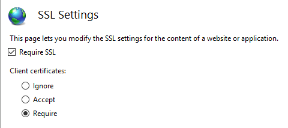

# Microsoft.AspNetCore.Authentication.Certificate
 
This project sort of contains an implementation of [Certificate Authentication](https://tools.ietf.org/html/rfc5246#section-7.4.4) for ASP.NET Core. 
Certificate authentication happens at the TLS level, long before it ever gets to ASP.NET Core, so, more accurately this is an authentication handler
that validates the certificate and then gives you an event where you can resolve that certificate to a ClaimsPrincipal. 

You **must** [configure your host](#hostConfiguration) for certificate authentication, be it IIS, Kestrel, Azure Web Applications or whatever else you're using.

## Getting started

First acquire an HTTPS certificate, apply it and then [configure your host](#hostConfiguration) to require certificates.

In your web application add a reference to the package, then in the `ConfigureServices` method in `startup.cs` call
`app.AddAuthentication(CertificateAuthenticationDefaults.AuthenticationScheme).UseCertificateAuthentication(...);` with your options, 
providing a delegate for `OnValidateCertificate` to validate the client certificate sent with requests and turn that information 
into an `ClaimsPrincipal`, set it on the `context.Principal` property and call `context.Success()`.

If you change your scheme name in the options for the authentication handler you need to change the scheme name in 
`AddAuthentication()` to ensure it's used on every request which ends in an endpoint that requires authorization.

If authentication fails this handler will return a `403 (Forbidden)` response rather a `401 (Unauthorized)` as you
might expect - this is because the authentication should happen during the initial TLS connection - by the time it 
reaches the handler it's too late, and there's no way to actually upgrade the connection from an anonymous connection 
to one with a certificate.

You must also add `app.UseAuthentication();` in the `Configure` method, otherwise nothing will ever get called.

For example;

```c#
public void ConfigureServices(IServiceCollection services)
{
    services.AddAuthentication(CertificateAuthenticationDefaults.AuthenticationScheme)
            .AddCertificate();
    // All the other service configuration.
}

public void Configure(IApplicationBuilder app, IHostingEnvironment env)
{
    app.UseAuthentication();

    // All the other app configuration.
}
```

In the sample above you can see the default way to add certificate authentication. The handler will construct a user principal using the common certificate properties for you.

## Configuring Certificate Validation

The `CertificateAuthenticationOptions` handler has some built in validations that are the minimium validations you should perform on 
a certificate. Each of these settings are turned on by default.

### ValidateCertificateChain

This check validates that the issuer for the certificate is trusted by the application host OS. If 
you are going to accept self-signed certificates you must disable this check.

### ValidateCertificateUse

This check validates that the certificate presented by the client has the Client Authentication 
extended key use, or no EKUs at all (as the specifications say if no EKU is specified then all EKUs 
are valid). 

### ValidateValidityPeriod

This check validates that the certificate is within its validity period. As the handler runs on every 
request this ensures that a certificate that was valid when it was presented has not expired during
its current session.

### RevocationFlag

A flag which specifies which certificates in the chain are checked for revocation.

Revocation checks are only performed when the certificate is chained to a root certificate.

### RevocationMode 

A flag which specifies how revocation checks are performed.
Specifying an on-line check can result in a long delay while the certificate authority is contacted.

Revocation checks are only performed when the certificate is chained to a root certificate.

### Can I configure my application to require a certificate only on certain paths?

Not possible, remember the certificate exchange is done that the start of the HTTPS conversation, 
it's done by the host, not the application. Kestrel, IIS, Azure Web Apps don't have any configuration for
this sort of thing.

# Handler events

The handler has two events, `OnAuthenticationFailed()`, which is called if an exception happens during authentication and allows you to react, and `OnValidateCertificate()` which is 
called after certificate has been validated, passed validation, abut before the default principal has been created. This allows you to perform your own validation, for example 
checking if the certificate is one your services knows about, and to construct your own principal. For example,

```c#
services.AddAuthentication(CertificateAuthenticationDefaults.AuthenticationScheme)
        .AddCertificate(options =>
        {
            options.Events = new CertificateAuthenticationEvents
            {
                OnValidateCertificate = context =>
                {
                    var claims = new[]
                    {
                        new Claim(ClaimTypes.NameIdentifier, context.ClientCertificate.Subject, ClaimValueTypes.String, context.Options.ClaimsIssuer),
                        new Claim(ClaimTypes.Name, context.ClientCertificate.Subject, ClaimValueTypes.String, context.Options.ClaimsIssuer)
                    };

                    context.Principal = new ClaimsPrincipal(new ClaimsIdentity(claims, context.Scheme.Name));
                    context.Success();

                    return Task.CompletedTask;
                }
            };
        });
```

If you find the inbound certificate doesn't meet your extra validation call `context.Fail("failure Reason")` with a failure reason.

For real functionality you will probably want to call a service registered in DI which talks to a database or other type of 
user store. You can grab your service by using the context passed into your delegates, like so

```c#
services.AddAuthentication(CertificateAuthenticationDefaults.AuthenticationScheme)
        .AddCertificate(options =>
        {
            options.Events = new CertificateAuthenticationEvents
            {
                OnCertificateValidated = context =>
                {
                    var validationService =
                        context.HttpContext.RequestServices.GetService<ICertificateValidationService>();
                    
                    if (validationService.ValidateCertificate(context.ClientCertificate))
                    {
                        var claims = new[]
                        {
                            new Claim(ClaimTypes.NameIdentifier, context.ClientCertificate.Subject, ClaimValueTypes.String, context.Options.ClaimsIssuer),
                            new Claim(ClaimTypes.Name, context.ClientCertificate.Subject, ClaimValueTypes.String, context.Options.ClaimsIssuer)
                        };

                        context.Principal = new ClaimsPrincipal(new ClaimsIdentity(claims, context.Scheme.Name));
                        context.Success();
                    }                     

                    return Task.CompletedTask;
                }
            };
        });
```
Note that conceptually the validation of the certification is an authorization concern, and putting a check on, for example, an issuer or thumbprint in an authorization policy rather 
than inside OnCertificateValidated() is perfectly acceptable.

## <a name="hostConfiguration"></a>Configuring your host to require certificates

### Kestrel

In program.cs configure `UseKestrel()` as follows.

```c#
public static IWebHost BuildWebHost(string[] args)
    => WebHost.CreateDefaultBuilder(args)
    .UseStartup<Startup>()
    .ConfigureKestrel(options =>
    {
        options.ConfigureHttpsDefaults(opt =>
        {
            opt.ClientCertificateMode = ClientCertificateMode.RequireCertificate;
        });
    })
    .Build();
```
You must set the `ClientCertificateValidation` delegate to `CertificateValidator.DisableChannelValidation` in order to stop Kestrel using the default OS certificate validation routine and, 
instead, letting the authentication handler perform the validation.

### IIS

In the IIS Manager 

1. Select your Site in the Connections tab.
2. Double click the SSL Settings in the Features View window.
3. Check the `Require SSL` Check Box and select the `Require` radio button under Client Certificates.



### Azure

See the [Azure documentation](https://docs.microsoft.com/en-us/azure/app-service/app-service-web-configure-tls-mutual-auth) 
to configure Azure Web Apps then add the following to your application startup method, `Configure(IApplicationBuilder app)` add the 
following line before the call to `app.UseAuthentication();`

```c#
app.UseCertificateHeaderForwarding();
```

### Random custom web proxies

If you're using a proxy which isn't IIS or Azure's Web Apps Application Request Routing you will need to configure your proxy
to forward the certificate it received in an HTTP header. 
In your application startup method, `Configure(IApplicationBuilder app)`, add the 
following line before the call to `app.UseAuthentication();`

```c#
app.UseCertificateForwarding();
```

You will also need to configure the Certificate Forwarding middleware to specify the header name.
In your service configuration method, `ConfigureServices(IServiceCollection services)` add 
the following code to configure the header the forwarding middleware will build a certificate from;

```c#
services.AddCertificateForwarding(options =>
{
    options.CertificateHeader = "YOUR_CUSTOM_HEADER_NAME";
});
```

Finally, if your proxy is doing something weird to pass the header on, rather than base 64 encoding it 
(looking at you nginx (╯°□°）╯︵ ┻━┻) you can override the converter option to be a func that will
perform the optional conversion, for example 

```c#
services.AddCertificateForwarding(options =>
{
    options.CertificateHeader = "YOUR_CUSTOM_HEADER_NAME";
    options.HeaderConverter = (headerValue) => 
    {
        var clientCertificate = 
           /* some weird conversion logic to create an X509Certificate2 */
        return clientCertificate;
    }
});
```

