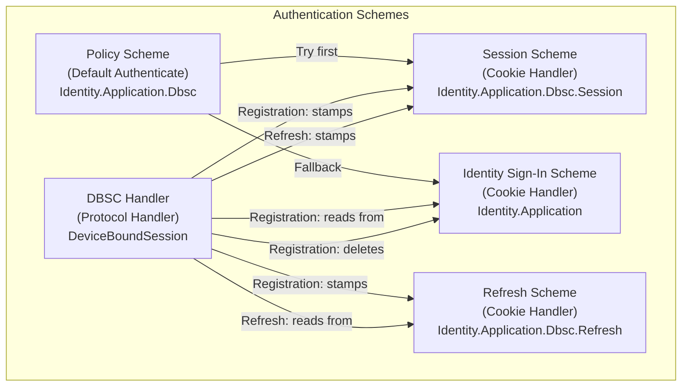
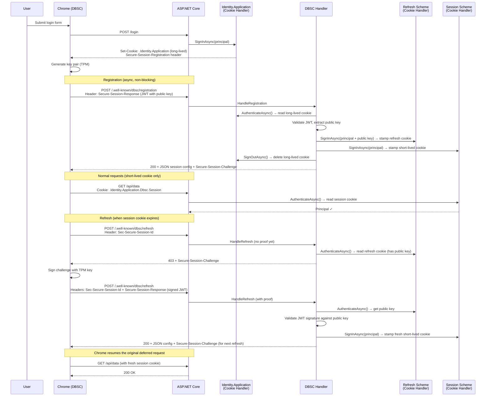
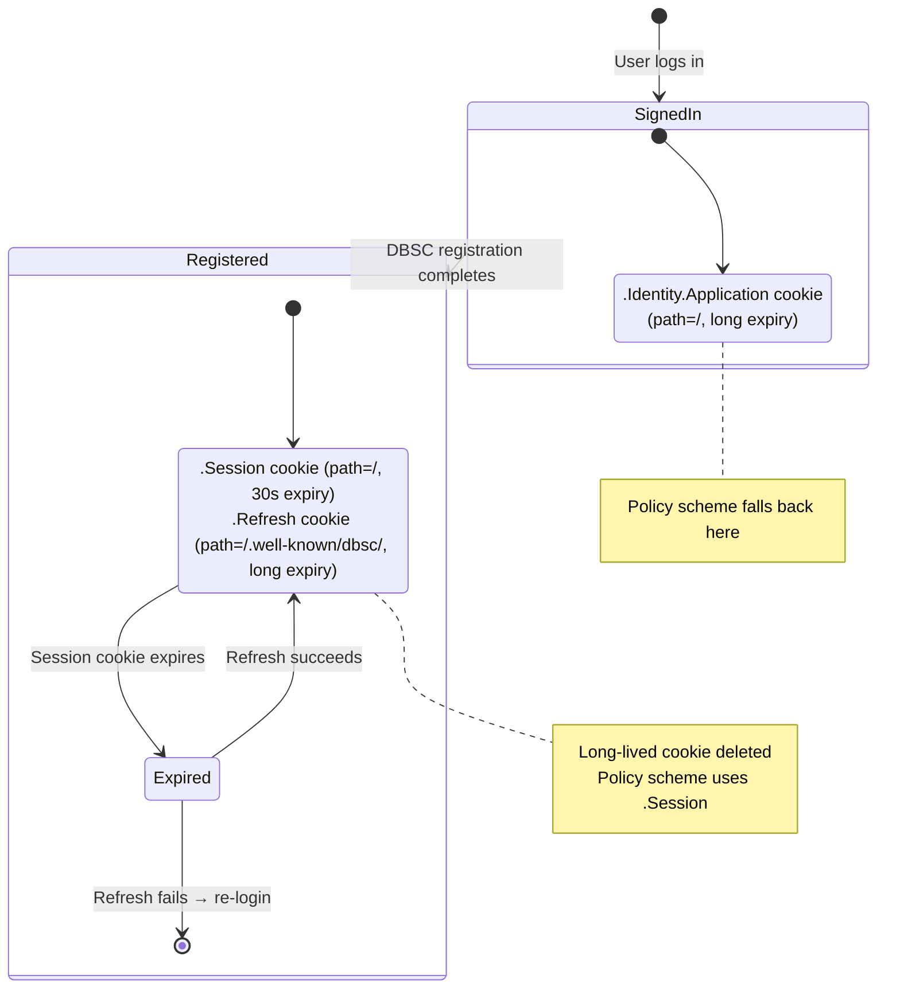
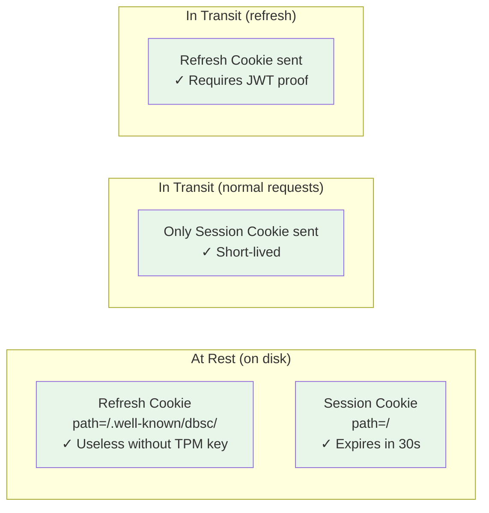

# Device Bound Session Credentials (DBSC) for ASP.NET Core

## Summary

Add support for [Device Bound Session Credentials (DBSC)](https://w3c.github.io/webappsec-dbsc/) to ASP.NET Core's authentication system. DBSC binds session cookies to a device using TPM-backed cryptographic keys, preventing session hijacking even if cookies are exfiltrated by malware.

The implementation introduces a new `DeviceBoundSession` authentication handler that manages the DBSC protocol (registration, refresh, key proof validation) and delegates cookie management to existing cookie authentication handlers — following the same architectural pattern as OpenID Connect.

## Motivation

Cookie-based sessions are the most common authentication mechanism on the web. Their primary vulnerability is **cookie theft** — malware with access to the file system or browser memory can exfiltrate cookies and use them on another device.

DBSC solves this by introducing a cryptographic key pair per session, where the private key is stored in secure hardware (TPM). The server issues short-lived cookies that must be periodically refreshed by proving possession of the private key. Even if the cookie is stolen, the attacker cannot refresh it without the TPM-bound key.

Chrome 135+ ships DBSC support. This proposal integrates DBSC into ASP.NET Core so that applications can opt in with minimal code changes.

## Goals

- Provide a DBSC authentication handler that manages the registration/refresh protocol
- Follow the established pattern of remote authentication handlers (like OpenID Connect) that delegate cookie management to a separate cookie scheme
- Support fully stateless operation (no server-side session store required)
- Ensure non-DBSC browsers continue to work normally (graceful degradation)
- Make integration with ASP.NET Core Identity straightforward

## Non-goals

- **Federated DBSC sessions** (cross-site key sharing via Session Provider) — deferred to a future version
- **Server-side session revocation store** — optional, not required for baseline operation
- **Custom signing algorithms beyond ES256/RS256** — only the algorithms Chrome currently supports

## Detailed Design

### Architectural Parallel with OpenID Connect

The DBSC handler follows the same delegation pattern as OpenID Connect:

| Concept | OpenID Connect | DBSC |
|---------|---------------|------|
| Protocol handler | `OpenIdConnectHandler` | `DeviceBoundSessionHandler` |
| Protocol dance | Authorization code flow | Registration + JWT proof |
| Credential stamping | `SignInAsync(SignInScheme)` | `SignInAsync(SessionScheme)` |
| Cookie storage | Cookie handler for `.AspNetCore.Cookies` | Cookie handler for `.Session` cookie |
| Trigger | HTTP redirect to IdP | Browser-initiated POST after seeing `Secure-Session-Registration` header |

**Why a separate handler instead of embedding in cookie middleware:**

1. **Separation of concerns** — Cookie auth handles reading/writing cookies. DBSC handles a JWT-based cryptographic protocol. These are distinct responsibilities.
2. **JWT dependency** — The cookie authentication package has zero JWT dependencies today. DBSC requires JWT parsing and signature validation (ES256/RS256).
3. **Independent evolution** — The DBSC spec is still a W3C draft. A separate handler can evolve without affecting the stable cookie auth package.
4. **Composability** — The handler can delegate to any cookie scheme, just like OIDC can sign into any cookie scheme.
5. **Testability** — The protocol logic can be tested independently from cookie management.

### Scheme Architecture



| Scheme | Cookie Name | Path | Lifetime | Role |
|--------|-------------|------|----------|------|
| `Identity.Application` | `.AspNetCore.Identity.Application` | `/` | Long (days) | Initial sign-in. Deleted after DBSC registration. |
| `Identity.Application.Dbsc.Refresh` | `.AspNetCore.Identity.Application.Dbsc.Refresh` | `/.well-known/dbsc/` | Long (days) | Stash — holds data-protected ticket + public key. Only sent to refresh endpoint. |
| `Identity.Application.Dbsc.Session` | `.AspNetCore.Identity.Application.Dbsc.Session` | `/` | Short (30s) | Active session cookie. Used for authentication on all requests. |
| Policy Scheme | — | — | — | Routes authentication: tries `.Session` first, falls back to `Identity.Application`. |

### Protocol Flow



### Cookie Lifecycle



### Security Properties



| Threat | Mitigation |
|--------|-----------|
| Malware steals session cookie | Expires in ≤30s. Attacker has a tiny window. |
| Malware steals refresh cookie | Useless — refresh endpoint requires JWT proof signed with TPM-bound private key. |
| Malware steals both cookies | Session cookie expires quickly. Refresh cookie can't be used remotely. |
| Long-lived cookie exfiltration | Deleted after registration. Only exists briefly during sign-in → registration gap. |
| Refresh endpoint is down | User must re-login. No stealable long-lived token persists. |
| Non-DBSC browser | Falls back to long-lived cookie via policy scheme. Same security as today (no regression). |

### Policy Scheme (Fallback Behavior)

The policy scheme handles the transition between pre-registration (long-lived cookie) and post-registration (session cookie):

```csharp
.AddPolicyScheme("Identity.Application.Dbsc", options =>
{
    options.ForwardDefaultSelector = context =>
    {
        // If the short-lived session cookie exists, authenticate with it
        if (context.Request.Cookies.ContainsKey(sessionCookieName))
            return "Identity.Application.Dbsc.Session";

        // Otherwise fall back to the long-lived cookie
        // (pre-registration gap, or non-DBSC browser)
        return "Identity.Application";
    };
});
```

This ensures:
- **Non-DBSC browsers**: Continue using the long-lived cookie forever (no regression)
- **Pre-registration gap**: Long-lived cookie covers the user until registration completes
- **Post-registration**: Session cookie is the active credential; long-lived cookie is deleted

### Refresh Cookie as "Stash"

The refresh cookie stores the authentication ticket + public key + session metadata, data-protected and path-scoped:

```
Refresh Cookie Value = DataProtect(
    session_id_length | session_id |
    algorithm_length  | algorithm  |
    public_key_length | public_key_jwk |
    ticket_bytes
)
```

- **Path-scoped** to `/.well-known/dbsc/` → never sent on normal requests
- **Data-protected** → opaque to the browser and any code that doesn't have the server's keys
- **Long-lived** → matches the original ticket's intended lifetime
- **Stateless** → no server-side store needed; the cookie IS the store

### Stateless Challenges

Challenges use the same self-contained pattern:

```
Challenge = DataProtect(timestamp | nonce | session_id)
```

The server validates a challenge by unprotecting it and checking:
1. The timestamp is within the allowed window (e.g., 5 minutes)
2. The session ID matches the requesting session

No server-side challenge storage is needed.

### Integration with ASP.NET Core Identity

```csharp
// In Program.cs or Startup:
builder.Services.AddAuthentication()
    .AddIdentityCookies()
    .AddDeviceBoundSession(options =>
    {
        options.RegistrationSourceScheme = IdentityConstants.ApplicationScheme;
        options.RefreshSourceScheme = "Identity.Application.Dbsc.Refresh";
        options.SignInScheme = "Identity.Application.Dbsc.Session";
        options.ShortLivedCookieExpiration = TimeSpan.FromSeconds(30);
    });

// Or a convenience helper:
builder.Services.AddIdentity<AppUser, AppRole>()
    .AddDeviceBoundSessions(); // wires up all schemes automatically
```

### Handler Implementation Sketch

```csharp
public class DeviceBoundSessionHandler : AuthenticationHandler<DeviceBoundSessionOptions>
{
    // Not used for normal request authentication — the cookie handlers do that.
    protected override Task<AuthenticateResult> HandleAuthenticateAsync()
        => Task.FromResult(AuthenticateResult.NoResult());

    // Registration and refresh are handled as middleware-style endpoint matching
    // within the handler, similar to how RemoteAuthenticationHandler handles callbacks.
}
```

The handler uses the `RemoteAuthenticationHandler` pattern:
- It doesn't authenticate normal requests (returns `NoResult`)
- It intercepts specific paths (registration, refresh) and handles the protocol
- On success, it delegates to cookie handlers via `SignInAsync`

## Risks

- **Header size for `Secure-Session-Challenge`**: Challenges are data-protected blobs (~200 bytes). Well within HTTP header limits.
- **Refresh cookie size**: Contains a full authentication ticket (~500-1500 bytes base64). Within the 4KB per-cookie limit for typical claims sets. Large claims sets may need the existing cookie chunking mechanism.
- **Chrome spec changes**: DBSC is still a W3C draft. The separate handler/package approach makes it easier to adapt to spec changes without impacting stable cookie auth code.
- **TPM rate limiting**: Chrome batches/deduplicates refresh requests. With 30s cookie expiry, TPM signing happens at most once per 30s per session — well within hardware limits.

## Drawbacks

- Adds complexity to the authentication scheme graph (policy scheme + 3 cookie schemes + DBSC handler)
- Non-DBSC browsers retain the long-lived cookie (no security improvement for them)
- If the refresh endpoint is unavailable, DBSC users lose their session and must re-login

## Considered Alternatives

### Embedding DBSC in the Cookie Authentication Handler

Rejected because:
- Adds JWT dependencies to the cookie auth package
- Mixes two distinct responsibilities (cookie management vs. cryptographic protocol)
- Makes the cookie handler harder to maintain and test
- Prevents independent evolution of DBSC support

### Using the long-lived cookie for both normal requests and refresh

Rejected because:
- If the long-lived cookie is sent on every request, stealing it defeats the purpose of DBSC
- The whole point is that the "stealable" tokens are short-lived

### Keeping the long-lived cookie as fallback (Chrome's "Alternative integration pattern")

Rejected for the strict security mode because:
- A persistent long-lived cookie at `path=/` is exactly what DBSC is trying to eliminate
- Acceptable as an opt-in configuration for sites that prioritize availability over maximum security

### Stashing ticket data in the session ID or challenge header

Rejected because:
- Both appear in HTTP headers with size constraints
- Path-scoped refresh cookie provides ample space (4KB) without header size concerns
- Cookie infrastructure (chunking, data protection) already exists in ASP.NET Core
