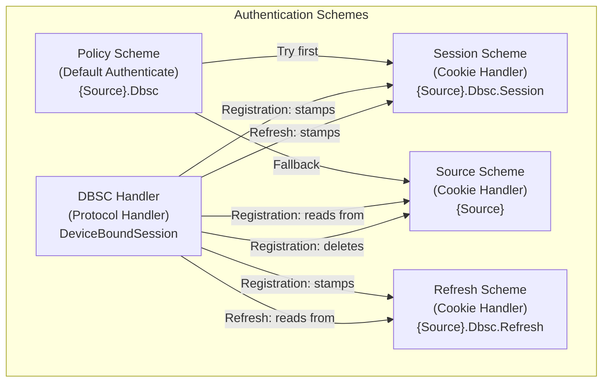
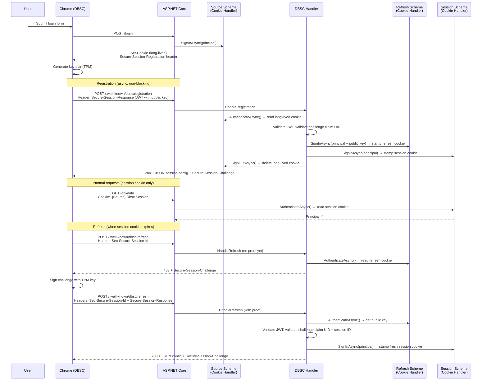

# Device Bound Session Credentials (DBSC) for ASP.NET Core

## Summary

Add support for [Device Bound Session Credentials (DBSC)](https://w3c.github.io/webappsec-dbsc/) to ASP.NET Core's authentication system. DBSC binds session cookies to a device using TPM-backed cryptographic keys, preventing session hijacking even if cookies are exfiltrated by malware.

The implementation introduces a new `Microsoft.AspNetCore.Authentication.DeviceBoundSessions` NuGet package with a dedicated authentication handler that manages the DBSC protocol (registration, refresh, key proof validation) and delegates cookie management to existing cookie authentication handlers — following the same architectural pattern as OpenID Connect.

> **Status: experimental prototype.** The entire public API surface is gated behind the analyzer diagnostic `ASP0030` (`[Experimental("ASP0030")]`); consumers must explicitly opt in. The DBSC wire protocol is a W3C **Editor's Draft** that changes frequently (we have already absorbed breaking changes such as header renames and a 401→403 re-challenge switch) and ships single-vendor (Chromium) behind a flag. Both the protocol and this API are expected to change.

## Motivation

Cookie-based sessions are the most common authentication mechanism on the web. Their primary vulnerability is **cookie theft** — malware with access to the file system or browser memory can exfiltrate cookies and use them on another device.

DBSC solves this by introducing a cryptographic key pair per session, where the private key is stored in secure hardware (TPM). The server issues short-lived cookies that must be periodically refreshed by proving possession of the private key. Even if the cookie is stolen, the attacker cannot refresh it without the TPM-bound key.

Chrome ships DBSC behind a flag (`chrome://flags/#enable-standard-device-bound-session-credentials`). This proposal integrates DBSC into ASP.NET Core so that applications can opt in with minimal code changes.

## Goals

- Provide a DBSC authentication handler that manages the registration/refresh protocol
- Follow the established pattern of remote authentication handlers (like OpenID Connect) that delegate cookie management to a separate cookie scheme
- Support fully stateless operation (no server-side session store required)
- Ensure non-DBSC browsers continue to work normally (graceful degradation)
- Make integration with ASP.NET Core Identity straightforward
- Ship as a standalone NuGet package (not part of the shared framework), same model as JwtBearer

## Non-goals

- **Federated DBSC sessions** (cross-site key sharing via Session Provider) — deferred to a future version
- **Server-side session revocation store** — optional, not required for baseline operation
- **Custom signing algorithms beyond ES256/RS256** — only the algorithms Chrome currently supports

## Detailed Design

### Package and Dependencies

- **Package**: `Microsoft.AspNetCore.Authentication.DeviceBoundSessions`
- **Ships as NuGet package** (not shared framework) — same model as `Microsoft.AspNetCore.Authentication.JwtBearer`
- **Dependencies**: `Microsoft.IdentityModel.Protocols.OpenIdConnect` (for JWT validation, same package JwtBearer uses), `System.Formats.Cbor` (for challenge payload encoding)

### Architectural Parallel with OpenID Connect

The DBSC handler follows the same delegation pattern as OpenID Connect:

| Concept | OpenID Connect | DBSC |
|---------|---------------|------|
| Protocol handler | `OpenIdConnectHandler` | `DeviceBoundSessionHandler` |
| Protocol dance | Authorization code flow | Registration + JWT proof |
| Credential stamping | `SignInAsync(SignInScheme)` | `SignInAsync(SessionScheme)` |
| Cookie storage | Cookie handler for `.AspNetCore.Cookies` | Cookie handler for `.Session` cookie |
| Trigger | HTTP redirect to IdP | Browser-initiated POST after seeing `Secure-Session-Registration` header |
| Package model | Standalone NuGet | Standalone NuGet |

**Why a separate handler instead of embedding in cookie middleware:**

1. **Separation of concerns** — Cookie auth handles reading/writing cookies. DBSC handles a JWT-based cryptographic protocol.
2. **JWT dependency** — The cookie authentication package has zero JWT dependencies today. DBSC requires JWT parsing and signature validation (ES256/RS256) via Microsoft.IdentityModel.
3. **Independent evolution** — The DBSC spec is still a W3C draft. A separate handler can evolve without affecting the stable cookie auth package.
4. **Composability** — The handler can delegate to any cookie scheme, just like OIDC can sign into any cookie scheme.
5. **Testability** — The protocol logic can be tested independently from cookie management.

### Scheme Architecture



| Scheme | Cookie Name | Path | Lifetime | Role |
|--------|-------------|------|----------|------|
| `{Source}` (e.g. `Identity.Application`) | `.AspNetCore.{Source}` | `/` | Long (days) | Initial sign-in. Deleted after DBSC registration. |
| `{Source}.Dbsc.Refresh` | `.AspNetCore.{Source}.Dbsc.Refresh` | `/.well-known/dbsc/` | Slides with source | Stash — holds ticket + public key. Only sent to refresh endpoint. |
| `{Source}.Dbsc.Session` | `.AspNetCore.{Source}.Dbsc.Session` | `/` | Short (10min default) | Active session cookie. Used for authentication on all requests. |
| `{Source}.Dbsc` (Policy) | — | — | — | Routes authentication: tries `.Session` first, falls back to `{Source}`. |

The refresh and session cookie schemes **inherit settings** (HttpOnly, Secure, SameSite, Domain, lifetime, and sliding behavior) from the source cookie scheme via `IPostConfigureOptions`.

### Protocol Flow



### Challenge Design

Challenges are time-limited, data-protected payloads that bind to the user identity:

**Registration challenge** (emitted at sign-in, validated at registration):
```
registrationProtector.Protect(CBOR(claimUid), lifetime=5min)
```

**Refresh challenge** (emitted at registration/refresh, validated at next refresh):
```
refreshProtector.Protect(CBOR(claimUid, sessionId), lifetime=5min)
```

- **No nonce needed** — `ITimeLimitedDataProtector` provides uniqueness via its embedded timestamp + MAC
- **Claim UID** follows antiforgery priority: `sub` > `ClaimTypes.NameIdentifier` > `ClaimTypes.Upn` > SHA256(all claims)
- **Claim UID encoding** uses CBOR (claim type, value, issuer as text strings)
- **CBOR payload** is a bare sequence of text strings (no array/map framing)
- **5-minute expiry** (`ChallengeMaxAge`) — time-limited protector rejects expired challenges automatically
- **Domain separation** — registration and refresh challenges are protected under **distinct data-protection purposes** (`...Challenge.Registration.v1` and `...Challenge.Refresh.v1`). A challenge minted for one flow can never be decrypted (let alone confused) as the other, so cross-type challenge confusion is cryptographically impossible.

The `DeviceBoundSessionChallengeProtector` holds two `ITimeLimitedDataProtector` instances (one per purpose) and a logger; every validation failure is logged at `Debug` with its specific reason (undecryptable / malformed / principal-mismatch / session-mismatch), never logging the payload.

### JWT Validation

JWT validation uses `Microsoft.IdentityModel.JsonWebTokens.JsonWebTokenHandler` (same library as JwtBearer):
- Parse JWT via `new JsonWebToken(tokenString)`
- Validate `typ` header is `"dbsc+jwt"`
- Extract `jwk` from JWT header (registration) or from refresh cookie properties (refresh)
- Construct `ECDsaSecurityKey` (ES256) or `RsaSecurityKey` (RS256) from JWK
- Validate signature via `JsonWebTokenHandler.ValidateTokenAsync()` with appropriate `TokenValidationParameters`

`DeviceBoundSessionJwtValidator` is an instance service with a logger. Each rejection path logs its specific reason at `Debug` (malformed token, wrong `typ`, missing algorithm, missing/unsupported key, invalid signature, challenge mismatch) without logging the proof itself.

### Diagnostics and Experimental Status

Every public type in the package carries `[Experimental("ASP0030", UrlFormat = "https://aka.ms/aspnet/analyzer/{0}")]`, matching the convention used by the validation feature. The diagnostic id `ASP0030` is reserved in `docs/list-of-diagnostics.md`. Internal consumers, the source-generated JSON context, and the sample suppress `ASP0030` where the analyzer flags same-assembly usage. Marking the API experimental forces callers to explicitly opt in, signaling that both the unstable wire protocol and the still-evolving .NET surface may change.

### Logging

All diagnostic logging uses the source-generated `LoggerMessage` pattern in `LoggingExtensions.cs` (`internal static partial class DeviceBoundSessionsLoggingExtensions` in `namespace Microsoft.Extensions.Logging`). Validation failures are logged at `Debug` (matching Identity's convention), while operationally notable conditions (no source authentication, missing refresh cookie, principal/session mismatch) are logged at `Warning`. Secrets — proofs, challenge payloads, keys — are never logged.

### Integration with ASP.NET Core Identity

```csharp
builder.Services.AddAuthentication(IdentityConstants.ApplicationScheme)
    .AddIdentityCookies()
    .AddDeviceBoundSession(IdentityConstants.ApplicationScheme, o =>
    {
        o.ShortLivedCookieExpiration = TimeSpan.FromMinutes(10);
    });
```

`AddDeviceBoundSession(sourceScheme)` handles everything:
- Registers refresh/session cookie schemes (inheriting source cookie settings via `IPostConfigureOptions`)
- Registers a policy scheme as `DefaultAuthenticateScheme`
- Registers the DBSC protocol handler
- Hooks `Secure-Session-Registration` header emission into the source scheme's `OnSigningIn` event via `IPostConfigureOptions<CookieAuthenticationOptions>`

No manual event wiring needed by the user.

### Cookie Settings Inheritance

`PostConfigureDeviceBoundSessionDerivedCookieOptions` copies the following from the source cookie scheme to refresh and session schemes:
- `Cookie.HttpOnly`
- `Cookie.SecurePolicy`
- `Cookie.SameSite`
- `Cookie.Domain`
- `Cookie.IsEssential`
- `ExpireTimeSpan`
- `SlidingExpiration`

The refresh scheme overrides `Cookie.Path = "/.well-known/dbsc"`. The session scheme's `ExpireTimeSpan` is overridden at sign-in time via `AuthenticationProperties.ExpiresUtc`, and it is deliberately **non-sliding** (re-minted fresh on every refresh).

#### Refresh cookie lifetime and sliding

The refresh cookie is a genuine cookie-auth scheme, so it reuses the standard `CookieAuthenticationHandler` lifetime machinery rather than inventing a parallel model:

- It **inherits `SlidingExpiration`** from the source scheme (default `true`).
- Its lifetime is **not anchored** at registration; sign-in starts a fresh `ExpireTimeSpan` window exactly like a normal login, and each refresh request (`AuthenticateAsync` on the refresh scheme) runs the cookie handler's own sliding renewal at the 50%-of-`ExpireTimeSpan` mark.

The result is that enabling DBSC does **not** regress an active user's session lifetime: the refresh cookie ages exactly like the auth cookie it replaces — an active user stays signed in, an inactive one expires after `ExpireTimeSpan` of inactivity. Because each refresh is cryptographically bound to the device key, sliding here is also safer than sliding a plain bearer cookie. The short-lived session cookie remains non-sliding by design.

### Security Properties

| Threat | Mitigation |
|--------|-----------|
| Malware steals session cookie | Expires in ≤10min. Attacker has a limited window. |
| Malware steals refresh cookie | Useless — refresh endpoint requires JWT proof signed with TPM-bound private key. |
| Malware steals both cookies | Session cookie expires quickly. Refresh cookie can't be used remotely. |
| Long-lived cookie exfiltration | Deleted after registration. Only exists briefly during sign-in → registration gap. |
| Refresh endpoint is down | User must re-login. No stealable long-lived token persists. |
| Non-DBSC browser | Falls back to long-lived cookie via policy scheme. Same security as today (no regression). |
| Challenge replay | ITimeLimitedDataProtector rejects expired challenges; claim UID binding prevents cross-user replay. |
| Cross-type challenge confusion | Registration and refresh challenges use distinct data-protection purposes, so a challenge from one flow cannot be decrypted or accepted by the other. |

### File Structure

```
src/Security/Authentication/DeviceBoundSessions/src/
├── DeviceBoundSessionChallengeProtector.cs      # Generates/validates challenges (CBOR + time-limited DP, two purposes), logs failures
├── DeviceBoundSessionConstants.cs               # Constants: DBSC header names + supported/advertised algorithms
├── DeviceBoundSessionCookieEvents.cs            # CookieAuthenticationEvents wiring for the source scheme
├── DeviceBoundSessionDefaults.cs                # Constants: scheme name, paths
├── DeviceBoundSessionExtensions.cs              # AddDeviceBoundSession() extension methods
├── DeviceBoundSessionHandler.cs                 # Main handler: registration + refresh protocol
├── DeviceBoundSessionHttpContextExtensions.cs   # WriteDeviceBoundSessionRegistration() helper
├── DeviceBoundSessionJsonContext.cs             # Source-generated JSON serializer context
├── DeviceBoundSessionJwtResult.cs               # JWT validation result model
├── DeviceBoundSessionJwtValidator.cs            # JWT proof validation (instance + logging) via Microsoft.IdentityModel
├── DeviceBoundSessionOptions.cs                 # Handler options
├── DeviceBoundSessionRegistrationHeader.cs      # Writes the Secure-Session-Registration header on sign-in
├── DeviceBoundSessionScopeRule.cs               # Options model: scope rule
├── DeviceBoundSessionSourceSchemes.cs           # Internal: tracks scheme name mappings
├── LoggingExtensions.cs                         # Source-generated LoggerMessage events
├── PostConfigureDeviceBoundSessionCookieOptions.cs          # IPostConfigure: hooks OnSigningIn to emit registration header
├── PostConfigureDeviceBoundSessionDerivedCookieOptions.cs   # Copies source cookie settings (+ sliding) to derived schemes
├── SessionInstruction.cs                        # JSON response model: DBSC session instruction (root)
├── SessionScope.cs                              # JSON response model: scope
├── SessionScopeRule.cs                          # JSON response model: scope rule
├── SessionCredential.cs                         # JSON response model: credential entry (type is fixed "cookie")
├── PublicAPI.Shipped.txt
└── PublicAPI.Unshipped.txt
```

The `DbscDebugServer` sample (`samples/DbscDebugServer/`) provides a live dashboard that decodes cookies, proof JWTs, and challenges (using both protector purposes) for inspecting the protocol end-to-end.

## Risks

- **Refresh cookie size**: Contains a full authentication ticket (~500-1500 bytes base64). Within the 4KB per-cookie limit for typical claims sets. Large claims sets may need the existing cookie chunking mechanism.
- **Chrome spec changes**: DBSC is still a W3C draft. The separate handler/package approach makes it easier to adapt.
- **TPM rate limiting**: Chrome batches/deduplicates refresh requests. With 10min cookie expiry, TPM signing happens at most once per 10min per session.

## Drawbacks

- Adds complexity to the authentication scheme graph (policy scheme + 3 cookie schemes + DBSC handler)
- Non-DBSC browsers retain the long-lived cookie (no security improvement for them)
- If the refresh endpoint is unavailable, DBSC users lose their session and must re-login

## Considered Alternatives

### Embedding DBSC in the Cookie Authentication Handler

Rejected because:
- Adds JWT dependencies to the cookie auth package
- Mixes two distinct responsibilities (cookie management vs. cryptographic protocol)
- Makes the cookie handler harder to maintain and test
- Prevents independent evolution of DBSC support

### Adding IdentityModel to the shared framework

Rejected because:
- JwtBearer already ships as a standalone NuGet package with IdentityModel as a dependency
- Adding IdentityModel to the shared framework would bloat it for all apps
- The DBSC package follows the same standalone package model

### Using the long-lived cookie for both normal requests and refresh

Rejected because:
- If the long-lived cookie is sent on every request, stealing it defeats the purpose of DBSC
- The whole point is that the "stealable" tokens are short-lived

### Keeping the long-lived cookie as fallback

Rejected for the strict security mode because:
- A persistent long-lived cookie at `path=/` is exactly what DBSC is trying to eliminate
- The tradeoff (re-login on refresh failure vs. security) is acceptable

### Stashing ticket data in the session ID or challenge header

Rejected because:
- Both appear in HTTP headers with size constraints
- Path-scoped refresh cookie provides ample space (4KB) without header size concerns
- Cookie infrastructure (chunking, data protection) already exists in ASP.NET Core

### Using nonce in challenges

Rejected because:
- `ITimeLimitedDataProtector` already provides uniqueness via embedded timestamp + MAC
- Adding a nonce increases payload size without security benefit
- The data protection system's MAC prevents any form of replay or forgery

### Anchoring the refresh cookie lifetime to the source ticket

An earlier iteration copied the source sign-in ticket's `IssuedUtc`/`ExpiresUtc` onto the refresh cookie so the bound session could "never outlive the credential it was exchanged for." Rejected because:
- It silently **shortened** an active user's session relative to plain cookie auth (which slides by default), a behavior regression when DBSC is enabled
- It duplicated lifetime logic instead of reusing the cookie handler's proven sliding machinery

Replaced by inheriting `SlidingExpiration`/`ExpireTimeSpan` from the source scheme and letting the refresh scheme's own `CookieAuthenticationHandler` slide it \u2014 zero divergence from the auth cookie it replaces.
