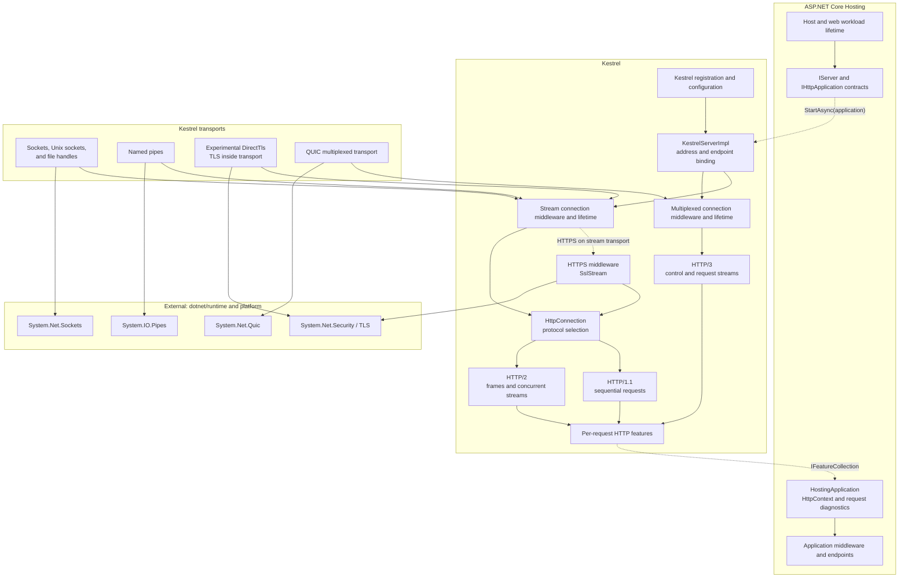
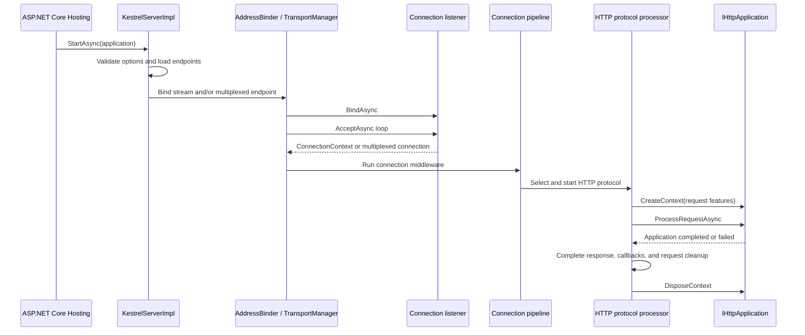

# Kestrel Architecture

## Purpose and Scope

This document describes how the subsystems under `src/Servers/Kestrel` compose to implement Kestrel, the cross-platform HTTP server used by default in ASP.NET Core. It explains Kestrel-owned responsibilities, dependency direction, connection and request lifetimes, protocol-specific state, transport boundaries, and validation layers.

The intended audience is contributors who need to determine where Kestrel behavior belongs and how a change in one layer affects the rest of the server. The document covers Kestrel registration and configuration, endpoint binding, connection middleware, sockets and named-pipe transports, the optional DirectTls transport, QUIC integration, TLS adaptation, HTTP/1.1, HTTP/2, HTTP/3, request features, body I/O, timeouts, shutdown, pooling, diagnostics, and generated implementation surfaces.

Kestrel consumes contracts owned by other areas. ASP.NET Core Hosting owns application construction and the `IServer` handoff. `Connections.Abstractions` owns the general connection and listener contracts. `src/Http` owns generic `HttpContext` and HTTP feature contracts. The .NET runtime owns socket, TLS, and QUIC implementations. This document describes those systems only where they meet Kestrel.

This document is not an HTTP specification, an API reference, an exhaustive project inventory, a server configuration tutorial, a performance tuning guide, or a build and test workflow. Consumer guidance belongs in the [ASP.NET Core Kestrel documentation](https://learn.microsoft.com/aspnet/core/fundamentals/servers/kestrel). Development entry points remain in the [Kestrel README](README.md), and wire requirements remain in the applicable HTTP and TLS specifications.

## System Overview

Hosting starts Kestrel through the `IServer` contract and supplies an `IHttpApplication<TContext>` adapter for the application request pipeline. Kestrel resolves configured endpoints, builds a connection middleware pipeline for each endpoint, selects a compatible listener factory, binds the listener, and starts accepting connections.

Stream transports such as sockets, Unix domain sockets, file handles, named pipes, and DirectTls produce a `ConnectionContext` with a duplex pipe. The QUIC transport produces a `MultiplexedConnectionContext` whose accepted streams are individual `ConnectionContext` instances. Kestrel wraps accepted connections with server-owned lifetime, timeout, resource, and diagnostics state before running the endpoint's connection pipeline.

For ordinary sockets and named pipes, HTTPS is connection middleware that installs TLS features, performs an `SslStream` handshake over the underlying transport, and presents decrypted application bytes to the remainder of the pipeline. DirectTls performs TLS inside the transport and publishes equivalent features before Kestrel receives the connection. QUIC performs TLS and multiplexing through `System.Net.Quic`; Kestrel supplies endpoint TLS options and implements HTTP/3 above the resulting QUIC connection and streams.

The terminal HTTP middleware creates an `HttpConnection`, selects the protocol processor, and passes Kestrel's per-request feature collection to the Hosting-provided application adapter. HTTP/1.1 processes requests sequentially on one connection. HTTP/2 parses frames and coordinates multiple Kestrel-owned request streams on one duplex transport. HTTP/3 coordinates HTTP control and request streams above the multiplexed QUIC transport.

### Composition Diagram

Solid arrows show composition or ownership. Dashed arrows show runtime handoffs across subsystem boundaries. This is a responsibility map, not a complete project-reference graph.

## Repository and Subsystem Ownership

| Subsystem | Responsibility | Ownership boundary |
| --- | --- | --- |
| [`Kestrel/Kestrel`](Kestrel) | Hosting registration, full and reduced Kestrel compositions, configuration loading integration, and HTTPS configuration services | Kestrel owns selecting and configuring its server services; Hosting owns the host and service-provider lifetime |
| [`Kestrel/Core`](Core) | `IServer` implementation, endpoint binding, connection middleware, HTTP protocol engines, request features, limits, timeouts, shutdown, diagnostics, and most public Kestrel configuration | Kestrel implementation |
| [`Connections.Abstractions`](../Connections.Abstractions) | Listener, connection, multiplexed connection, connection-pipeline, endpoint, and transport feature contracts | Shared server and SignalR infrastructure outside the Kestrel directory |
| [`Transport.Sockets`](Transport.Sockets) | TCP, Unix domain socket, and file-handle listeners; socket send and receive loops; duplex transport pipes | Kestrel transport over `System.Net.Sockets` |
| [`Transport.NamedPipes`](Transport.NamedPipes) | Windows named-pipe listeners, accepted connections, pipe creation policy, and duplex transport pipes | Kestrel transport over `System.IO.Pipes` |
| [`Transport.DirectTls`](Transport.DirectTls) | Experimental Linux transport that binds explicit `DirectTlsEndpoint` instances and performs native, file-descriptor-bound TLS before handing connections to the HTTP pipeline | Kestrel transport with a runtime TLS dependency; it is not the standard HTTPS middleware path |
| [`Transport.Quic`](Transport.Quic) | Adapts `System.Net.Quic` listeners, connections, and streams to ASP.NET Core multiplexed connection contracts | Kestrel owns the adapter; the runtime owns QUIC transport, congestion control, packet processing, and TLS implementation |
| [`shared`](shared) | Shared source and checked-in generated feature, header, HPACK, pipe, and pooling implementation used by multiple Kestrel projects | Kestrel implementation support, not a separate runtime layer |
| [`tools/CodeGenerator`](tools/CodeGenerator) | Generates checked-in high-performance header, feature-collection, transport-feature, and HTTP utility code | Kestrel tooling; generated files remain implementation details |
| [`test`](test), transport tests, [`perf`](perf), [`stress`](stress), and [`samples`](samples) | Protocol, transport, interoperability, performance, sustained-load, and illustrative application coverage | Validation and contributor support, not runtime layers |

Directory location alone does not transfer ownership. The [`Hosting server abstractions`](../../Hosting/Server.Abstractions) define `IServer` and `IHttpApplication<TContext>`. The [`HTTP features`](../../Http/Http.Features) and [`HTTP implementation`](../../Http/Http) define general request contracts and `HttpContext` behavior. Kestrel implements and populates many of those contracts for its requests.

## Startup, Binding, and the Hosting Handoff

`UseKestrelCore` registers `KestrelServerImpl`, core options and diagnostics services, the sockets transport, the Kestrel memory-pool factory, and the Windows named-pipe transport when applicable. `UseKestrel` adds the full HTTPS configuration service and conditionally registers the QUIC transport when the runtime reports QUIC support. Other transports can be registered additively and can claim selected endpoint types.

When Hosting starts the web workload, it passes its application adapter to `KestrelServerImpl.StartAsync`. Kestrel then:

1. Validates server limits and starts its heartbeat.
2. Loads code-backed and configuration-backed endpoints.
3. Resolves the precedence between explicit Kestrel endpoints and addresses supplied through `IServerAddressesFeature`.
4. Applies endpoint defaults and HTTPS defaults.
5. Builds a stream connection pipeline for HTTP/1.1 and HTTP/2, a multiplexed connection pipeline for HTTP/3, or both when an endpoint supports multiple protocol families.
6. Selects a registered listener factory that supports the endpoint and binds it.
7. Starts an accept loop and tracks the listener and its connections for reload and shutdown.

Listener factories are considered in reverse registration order. A factory can implement `IConnectionListenerFactorySelector` to claim only compatible endpoints. This allows named pipes, DirectTls, sockets, and application-provided transports to coexist without making one factory responsible for every endpoint.

Hosting owns construction of the application pipeline and `HttpContext`. Its `HostingApplication` creates or reinitializes a context from Kestrel's feature collection, begins request diagnostics, invokes the `RequestDelegate`, and performs context cleanup. Kestrel owns accepting the connection, parsing the HTTP request, publishing server capabilities, invoking the adapter at the correct protocol transition, and completing the wire-level request and response lifetime.

Kestrel can reload configuration-backed endpoints. Reload stops affected listeners and their connections through the same transport lifetime machinery before binding replacement endpoints. It does not rebuild the host, application service provider, or application request pipeline.

## Transport and Connection Pipelines

`Connections.Abstractions` separates byte-stream connections from multiplexed connections:

- `IConnectionListenerFactory` binds an endpoint and produces `ConnectionContext` instances with an `IDuplexPipe`.
- `IMultiplexedConnectionListenerFactory` binds an endpoint and produces `MultiplexedConnectionContext` instances that accept or create streams.
- `IConnectionBuilder` and `IMultiplexedConnectionBuilder` compose ordered connection middleware around those contexts.

Kestrel owns the endpoint-specific pipelines built through `ListenOptions`. Connection logging, HTTPS, application-supplied connection middleware, the connection limit, and the terminal HTTP middleware participate at this layer. Ordinary connection middleware runs once per accepted stream transport connection. Multiplexed connection middleware runs once per accepted multiplexed transport connection. QUIC request streams are dispatched inside the HTTP/3 processor and do not rerun ordinary connection middleware.

The sockets and named-pipe transports translate platform I/O into paired `PipeReader` and `PipeWriter` instances. They own listener setup, accept behavior, transport exceptions, connection endpoints, send and receive loops, and disposal of their platform handles. Kestrel Core consumes the resulting duplex pipe and should not depend on transport-specific socket or pipe operations for ordinary HTTP processing.

The experimental DirectTls transport is selected only for `DirectTlsEndpoint`. It performs the TLS handshake inside the transport, publishes TLS, ALPN, and socket features on the accepted connection, and supplies decrypted application data through the normal duplex pipe contract. Because `ITlsConnectionFeature` is already present, standard HTTPS middleware does not wrap the connection in a second TLS layer.

The QUIC transport is structurally different. `System.Net.Quic` accepts a QUIC connection, performs TLS, and exposes bidirectional and unidirectional streams. The Kestrel adapter publishes these through `MultiplexedConnectionContext` and creates pipe-backed stream contexts. Kestrel Core owns HTTP/3 control and request semantics above those streams; it does not own QUIC packet processing, congestion control, retransmission, or the runtime's stream flow control.

For every transport, `ConnectionDispatcher` registers accepted connections before scheduling their connection delegate. `KestrelConnection<T>` adds heartbeat, completion, lifetime-notification, and metrics features; runs the connection pipeline; fires connection completion callbacks; disposes the transport connection; and only then removes it from connection tracking. This ordering prevents server shutdown from observing a connection as complete before its transport is torn down.

## TLS, SNI, ALPN, and Protocol Selection

For stream transports, `HttpsConnectionMiddleware` installs TLS feature objects and performs the TLS handshake with `SslStream`. It applies endpoint certificate configuration, server-certificate selection, optional client certificates, handshake timeout, SNI-sensitive callbacks, and ALPN. After a successful handshake it replaces the connection's transport with a plaintext-facing duplex-pipe adapter for the inner pipeline. The underlying transport continues carrying TLS records and is restored before outer connection cleanup. Publishing the feature objects before authentication also preserves handshake state for timeout and failure diagnostics.

DirectTls performs the corresponding handshake before the connection enters Kestrel Core. It resolves per-host TLS contexts, advertises endpoint protocols through ALPN, and publishes the negotiated result through the same feature contracts used by the standard path. Its native event-pump and descriptor ownership are transport-specific and must not leak into general HTTP processing.

For HTTP/3, Kestrel converts endpoint HTTPS configuration into `TlsConnectionCallbackOptions`. `QuicConnectionListener` supplies the resulting `SslServerAuthenticationOptions` to `System.Net.Quic`, which performs the TLS 1.3 and QUIC handshake. Kestrel still owns certificate configuration policy and HTTP/3 protocol behavior, while the runtime owns the handshake and QUIC implementation.

`HttpConnection` selects the HTTP processor after transport and TLS features are available:

- A multiplexed transport selects HTTP/3 when it is enabled.
- A TLS stream connection selects HTTP/2 only when HTTP/2 is enabled and ALPN negotiated `h2`; otherwise it selects HTTP/1.x when allowed.
- A cleartext endpoint with HTTP/1.x enabled selects HTTP/1.x because the initial bytes are ambiguous.
- A cleartext endpoint configured only for HTTP/2 uses HTTP/2 prior knowledge.

ALPN negotiation, cleartext HTTP/2 prior knowledge, QUIC transport selection, and `Alt-Svc` advertisement are separate mechanisms. `Alt-Svc` can advertise an HTTP/3 alternative on an HTTP/1.1 or HTTP/2 response, but it does not upgrade the current connection or select a protocol inside Kestrel.

## HTTP Protocol Engines

The protocol implementations share request adaptation through `HttpProtocol`, but they retain separate connection and stream state machines. Code should be shared only where request semantics are truly common; framing, flow control, shutdown, and error mapping remain protocol-specific.

### HTTP/1.1

`Http1Connection` owns one sequential request loop over a stream transport. It parses the request line and headers directly from the connection input pipe, determines message-body framing, invokes the application, writes the response, and then either processes the next request or closes the connection.

Keep-alive reuse depends on preserving byte boundaries. When possible, Kestrel completes the response before consuming the unread remainder of a request body so clients waiting for response termination are not unnecessarily delayed. It then drains or stops the body deliberately before parsing another request. Upgrades transfer the duplex connection to the application and end ordinary HTTP request reuse.

Stopping an HTTP/1.1 connection disables the next keep-alive request and cancels a pending read. An active request can complete through the normal response path; a timeout, transport completion, application abort, or shutdown escalation can instead abort the connection and poison outstanding body I/O.

### HTTP/2

`Http2Connection` owns the connection preface, SETTINGS exchange, frame parsing, HPACK state, connection-level flow control, stream lookup, keep-alive behavior, and GOAWAY. Each request is represented by an `Http2Stream`, which owns request features, stream-level input flow control, body pipes, output production, and application execution.

HTTP/2 requests can run concurrently, but the connection remains the owner of shared framing and connection windows. Stream and connection flow-control windows are tracked separately. Consuming request data can release capacity to both levels; aborting a stream returns its unread contribution to the connection window without continuing stream-level window updates.

Completed streams remain tracked while unread request data is drained, until a drain deadline expires, or until bounded drain tracking evicts older completed streams. After removal from active tracking, a stream is eligible for Kestrel's HTTP/2 stream pool when its response completed without a connection abort and pool capacity is available. Reinitialization resets stream features, flow control, body pipes, output state, and request state before reuse.

Server-initiated graceful shutdown begins two-stage GOAWAY processing when requests remain active. Kestrel sends an initial GOAWAY with the maximum permitted stream identifier and continues accepting request streams that may have been created before the client observed that frame. When active client streams reach zero, Kestrel closes admission, sends a final GOAWAY using the highest opened stream identifier, and closes the connection. When no requests are active at shutdown initiation, Kestrel skips the initial GOAWAY and sends only the final one. Connection errors and shutdown escalation use protocol-specific error codes and abort remaining streams.

### HTTP/3

`Http3Connection` runs above a multiplexed transport. It creates the outbound control stream, accepts inbound request and control streams, applies HTTP/3 settings, coordinates QPACK processing, tracks active requests, and sends GOAWAY. Each request stream has its own `Http3Stream`, request features, body pipes, frame writer, output producer, and application execution.

Kestrel owns HTTP/3 frame ordering, pseudo-header validation, control-stream rules, request and connection error mapping, and HTTP-level timeouts. `System.Net.Quic` owns the underlying QUIC connection, QUIC streams, packet transport, and transport flow control. Kestrel's stream pipes add application-facing buffering and backpressure above that runtime transport.

When an application completes without reading the full request body, Kestrel can abort the read direction with an HTTP/3 no-error code while completing the response direction. Request finalization awaits application completion, attempts frame-writer completion, marks the HTTP stream completed and waits for in-flight abort side effects, drains and disposes the transport stream, removes active tracking, and only then permits eligible transport and HTTP stream state to be reused.

Server-initiated graceful shutdown begins two-stage GOAWAY processing when requests remain active. Kestrel sends an initial GOAWAY with the maximum permitted request-stream identifier and rejects newly arriving request streams. When active request streams reach zero, the accept loop exits, Kestrel sends a final GOAWAY with the next request-stream identifier beyond the highest opened stream, and closes the connection. When no request stream has been opened, that cutoff is stream 0; when no requests are active at shutdown initiation, Kestrel skips the initial GOAWAY and sends only the final one. Critical control-stream closure, connection errors, and shutdown escalation abort the connection and its active streams with HTTP/3 error semantics.

## Request Processing and Feature Adaptation

`HttpProtocol` is both Kestrel's shared request processor and its per-request `IFeatureCollection`. Generated feature-collection code provides fast access to the interfaces Kestrel implements. Protocol-specific partial implementations add or replace capabilities such as HTTP/2 stream identifiers, reset behavior, trailers, upgrades, extended CONNECT, WebTransport, and persistent stream state.

For each request, Kestrel resets server-owned mutable state, parses the request, initializes request and response body adapters, and calls `IHttpApplication<TContext>.CreateContext` with itself as the feature collection. It then awaits application processing and coordinates:

1. `OnStarting` callbacks before response headers become immutable.
2. Response validation and protocol-specific response completion.
3. `OnCompleted` callbacks after body use by application code has ended.
4. `IHttpApplication<TContext>.DisposeContext`.
5. Any remaining protocol-specific body drain or stream cleanup.

`OnStarting` and `OnCompleted` callbacks are processed as stacks. An `OnStarting` failure affects response production; an `OnCompleted` failure is logged while remaining completion callbacks continue.

Feature presence, operation availability, and mutability are separate. Some unavailable capabilities are represented by absent interfaces; others expose an interface whose state flags or supported operations restrict its use. For example, HTTP/1.1 upgrade, HTTP/2 stream reset, HTTP/3 stream abort, trailers, synchronous I/O, body-size mutation, and extended CONNECT have different availability and mutability rules. The general feature interfaces and `HttpContext` projection are owned by `src/Http`; Kestrel owns the concrete server behavior behind the features it supplies.

Hosting creates or reinitializes `HttpContext` from those features. Request services are created lazily by HTTP-owned request-service infrastructure when application code first accesses them. Kestrel does not create the application's request service scope or own its dependency injection lifetime.

## Body I/O, Buffering, and Backpressure

Transport implementations expose duplex pipes. Kestrel layers request-body readers and streams, response-body writers and streams, and protocol output producers over those pipes. `BodyControl` selects the appropriate adapters for an ordinary request, HTTP/1.1 upgrade, or extended CONNECT and transitions them together when request processing starts, stops, or aborts.

Request parsing and body consumption preserve `PipeReader` ownership by advancing only bytes that were consumed and retaining examined-but-incomplete input. Response output preserves `PipeWriter` ownership by committing bytes, awaiting flushes when the consumer or transport applies pressure, and completing or aborting writers exactly once for the active lifetime.

Buffer thresholds are layer-specific. Transport options configure transport-pipe pause and resume thresholds. HTTP/2 request-body buffering is sized relative to its receive window, while HTTP/3 currently uses a separate fixed-size request-body pipe. Kestrel server buffer settings are not a universal mapping onto every protocol adapter. These thresholds bound buffering between producers and consumers; they are not HTTP/2 or QUIC flow-control windows.

HTTP/2 adds explicit connection-level and stream-level flow control. Application consumption releases receive-window capacity, and output scheduling coordinates stream writes through the connection frame writer. HTTP/3 relies on `System.Net.Quic` for QUIC flow control while Kestrel's per-stream pipes still provide buffering and application backpressure. The runtime does not expose the same connection-window signal that Kestrel uses when evaluating HTTP/2 request-body data rates, so these mechanisms must not be described as identical.

Response minimum data-rate timing is integrated with asynchronous flushes. Kestrel accounts for bytes committed to the buffer and times periods when writes are awaiting downstream progress. A synchronous producer loop that ignores flush completion can bypass intended pressure and grow memory or pending work; protocol output paths must preserve the wait and cancellation semantics of the underlying pipe and peer flow control.

## Timeouts, Rates, and Graceful Shutdown

Kestrel's heartbeat supplies a common time source for connection walking, date-header updates, timeout evaluation, and memory-pool maintenance. Kestrel uses several timeout mechanisms with different owners. Heartbeat-driven protocol timeout control distinguishes:

- Keep-alive time while no request is active.
- Request-header time while a request is being identified.
- Minimum request-body data rate while application reads are pending.
- Minimum response data rate while writes are waiting for downstream progress.
- Request-body drain time after application processing.

TLS-owning middleware and transports enforce handshake timeouts separately. Protocol processors also own version-specific keep-alive, flow-control-sensitive rate evaluation, and control-stream checks.

The same timeout reason can have different protocol consequences. HTTP/1.1 can produce an error response before closing when the response has not started. HTTP/2 and HTTP/3 map connection and stream failures to their protocol error and shutdown mechanisms. Client disconnect, application abort, server timeout, and host shutdown remain distinct outcomes for cleanup and diagnostics.

Server shutdown is ordered:

1. Stop the heartbeat so it does not race with teardown.
2. Unbind listeners and wait for accept loops to exit.
3. Request graceful closure of tracked connections through the lifetime-notification feature.
4. Wait for protocol processors and transport connections to finish within the Hosting-provided cancellation window.
5. Abort connections that did not close in time.
6. Briefly wait for abort processing, then dispose listeners and remove their transport tracking.

The Hosting cancellation token bounds the graceful connection wait, not all teardown. After escalation, Kestrel proceeds with listener disposal even if some connection or application work has not completed. The protocol processor decides how a graceful-close request maps to HTTP/1.1 keep-alive termination, HTTP/2 GOAWAY, or HTTP/3 GOAWAY and stream admission. The transport owns stopping new accepts and releasing platform resources. Hosting owns the outer shutdown deadline and host disposal.

## Pooling, Resource Ownership, and Concurrency

Kestrel uses pooling to reduce allocation on hot paths, but pooled state is reusable only after its previous owner has finished all reads, writes, callbacks, cancellation, abort handling, and disposal.

- HTTP/1.1 reuses one `Http1Connection` across sequential requests and resets request features and mutable state between them.
- HTTP/2 can pool `Http2Stream` objects after removal from active tracking when the response completed without a connection abort and pool capacity is available. Drain completion, expiry, or bounded drain-queue eviction can trigger removal.
- HTTP/3 can retain `Http3Stream` state through a transport stream's persistent-state feature only when both the HTTP stream and reusable QUIC stream adapter completed cleanly. The underlying `QuicStream` itself is disposed and is not reused.
- Transports create or obtain memory pools for their pipes. Kestrel Core consumes the pool exposed through connection features rather than assuming one process-wide pool.
- Cancellation sources, feature collections, headers, output producers, and body adapters are reset only when their owning connection or stream state machine has made reuse safe.

Connection-wide and stream-wide mutable state use different synchronization. HTTP/2 serializes frame parsing in the connection loop while request applications execute concurrently. HTTP/3 accepts streams through a connection-level accept loop and dispatches request and control-stream processing concurrently, with synchronization around shared connection, control-stream, active-stream, and shutdown state. Transport send and receive loops can complete independently of application execution.

User callbacks, application delegates, and completion callbacks can run arbitrary code. Shared state transitions must be published before invoking them, and Kestrel must not hold internal locks across user code or unrelated asynchronous waits.

## Diagnostics, Logging, and Metrics

Kestrel has several observability surfaces with different contracts:

- `KestrelTrace` uses structured logging categories for general server behavior, bad requests, connections, HTTP/2, and HTTP/3.
- `KestrelEventSource` emits connection, request, TLS, queue, and upgrade events and compatibility counters.
- `KestrelMetrics` publishes `System.Diagnostics.Metrics` instruments for active, queued, rejected, upgraded, and duration measurements.
- Protocol and transport implementations attach endpoint, protocol, TLS, and connection-end information to diagnostics when the information becomes stable.
- `DiagnosticSource` is used for selected Kestrel events such as bad requests; Hosting owns the broader request `Activity`, request logs, and request-duration diagnostics around the application pipeline.

Metric enablement for paired start and stop events is captured when a connection begins so both sides use a consistent tag set. A connection-end reason is recorded before leaving the HTTP layer and can be overwritten by shutdown escalation when that later outcome is the material reason the transport ended.

Expected client disconnects, malformed requests, protocol errors, application failures, and internal failures have different logging and error-mapping paths. Changes should preserve those distinctions rather than translating every close into one exception or log level.

## Generated and Shared Implementation

Kestrel's code generator produces checked-in source for:

- Known request and response headers.
- The `HttpProtocol` feature collection.
- HTTP utility lookup tables.
- Multiplexed transport feature collections.
- Stream transport feature collections.

The generated shapes are optimized implementation surfaces, not new ownership boundaries. Changes to implemented feature interfaces, known headers, or utility tables must update the generator inputs and regenerate the corresponding files. `GeneratedCodeTests.GeneratedCodeIsUpToDate` runs the generator into temporary files and compares all generated outputs with the checked-in source.

The `shared` directory also contains source compiled into multiple Kestrel projects, including pipe completion wrappers, HPACK helpers, known-header inputs, pooling primitives, and test infrastructure. Shared compilation does not imply shared object lifetime, and a type compiled into multiple assemblies does not become a public cross-assembly contract.

## Trust and External Boundaries

Kestrel treats transport input, HTTP framing, headers, and body bytes as peer-controlled data. Parsing and protocol state machines enforce syntax, ordering, size, rate, stream-count, and lifecycle limits before publishing stable request features to the application. Limits are layered: transport buffering, HTTP message limits, protocol flow control, and application policy are related but not interchangeable.

TLS certificate selection, SNI callbacks, connection middleware, and `IHttpApplication` execution can invoke application code. Kestrel owns when those callbacks run and how their failures affect the connection, but it does not own the callback's application policy or external resources.

Kestrel reports the connection and request information it directly observes. Reverse-proxy trust, forwarded headers, path-base rewriting, authentication, authorization, routing, application validation, response caching, compression, and higher-level protocol policy belong to middleware or application layers. Kestrel should not infer those policies from socket peers or introduce them into HTTP framing.

Kestrel consumes runtime sockets, `SslStream`, TLS contexts, and `System.Net.Quic` through supported runtime contracts. Platform capability, cipher implementation, certificate stores, QUIC packet behavior, and OS socket behavior remain external even when Kestrel validates configuration or improves the resulting diagnostics.

## Design Principles and Invariants

- **Keep ownership explicit.** Every listener, connection, stream, pipe, request, response, callback, buffer, timer, and pooled object has one owner responsible for completion and cleanup.
- **Preserve wire and lifetime behavior.** Connection reuse, response-start semantics, cancellation, GOAWAY, resets, body drain, and shutdown ordering are observable contracts.
- **Keep protocol state machines distinct.** Share request adaptation where semantics align, but do not flatten HTTP/1.1 sequencing, HTTP/2 frames and windows, or HTTP/3 streams and QUIC into one lifecycle.
- **Propagate backpressure.** Await transport flushes, pipe pressure, and protocol flow-control capacity instead of accumulating unbounded data or pending work.
- **Separate transport from HTTP policy.** Transports move connections and bytes or streams. Kestrel Core owns HTTP protocol behavior above them.
- **Publish only valid features.** Feature availability and mutability must match the active protocol, transport, and request state.
- **Do not reuse state early.** Pool return follows protocol-specific completion and detachment conditions. HTTP/2 permits pooling after drain completion, expiry, or bounded drain-queue eviction without disposing the shared transport. HTTP/3 additionally requires transport-stream disposal and removal from active tracking.
- **Keep hot paths deliberate.** Parsing, framing, feature lookup, logging, metrics, memory ownership, scheduling, and synchronization changes require allocation and contention awareness.
- **Translate failures at the owning boundary.** Platform errors become transport failures, protocol violations become version-specific errors, and application failures follow response-start and disclosure rules.
- **Validate at the narrowest faithful layer.** A parser test, in-memory protocol test, real transport test, and interoperability test establish different properties.

## Verification Boundaries

| Validation area | Location | What it establishes |
| --- | --- | --- |
| Core unit tests | [`Core/test`](Core/test) | Parsers, headers, feature collections, protocol output, limits, timeouts, pooling, binding decisions, diagnostics helpers, and focused state-machine behavior |
| Registration and generated-code tests | [`Kestrel/test`](Kestrel/test) | Hosting registration, configuration loading, HTTPS configuration, and synchronization of generated source |
| In-memory functional tests | [`test/InMemory.FunctionalTests`](test/InMemory.FunctionalTests) | Kestrel HTTP protocol and application interaction over controlled test transports, including malformed frames, timeouts, shutdown, and request/response behavior; these tests do not establish operating-system transport or real QUIC behavior |
| Socket binding and functional tests | [`test/Sockets.BindTests`](test/Sockets.BindTests) and [`test/Sockets.FunctionalTests`](test/Sockets.FunctionalTests) | Real socket listener, binding, transport, and shared functional behavior |
| Interoperability tests | [`test/Interop.FunctionalTests`](test/Interop.FunctionalTests) | Behavior with real HTTP clients, HTTP/2 conformance tooling, and supported HTTP/3 runtime environments |
| Transport-specific tests | [`Transport.Sockets`](Transport.Sockets), [`Transport.NamedPipes`](Transport.NamedPipes), [`Transport.Quic`](Transport.Quic), and [`Transport.DirectTls`](Transport.DirectTls) test directories | Platform adapter, listener, pipe, handshake, stream, disposal, and transport-specific failure behavior |
| Microbenchmarks | [`perf/Microbenchmarks`](perf/Microbenchmarks) | Allocation, parser, header, framing, scheduling, and in-memory throughput characteristics; not end-to-end correctness |
| Stress application | [`stress`](stress) | Sustained concurrency, protocol combinations, cancellation, and resource behavior under load |
| Samples | [`samples`](samples) | Illustrative compositions and manual experimentation; not compatibility or correctness proof |

No single layer proves the whole server. In-memory tests can faithfully exercise Kestrel's protocol producer without proving socket or QUIC integration. Transport tests can prove connection behavior without exercising every HTTP state. Interoperability tests can establish end-to-end behavior but may depend on platform capabilities and external executables.

## Documentation Map

- [Kestrel README](README.md) - area overview and development entry points.
- [ASP.NET Core Kestrel documentation](https://learn.microsoft.com/aspnet/core/fundamentals/servers/kestrel) - consumer concepts and server usage.
- [Kestrel endpoints documentation](https://learn.microsoft.com/aspnet/core/fundamentals/servers/kestrel/endpoints) - endpoint and HTTPS configuration.
- [Kestrel options documentation](https://learn.microsoft.com/aspnet/core/fundamentals/servers/kestrel/options) - limits, timeouts, and common server options.
- [HTTP/1.1 specification](https://www.rfc-editor.org/rfc/rfc9112), [HTTP/2 specification](https://www.rfc-editor.org/rfc/rfc9113), and [HTTP/3 specification](https://www.rfc-editor.org/rfc/rfc9114) - normative wire contracts.
- [QUIC transport specification](https://www.rfc-editor.org/rfc/rfc9000) - the transport below HTTP/3.
- [Kestrel samples](samples/README.md) - focused example applications.
- [Kestrel microbenchmark notes](perf/Microbenchmarks/README.md) - benchmark entry points.

## Finding the Right Subsystem

| Change or question | Primary owner |
| --- | --- |
| Kestrel DI registration, full versus core composition, or configuration loading | [`Kestrel/Kestrel`](Kestrel) |
| Endpoint precedence, binding, reload, server limits, connection tracking, or shutdown | [`Kestrel/Core`](Core) |
| TCP, Unix socket, or file-handle I/O | [`Transport.Sockets`](Transport.Sockets) |
| Windows named-pipe behavior | [`Transport.NamedPipes`](Transport.NamedPipes) |
| Experimental native DirectTls endpoint behavior | [`Transport.DirectTls`](Transport.DirectTls) |
| QUIC listener, connection, or stream adaptation | [`Transport.Quic`](Transport.Quic) |
| HTTP/1.1 parsing, keep-alive, chunking, upgrade, or sequential request reuse | [`Core/src/Internal/Http`](Core/src/Internal/Http) |
| HTTP/2 frames, HPACK, flow control, streams, reset, or GOAWAY | [`Core/src/Internal/Http2`](Core/src/Internal/Http2) |
| HTTP/3 frames, QPACK, control streams, request streams, WebTransport integration, or GOAWAY | [`Core/src/Internal/Http3`](Core/src/Internal/Http3) |
| General connection or listener abstraction | [`Connections.Abstractions`](../Connections.Abstractions) |
| `IServer`, application startup, `HttpContext` creation, request diagnostics, host shutdown deadline, or request services | [`src/Hosting`](../../Hosting) and [`src/Http`](../../Http) |
| Generic HTTP feature interface or `HttpContext` behavior | [`src/Http`](../../Http) |
| HTTP.sys server behavior | [`src/Servers/HttpSys`](../HttpSys) |
| Managed IIS server integration or native IIS/ANCM behavior | [`src/Servers/IIS`](../IIS); native code and installer concerns remain with their IIS/native owners |
| Generic middleware ordering, routing, proxy processing, compression, caching, or application policy | [`src/Middleware`](../../Middleware), [`src/Http`](../../Http), or the owning feature area |
| SignalR negotiation, transports, hubs, or reconnect | [`src/SignalR`](../../SignalR) |
| gRPC framing, calls, or service runtime | The [grpc-dotnet repository](https://github.com/grpc/grpc-dotnet); ASP.NET Core integration boundaries are under [`src/Grpc`](../../Grpc) |
| Socket, TLS, certificate-store, or QUIC runtime implementation | [dotnet/runtime](https://github.com/dotnet/runtime) and the operating system |
| Reverse-proxy topology, forwarding policy, deployment, or application behavior | The proxy, middleware, Hosting, or application that owns the policy |

## Terminology

| Term | Meaning in this document |
| --- | --- |
| **Stream transport** | A transport that presents one ordered duplex byte stream as a `ConnectionContext`, such as sockets, named pipes, or DirectTls |
| **Multiplexed transport** | A transport that presents a connection capable of accepting multiple streams through `MultiplexedConnectionContext`; Kestrel uses this for QUIC |
| **Connection pipeline** | Ordered middleware that runs for a transport connection before the terminal HTTP processor |
| **Transport connection** | The connection object and platform resources supplied by a listener |
| **HTTP connection** | Kestrel's protocol-processing lifetime above a transport connection |
| **Request stream** | An independently processed HTTP/2 or HTTP/3 request within a multiplexed HTTP connection |
| **Feature** | A capability published through `IFeatureCollection` for a server, connection, stream, or request |
| **Application adapter** | The Hosting-owned `IHttpApplication<TContext>` implementation that turns request features into `HttpContext` and invokes the application pipeline |
| **Backpressure** | A downstream signal that requires a producer to pause because transport, pipe, protocol, or peer capacity is unavailable |
| **Drain** | Deliberate completion or consumption of remaining request, response, stream, or transport work before reuse or close |
| **Graceful shutdown** | Stopping new accepts or requests while allowing active protocol work to finish before abort escalation |
| **Pool reuse** | Reinitializing a framework-owned object only after its previous lifetime has fully completed and mutable state has been reset |
