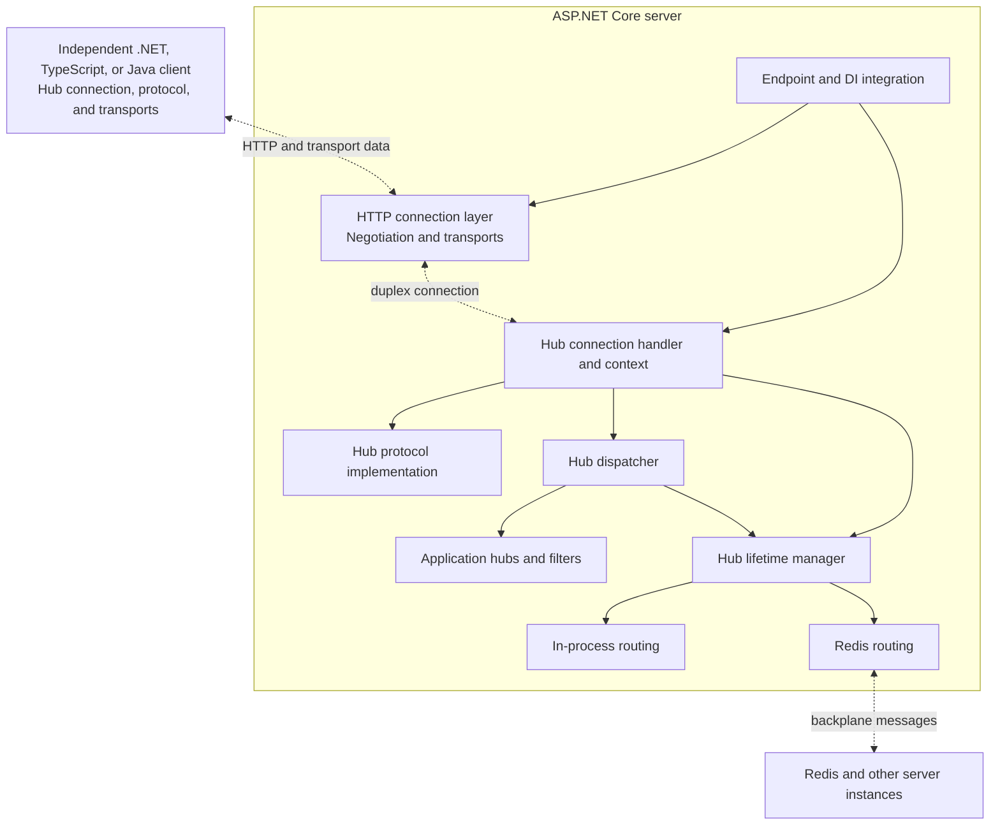

# ASP.NET Core SignalR Architecture

## Purpose and Scope

This document describes how the subsystems under `src/SignalR` compose to provide bidirectional communication between ASP.NET Core applications and independently implemented clients. It explains the responsibilities, state ownership, wire contracts, and failure boundaries of the hub, connection, transport, protocol, and scaleout layers.

The intended audience is contributors who need to understand where behavior belongs and how a change in one layer affects the others. This is the authoritative architecture overview for the SignalR area. It describes runtime relationships rather than cataloging every project or feature.

This document is not an API reference, an exhaustive inventory of projects and source files, or a build and test workflow. The [SignalR README](README.md) provides the area introduction, product documentation links, and development entry points. The [Hub Protocol](docs/specs/HubProtocol.md) and [Transport Protocols](docs/specs/TransportProtocols.md) describe the wire contracts in detail.

## System Overview

SignalR separates the application's hub programming model from the mechanism that carries messages. A hub exposes application methods to connected clients and can address clients by connection, group, or user. Client and server protocol implementations translate invocations, results, streams, and connection-control messages into a common wire contract. Transports carry the encoded data without interpreting hub methods or application arguments.

On the server, ASP.NET Core endpoint integration composes the HTTP connection layer with the hub connection handler. The connection layer presents a duplex connection even when sending and receiving use separate HTTP requests. Above that boundary, the hub runtime performs the handshake, reads and writes hub messages, dispatches application calls, and coordinates connection shutdown.

The hub lifetime manager is a separate routing boundary. The default implementation reaches connections in the current server process; a scaleout implementation extends addressing across servers. Replacing that service changes delivery topology, not the hub programming model or the client-facing protocol.

### Composition Diagram

Solid arrows represent service composition and use. Dashed arrows represent runtime communication. This is a responsibility map, not an exhaustive assembly-dependency graph.

In-process routing and Redis routing are alternative lifetime-manager implementations. Each server still owns its local connections, their selected protocols, and their application execution. Outbound messages, including messages routed through the backplane, ultimately pass through those local connection contexts.

## Architectural Layers and Ownership

### Endpoint and HTTP Connection Integration

[`server/SignalR`](server/SignalR) owns the ASP.NET Core integration used to register SignalR services and map hubs to endpoints. It joins the HTTP connection pipeline to the hub runtime; it does not implement a second dispatcher or transport stack.

[`common/Http.Connections`](common/Http.Connections) owns server-side negotiation, HTTP connection management, WebSockets, Server-Sent Events, Long Polling, and HTTP sends. It correlates transport requests with a connection and exposes connection features and duplex pipes to the application above it. This layer can host connection-oriented applications without understanding hub invocations.

[`common/Http.Connections.Common`](common/Http.Connections.Common) holds HTTP connection contracts shared by the server and .NET client, including negotiation support and transport kinds. HTTP-specific behavior remains below the hub boundary rather than becoming policy in hub dispatch.

### Hub Runtime

[`server/Core`](server/Core) owns hub abstractions, dispatch, connection lifetime, filters, user and group addressing, typed client proxies, and the lifetime-manager abstraction and default implementation.

The main runtime roles are distinct:

- `HubConnectionHandler<THub>` coordinates one hub connection: handshake, lifetime-manager notifications, dispatcher callbacks, the message loop, and shutdown.
- `HubConnectionContext` carries connection-owned state and coordinates writes, cancellation, timeouts, and optional reconnect buffering.
- `DefaultHubDispatcher<THub>` discovers hub methods, supplies binding information, authorizes and dispatches invocations, activates hubs and filters, and coordinates invocation and stream completion.
- `HubLifetimeManager<THub>` provides client routing and group operations and receives connection-lifetime notifications. It is not the owner of application method execution.

Application hub instances are short-lived activations, not the long-lived connection itself. The dispatcher initializes them with the connection's caller context, client access, and group manager. `IHubContext<THub>` provides client addressing outside a hub invocation without retaining a hub instance.

### Shared Messages, Framing, and Encodings

[`common/SignalR.Common`](common/SignalR.Common) owns the shared .NET hub-message model, protocol abstractions, and handshake support. [`common/Shared`](common/Shared) contains implementation source, including text and binary framing and reconnect buffering, that is compiled into multiple projects. Shared source does not imply a single shared runtime instance.

The `common/Protocols.*` projects implement the encoding boundary:

- [`Protocols.Json`](common/Protocols.Json) uses System.Text.Json for JSON hub messages.
- [`Protocols.NewtonsoftJson`](common/Protocols.NewtonsoftJson) provides the JSON encoding using Newtonsoft.Json.
- [`Protocols.MessagePack`](common/Protocols.MessagePack) provides the binary MessagePack encoding.

These implementations share logical message semantics, but serializers still determine how application arguments and results map to wire values. The TypeScript and Java clients have their own protocol implementations; the .NET shared libraries are not an implementation dependency for those clients.

### Scaleout and Conformance Infrastructure

[`server/StackExchangeRedis`](server/StackExchangeRedis) owns the Redis lifetime manager and backplane protocol. Provider-specific channels, subscriptions, management acknowledgements, and failure handling remain behind the lifetime-manager boundary.

[`server/Specification.Tests`](server/Specification.Tests) expresses reusable lifetime-manager contracts, including cross-server behavior. It is conformance infrastructure, not a runtime layer. Its contracts distinguish behavior that every applicable lifetime manager must provide from behavior specific to Redis.

### Independent Clients

[`clients/csharp`](clients/csharp), [`clients/ts`](clients/ts), and [`clients/java`](clients/java) own separate connection state machines, HTTP and transport adaptation, handler registration, pending invocations, and streaming surfaces. They interoperate through the wire protocols, not through a common client implementation. Their feature and platform boundaries are described in [Independent Client Implementations](#independent-client-implementations).

## Connection Establishment and Hub Handshake

Connection establishment has two different agreements. HTTP negotiation establishes how the connection will be transported. The hub handshake establishes how messages on that connection will be interpreted. Success at the first boundary does not imply success at the second.

In the negotiated path, the server advertises available transports and their transfer formats. The client selects a compatible transport using that advertisement, its explicit configuration, and the capabilities of its environment. Negotiation also supplies the identity used to correlate later transport requests. In negotiation version 1, the public connection ID and the secret connection token have different purposes: the ID is used for application addressing, while the token associates later HTTP requests with the connection and must remain secret. They are not interchangeable.

A client configured to use WebSockets directly can skip HTTP negotiation. WebSockets is the only transport supporting this path. Skipping negotiation does not skip the hub handshake, and it is not a way to enable features that require a negotiated agreement, such as stateful reconnect.

Once the transport connection is open, the client's first hub-level message is a handshake request naming a hub protocol and version. The request and response are always JSON with record-separator text framing, including when subsequent hub messages use MessagePack. The server resolves the requested protocol, checks that it is supported and compatible with the transport's transfer format, and responds before normal hub dispatch begins.

The selected hub protocol belongs to that connection for its lifetime. Negotiation protocol versions and hub protocol versions govern separate contracts. A handshake rejection or timeout ends startup before the connection enters normal hub lifetime processing; opening an HTTP transport alone does not create a successfully connected hub client.

## Transport and Protocol Separation

### Transport Composition and Transfer Formats

The HTTP transport layer supplies bidirectional communication through different compositions:

| Transport | Receive and send composition | Transfer formats |
| --- | --- | --- |
| WebSockets | A single full-duplex transport carries data in both directions. | Text and binary |
| Server-Sent Events | The event stream carries server-to-client data; separate HTTP POST requests carry client-to-server data. | Text |
| Long Polling | Repeated polls carry server-to-client data; separate HTTP POST requests carry client-to-server data. | Text and binary |

Server-Sent Events and Long Polling are receive-side half-transports combined with HTTP sends to form the duplex abstraction. An individual HTTP request completing is therefore not equivalent to the hub connection ending. Poll timeout, connection completion, and transport failure are distinct outcomes owned by the HTTP connection layer.

Transfer format constrains which hub encoding can use a transport. JSON uses text and MessagePack uses binary; transport selection must satisfy the chosen protocol rather than silently changing its encoding. Server-Sent Events also has text line-ending normalization behavior, so it is not a substitute for byte-preserving binary delivery.

### Message Semantics and Framing

The Hub Protocol assumes reliable, ordered delivery from the underlying connection. It does not generally reorder messages or retransmit arbitrary lost traffic. The opt-in stateful reconnect extension provides a narrower resumption mechanism described below, not a replacement for that transport requirement.

JSON and MessagePack express the same logical message families: invocation, streamed items, completion, cancellation, ping, close, acknowledgement, and sequence. The encoding does not change the meaning of an invocation ID or turn an invocation error into a connection error. It does change the representation of fields and application values, so semantic parity does not imply interchangeable bytes or identical serializer configuration.

Text messages end with the record separator. Binary messages have a length prefix. Transport reads and hub-message boundaries need not align: a read may contain part of one message or several complete messages. Framing owns identifying complete messages from segmented input and rejecting invalid lengths; protocol parsing owns interpreting the framed payload.

Forward-compatible parsing is part of the encoding contract. The .NET protocol parsers tolerate unknown JSON properties and unknown hub-message types, and their MessagePack parser permits additional trailing array elements. These tolerances must not be assumed across all client implementations. This extensibility is different from accepting malformed required fields or invalid framing. Tightening parsing can break an older implementation's ability to communicate with a newer peer even when the messages it understands have not changed.

## Server Dispatch and Lifetime

### Connection and Invocation State

After a successful handshake, the handler notifies the lifetime manager that the connection exists and enters hub processing. The dispatcher invokes the application's connected callback before normal message dispatch. During normal shutdown, the handler coordinates hub disconnection and then performs connection cleanup and the lifetime manager's disconnected notification. Startup failures take shorter paths and do not imply that every application lifetime callback has run.

`HubConnectionContext` and the underlying connection features are the source of truth for per-connection state. This includes the caller identity, selected protocol, abort signal, active requests, upload-stream tracking, write coordination, and reconnect state. Lifetime-manager group membership and provider subscriptions refer to that connection and are removed when it ends. Keeping these relationships attached to their owner avoids parallel copies of state drifting between transport, dispatcher, and routing layers.

Each hub invocation has its own activation and service scope. A streaming invocation retains the resources needed to produce or consume its stream until that operation finishes; returning control to the message loop does not release ownership. Hubs, invocation scopes, cancellation sources, stream trackers, and framework-created filters all have cleanup paths independent of whether application execution succeeds.

### Concurrency and Streaming

Ordinary non-streaming hub invocations are serialized per connection by default. `HubOptions.MaximumParallelInvocationsPerClient` changes that invocation limit; it does not impose a single global lock on the server or make hub instances connection-scoped.

Invocations with streaming parameters or streaming results do not consume this non-streaming invocation limit. The dispatcher can continue processing messages while a stream is active, which is necessary to receive upload items, cancellation, and other connection traffic. Stream ownership and completion therefore cannot be inferred from the completion of the dispatch call that started the stream.

Cancellation crosses both invocation and connection boundaries. Invocation cancellation targets the corresponding active operation; connection abortion signals that the connection can no longer support its work. Stream completion, linked cancellation, hub release, and scope disposal remain owned by the invocation and connection machinery, including when application code observes cancellation asynchronously.

### Close, Abort, Timeout, and Error Boundaries

These outcomes are related but not interchangeable:

- A hub method failure normally completes that invocation with an error, when a response is expected, rather than terminating unrelated work on the connection.
- A hub `Close` message communicates a connection-level outcome, including error and reconnect information. It is not an HTTP status or a WebSocket close frame.
- Abort terminates connection use and signals cancellation. In the normal hub disconnection path, the handler attempts the hub close message and waits for abort callbacks before invoking the application's disconnected callback.
- Handshake timeout belongs to startup. Client timeout belongs to liveness detection on an established connection. Keep-alive traffic and application traffic feed that liveness mechanism.
- Protocol errors, transport failures, and exceptions in hub lifetime callbacks have different entry points and may prevent later phases from running.

The error exposed to the peer and the exception observed by application lifetime callbacks are deliberate translations, not necessarily the same exception. Detailed error options affect disclosure. Cleanup and diagnostics must still distinguish a graceful close, an invocation failure, an abandoned startup, and an unexpectedly lost connection.

## Configuration, Extensibility, and Reflection

Global `HubOptions` establish the configuration inherited by individual hubs. Per-hub `HubOptions<THub>` configuration is applied on top of the global setup; collections such as supported protocols and filters are copied rather than sharing a mutable list across hubs. The handler resolves effective settings before creating connection state. This keeps timeout, concurrency, protocol, and buffering decisions consistent within the connection that uses them.

Hub filters wrap invocation and lifetime callbacks without taking ownership of the connection. A filter can be supplied as an instance, resolved from DI, or created by the framework when its type is not registered. These choices imply different disposal owners. The filter factory releases instances it creates; a DI-resolved filter follows its container's lifetime, and a supplied instance is not made framework-owned merely by participating in the pipeline.

Hub method discovery, argument binding, typed client proxy generation, and application serialization form a reflection-sensitive boundary. Method metadata is discovered and reused by the dispatcher, while invocation data and activated services remain local to each call. Trimming annotations preserve metadata needed by discovery and binding, but metadata preservation is not the same as runtime code-generation support. For example, the typed client builder generates proxy code and has a dynamic-code requirement. A working reflection-based path does not by itself establish Native AOT support for every hub or serializer configuration.

## Stateful Reconnect

Stateful reconnect preserves an existing logical connection across a temporary transport interruption. It is opt-in at both the server endpoint and a supporting client, requires negotiation, and currently uses WebSockets. It does not apply to every transport or client implementation.

The transport layer owns reconnecting the transport to retained connection state. The hub layer owns the message continuity needed above that replacement:

- Outgoing invocation-related messages are retained in a connection-owned message buffer until acknowledged.
- `Ack` messages advance the acknowledged position and release buffered data.
- `Sequence` messages establish the sending position when resuming; the receiver uses sequence tracking to suppress duplicates.
- Resend coordination orders retained messages with subsequent writes. Buffer limits introduce backpressure, so acknowledgement progress, cancellation, and disposal are part of the connection's resource lifetime.

The shared .NET implementation is in [`common/Shared/MessageBuffer.cs`](common/Shared/MessageBuffer.cs); the TypeScript client implements its own corresponding state machine. Acknowledgement means receipt at the protocol boundary, not that an application operation has committed a durable side effect.

Ordinary automatic reconnect is a different client policy: it attempts to establish a new connection after the previous one is lost. It does not retain the old server connection, group memberships, or an unacknowledged-message buffer. Stateful reconnect instead depends on the original server connection still existing and the resumption succeeding. It is not durable storage, process failover, or a general exactly-once delivery guarantee, and a Redis backplane does not turn it into those things.

## Scaleout, Groups, and Users

`DefaultHubLifetimeManager<THub>` tracks and addresses connections in the current process. Broadcasts, group sends, user sends, and connection-targeted sends resolve to local connection contexts. Group membership is associated with connections, while user addressing uses the user identifier supplied for those connections; a user may have multiple connections.

`RedisHubLifetimeManager<THub>` keeps local connection ownership but extends routing using Redis channels for hub-wide, group, user, and connection messages. Messages received from Redis are delivered through the local connection contexts and their selected hub protocols. Backplane serialization is an internal server-to-server contract, distinct from the hub encoding selected by each client.

Some operations can be completed locally without a Redis round trip, such as a send to a connection owned by the current server. A group add or remove targeting another server instead uses a management channel and an acknowledgement from the owner. These management acknowledgements confirm routing-state operations; they are unrelated to the hub `Ack` messages used for stateful reconnect.

Disconnect cleanup removes local connections and their group and provider subscription state. Scaleout does not move hub instances, invocation scopes, or live connection buffers to Redis. It also does not establish durable replay or a total order across all senders beyond the guarantees of the provider and the operations involved.

`HubLifetimeManagerTestsBase<THub>` defines reusable single-server contracts. `ScaleoutHubLifetimeManagerTests<TBackplane>` extends that boundary to multiple server instances. Redis-specific tests cover the provider's channel, connection, and routing behavior rather than redefining the common lifetime-manager contract.

## Independent Client Implementations

The clients share wire-level meaning, but their connection state machines, platform adapters, and application surfaces are independent. A server or .NET client implementation detail is not automatically a capability of the TypeScript or Java client.

| Capability | .NET client | TypeScript client | Java client |
| --- | --- | --- | --- |
| HTTP transports | WebSockets, Server-Sent Events, Long Polling | WebSockets, Server-Sent Events, Long Polling | WebSockets and Long Polling; no Server-Sent Events |
| Skip negotiation | WebSockets only | WebSockets only | WebSockets only |
| Automatic reconnect | Opt-in with `WithAutomaticReconnect` | Opt-in with `withAutomaticReconnect` | Not implemented |
| Stateful reconnect | Separate opt-in; WebSockets only | Separate opt-in; WebSockets only | Not implemented |
| Streaming surface | `IAsyncEnumerable<T>` and `ChannelReader<T>`, with cancellation | `IStreamResult<T>` and disposable subscriptions | RxJava `Observable<T>` and `Disposable.dispose()` |

The .NET client separates its hub connection in `Client.Core` from the HTTP adaptation in `Http.Connections.Client`; the higher-level `Client` project composes them. The TypeScript and Java trees have their own transport and protocol implementations rather than wrapping those .NET services.

Platform capability remains below the shared hub contract. Browser WebSockets and Server-Sent Events cannot set arbitrary request headers, so authentication may use transport-specific access-token alternatives. That restriction does not apply in the same way to Long Polling or non-browser clients. Cookie, proxy, certificate, credential, and WebSocket configuration also depend on the actual runtime and transport, including browser-hosted .NET.

Handler registration and stream subscriptions are distinct lifetimes. In Java, `Subscription.unsubscribe()` removes a hub-method handler; RxJava `Disposable.dispose()` cancels a stream subscription. Each client owns completing or failing pending invocations, propagating stream cancellation, and handling registered callbacks when it stops or reconnects. The shared wire protocol does not supply a universal subscription or disposal abstraction.

## Design Principles and Invariants

- **Keep transport, encoding, dispatch, and routing independent.** Transport code carries data, protocol code interprets message shape, the dispatcher executes application operations, and the lifetime manager addresses clients. Cross-layer features use explicit connection features and contracts rather than moving one layer's policy into another.
- **Treat wire semantics as the cross-implementation boundary.** .NET, TypeScript, and Java communicate through versioned protocols. Defaults, framing, tolerated extensions, completion semantics, and error disclosure can affect interoperability even when public method signatures are unchanged.
- **Make ownership follow lifetime.** Connection state belongs to the connection, invocation state to the invocation, and provider state to its lifetime manager. Activated hubs and filters do not acquire connection lifetime merely because they can access a caller context.
- **Separate operation failure from connection failure.** Invocation completion, stream cancellation, graceful close, transport loss, and failed startup carry different meanings. Their error and cleanup paths preserve those distinctions.
- **Keep concurrent work accountable.** Returning to the message loop does not end an active stream or release its scope. Cancellation, completion, buffering, and shutdown need explicit owners even when work continues asynchronously.
- **Do not infer reliability from topology.** Scaleout expands addressing; ordinary reconnect starts again; stateful reconnect resumes retained state. None of these mechanisms alone provides durable delivery, application transaction acknowledgement, or unrestricted replay.
- **Model capabilities where they are provided.** Transfer formats, reconnect support, browser restrictions, and dynamic-code requirements are properties of particular layers and implementations, not consequences of speaking the Hub Protocol.

## Architecture Documentation Map

This document owns the area-wide runtime composition and its boundaries. The existing focused documents below retain their separate purposes; they are not duplicate architecture entry points.

| Document | Boundary or purpose |
| --- | --- |
| [SignalR README](README.md) | Area introduction, product documentation, and development entry points |
| [Hub Protocol](docs/specs/HubProtocol.md) | Hub handshake, message semantics, JSON and MessagePack wire representations |
| [Transport Protocols](docs/specs/TransportProtocols.md) | HTTP negotiation and transport wire behavior |
| [JavaScript unit tests](docs/JSUnitTests.md) | Existing workflow documentation for isolated TypeScript client tests |
| [JavaScript functional tests](docs/JSFunctionalTests.md) | Existing workflow documentation for hosted JavaScript client/server tests |

The source links in [Architectural Layers and Ownership](#architectural-layers-and-ownership) identify the implementations behind these boundaries. Samples, benchmarks, and test infrastructure support understanding and validation but are not additional runtime layers.

## Verification Boundaries

Different test boundaries establish different architectural claims. An isolated protocol test can establish parsing and framing without establishing that an HTTP transport produces the disputed input. A client unit test can establish its response to a disconnect without establishing browser behavior. Hosted tests join those owners when the observable behavior crosses the boundary.

| Architectural behavior | Existing verification boundary |
| --- | --- |
| Shared .NET framing, handshake, and hub-message encodings | [`common/SignalR.Common/test`](common/SignalR.Common/test) |
| Negotiation, transport selection, HTTP connection lifetime, and individual server transports | [`common/Http.Connections/test`](common/Http.Connections/test) |
| Hub dispatch, options, filters, connection lifetime, and server reconnect integration | [`server/SignalR/test`](server/SignalR/test), including `HubConnectionHandlerTests` and `HubFilterTests` |
| Single-server and provider-independent cross-server lifetime-manager contracts | [`server/Specification.Tests`](server/Specification.Tests) |
| Redis-specific routing and backplane integration | [`server/StackExchangeRedis/test`](server/StackExchangeRedis/test) |
| .NET client state, HTTP adaptation, and hosted client/server behavior | [`clients/csharp/Client/test`](clients/csharp/Client/test), with separate unit and functional boundaries |
| TypeScript client and MessagePack implementation behavior | [`clients/ts/signalr/tests`](clients/ts/signalr/tests) and [`clients/ts/signalr-protocol-msgpack/tests`](clients/ts/signalr-protocol-msgpack/tests) |
| Hosted browser and JavaScript client/server behavior | [`clients/ts/FunctionalTests`](clients/ts/FunctionalTests) |
| Java client behavior | [`clients/java/signalr/test`](clients/java/signalr/test) |
| Protocol and dispatch costs or behavior under sustained load | [`perf/Microbenchmarks`](perf/Microbenchmarks) and [`perf/benchmarkapps/Crankier`](perf/benchmarkapps/Crankier) |

The relevant observations are boundary-specific: parsed messages, protocol completions, transport termination, callback ordering, group delivery, pending invocation outcomes, cancellation, cleanup, and resource use. Shared conformance tests do not establish every provider or client implementation's behavior, and unit tests that run with reflection available do not establish trimming or Native AOT compatibility. These are limits of the evidence, not additional guarantees inferred from passing tests.

## Terminology

- **Hub connection** - The logical client/server relationship above a transport, with a selected hub protocol, caller identity, active operations, and connection-owned state.
- **Transport** - The mechanism carrying data. It may be a full-duplex WebSocket or a receive-side HTTP mechanism combined with separate sends.
- **Negotiation** - The HTTP-level agreement supplying transport choices, connection correlation information, and negotiated capabilities.
- **Hub handshake** - The initial JSON-framed exchange selecting the hub protocol and version on an established transport connection.
- **Transfer format** - The text or binary capability required to carry a protocol's encoded messages.
- **Hub protocol** - The message semantics and encoding for invocations, streams, completion, cancellation, and connection control.
- **Lifetime manager** - The server routing abstraction that tracks connections and implements client, group, and user addressing.
- **Backplane** - The server-to-server messaging mechanism used by a scaleout lifetime manager.
- **Stateful reconnect** - Resumption of a retained logical connection with acknowledgement, sequence tracking, and buffered resend; distinct from starting a new connection.
